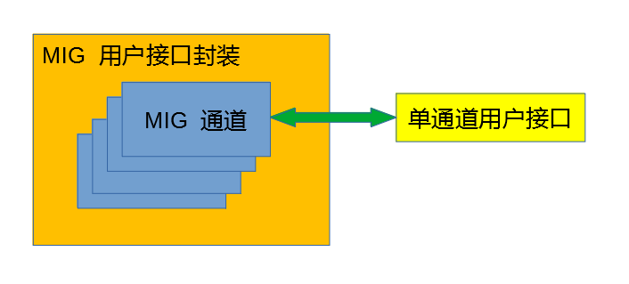

# 概述

使用 Zynq 芯片实现 2 通道图像的融合，即需要进行各通道独立的图像处理算法，也需要在 2 个通道都完成图像处理后进行图像融合，以 1 幅图像的形式输出。

根据 Zynq 芯片设计的基本原则，PL 负责高速接口和图像处理算法，PS 负责低速接口和流程控制。

试验使用 zcu102 开发板，板上 Zynq 型号为 xczu9eg-ffvb1156-2-e，该板卡的官方参考主要是 ug1182 和 ug1085。

# 设计要求

- 2 通道图像由 Sensor 输入时需要尽可能保证曝光同步， 2 通道的图像内容不能出现肉眼可见的差异；
- PS 与 PL 进行高速数据传输时需要考虑 PS 程序的非实时性，必要时使用大容量缓冲；
- 大容量数据缓冲（DDR）以帧为单位，小容量数据缓冲（BRAM）以行为单位；
- 数据缓冲必须检查满写导致丢数的情况，后续处理需要进行纠错，使后续的图像帧恢复确传输；
- 在图像输出时需要加入单帧重发的功能，在设备进行实时校正（放下镜头挡板）的过程中需要保持图像。

# 关键设计

## PL 内多通道 DDR 缓冲设计

在 PL 内部在图像算法、数据传输等功能处可能需要进行多帧图像数据传输，BRAM 的资源不足以实现这样大的缓冲容量，因此必须使用外部的 DDR 缓冲。

在编程实现时，DDR 读写使用 MIG IP 核的用户接口，需要对此用户接口进行逻辑封装实现多通道的数据缓冲。

分为 3 个模块



- MIG 通道：`mig_ch`，连接对应通道的用户读写操作和 MIG 用户接口的读写逻辑；
- MIG 用户接口封装：`mig_interface`，例化多个 `mig_ch` 模块，对各模块的 DDR 读写指令和数据进行调度控制；
- 单通道用户接口：`mig_ch_usr`，连接 `mig_ch` 的用户接口，根据用户数据时序控制缓冲数据读写，不具备通用性，但是应当保证基本设计原则。

### MIG 通道 `mig_ch`

`mig_ch` 负责连接用户缓冲以及 MIG 用户接口读写逻辑。

`mig_ch` 模块端口分为 2 个部分，用户接口部分和 MIG 接口部分。

**用户接口和 MIG 接口，分别使用独立的时钟域，在 `mig_ch` 内通过异步 FIFO 实现跨时钟域。**主要原因是大部分情况下用户数据都不在 MIG 时钟域，如果在 `mig_ch_usr` 中进行跨时钟域处理，会由于 `mig_ch_usr` 非通用性导致增加模块编程的复杂度。

`mig_ch` 内部逻辑分为 2 个部分，用户接口至 MIG 接口的指令逻辑，MIG 接口至用户接口的反馈逻辑。

#### 指令逻辑

`mig_ch` 内部使用 2 个异步指令 FIFO 分别缓冲用户的读写指令，读指令内容是读地址，写指令内容包括写地址和写数据。FIFO 写入由用户接口逻辑控制，FIFO 读出由 MIG 接口逻辑控制。注意：==1 条指令对应 1 个 MIG 数据单元==。

**写指令 FIFO 由于需要缓冲写数据，因此使用较大的缓冲深度。**

写操作的用户接口即写指令 FIFO 的写接口，MIG 接口为写指令 FIFO 的读接口；

读操作的用户接口即读指令 FIFO 的写接口，MIG 接口为读指令 FIFO 的读接口；

#### 反馈逻辑

`mig_ch` 内部使用 2 个异步反馈 FIFO 分别缓冲 MIG 写操作完成情况以及 MIG 读操作的读出数据。FIFO 写入由 MIG 接口逻辑控制，FIFO 读出由用户接口逻辑控制。

**读反馈 FIFO 由于需要缓冲读出数据，因此使用较大的缓冲深度。**

MIG 写操作完成 1 个数据单元，则返回 1 个时钟周期有效的写完成信号，写完成信号需要由 MIG 时钟域跨入用户时钟域，因此写反馈 FIFO 使用 1 bit 位宽的异步 FIFO，由于位宽较小，FIFO 模式配置为分布式 RAM。**为了让数据进入 FIFO 后立即输出，FIFO 空指示信号取反用组合逻辑直连 FIFO 读使能端口。**

==写反馈 FIFO 的深度设置需要考虑用户时钟频率远小于 MIG 时钟频率的情况，最好设置成与写指令 FIFO 深度一致。==

#### 模块端口定义

```verilog
module mig_ch
#(
parameter WIDTH_ADDR = 25,//地址位宽
parameter WIDTH_DATA = 128//数据位宽
)
(
//用户接口时钟
input usr_clk,
input usr_rst,

//用户写接口
output [8:0] wr_suspend,//未被 mig 响应的写操作的数目，比 wr_en 滞后 1 个时钟，即 FIFO 的 wr_data_count
input wr_en,//写使能
input [(WIDTH_ADDR-1):0] wr_addr,//写地址，对齐 wr_en
input [(WIDTH_DATA-1):0] wr_data,//写数据，对齐 wr_en
output reg wr_done = 1'b0,//写数据完成，1 个时钟高电平表示完成 1 个数据写入

//用户读接口
output [8:0] rd_suspend,//未被 mig 响应的写操作的数目，比 rd_en 滞后 1 个时钟，即 FIFO 的 rd_data_count
input rd_en,//读使能
input [(WIDTH_ADDR-1):0] rd_addr,//读地址，对齐 rd_en
output reg rd_data_vld = 1'b0,//读数据有效，与 rd_en 没有固定的时间间隔
output reg [(WIDTH_DATA-1):0] rd_data = {WIDTH_DATA{1'b0}},//读数据，对齐 rd_data_vld

//mig 接口时钟
input mig_clk,
input mig_rst,

//mig 写接口，读出写 FIFO 内的地址和数据
//FIFO 具有 FWFT 属性，在 mwr_rd_en 值为 1 时取 mwr_addr 和 mwr_data
input mwr_rd_en,
output [8:0] mwr_data_count,//FIFO 的 rd_data_count
output [(WIDTH_ADDR-1):0] mwr_addr,//写地址
output [(WIDTH_DATA-1):0] mwr_data,//写数据
input mwr_done,//写数据完成，1 个时钟高电平表示完成 1 个数据写入

//mig 读接口，读出读 FIFO 内的地址
//FIFO 具有 FWFT 属性，在 mrd_rd_en 值为 1 时取 mrd_addr
input mrd_rd_en,
output [8:0] mrd_data_count,//FIFO 的 rd_data_count
output [(WIDTH_ADDR-1):0] mrd_addr,//读地址
input mrd_data_vld,//mig 接口读出数据有效
input [(WIDTH_DATA-1):0] mrd_data//mig 接口读出数据
);

endmodule
```


### MIG 用户接口封装 `mig_interface`

`mig_interface` 负责连接 MIG IP 的用户接口，以及其内部例化的各 `mig_ch` 模块。

**为了保证通用性和可扩展性，使用 Verilog 语言的 parameter 定义 MIG 通道的数目，并且使用 generate 例化和连接所有 `mig_ch` 模块。**

`mig_interface` 的设计核心在于 2 个部分：`mig_ch` 的调度和 MIG 用户接口逻辑。

#### `mig_ch` 调度

`mig_interface` 内部建立读写 2 组 FIFO，每组 FIFO 包括指令 FIFO 和通道序号 FIFO 2个 FIFO，指令 FIFO 用于从各 `mig_ch` 模块中读出读/写指令进行缓存，通道序号 FIFO 用于在指令 FIFO 写入的过程中记录下当前写入指令来源的通道的序号。

**指令 FIFO 用于汇总来源于各 `mig_ch` 的读/写指令，供 MIG 用户接口逻辑调用；通道序号 FIFO 用于在 1 条读/写指令结束时，将处理结果反馈给对应的 `mig_ch`。**

在执行读/写指令前从对应的指令 FIFO 读出指令（地址/数据），再指令完成后（或者读操作读出数据）从通道序号 FIFO 读出指令来源的通道序号，向对应的 `mig_ch` 模块反馈执行结果（或者读出数据）。

`mig_interface` 使用读和写 2 个状态机分别轮询所有 `mig_ch` 模块的可读出指令的数目，根据当前**写 FIFO 组可写数据量（查看后读出的通道序号 FIFO）**，将指令从 `mig_ch` 中读出并且写入读/写 FIFO 组的指令 FIFO，同时将对应的 `mig_ch` 通道序号写入通道序号 FIFO。

通道序号 FIFO 的读出用于向 `mig_ch` 反馈读/写操作的结果，由 MIG 用户接口逻辑控制其读出时机。

#### MIG 用户接口逻辑

MIG 用户接口逻辑使用单个状态机控制 MIG 用户接口的读/写操作，**以 parameter 设置一轮读/写操作的最大数据单元数目 BULK**，读写操作交替进行，只要发现指令 FIFO 内的指令数目大于 0 就执行一轮读/写操作，如果指令 FIFO 为空则读写操作相互切换。

MIG 用户接口写流程需要进行特别设计。MIG 写接口中写指令和写数据分别由 2 个反馈信号表示 MIG 接受写指令或者接受写数据。在同时给出写指令有效和写数据有效的情况下，2 个反馈信号可能出现不同步的现象，可能出现 MIG 接受写指令而不接受写数据，或者 MIG 接受写数据而不接受写指令，因此需要在状态机中加入对应的状态等待未被接受的写数据或者写指令，从而增加了指令/通道序号 FIFO 读使能的控制逻辑。**为了保证 FIFO 的连续读出可能需要使用复杂的组合逻辑控制 FIFO 读使能，而 MIG 用户接口的高频时钟将导致时序约束失败。解决的办法是使用与 BULK 大小一致的寄存器组，缓冲指令/通道序号 FIFO 读出的数据，在一轮读/写操作启动时一次性读出此轮操作的作部 FIFO 数据并且在寄存器组中缓存，MIG 用户接口从寄存器组中取出数据使用，而不是直接从指令/通道序号 FIFO 取出数据。**==需要注意的是在一轮读/写操作启动时，通过流程控制保证写入寄存器组的时机先于 MIG 用户接口赋值的时机，不用等待写完寄存器组再给 MIG 用户接口赋值，以减少时延。==

#### 模块端口定义（以 4 通道为例）

```verilog
module mig_interface(
//mig 用户接口*********************************************************
input clk,//mig 用户接口时钟
input rst,//mig 用户接口复位

output reg ui_en = 1'b0,//指令有效标记
output reg [2:0] ui_cmd = 3'b001,//写指令3’b000，读指令3'b001
output [27:0] ui_addr,//地址，每个地址对应DDR4物理层16位数据总线
input ui_rdy,//指令被接受标记

input [127:0] ui_rd_data,//读数据
input ui_rd_data_valid,//读数据有效

output reg ui_wdf_wren = 1'b0,//写数据有效标记
output ui_wdf_end,//写数据结束，与ui_wdf_wren对齐
output reg [127:0] ui_wdf_data = 128'd0,//写数据
input ui_wdf_rdy,//数据可写标记，表示MIG内部缓冲可以装下新的写数据

//4 通道时钟及复位
input ch0_clk,
input ch0_rst,
input ch1_clk,
input ch1_rst,
input ch2_clk,
input ch2_rst,
input ch3_clk,
input ch3_rst,

//4 通道的写接口********************************************************
output [8:0] ch0_wr_suspend,//256-suspend 即为接口可以执行的次数
input ch0_wr_en,//写使能
input [24:0] ch0_wr_addr,//写地址，对齐 wr_en
input [127:0] ch0_wr_data,//写数据，对齐 wr_en
output ch0_wr_done,//写数据完成，1 个时钟高电平表示完成 1 个数据写入

output [8:0] ch1_wr_suspend,
input ch1_wr_en,
input [24:0] ch1_wr_addr,
input [127:0] ch1_wr_data,
output ch1_wr_done,

output [8:0] ch2_wr_suspend,
input ch2_wr_en,
input [24:0] ch2_wr_addr,
input [127:0] ch2_wr_data,
output ch2_wr_done,

output [8:0] ch3_wr_suspend,
input ch3_wr_en,
input [24:0] ch3_wr_addr,
input [127:0] ch3_wr_data,
output ch3_wr_done,

//4 通道的读接口************************************************************
output [8:0] ch0_rd_suspend,//256-suspend 即为接口可以执行的次数
input ch0_rd_en,//读使能
input [24:0] ch0_rd_addr,//读地址，对齐 rd_en
output ch0_rd_data_vld,//读数据有效，与 rd_en 没有固定的时间间隔
output [127:0] ch0_rd_data,//读数据，对齐 rd_data_vld

output [8:0] ch1_rd_suspend,
input ch1_rd_en,
input [24:0] ch1_rd_addr,
output ch1_rd_data_vld,
output [127:0] ch1_rd_data,

output [8:0] ch2_rd_suspend,
input ch2_rd_en,
input [24:0] ch2_rd_addr,
output ch2_rd_data_vld,
output [127:0] ch2_rd_data,

output [8:0] ch3_rd_suspend,
input ch3_rd_en,
input [24:0] ch3_rd_addr,
output ch3_rd_data_vld,
output [127:0] ch3_rd_data
);

endmodule
```


### 单通道用户接口 `mig_ch_usr`

单通道用户接口主要完成 3 项功能：

- 读/写操作指令地址控制，保证在有效地址范围内；
- 通过逻辑控制对于某个地址的读操作在写操作之后，即通过 `mig_ch` 的写数据完成信号和读出数据有效信号判断对应的操作已完成；
- 用户数据的输入输出。

而且由于前述 `mig_ch` 模块已完成数据在用户时钟域和 MIG 时钟域的转换，此处不用考虑跨时钟域处理。

####  地址范围控制

使用 parameter 定义地址范围：

```verilog
parameter ADDR_BASE = 25'd0;//基地址
parameter ADDR_SIZE = 25'h800_000;//地址空间大小
localparam ADDR_MAX = ADDR_BASE+ADDR_SIZE-25'd1;//最大地址值，用于地址更新计算
```

#### 先写后读控制

通过写数据完成信号和读出数据有效信号持续记录当前模块定义的地址空间范围内已写入 MIG 的数据单元数目：

```verilog
reg [24:0] mig_data_count = 25'd0;//mig 内数据单元数目

always @(posedge clk) begin
	if (rst == 1'b1) begin
		mig_data_count <= 25'd0;
	end
	else begin
		case ({wr_done, rd_data_vld})
			{1'b1, 1'b0}: begin
				//完成写入，计数增 1
				mig_data_count <= mig_data_count+25'd1;
			end

			{1'b0, 1'b1}: begin
				//完成读出，计数减 1
				mig_data_count <= mig_data_count-25'd1;
			end

			{1'b1, 1'b1},
			{1'b0, 1'b0}: begin
				//同时完成写入和读出，或者写入读出都未执行
				mig_data_count <= mig_data_count;
			end
		endcase
	end
end
```

#### 用户数据输入输出

用户数据输入输出是 `mig_ch_usr` 的主要定制项。由于 `mig_ch` 接口同时开放了地址与数据接口，用户数据输入输出模式即可以仿照 BRAM 也可以仿照 FIFO。

FIFO 模式的 `mig_ch_usr` 的端口定义：

```verilog
module mig_ch_usr_fifo(
input clk,
input rst,
//mig 通道接口***************************************************
//用户写接口
input [8:0] wr_suspend,//未被 mig 响应的写操作的数目，比 wr_en 滞后 1 个时钟
output reg wr_en = 1'b0,//写使能
output reg [24:0] wr_addr = 25'd0,//写地址，对齐 wr_en
output reg [127:0] wr_data = 128'd0,//写数据，对齐 wr_en
input wr_done,//写数据完成，1 个时钟高电平表示完成 1 个数据写入
//用户读接口
input [8:0] rd_suspend,//未被 mig 响应的写操作的数目，比 rd_en 滞后 1 个时钟
output reg rd_en = 1'b0,//读使能
output reg [24:0] rd_addr = 25'd0,//读地址，对齐 rd_en
input rd_data_vld = 1'b0,//读数据有效，与 rd_en 没有固定的时间间隔
input [127:0] rd_data,//读数据，对齐 rd_data_vld

//用户数据接口**********************************************************
input usr_wr_en,
input [127:0] usr_din,
output [9:0] usr_wr_data_count,//写 FIFO 内数据量，FIFO 深度 512
output usr_full,//用于判断满写
input usr_rd_en,
output [127:0] usr_dout,
output [9:0] usr_rd_data_count,//读 FIFO 内数据量，FIFO 深度 512
output usr_empty//用于判断空读
);

endmodule
```


## 用 Block Design 定制 PS 与 PL 的数据接口

PS 与 PL 的数据交互包括：

- PS >> PL：图像算法参数；
- PS >> PL：工作指令：启动、停止、图像暂停；
- PS >> PL：GUI 图像数据，PS 使用裸核 GUI 库（uGUI 等）实现 GUI，PL 连接 LED 显示屏输出实时图像；
- PL >> PS：设备控制按钮状态，PL 连接按钮接口，由 PS 响应按钮操作；
- PL >> PS：工作状态；
- PL >> PS：输出图像数据，用于 PS 通过网络接口发送给上位机；
- PL <<>> PS：红外 Sensor 配置数据和红外图像统计数据（用于非均匀性校正）。

Zynq 模块的 3 个数据接口

### AXI_LITE

PS 为接口 Master，采用地址/数据对应的方式，由 PS 对数据进行读写。

包括：图像算法参数、工作指令、按钮状态、工作状态

### AXI_Stream DMA

2 个基于 AXI_Stream 的 DMA 通道：

- MM2S：GUI 图像数据；
- S2MM：PL 的输出图像数据。

### AXI_BlockRAM

用于红外 Sensor 配置，使用纯双口 RAM，PS 和 PL 分别控制 1 个 BRAM Port。

具体处理方式见[红外 Sensor 非均匀性校正](#红外 Sensor 非均匀性校正)。

## 红外 Sensor 非均匀性校正

==TODO==

# 方案设计

## 总体设计

