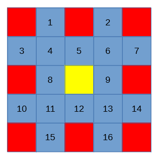

# 概述

2 通道图像融合的 2 个通道指的是红外图像（IR）与微光图像（NV）。

在 FPGA 的处理过程中，首先将 2 个通道的图像进行独立的图像处理，再经过同步后进行 2 通道融合，变成完整的一幅图像后输出。目的是在输出图像中融合 2 个通道图像的内容，丰富图像信息。

算法流程框图：

==TODO==

# IR 图像算法（InfraRed）

以下 IR 图像算法的内容主要**针对非制冷机芯**。

非制冷红外机芯与制冷红外机芯的主要差异在于，非制冷的情况下，红外传感器（Sensor）自身的温度会随着外界环境和设备散热出现变化，而且传感器各部分温度差异也会导致红外图像不均匀，即红外图像**温飘**现象。为了解决这种问题，大多数非制冷红外机芯都会配备档板，通过定时或者温度传感器的控制自动进行非均匀性校正流程。

对于制冷机芯而言，由于其使用内部的制冷机控制红外传感器的温度恒定，基本不会出现前述的温飘现象，即使用在某些极端使用场景下可能出现红外图像非均匀的问题，也是使用手动方式实现非均匀性校正。

## 非均匀性校正（NUC）

红外图像的非均匀性校正主要是解决 2 个方面的问题：

1. 红外传感器所有像素点对于同一温度的成像应当输出相同的灰度值；
2. 红外传感器单个像素点在 2 个温度之间的变化应当符合线性规律。

NUC 算法有 2 种：两点校正与单点校正。

### 两点校正

**两点校正主要是在非工作场景下（设备标定）**，使用黑体面源配合完成校正，将校正结果以参数表的形式提供给用户使用。

两点校正解决了前述的 NUC 2 个方面的问题。

设 Sensor 中某个像素点灰度值为 x，校正后的灰度值为 y，根据前述的 NUC 目标，则有以下公式：
$$
y=a\times x+b
$$
“两点校正”的两点指的是 2 个温度值，即当前设备目标温度范围的上限与下限。

**大多数情况下由于 Sensor 本身的设计问题，在其工作温度范围内不具备完美的线性响应，于是将其工作温度范围分解成数个温度段，每个温度段单独进行两点校正。**

在校正时，首先将**黑体面源**设置为目标温度，用 Sensor 拍摄多帧红外图像，分别计算 2 种均值：

1. 图像中每个像素点的多帧均值（变化不大，可以只取一帧的数值）：作为校正的输入值 x;
2. 整幅图像所有像素点的均值：作为校正的目标值 y。

对于某个像素点，令下限温度的输入值为 x~L~，上限温度的输入值为 x~H~，下限目标值为 y~L~，上限目标值为 y~H~：
$$
y_L=a\times x_L+b\\
y_H=a\times x_H+b
$$
解上述的二元一次方程组得到当前像素点的两点校正结果 (a, b)：
$$
a=\frac{{y}_H-{y}_L}{{x}_H-{x}_L}
$$

$$
b=\frac{{y}_L\times {x}_H-{y}_H\times {x}_L}{{x}_H-{x}_L}
$$

计算得到整幅图像中所有像素点的校正值即完成两点校正。

对于多个温度段的情况，每个温度段都计算所有像素点的两点校正结果，在大多数 Sensor 手册中**一个温度段的校正结果被称为一个 NUC Table**。

### 单点校正

**单点校正主要是在工作场景下**，使用挡板配合完成校正，校正完成后实时应用校正结果。可以理解为在两点校正的基础上，在工作中实时调整校正参数。

单点校正的目标是解决所有像素点对同一温度输出相同灰度值的问题，主要**针对温飘现象**。

在校正时，首先用挡板遮住镜头，认为这种情况下拍摄的应当是所有像素点输出一致的红外图像，分别计算 2 种均值：

1. 图像中每个像素点的多帧均值：作为校正的输入值 y;
2. 整幅图像所有像素点的均值：作为校正的目标值 y'。

对于某个像素点，由于温飘是加性偏移，则校正偏移值 b' 的计算公式为：
$$
b'=y'-y
$$
结合前述的两点校正公式，则单点校正的结果为：
$$
y'=a\times x+b+b'
$$

### 实现方法

通过前述的 2 种 NUC 算法可以发现两点校正的效果比单点校正的效果更好，但是付出的存储和计算资源的代价也更高。

**如果红外成像设备需要用于精确测温，则需要同时使用 2 种 NUC 算法；如果红外成像仅用于观察，不需要精确测温，则单点校正即可以达成目标。**

对于大多数红外 Sensor 而言，NUC 校正是其内置的功能，将计算得到的校正参数写入 Sensor 的配置寄存器值即可以完成 NUC。部分 Sensor 也已经包含了校正参数计算的功能，只要根据其 NUC 配置流程即可以完成参数计算与应用的工作。

在 FPGA 实现 NUC 算法时，需要 2 点特殊设计：

1. NUC 参数由于对每个像素点都有一组两点校正的 (a, b) 参数，和一组实时更新的单点校正 b' 参数，保存这些数据需要占用大量的存储空间，因此不能使用 FPGA 内部存储资源，而是使用外接 DDR 的方式保存，在设备初始化过程中加载进入 DDR 内存，在红外图像输入流水中完成乘加计算；
2. 如果使用 Sensor 配置寄存器的方式实现 NUC，则需要根据 Sensor 手册添加 NUC 配置流程的控制和图像帧数据统计计算的功能，并且在单点校正过程中重复输出挡板放下前的有效图像。

## 盲元补偿

由于红外 Sensor 的生产工艺和工作原理，其部分像素点的输出响应可能出现异常。

根据标准定义，盲元分为死像元和过热像元 2 种：

- 死像元：像元响应率不足所有有效像元平均响应率的 0.1 倍；
- 过热像元：像元噪声大于所有有效像元平均噪声电压 10 倍。

实际应用中，死像元会在标定过程中发现并标记，过热像元会被当成噪声处理。

### 盲元检测

盲元检测分为标定过程中的检测和工作过程中的检测两种。

#### 标定过程中的盲元检测

标定过程中的检测主要指的是[两点校正过程中检测盲元](#两点校正)，根据每个像素点校正计算得到的 a 值情况，令所有像素点校正 a 值的均值为 a~ave~，可以判断 4 种盲元：

- 过暗盲元（惰性盲元）：对任何温度都响应为低温，x~H~ 和 x~L~ 数值很小且非常接近，判断条件为 $a > (10\times a_{ave})$
- 过亮盲元（惰性盲元）：对任何温度都响应为高温，x~H~ 和 x~L~ 数值很大且非常接近，判断条件为 $a > (10\times a_{ave})$
- 过热盲元：对温度变化响应极大，x~H~ 和 x~L~ 差异极大，判断条件为 $a <  (0.1\times a_{ave})$
- 反转盲元：对低温的响应值高于对高温的响应值，即 $x_H < x_L$，判断条件为 $a < 0$

在两点校正过程中可以通过前述计算判断盲元，但是由于计算中的 a~ave~ 值不在两点校正参数表内，因此具体实现时**将所有盲元（无论是否为反转盲元）的 a 值设为小于 0 的负数**，在 FPGA 计算时与 0 值比较即可以判断当前像素点是否为盲元。

#### 工作过程中的盲元检测

工作过程中由于温度变化，部分在标定过程中检测到的正常像素点可能也会变成盲元，导致 NUC 的校正结果无效，使得**红外图像出现孤立的或者成片的亮点或者暗点**。

**对于孤立的盲元，可以通过中值滤波的方法滤除。**

对于成片的盲元需要使得特殊的实时盲元检测算法进行检测。方法较复杂，除非有特别的用户需求，一般不加入自动盲元检测功能。

### 盲元补偿

盲元补偿一般使用均值滤波的办法实现，使用盲元像素点邻域 $5\times 5$ 范围内除该像素点外其它 24 个像素点的均值代替盲元像素值。

在实际的 FPGA 实现中，为了不计算除法，实际的均值计算使用邻域 $5\times 5$ 范围内 16 点计算均值，如下图所示：

## 均值归零

均值归零的目标将红外图像的均值移至灰度满量程的一半，防止图像过亮或者过暗。

令当前像素点灰度值位宽为 N，则其满量程的一半为 2^N-1^，若输入灰度值为 x，当前图像帧的灰度均值为 x~ave~，则有输出灰度值如下：
$$
y=x-x_{ave}+x^{N-1}
$$
在实际的 FPGA 实现中，如果计算当前图像帧的均值需要等到一帧图像全部像素点流水经过，

# NV 图像算法（Night Vision）

# 融合图像算法

