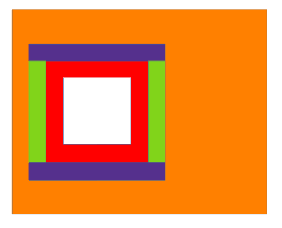

# 概述

2 通道图像融合的 2 个通道指的是红外图像（IR）与微光图像（NV）。

在 FPGA 的处理过程中，首先将 2 个通道的图像进行独立的图像处理，再经过同步后进行 2 通道融合，变成完整的一幅图像后输出。目的是在输出图像中融合 2 个通道图像的内容，丰富图像信息。

算法流程框图：

==TODO==

# IR 图像算法（InfraRed）

以下 IR 图像算法的内容主要**针对非制冷机芯**。

非制冷红外机芯与制冷红外机芯的主要差异在于，非制冷的情况下，红外传感器（Sensor）自身的温度会随着外界环境和设备散热出现变化，而且传感器各部分温度差异也会导致红外图像不均匀，即红外图像**温飘**现象。为了解决这种问题，大多数非制冷红外机芯都会配备档板，通过定时或者温度传感器的控制自动进行非均匀性校正流程。

对于制冷机芯而言，由于其使用内部的制冷机控制红外传感器的温度恒定，基本不会出现前述的温飘现象，即使用在某些极端使用场景下可能出现红外图像非均匀的问题，也是使用手动方式实现非均匀性校正。

## 非均匀性校正（NUC）

红外图像的非均匀性校正主要是解决 2 个方面的问题：

1. 红外传感器所有像素点对于同一温度的成像应当输出相同的灰度值；
2. 红外传感器单个像素点在 2 个温度之间的变化应当符合线性规律。

NUC 算法有 2 种：两点校正与单点校正。

### 两点校正

**两点校正主要是在非工作场景下（设备标定）**，使用黑体面源配合完成校正，将校正结果以参数表的形式提供给用户使用。

两点校正解决了前述的 NUC 2 个方面的问题。

设 Sensor 中某个像素点灰度值为 x，校正后的灰度值为 y，根据前述的 NUC 目标，则有以下公式：
$$
y=a\times x+b
$$
“两点校正”的两点指的是 2 个温度值，即当前设备目标温度范围的上限与下限。

**大多数情况下由于 Sensor 本身的设计问题，在其工作温度范围内不具备完美的线性响应，于是将其工作温度范围分解成数个温度段，每个温度段单独进行两点校正。**

在校正时，首先将**黑体面源**设置为目标温度，用 Sensor 拍摄多帧红外图像，分别计算 2 种均值：

1. 图像中每个像素点的多帧均值（变化不大，可以只取一帧的数值）：作为校正的输入值 x;
2. 整幅图像所有像素点的均值：作为校正的目标值 y。

对于某个像素点，令下限温度的输入值为 x~L~，上限温度的输入值为 x~H~，下限目标值为 y~L~，上限目标值为 y~H~：
$$
y_L=a\times x_L+b\\
y_H=a\times x_H+b
$$
解上述的二元一次方程组得到当前像素点的两点校正结果 (a, b)：
$$
a=\frac{{y}_H-{y}_L}{{x}_H-{x}_L}
$$

$$
b=\frac{{y}_L\times {x}_H-{y}_H\times {x}_L}{{x}_H-{x}_L}
$$

计算得到整幅图像中所有像素点的校正值即完成两点校正。

对于多个温度段的情况，每个温度段都计算所有像素点的两点校正结果，在大多数 Sensor 手册中**一个温度段的校正结果被称为一个 NUC Table**。

### 单点校正

**单点校正主要是在工作场景下**，使用挡板配合完成校正，校正完成后实时应用校正结果。可以理解为在两点校正的基础上，在工作中实时调整校正参数。

单点校正的目标是解决所有像素点对同一温度输出相同灰度值的问题，主要**针对温飘现象**。

在校正时，首先用挡板遮住镜头，认为这种情况下拍摄的应当是所有像素点输出一致的红外图像，分别计算 2 种均值：

1. 图像中每个像素点的多帧均值：作为校正的输入值 y;
2. 整幅图像所有像素点的均值：作为校正的目标值 y'。

对于某个像素点，由于温飘是加性偏移，则校正偏移值 b' 的计算公式为：
$$
b'=y'-y
$$
结合前述的两点校正公式，则单点校正的结果为：
$$
y'=a\times x+b+b'
$$

### 实现方法

通过前述的 2 种 NUC 算法可以发现两点校正的效果比单点校正的效果更好，但是付出的存储和计算资源的代价也更高。

**如果红外成像设备需要用于精确测温，则需要同时使用 2 种 NUC 算法；如果红外成像仅用于观察，不需要精确测温，则单点校正即可以达成目标。**

对于大多数红外 Sensor 而言，NUC 校正是其内置的功能，将计算得到的校正参数写入 Sensor 的配置寄存器值即可以完成 NUC。部分 Sensor 也已经包含了校正参数计算的功能，只要根据其 NUC 配置流程即可以完成参数计算与应用的工作。

在 FPGA 实现 NUC 算法时，需要 2 点特殊设计：

1. NUC 参数由于对每个像素点都有一组两点校正的 (a, b) 参数，和一组实时更新的单点校正 b' 参数，保存这些数据需要占用大量的存储空间，因此不能使用 FPGA 内部存储资源，而是使用外接 DDR 的方式保存，在设备初始化过程中加载进入 DDR 内存，在红外图像输入流水中完成乘加计算；
2. 如果使用 Sensor 配置寄存器的方式实现 NUC，则需要根据 Sensor 手册添加 NUC 配置流程的控制和图像帧数据统计计算的功能，并且在单点校正过程中重复输出挡板放下前的有效图像。

## 盲元补偿

由于红外 Sensor 的生产工艺和工作原理，其部分像素点的输出响应可能出现异常。

根据标准定义，盲元分为死像元和过热像元 2 种：

- 死像元：像元响应率不足所有有效像元平均响应率的 0.1 倍；
- 过热像元：像元噪声大于所有有效像元平均噪声电压 10 倍。

实际应用中，死像元会在标定过程中发现并标记，过热像元会被当成噪声处理。

### 盲元检测

盲元检测分为标定过程中的检测和工作过程中的检测两种。

#### 标定过程中的盲元检测

标定过程中的检测主要指的是[两点校正过程中检测盲元](#两点校正)，根据每个像素点校正计算得到的 a 值情况，令所有像素点校正 a 值的均值为 a~ave~，可以判断 4 种盲元：

- 过暗盲元（惰性盲元）：对任何温度都响应为低温，x~H~ 和 x~L~ 数值很小且非常接近，判断条件为 $a > (10\times a_{ave})$
- 过亮盲元（惰性盲元）：对任何温度都响应为高温，x~H~ 和 x~L~ 数值很大且非常接近，判断条件为 $a > (10\times a_{ave})$
- 过热盲元：对温度变化响应极大，x~H~ 和 x~L~ 差异极大，判断条件为 $a <  (0.1\times a_{ave})$
- 反转盲元：对低温的响应值高于对高温的响应值，即 $x_H < x_L$，判断条件为 $a < 0$

在两点校正过程中可以通过前述计算判断盲元，但是由于计算中的 a~ave~ 值不在两点校正参数表内，因此具体实现时**将所有盲元（无论是否为反转盲元）的 a 值设为小于 0 的负数**，在 FPGA 计算时与 0 值比较即可以判断当前像素点是否为盲元。

#### 工作过程中的盲元检测

工作过程中由于温度变化，部分在标定过程中检测到的正常像素点可能也会变成盲元，导致 NUC 的校正结果无效，使得**红外图像出现孤立的或者成片的亮点或者暗点**。

**对于孤立的盲元，可以通过中值滤波的方法滤除。**

对于成片的盲元需要使得特殊的实时盲元检测算法进行检测。方法较复杂，除非有特别的用户需求，一般不加入自动盲元检测功能。

### 盲元补偿

盲元补偿一般使用均值滤波的办法实现，使用盲元像素点邻域 $5\times 5$ 范围内除该像素点外其它 24 个像素点的均值代替盲元像素值。

在实际的 FPGA 实现中，为了不计算除法，实际的均值计算使用邻域 $5\times 5$ 范围内 16 点计算均值，如下图所示计算黄色盲元的替代值：

## 均值归零

均值归零的目标将红外图像的均值移至灰度满量程的一半，**防止图像过亮或者过暗**。

令当前像素点灰度值位宽为 N，则其满量程的一半为 2^N-1^，若输入灰度值为 x，当前图像帧的灰度均值为 x~ave~，则有输出灰度值如下：
$$
y=x-x_{ave}+x^{N-1}
$$
计算过程中需要防止计算结果上溢或者下溢。

在实际的 FPGA 实现中，如果计算当前图像帧的均值需要等到一帧图像全部像素点流水经过，在经过的过程中还得缓冲全部像素点值，之后再读出每个像素点值与均值进行计算，这种办法将产生至少一帧的计算延迟。

于是使用 ping/pong 寄存器切换的办法，**在每帧图像像素点流水经过的过程中，用一个寄存器统计当前帧的像素点均值，另一个寄存器用其保存的前一帧的均值与当前帧的像素点进行均值归零计算**，在完成一帧图像全部像素点流水计算之后切换这 2 个均值寄存器的作用。考虑到在高帧率情况下，即使是运动图像，在相邻两帧图像之间的差异也不会太大，这种计算方法不会产生太大的误差。

## 去竖条噪声

主要参考：《基于引导滤波的红外图像条纹噪声去除方法》——张盛伟

该参考文档描述了**基本的去噪算法 LPSF**，以及使用引导滤波对 LPSF 算法的改进。

引导滤波方法是对 LPSF 算法得到的列条纹噪声值再进行一次滤波调节得到实际使用的列条纹噪声，算法比较复杂并且涉及参数选择，实际应用时暂不使用这种办法。

> LPSF 是一种利用模糊图像提取条纹噪声校正项的方法，通过设定阈值来区分模糊图像中残余的边信息与噪声信息，减少边缘信息对提取条纹噪声的影响，但去除效果受阈值的选取以及滤波器特性的影响。

> LPSF 方法通过累加多帧连续的运动图像获得模糊图像，然后对模糊图像进行滤波处理获得条纹噪声校正项，最后将实时图像与噪声图像相减得到校正后图像。**由条纹噪声产生机理可知，在成像过程中条纹噪声随时间变化缓慢，因此对多帧运动图像进行累加平均会模糊场景信息，突出图像中条纹噪声。**

对每帧图像与前一帧图像进行像素点对位减法，统计所有差值的绝对值之和，如果大于某预设门限，则认为当前帧为运动图像帧。

多帧运动图像帧累加平均得到模糊图像，在模糊图像中进行以下计算：

1. 对所有像素点进行水平滤波，范围 [-4, 4]，用当前像素点减去水平相邻点得到差值（并非绝对值）后进行加权平均，如果差值绝对值小于边缘判断门限，则认为是噪声，权值为 1，如果差值绝对值大于边缘门限，则认为是边缘图像权值为 0；
2. 将每列所有像素点的水平滤波结果进行累加平均，得到的每列图像的条纹噪声估值。

得到条纹噪声估值后，在后续的图像帧流水过程中，每个像素点减去其所在列的条纹噪声值即完成 LPSF 的去噪。

LPSF 算法中 2 处门限选择（运动图像判定和边缘判定）和 2 次均值计算（模糊图像和水平滤波结果列平均）产生的偏差都可能造成噪声残留，以及真实边缘信息被削弱。

在实际的 FPGA 实现中，**去竖条噪声算法定时执行，用状态机控制其执行步骤**。

为了方便编程实现，**放弃前述的运动图像选择操作，而选择所有图像帧进行累加平均得到模糊图像**。

具体的状态机执行步骤如下：

1. 到达定时，启动算法流程；
2. 累加 M 帧图像。**使用 ping/pong 切换 2 帧缓冲存储空间的 MIG 缓冲，两部分分别用于读出和写入。**首帧进入 MIG 缓冲后，后续帧进入的过程中读出之前的累加图像帧相加后同步写入另一缓冲空间，每完成一帧图像就切换 ping/pong；
3. 完成 M 帧累加后（不用做除法求均值），从 MIG 缓冲按行读出累加结果，并且进行行水平滤波，**滤波结果用寄存器组保存，相同列坐标的像素点的滤波结果保存在同一寄存器中**，每行滤波结果与之前的滤波结果累加后保存在寄存器组内，直到完成全部 N 行的水平滤波；
4. 行水平滤波器组内的数值除以 $M\times N$ 即得到每列的条纹噪声估值，保存在列噪声寄存器组内。为了方便除法计算需要**选择特殊的 M 值，使得 $M\times N$ 值为 2 的指数**。以 N 值 480 为例，选择 M 值为 68，则有 $M\times N=32640\approx 2^{15}$，于是在 FPGA 计算时可以使用截掉低 15 位的办法实现除法计算；
5. 后续的图像帧对应列像素点减去列噪声寄存器组内的对应列噪声值实现去噪效果。在实际过程中用于列噪声统计计算的图像帧使用前一轮状态机计算得到的列噪声进行计算，所以当前步骤实际由另一状态机控制。

## 中值滤波去噪==（计算流水中的位置待定）==

==TODO==

## 时域滤波去噪==（计算流水中的位置待定）==

图像时域滤波的原理是将当前图像帧的像素点与之前若干帧图像内相同坐标的像素点进行加权平均计算，以达到削弱时域噪声的目的。

由于需要使用多帧图像内的数据，因此使用 MIG 缓冲将图像缓存在 DDR 内。

对于高 FPS 的场景，选择较高帧数滤波，对于低 FPS 场景使用较低帧数滤波。

以 4 帧滤波计算为例说明 FPGA 内的实现算法。

**MIG 缓冲空间分为 4 帧缓冲空间，当前帧流水进入算法模块过程中，一方面进行滤波计算，另一方面写入帧缓冲空间。**

滤波计算的过程中，状态机根据当前像素点的坐标从其它 3 个帧缓冲空间内取出对应像素点的数据，并且完成滤波计算并输出；

完成一帧数据写入帧缓冲的过程后，下一帧写入 MIG 帧缓冲空间的位置移至 MIG 缓冲内的下一帧，轮转切换。

编程的复杂部分在于：图像数据进入过程中其它 3 个帧缓冲空间读地址的计算，以及一帧计算完成后切换 MIG 的 1 个写入帧地址和 3 个读出帧地址。

时域滤波去噪的由于采用了多帧平均的计算方法，产生的**最严重的副作用就是图像中的运动目标出现模糊**，因此大多数情况下并不使用时域滤波去噪算法，除非红外 Sensor 的时域噪声非常强，并且在**使用时域滤波算法时，必须加入运动目标解模糊算法**。

==以下运动目标解模糊算法未经验证。==

主要参考：《基于目标运动特征的红外目标检测与跟踪方法》——娄康

运动目标解模糊算法分为两个部分：**运动目标检测与图像区域边缘融合**。

### 运动目标检测

**运动目标检测使用 3 帧差分检测法**，设当前帧序号为 t，根据前述的算法原理，在滤波计算的过程中需要取出序号为 t-1、t-2 和 t-3 的 3 帧数据，以 t-1 帧像素点为基准，分别计算 t 帧和 t-2 帧相同坐标像素点与之的差值绝对值，如果计算所得的 2 个绝对值都大于预设的门限，则表示当前像素点为运动目标边缘像素点，否则当前像素点并非运动目标边缘像素点。原始检测算法中以 t-1 帧为当前帧，通过计算其与前后 2 帧的差分值检测运动目标，这种办法在 FPGA 实现时会产生至少一帧的延时，于是**将算法改进为用 t-1 帧进行目标检测，但是仍用 t 帧作为当前帧**。

在运动目标检测过程中统计运动目标边缘像素点的列坐标的最大值 x~max~ 与最小值 x~min~，以及行坐标的最大值 y~max~ 与最小值 y~min~，将矩形范围 ((x~min~-8, y~min~-8), (x~max~+8, y~max~+8)) 作为当前运动范围，在此范围内不再区分多个运动目标。范围坐标扩展 8 个像素对于高分辨率图像可以适当放大，对于低分辨率图像可以减小。此运动范围内的输出图像使用当前帧图像，不使用时域滤波结果。

### 图像区域边缘融合

以下图所示的图像范围进行边缘融合计算说明

橙色区域为整幅图像区域；

白色区域为统计坐标范围 ((x~min~, y~min~), (x~max~, y~max~))；

红色区域为自定义的运动范围 ((x~min~-8, y~min~-8), (x~max~+8, y~max~+8))，此范围内的输出图像使用当前帧图像，不使用滤波图像；

绿色区域为列坐标融合范围，**融合范围内的像素点使用当前帧图像像素值和滤波图像像素值的加权平均**，列坐标越接近运动范围，当前帧像素值的加权越大，滤波图像像素值的加权越小；（融合范围考虑仍使用用 8 个像素点）

紫色区域为行坐标融合范围，融合范围内的像素点使用当前帧图像像素值和滤波图像像素值的加权平均，行坐标越接近运动范围，当前帧像素值的加权越大，滤波图像像素值的加权越小。

## 直方图均衡

使用自适应直方图均衡

## 图像锐化（计算流水中的位置待定）

# NV 图像算法（Night Vision）

## 解 Bayer

## RGB 图像生成灰度图像

## 图像截取

## 去噪（计算流水中的位置待定）

## 直方图均衡

## 锐化（计算流水中的位置待定）

# 融合图像算法

## 图像缩放

使用双立方插值（BiCubic），与 OpenCV 中 resize 函数的 INTER_CUBIC 插值算法一致。

## 双通道图像融合

