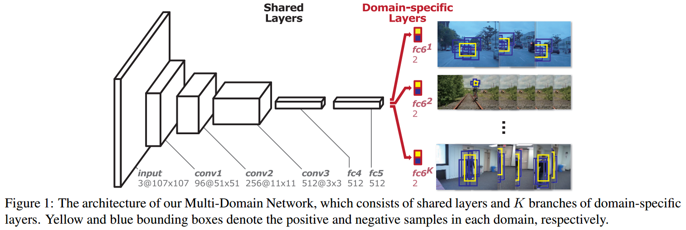
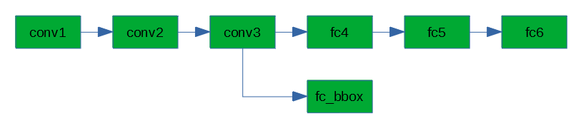

# 概述

MDNet 全称 Multi-Domain Convolutional Neural Network

原文：[Learning  Multi-Domain Convolutional Neural Networks for Visual Tracking](https://arxiv.org/abs/1510.07945)

代码：<https://github.com/hyeonseobnam/py-MDNet>

作者：Hyeonseob Nam, Bohyung Han

MDNet 使用小型卷积神经网络（CNN）实现视频内的目标跟踪==（单目标）==。

神经网络规模比一般的用于目标识别的大型 CNN 要小得多，根据作者的分析，主要原因在于以下 3 点：

1. CNN 识别的类型较小，只有 2 种：目标（前景）和背景；
2. 大型 CNN 由于其层数目较多，网络输出端已失去了较多的空间信息，很难判断目标在图像内的位置；
3. 目标跟踪用的 CNN 需要在工作过程中实时更新，小规模的 CNN 更新速度更快。

完整的 MDNet 分为 2 个部分：离线学习和在线跟踪，即使用是在线跟踪过程中也需要实时更新 CNN 参数。

本文首先说明了 MDNet 的 CNN 结构，之后再分别详述离线学习和在线跟踪的算法原理。

除原文外，主要参考如下：

- <https://blog.csdn.net/m0_37591902/article/details/84999542>
- <https://blog.csdn.net/sgfmby1994/article/details/79863772>
- <https://blog.csdn.net/Zfq740695564/article/details/79598559>

==声明：本文内容源于作者的理解，未经过仿真验证。部分内容与网络上一些文章并不一致，而且个人感觉原文结构也比较混乱，不确定理解正确。==

# 网络结构

原文的网络结构示意图如下：



MD 所表示的 Multi-Domain 指的是多个训练视频，每个训练视频被称为 1 个 Domain。

网络输入并非完整的视频帧图像，而是视频帧内所选择 Bounding Box (BBox)，经过缩放统一至 $107\times 107$ 分辨率的图像样本。

网络最后端用于输出的全连接层 fc6 为每个 Domain 所独有，K 个训练视频对应 K 个 fc6。训练过程中根据当前输入样本来源的视频，选择当前对应的 fc6 为 trainable，非样本来源视频的 fc6 为 untrainable。

==用 Keras 建立 MDNet 的只有 1 个 fc6 的 CNN 代码如下：==

```python
nn = models.Sequential()
nn.add(layers.Conv2D(96, (7, 7), activation='relu', strides=2, input_shape=(107, 107, 3)))
nn.add(layers.BatchNormalization())
nn.add(layers.MaxPool2D((3, 3), strides=2))
nn.add(layers.Conv2D(256, (5, 5), activation='relu', strides=2))
nn.add(layers.BatchNormalization())
nn.add(layers.MaxPool2D((3, 3), strides=2))
nn.add(layers.Conv2D(512, (3, 3), activation='relu', strides=1))
nn.add(layers.Flatten())
nn.add(layers.Dense(512, activation='relu'))
nn.add(layers.Dropout(0.5))
nn.add(layers.Dense(512, activation='relu'))
nn.add(layers.Dropout(0.5))
nn.add(layers.Dense(2, activation='softmax'))
nn.compile(optimizer='sgd', loss='categorical_crossentropy', metrics=['accuracy'])
```

**注意：此处的网络结构仅用于[离线学习](#离线学习)，在[在线跟踪](#在线跟踪)部分需要在当前网络结构进行调整。**

==MDNet 只进行二分类（目标与背景），但是最后一层 fc6 的激活函数没有选用二分类常用的 sigmoid，而是多分类情况下常用的 softmax，输出 2 个数值，在原文中被称为 positive score 和 negative score。可能其主要原因在于后续的[在线跟踪](#在线跟踪)过程中的 [Hard 负样本选取](#附：Hard 负样本选择)需要得到负样本的被判断为正的错误的可能性，如果使用 sigmoid 则无法得到。==

# 离线学习

离线学习的目标是通过当前的训练数据训练 conv1、conv2、conv3 层的参数（在线跟踪时不更新）以及 fc4 和 fc5 层的初始参数（在线跟踪时更新）。

## 训练数据处理

原始的训练数据为包含多个视频的内截取的连续视频帧，每帧图像内都通过人为标注的 bbox （称为 Ground-Truth bbox，后文简写 gt-bbox）表示了跟踪目标在图像内所处的位置。

bbox 用向量 [x, y, w, h] 表示，其中 (x, y) 为 bbox中心点在图像内的坐标，w 表示 bbox的列宽度，h 表示 bbox的行高度。

每个视频序列内的每帧图像内，根据 gt-bbox 使用**均匀随机**的办法建立 50 个 gt-bbox 的 $IoU\geq 0.7$ 的 bbox 作为正样本，以及 200 个 $IoU \leq 0.5$ 的 bbox作为负样本。

## 训练过程

离线学习的训练过程使用 mini batch，每轮训练依次循环选择一个视频序列作为当前的样本源，并且将该视频序列对应的 fc6 设置为 trainable，而所有其它的 fc6 全部设置为 untrainable。**（注意：conv1~3、fc4、fc5 在离线学习过程中一直为 trainable）**

mini batch 内的样本来源于当前视频序列中随机选择的 8 帧图像，每帧图像的全部正负样本中随机选择 4 个正样本以及 12 个负样本，共 32 个正样本和 96 个负样本，经由图像缩放至分辨率 $107\times 107$ 后组成计算输入 batch 数据。

在 K 个训练视频序列的情况下，共使用 100K 轮训练，并且设置 conv1~3 的学习率为 0.0001 ，fc4~6 的学习率为 0.001。

# 在线跟踪

在线跟踪使用了与离线学习不同的[网络结构](#网络结构)：

1. 保留离线学习的 conv1~3 和 fc4~5 的参数；
2. 保留 1 个 fc6，并且随机重置其参数；
3. 以 conv3 的输出建立 1 个全连接层作为边框回归层 fc_bbox；
4. 设置 conv1~3 为 untrainable。



以下各节内容描述在线跟踪各步骤：

## 步骤1：启动跟踪

启动之前**确保 fc6 和 fc_bbox 参数已重置**。

用户在当前图像帧（跟踪首帧）内人为标注跟踪 bbox，即 gt-bbox，表示当前跟踪目标。

## 步骤2：边框回归

边框回归的计算原理见[附录](#附：边框回归（Bounding Box Regression）)

根据 gt-bbox 的位置，使用**均匀随机**的办法建立 1000 个 gt-bbox 的 $IoU\geq 0.6$ 的 bbox，1000 个 bbox 范围内的图像经过缩放得到 1000 个 $107\times 107$ 分辨率的训练输入样本，使用**线性回归**算法得到 fc_bbox 的参数。

完成边框回归之后，fc_bbox 不再更新，直到下次跟踪。

## 步骤3：首帧训练

根据 gt-bbox 的位置，使用**高斯分布随机**的办法建立 500 个 gt-bbox 的  $IoU\geq 0.7$ 的 bbox 作为正样本，使用**均匀随机**的办法建立 5000 个 gt-bbox 的 $IoU\leq 0.3$ 的 bbox 作为负样本。

设置 fc4/fc5 学习率为 0.0001，fc6 学习率为 0.001，做 30 次迭代训练（SGD）。每次迭代的 mini batch 大小为 128，使用随机选择的 32 个正样本，以及 [随机的 1024 个负样本中选取的 96 个 hard 负样本（hard negatives）](#附：Hard 负样本选择)。

完成训练后 fc4~6 的参数被更新。

## 步骤4：实时跟踪

根据前一帧的 bbox 输出（紧接首帧之后的下一帧使用 gt-bbox），以高斯分布随机的方式生成 256 个候选 bbox，分别经由网络计算后得到其 positive score，选择数值最大的 bbox。

如果其 positive score 大于 0.5，则认为跟踪成功，执行以下操作：

- 用边框回归的参数调节 bbox，得到跟踪结果（即下一帧生成 256 个候选 bbox 的基准 bbox）；
- 以边框回归后的 bbox 为基准，以高斯分布随机的方式生成 50 个 $IoU\geq 0.7$ 的正样本和 200 个 $IoU\leq 0.3$ 的负样本。

如果其 positive score 小于 0.5，则认为跟踪失败。

### 实时训练

实时训练分为 long-term 和 short-term 2 种训练，训练只更新 fc4~6 的参数。

long-term 训练每 10 帧执行一次，short-term 训练在跟踪失败的帧立即执行。

两种训练的样本都来源于最近 100 个跟踪成功的帧（含首帧）所选取样本的样本库。首帧训练时建立的 5500 个样本以及跟踪成功的帧中建立的 250 个样本都放入样本库中。

训练使用 10 次迭代，输入的 mini batch 大小为 128：32 个正样本在 long-term 训练时在 100 帧内所有正样本中随机选择，在 short-term 训练时只在最近 20 帧的正样本中随机选择；96 个负样本与[首帧训练一样是 hard 负样本](#步骤3：首帧训练)，并且无论是 long-term 还是 short-term 都来源于最近 20 帧的负样本。

# 附：边框回归（Bounding Box Regression）

主要参考：

<https://blog.csdn.net/zijin0802034/article/details/77685438>

**边框回归并非用于计算得到目标边框的实际数值，而是用计算得到的参数调整已通过别的计算方法得到的目标边框，使其更接近真实的目标边框。**

图像内窗口一般使用向量 [x, y, width, height] 表示，(x, y) 表示窗口的中心点坐标，width 和 height 分别表示窗口的宽高。

正确的边框称为 Ground Truth，已有的边框为 Region Proposal。

令 Region Proposal 为 [x, y, width, height]，**边框回归计算输出为回归调整参数 $[W_{x}, W_{y}, W_{width}, W_{height}]$**，经由回归参数调整后的边框为 $[\hat{x}, \hat{y}, \hat{width}, \hat{height}]$，期望 $[\hat{x}, \hat{y}, \hat{width}, \hat{height}]$ 接近 Ground Truth $[x_{G}, y_{G}, width_{G}, height_{G}]$

边框回归分为 2 个部分，平移与尺度缩放
平移变换：
$$
\hat{x}=width\times W_{x}+x\\
\hat{y}=height\times W_{y}+y
$$
尺度缩放变换：
$$
\hat{width}=width\times exp(W_{width})\\
\hat{height}=height\times exp(W_{height})
$$
理想情况下：
$$
[\hat{x}, \hat{y}, \hat{width}, \hat{height}]=[x_{G}, y_{G}, width_{G}, height_{G}]
$$
则有正确的回归计算输出值 $[T_{x}, T_{y}, T_{width}, T_{height}]$ ：
$$
T_{x}=\frac{x_{G}-x}{width}\\
T_{y}=\frac{y_{G}-y}{height}
$$

$$
T_{width}=log(\frac{width_G}{width})\\
T_{height}=log(\frac{height_G}{height})
$$

**注意，边框回归的输入值并非 Region Proposal，而是卷积神经网络中最后 1 个卷积层的输出特征值（特征向量）。**

令输入特征向量为 $\Phi$，则有损失函数公式：
$$
L=(T_x-w_x^T\times\Phi)^2+(T_y-w_y^T\times\Phi)^2+(T_{width}-w_{width}^T\times\Phi)^2+(T_{height}-w_{height}^T\times\Phi)^2
$$

为了保证足够的泛化，做 L2 正则化得到训练使用的损失函数：
$$
L=(T_x-w_x^T\times\Phi)^2+(T_y-w_y^T\times\Phi)^2+(T_{width}-w_{width}^T\times\Phi)^2+(T_{height}-w_{height}^T\times\Phi)^2\\+\lambda(||w_x||_2^2+||w_y||_2^2+||w_{width}||_2^2+||w_{height}||_2^2)
$$
之后使用梯度下降法计算得到 4 个参数向量 $w_x$、$w_y$、$w_{width}$、$w_{height}$

2 个可能问题的解释：

1. 为什么平移变换中需要除以宽高？因为目标具有尺度不变性，即图像中对目标的判定不受其尺寸影响。相当于对边框的宽高进行了归一化处理，使得大边框平移较多，而小边框平移较少。
2. 为什么尺度缩放变换需要使用 log？因为可以用 exp 函数方便地保证在任意实数的回归参数时，尺度缩放计算不会出现负值。

# 附：Hard 负样本选择

Hard 负样本即计算结果出现 false positive 的负样本，这些负样本被误的认为是 positive，二分类被认为是目标。

Hard 负样本的选择先要经过网络测试，将 1024 个负样本送入网络后选择其中 positive score （源于 [fc6 的 softmax 激活](#网络结构)）最高的 96 个。