配置虚拟机网卡，在虚拟机设置中添加 2 个网络适配器，并配置为桥接模式

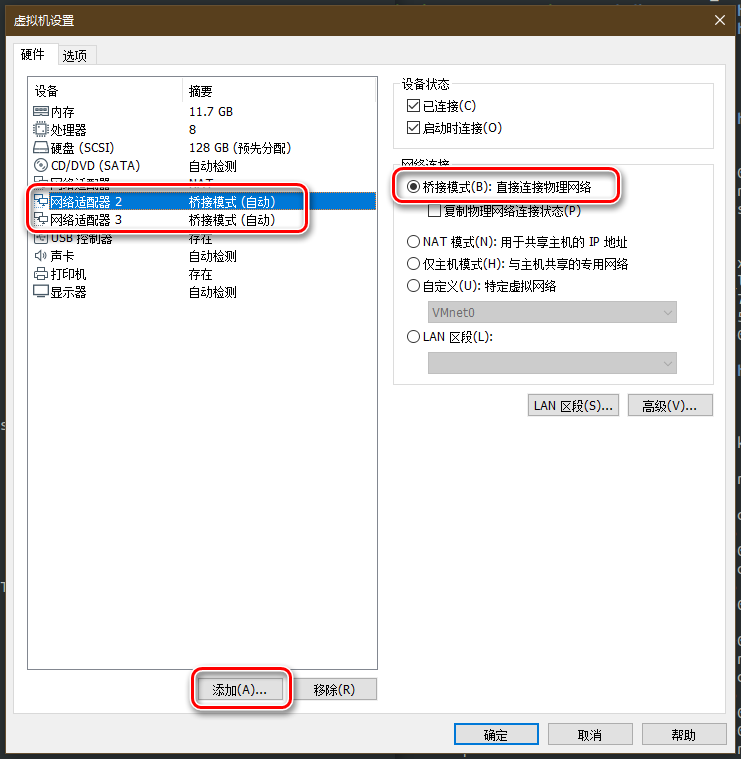

在 DPDK 官网首页打开下载页面

选择长期支持版 19.11.3

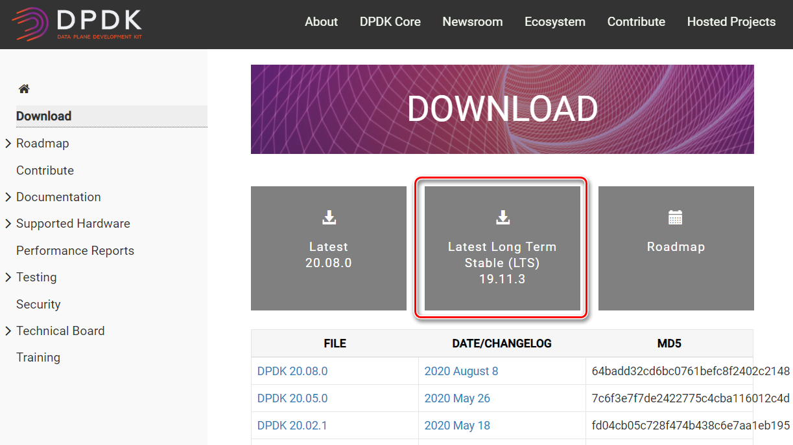

下载后的 dpdk-19.11.3.tar.xz 文件导入虚拟机并解压至主目录，为方便使用，将文件夹改名为 dpdk

打开终端，转为 root 用户

>   sudo su

配置环境变量

>   export RTE_SDK=/home/bt/dpdk
>
>   export RTE_TARGET=x86_64-native-linuxapp-gcc

安装辅助软件

>   apt-get install numactl
>
>   apt-get install libnuma-dev
>
>   apt-get install net-tools

进入 dpdk 的 usertools 目录，运行 dpdk-setup.sh

>   ./dpdk-setup.sh

根据提示选择 Option: 38 编译 dpdk 源码

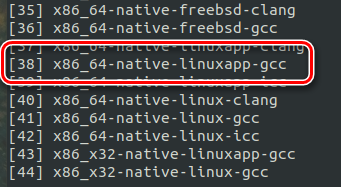

等待一段时间编译完成后，选择 Option: 45 插入 igb_uio 驱动模块

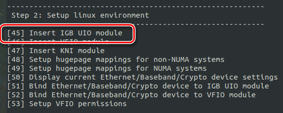

选择 Option: 48 non-NUMA 大页内存配置

虚拟机只有 1 个 socket，只能使用 non-NUMA

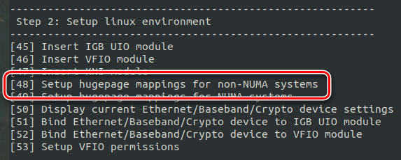

按需选择大页内存的页数，目前选择输入默认的 64

每个内存大页 2MB，64 页共 128MB

选择 Option: 50，查看当前网卡状态

3 个网卡全部为 active

选择 Option: 62，退出脚本

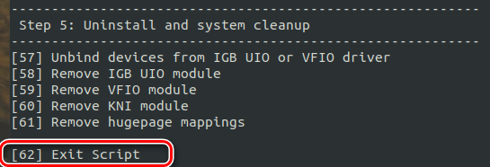

关闭之前新添加的 2 块网卡

>   ifconfig ens38 down
>
>   ifconfig ens39 down

完成后重新打开 dpdk-setup.sh

选择 Option: 51，绑定网卡

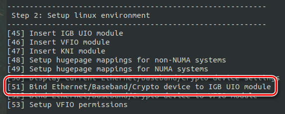

按提示输入网卡 ens38 和 ens39 的编号

>   Enter PCI address of device to bind to IGB UIO driver: 02:06.0
>
>   Enter PCI address of device to bind to IGB UIO driver: 02:07.0

选择 Option: 50，查看当前网卡状态

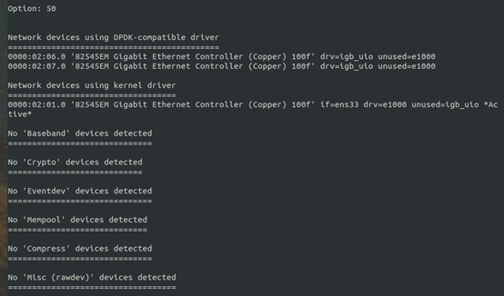

02:06.0 和 02:07.0 绑定为 DPDK-compatible

打开新的终端进入 dpdk 目录下 examples/helloworld 文件夹

配置环境变量

>   export RTE_SDK=/home/bt/dpdk
>
>   export RTE_TARGET=x86_64-native-linuxapp-gcc

编译示例工程

>   make

运行

**注意必须用 sudo，因为 dpdk 的功能必须使用 root 权限**

>   sudo ./build/helloworld

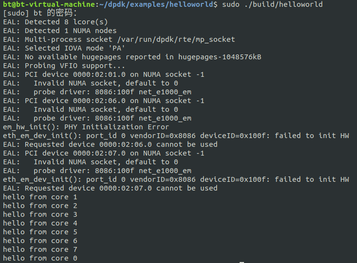

# 异常错误处理

## 1GB 大页内存挂载

前述运行结果中的错误

>   No available hugepages reported in hugepages-1048576kB

表示系统中的 1GB 大页内存未挂载

打开 /etc/default/grub 文件，原文

>   GRUB_CMDLINE_LINUX=""

修改为以下：

>GRUB_CMDLINE_LINUX="default_hugepagesz=1GB hugepagesz=1G hugepages=2"

在终端中更新 grub 并重启，运行

>   sudo update-grub
>
>   reboot

重启后重新配置 dpdk 环境，运行 helloworld

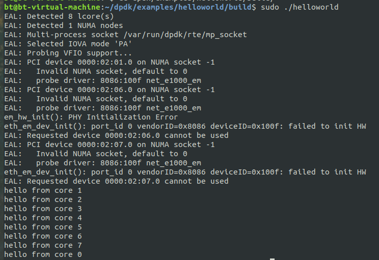

## 虚拟网卡类型

前述运行结果中的错误

>   failed to init HW

主要原因在于默认的 vmware 默认添加的网卡类型为 e1000，应当修改为 vmxnet3

关闭虚拟机后，进入虚拟机文件目录，打开扩展名为 vmx 的配置文件

原文

>   ethernet1.virtualDev = "e1000"
>
>   ethernet2.virtualDev = "e1000"

修改为

>   ethernet1.virtualDev = "vmxnet3"
>
>   ethernet2.virtualDev = "vmxnet3"

重启后重新配置 dpdk 环境，运行 helloworld

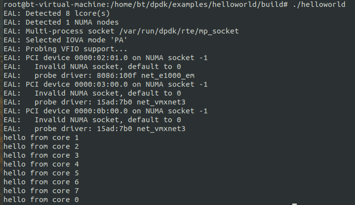

运行 skeleton

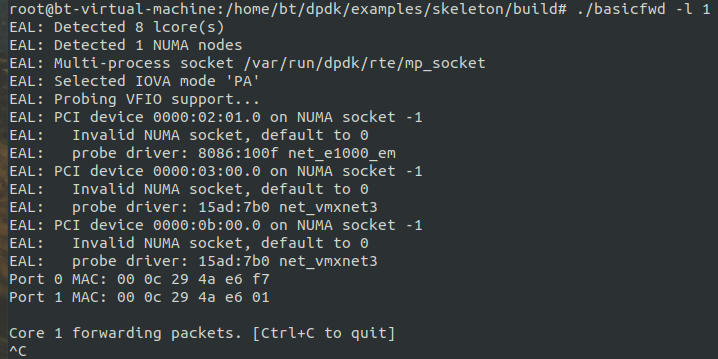

