本文档及此文档系列中使用zcu102开发板的全部文档均使用以下开发环境：

-   zcu102开发板
-   Windows 10
-   Vivado 2018.2.1
-   Matlab 2017b

---

本文首先说明了PL开发的完整流程，再对仿真和调试功能进行单独说明。

# 建立工程

启动Vivado，选择Create Project

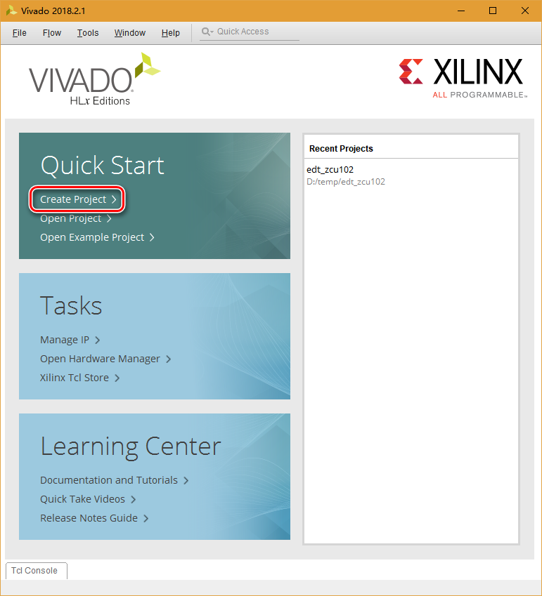

进入新建工程向导

在Project Name页设置工程名称及路径

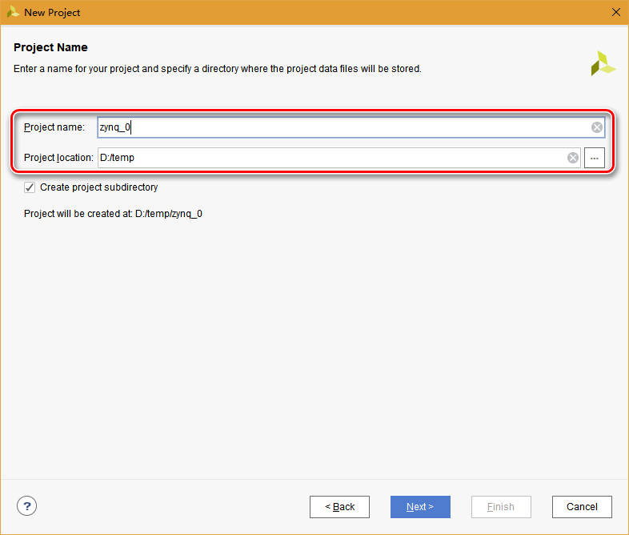

在Project Type页选择RTL Project，并且选中Do not specify sources at this time

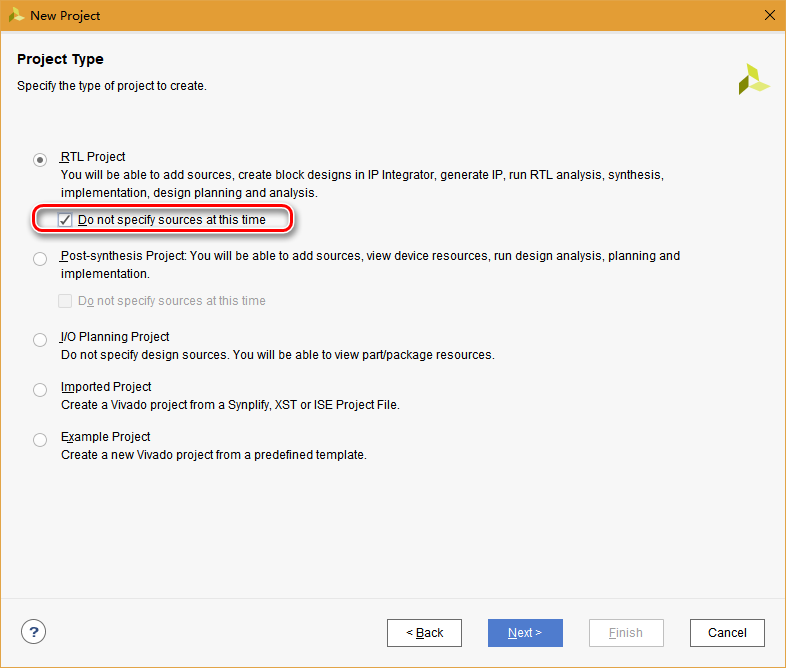

在Default Part页选择zcu102开发板

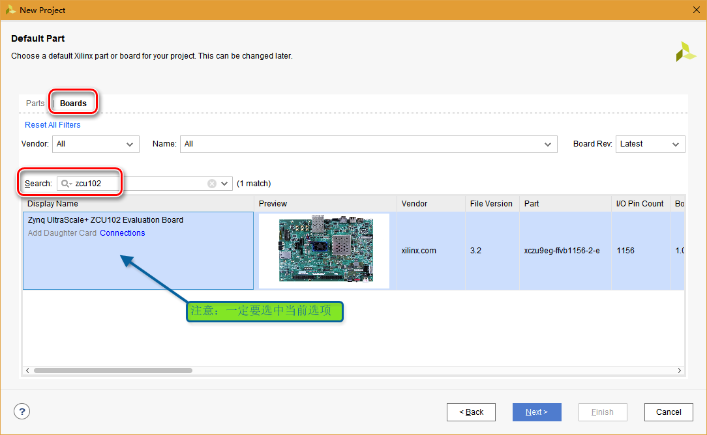

完成后点击Finish，建立工程完毕

# 添加时钟

根据ug1182 zcu102 evaluation board user guide，当前工程使用板上125MHz固定频率差分时钟。

由于管脚所在Bank为HIGH_DENSITY IO Bank，不能使用PLL或者MMCM等时钟模块，因此先由IBUFDS转化为单端时钟后直接使用。IBUFDS调用代码见[添加设计文件](#添加设计文件)部分的代码。

# 添加设计文件

在Sources窗口选择Add Sources


在弹出的Add Sources窗口，选择Add or create design sources

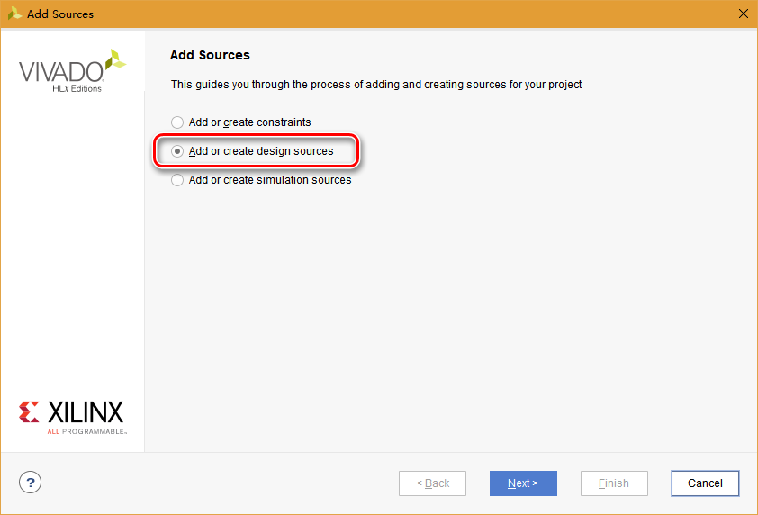

在Add or Create Design Sources页选择Create File

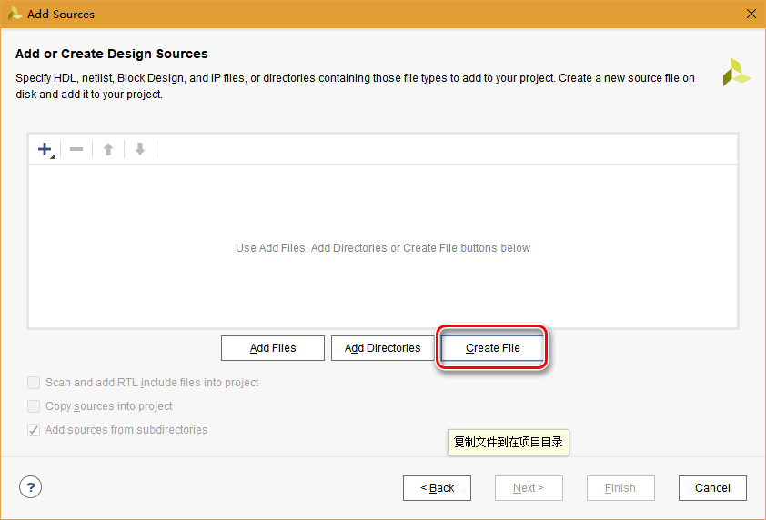

在弹出窗口中输入文件名称

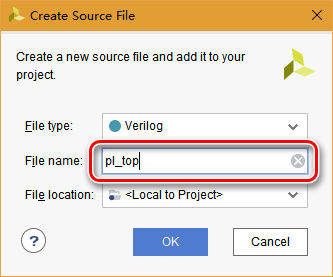

回到Add Sources窗口点击Finish

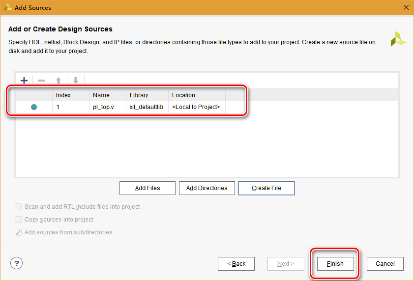

弹出的Define Module窗口中设置模块的输入输出端口，并选择OK

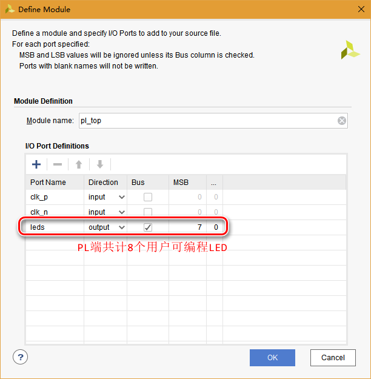

在Sources窗口双击新建的模块，编辑代码

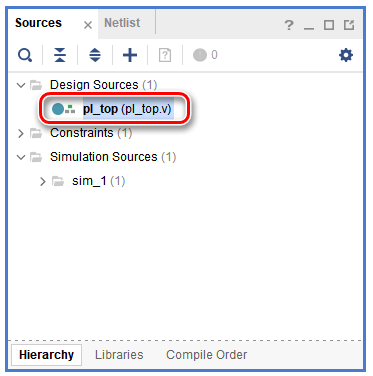

打开代码后可以看到前述流程中自动添加的端口定义

```verilog
module pl_top(
    input clk_p,
    input clk_n,
    output [7:0] leds
    );
endmodule
```

完成代码如下：

```verilog
module pl_top(
    input clk_p,
    input clk_n,
    output [7:0] leds
    );
    
    wire clk;//125MHz工作时钟
    
    //用原语实现差分时钟转单端
    IBUFDS
    #(
    .IOSTANDARD("DEFAULT")//DEFAULT默认所有情况
    )
    IBUFDS_inst
    (
    .O(clk),//输出
    .I(clk_p),//P端输入
    .IB(clk_n)//N端输入
    );
    
    //定义输出寄存器
    reg [7:0] leds = 8'b0000_0001;
    
    //计数器，计时1秒，计数范围0~27'd125_000_000-1
    reg [26:0] cnt = 27'd0;
    
    always @(posedge clk) begin
        case (cnt)
            27'd124_999_999: begin
                cnt <= 27'd0;//计数复位
                leds <= {leds[6:0], leds[7]};//循环移位
            end
            
            default: begin
                cnt <= cnt+27'd1;//计数
                leds <= leds;//保持
            end
        endcase
    end
    
endmodule
```

# 添加约束文件

使用与前述相同的方法打开Add Sources窗口，选择Add or create constraints

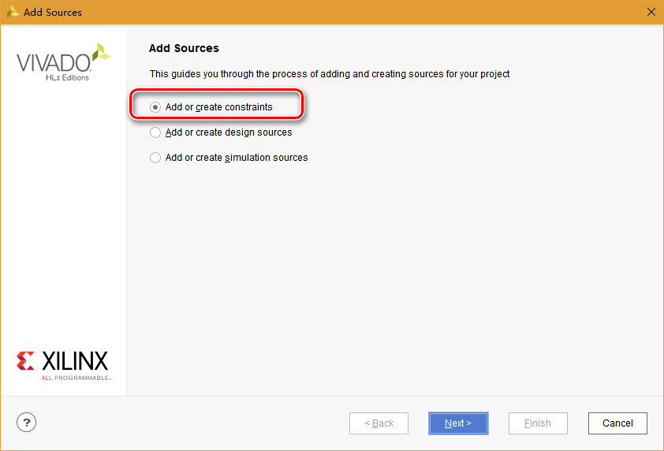

选择Create File，建立xdc约束文件，点击Finish完成

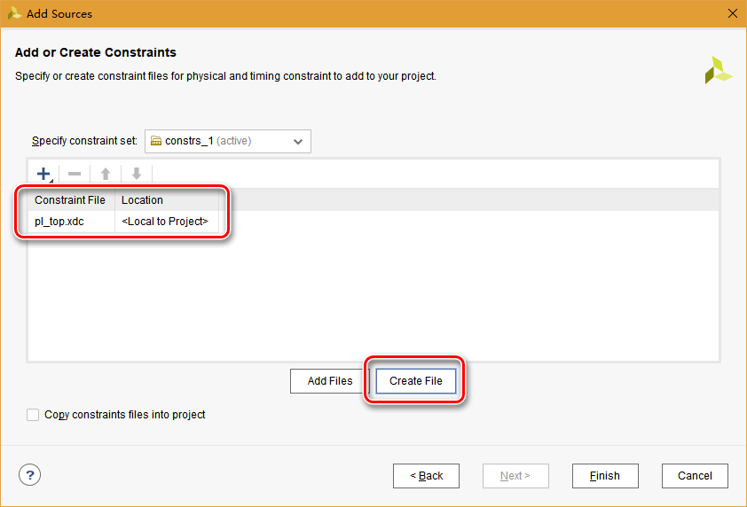

在Sources窗口可以看到新建立的约束文件

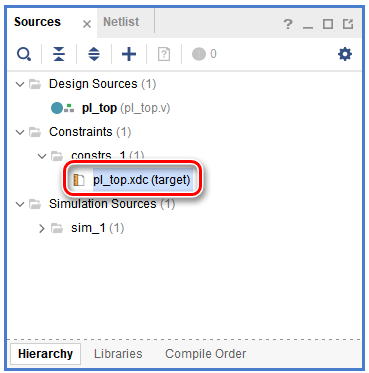

# 综合

在SYNTHESIS选择Run Synthesis

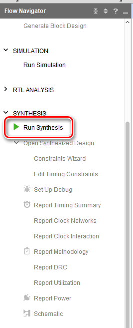

弹出窗口按默认设置选择OK开始综合

综合结束后在弹出窗口选择Open Synthesized Design（或者在Flow Navigator的SYHTHESIS项下选择）

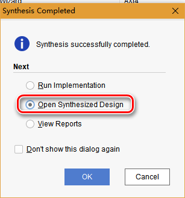

# 添加管脚约束

在Layout菜单选择I/O Planning

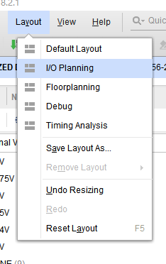

在I/O Ports页设置所有顶层管脚的Package Pin和I/O Std（参考ug1182）

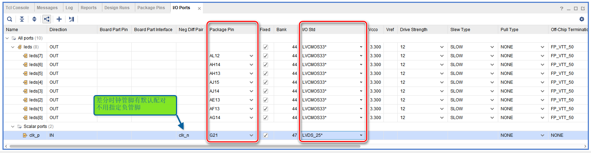

选择保存弹出Out of Date Design，选择OK

接下来弹出的Save Constraints窗口中指定前述建立的xdc约束文件

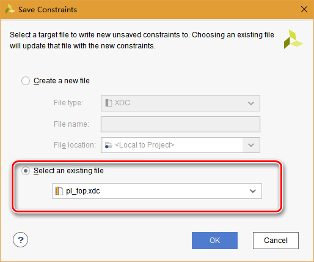

在Sources窗口双击打开pl_top.xdc文件可以看到保存的管脚约束代码

```verilog
set_property PACKAGE_PIN AL12 [get_ports {leds[7]}]
set_property PACKAGE_PIN AH14 [get_ports {leds[6]}]
set_property PACKAGE_PIN AH13 [get_ports {leds[5]}]
set_property PACKAGE_PIN AJ15 [get_ports {leds[4]}]
set_property PACKAGE_PIN AJ14 [get_ports {leds[3]}]
set_property PACKAGE_PIN AE13 [get_ports {leds[2]}]
set_property PACKAGE_PIN AF13 [get_ports {leds[1]}]
set_property PACKAGE_PIN AG14 [get_ports {leds[0]}]
set_property IOSTANDARD LVCMOS33 [get_ports {leds[7]}]
set_property IOSTANDARD LVCMOS33 [get_ports {leds[6]}]
set_property IOSTANDARD LVCMOS33 [get_ports {leds[5]}]
set_property IOSTANDARD LVCMOS33 [get_ports {leds[4]}]
set_property IOSTANDARD LVCMOS33 [get_ports {leds[3]}]
set_property IOSTANDARD LVCMOS33 [get_ports {leds[2]}]
set_property IOSTANDARD LVCMOS33 [get_ports {leds[1]}]
set_property IOSTANDARD LVCMOS33 [get_ports {leds[0]}]
set_property PACKAGE_PIN G21 [get_ports clk_p]
set_property IOSTANDARD LVDS_25 [get_ports clk_p]
set_property IOSTANDARD LVDS_25 [get_ports clk_n]
```

# 添加时钟约束

在SYNTHESIS选择Edit Timing Constraints

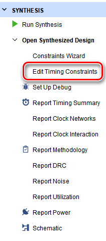

打开Timing Constraints页


双击Double click to create a Create Clock Constraint提示

在Create Clock窗口查找时钟并设置时钟周期

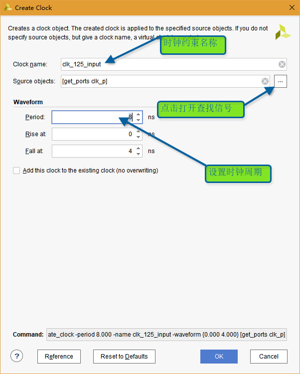

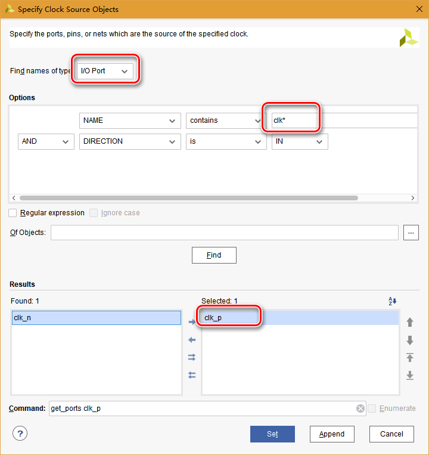

在Timing Constraints页面出现新建的时钟约束

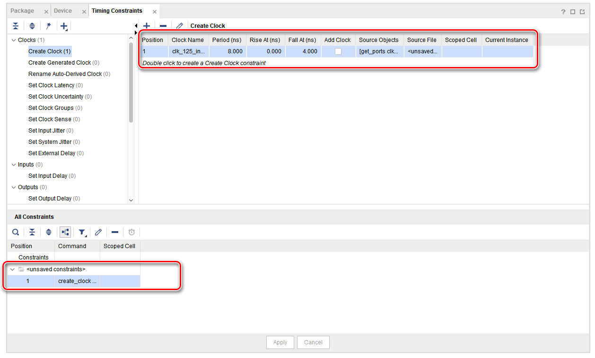

保存后在pl_top.xdc文件内出现时钟约束代码

```verilog
create_clock -period 8.000 -name clk_125_input -waveform {0.000 4.000} [get_ports clk_p]
```

# 实现

在IMPLEMENTATION选择Run Implementation

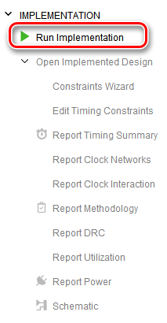

弹出窗口按默认设置选择OK开始实现

结束后的弹出窗口中选择Open Implemented Design（或者在Flow Navigator的IMPLEMENTATION项下选择）

在Timing页，可以看到时钟约束全部通过


# 生成并烧写

在PROGRAM AND DEBUG下点击Generate Bitstream

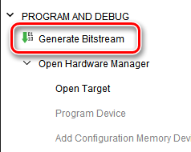

*根据xtp435 zcu102 software install and board setup的说明*，连接JTAG USB口，并且设置为JTAG加载之后，板卡上电

在PROGRAM AND DEBUG的Open Hardware Manager内选择Open Target

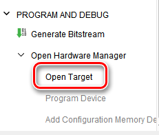

弹出菜单内选择Auto Connect

进入HARDWARE MANAGER界面后，在Hardware窗口选择xczu9_0器件，右键单击选择Program Device

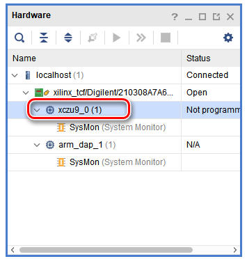

在弹出的Program Device窗口选择生成的bit文件，并点击Program按钮

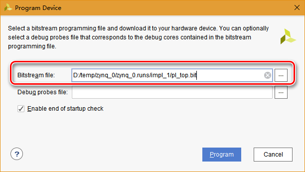

完成烧写后，板上LED按照代码设计依次点亮

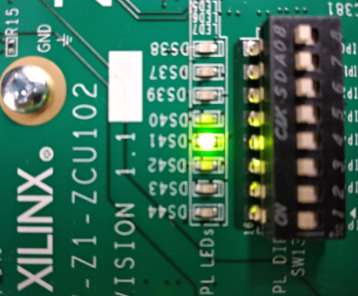

# 仿真

在Sources窗口选择Add Sources


在Add Sources窗口选择Add or create simulation sources

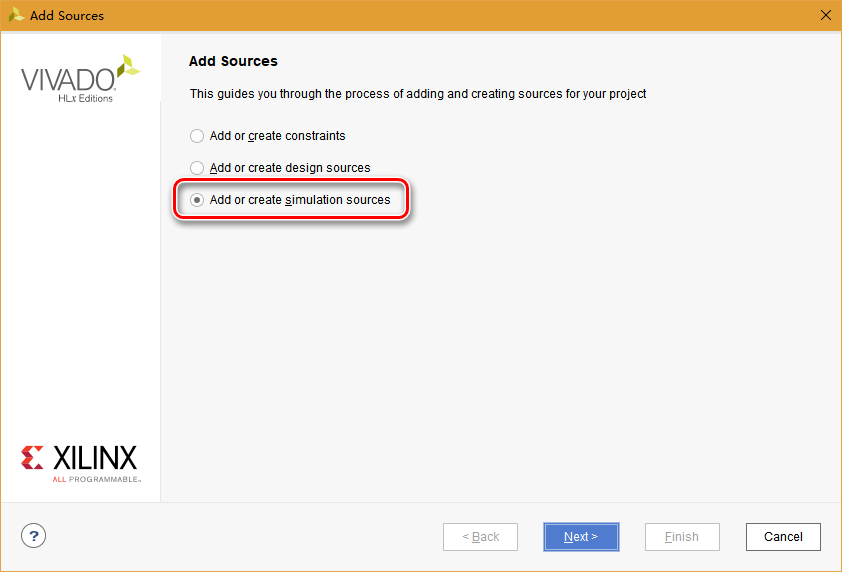

在下个步骤选择Create File

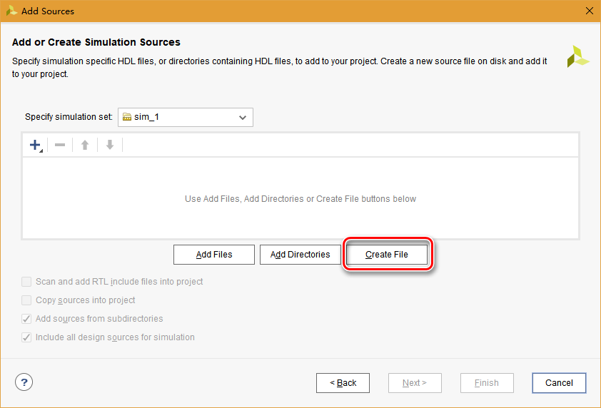

在Create Source File窗口设置文件名

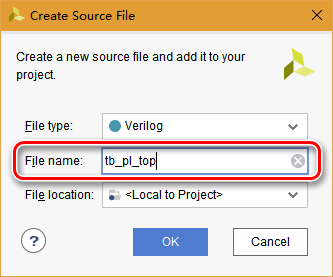

完成后点击Finish按钮

之后弹出的Define Module窗口用于指定模块端口，由于是仿真激励，直接点击OK

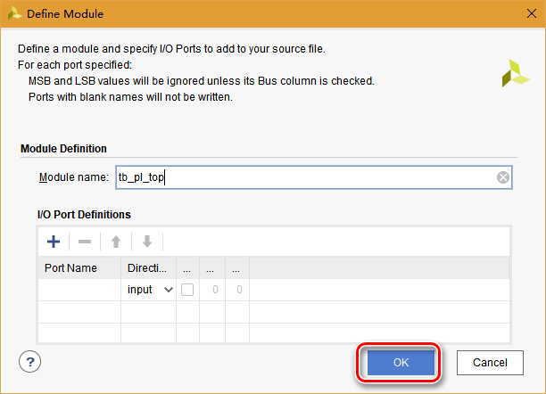

在Sources窗口找到新建的仿真模块，双击打开

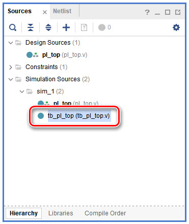

修改后的仿真代码如下：

```verilog
module tb_pl_top(

    );
    
    //建立差分时钟
    reg clk_p = 1'b0;
    wire clk_n;
    assign clk_n = ~clk_p;
    
    //设置时钟周期为8ns
    always #4 clk_p = ~clk_p;
    
    //定义led输出
    wire [7:0] leds;
    
    //例化
    pl_top u
    (
    .clk_p(clk_p), 
    .clk_n(clk_n), 
    .leds(leds)
    );
    
endmodule
```

在Flow Navigator的SIMULATION中选择Run Simulation，在弹出菜单中选择Run Behavioral Simulation

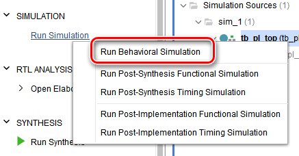

之后进入SIMULATION界面

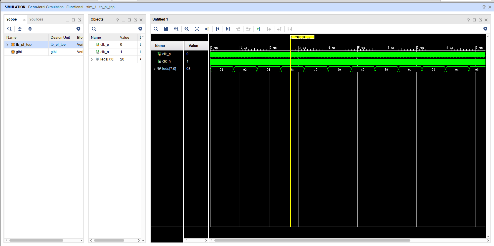

上方仿真波形是在修改设计代码中的计时长度后得到，否则仿真时间太长。

# 调试

此处的调试指上板调试，在FPGA运行中查看内部信号。

在SYNTHESIS下首先选择Open Synthesized Design，再选择Set Up Debug

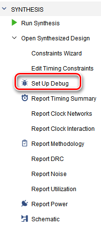

在弹出的Set Up Debug窗口中添加信号，简单的方法是从Netlist窗口直接拖入

若关注的信号没有在Netlist中出现，则可以在代码中信号定义之前添加` (* keep="true" *)`原语保持信号

**或者用`(* mark_debug="true" *)`直接标记为调试信号**

```verilog
(*keep="true"*) reg [26:0] cnt = 27'd0;
```

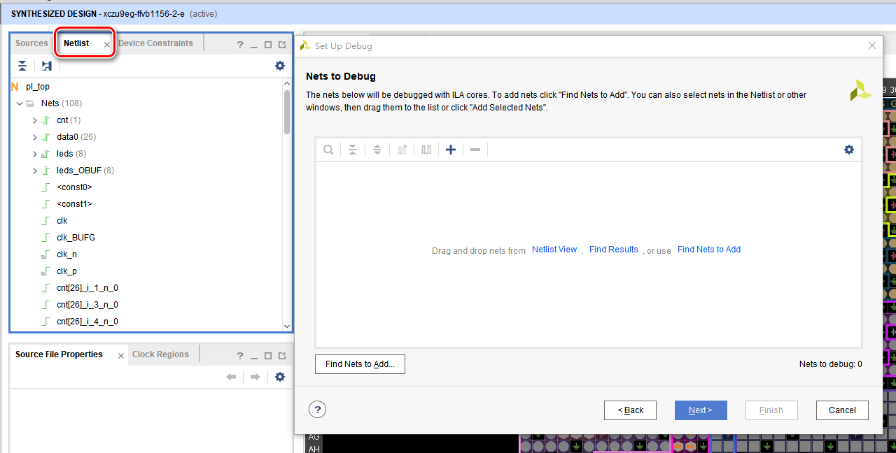

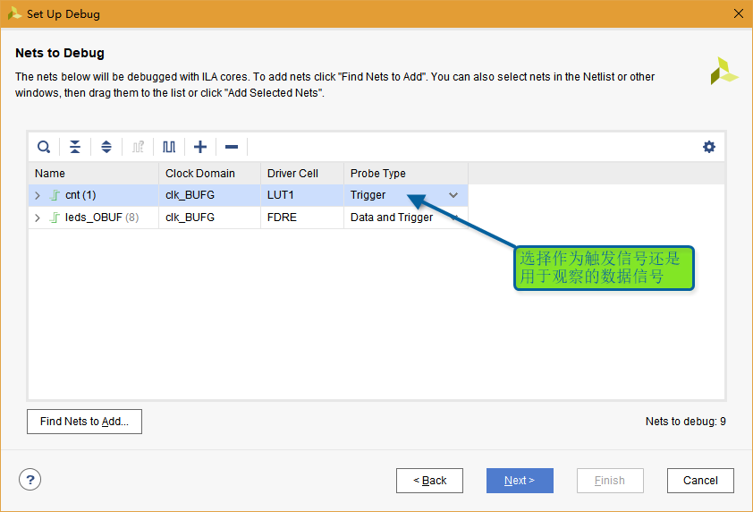

下一步骤中指定抓取信号的深度

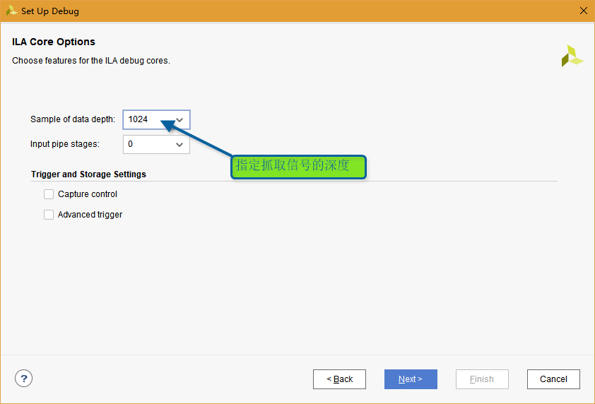

之后点击Finish完成设置

在Netlist窗口可以发现添加的调试信号左侧出现了调试标记

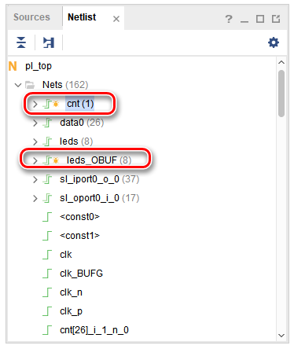

根据前述的说明重新生成bit文件后，打开烧写界面，在Program Device窗口可以发现自动添加的Debug文件

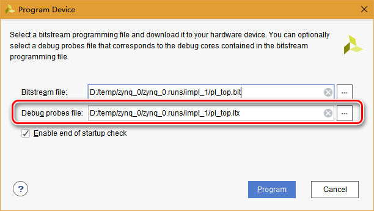

点击Program烧写完成后自动打开调试界面

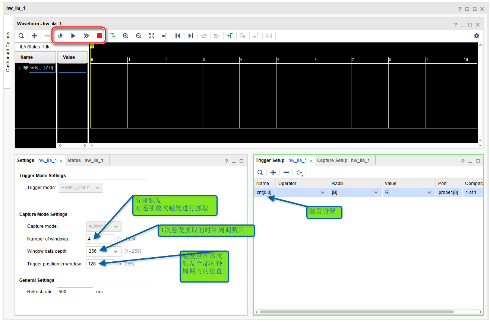

抓取结果：

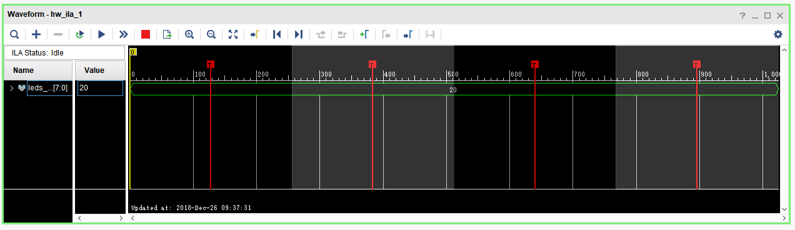