本文在PS的Standalone程序中使用xilffs库实现对SD卡文件的读写操作。

本文主要参考以下两篇博客：

<https://blog.csdn.net/jinhua1990/article/details/84100100>

<https://blog.csdn.net/lixiaolin126/article/details/83959214>

# Block Design

建立zcu102的Vivado工程，新建Block Design，并且添加zynq模块

运行Run Block Automation，双击打开zynq模块配置查看SD接口配置


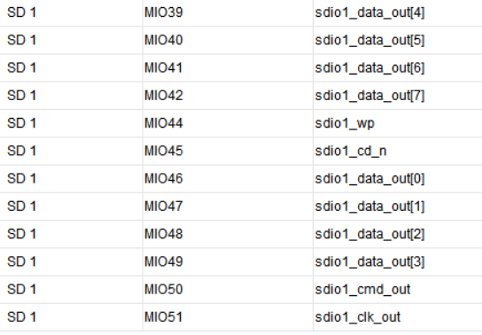

**注意，CD指Card Detection，WP指Write Protection**

==参考ug1182，发现MIO39~MIO42的自动配置与之不符，而且SD接口协议并不存在8Bit的Data Transfer Mode==

但是问题无解

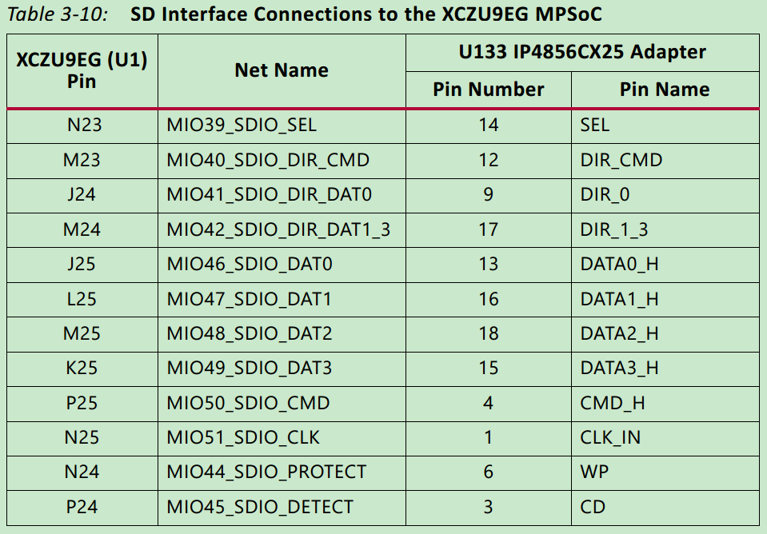

保留UART和SD1，关闭其它外设接口以及PS-PL接口

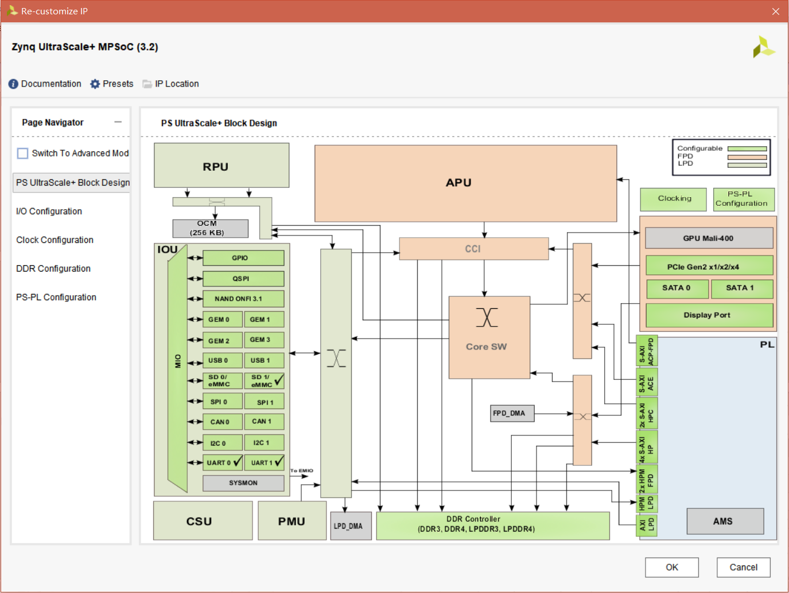

保存后依次运行Generate Output Products和Create HDL Wrapper

在Flow Navigator中选择Generate Bitstream，完成后先Export Hardware，再Launch SDK

# PS程序

在SDK中建立Hello World模板程序，并新建BSP工程

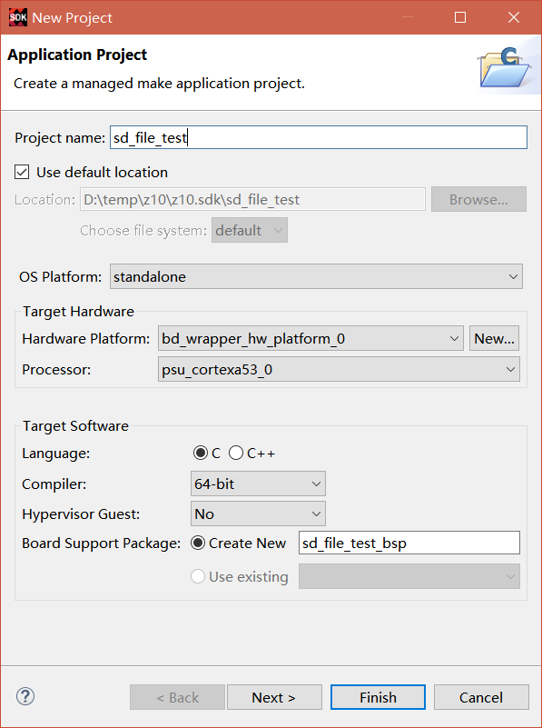

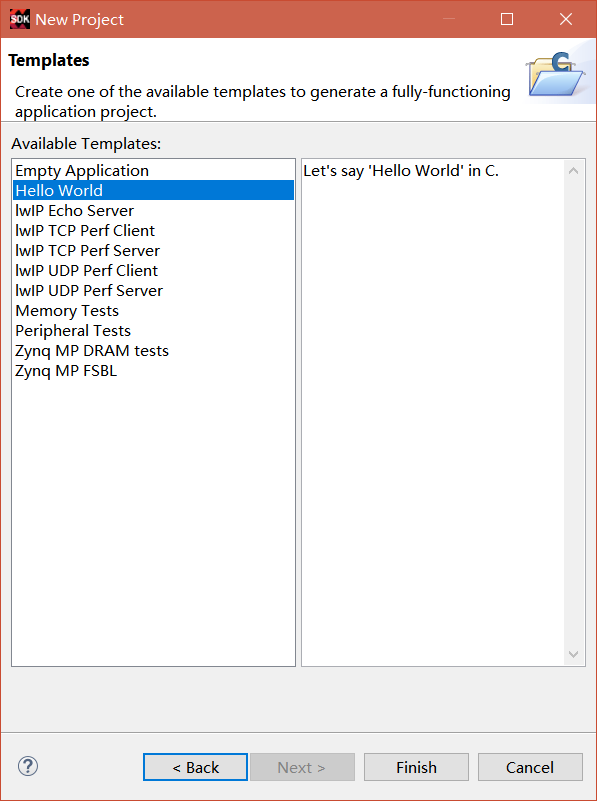

接下来在BSP工程配置xilffs库

在BSP工程上，右键菜单选择Board Support Package Settings

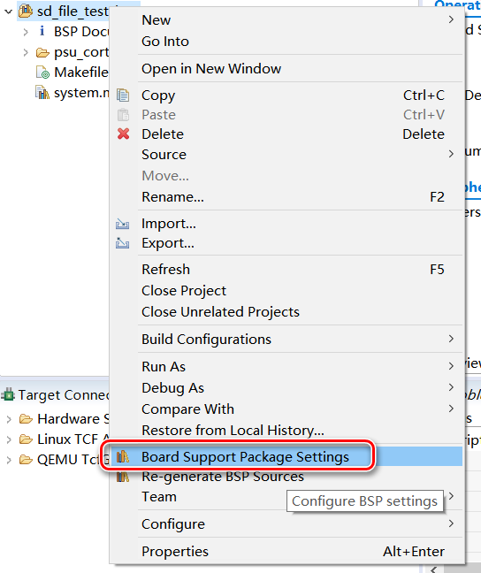

进入Settings窗口，在Overview界面选中xilffs库

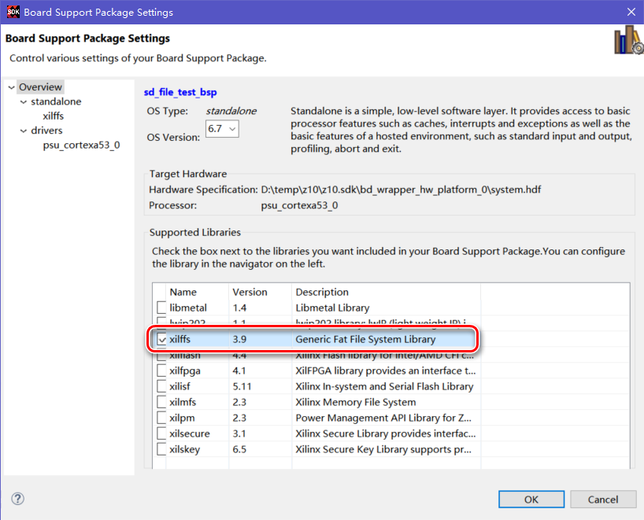

点击standalone下方的xilffs，进入xilffs配置界面，将use_lfn设置为true，使xilffs库支持长文件名

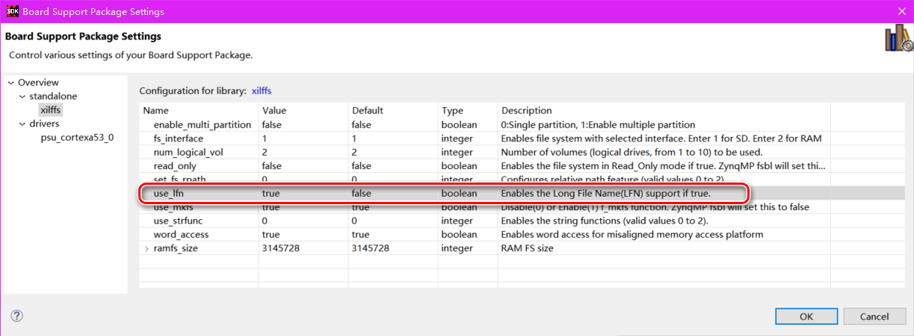

配置完成后点击OK

打开BSP工程中的system.mss文件，可以在最下方发现xilffs库，选择Import Examples导入示例工程

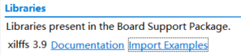

参考示例工程，修改helloworld.c文件内容如下：

```c
#include <stdio.h>
#include "platform.h"
#include "xil_printf.h"
#include "ff.h"


int main()
{
	xil_printf("SD Card File Test Begin\n\r");

	FIL fil;//文件
	FATFS fatfs;//文件系统

	TCHAR *Path = "0:/";//使用逻辑磁盘0

	//挂载逻辑磁盘0至当前文件系统变量
	//f_mount第3个参数的说明：Mounting option. 0: Do not mount now (to be mounted on the first access to the volume), 1: Force mounted the volume to check if it is ready to work.
	FRESULT Res;
	Res = f_mount(&fatfs, Path, 0);
	if (Res != FR_OK)//挂载失败
	{
		xil_printf("Fail to mount SD Card\n\r");
		return -1;
	}

	//写文件测试***************************************
	//定义文件名
	char FilePath[32] = "0:/test.dat";

	//打开文件，取得写入权限，如果文件不存在则新建文件
	Res = f_open(&fil, FilePath, FA_CREATE_ALWAYS | FA_WRITE);
	if (Res != FR_OK)//打开文件失败
	{
		xil_printf("Fail to open file\n\r");
		return -1;
	}

	//文件指针移至文件头
	Res = f_lseek(&fil, 0);
	if (Res != FR_OK)
	{
		xil_printf("Fail to seek beginning of file\n\r");
		return -1;
	}

	//用于写入的数据
	char Buf[9];
	int i = 0;
	for (i = 0; i < 9; ++i)
	{
		Buf[i] = i+1;
	}

	//写入数据
	UINT NumBytesWritten;
	Res = f_write(&fil, (const void*)Buf, 9, &NumBytesWritten);
	if (Res != FR_OK)
	{
		xil_printf("Fail to write file\n\r");
		return -1;
	}
	xil_printf("%d Bytes were written\n\r", NumBytesWritten);

	//关闭文件，数据由cache全部移至磁盘
	Res = f_close(&fil);
	if (Res != FR_OK)
	{
		xil_printf("Fail to close file\n\r");
		return -1;
	}

	//读文件测试****************************
	//打开文件，取得读权限
	Res = f_open(&fil, FilePath, FA_READ);
	if (Res != FR_OK)//打开文件失败
	{
		xil_printf("Fail to open file\n\r");
		return -1;
	}

	//文件指针移至文件头
	Res = f_lseek(&fil, 0);
	if (Res != FR_OK)
	{
		xil_printf("Fail to seek beginning of file\n\r");
		return -1;
	}

	//读文件
	memset(Buf, 0, 9);//清空Buf内存空间为全0
	UINT NumBytesRead;
	Res = f_read(&fil, (void*)Buf, 9, &NumBytesRead);
	if (Res != FR_OK)
	{
		xil_printf("Fail to read file\n\r");
		return -1;
	}
	xil_printf("%d Bytes were read\n\r", NumBytesRead);

	//打印读出数据
	for (i = 0; i < NumBytesRead; ++i)
	{
		xil_printf("Buf[%d] = %d\n\r", i, Buf[i]);
	}

	//关闭文件
	Res = f_close(&fil);
	if (Res != FR_OK)
	{
		xil_printf("Fail to close file\n\r");
		return -1;
	}

    return 0;
}
```

# 试验

将zcu102的启动模式设置为JTAG，并且插入SD卡（确保格式化为FAT32格式）

参考ug1182

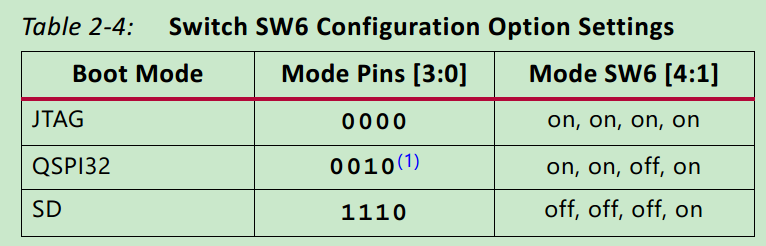

打开串口调试助手，按下图配置并且连接COM4


板卡上电后在SDK中，对测试工程选择Debug

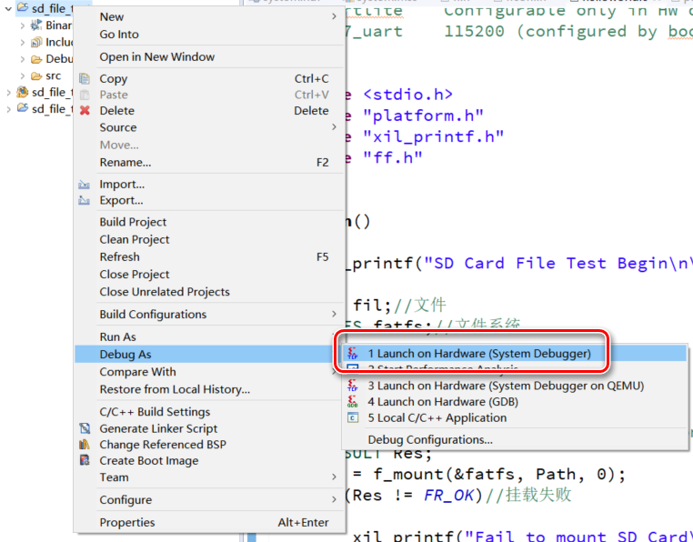

发现调试结果与代码预期功能相符合