本文实现zcu102输出HDMI视频的功能，没有PS参与，除了相关IP的Product Guide之外，主要参考以下2篇：

<https://www.cnblogs.com/xingjian92/p/9871445.html>

<https://www.cnblogs.com/xingjian92/p/9878505.html>

<https://blog.csdn.net/angelbosj/article/details/50716503>

<https://blog.csdn.net/angelbosj/article/details/50747263>

本文首先建立并且分析说明了Vivado HDMI IP自带的HDMI示例工程，之后以此为参考重新建立自定义的HDMI试验工程

最早想使用PS的DisplayPort输出接口进行视频输出

但是，根据<https://china.xilinx.com/support/answers/71774.html>的说明，**PS的DisplayPort输出接口不支持无源转接HDMI**

而且由于PS输出DisplayPort的参考资料实在太难找到，因此放弃PS的DP输出

目前找到的PS输出DisplayPort只有ug1085，SDK在BSP工程中自带的示例程序，和下述两个网页：

<https://www.xilinx.com/support/answers/71416.html>

<https://xilinx-wiki.atlassian.net/wiki/spaces/A/pages/18842318/ZynqMP+Standalone+DisplayPort+Driver>

# 建立HDMI示例工程

## 申请License

在示例工程要使用Video Test Pattern Generator IP，只有添加合适的License才能正常建立示例工程

而且**HDMI IP也需要申请Evaluation License才能生成试用的Bitstream**

以下仅说明Video Test Pattern Generator的License申请过程，HDMI IP的License申请办法与之相同

根据该IP的使用规则，需要注册Xilinx账号申请License

注册Xilinx账号见[Xilinx官网](https://china.xilinx.com/)

以下说明申请License的流程

进入[申请页面](https://www.xilinx.com/member/forms/license-form.html)，使用注册的账号登陆并且确定后，进入下图所示页面，点击Search Now按钮查找IP

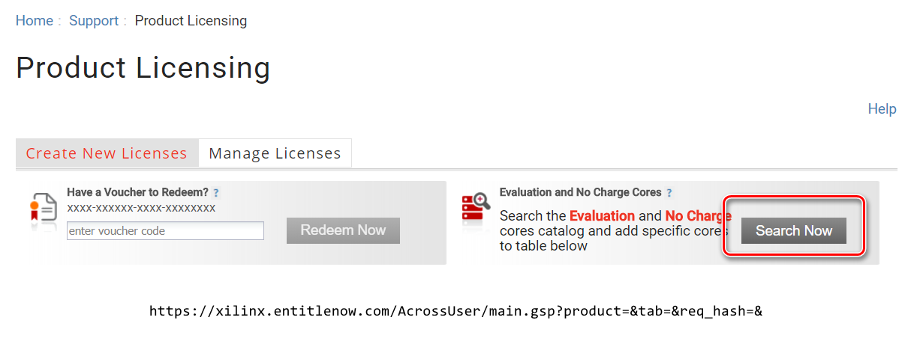

弹出窗口中搜索Test Pattern，选中查找结果并且点击Add按钮

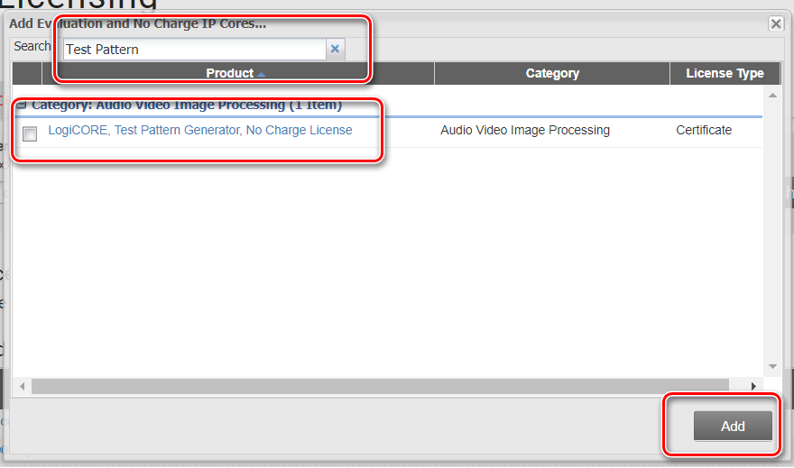

页面下方的Certificate Based Licenses框内出现前述添加的IP，选中后点击Generate Node-Locked License，弹出信息输入界面

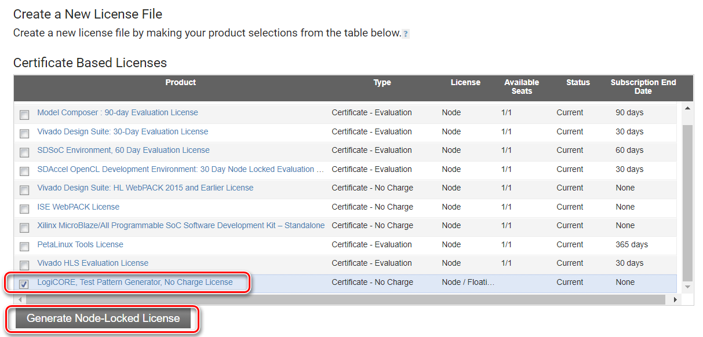

在输入信息之前需要先取得主机名称和MAC地址：

在windows设置中可以找到主机名称（设备名称）

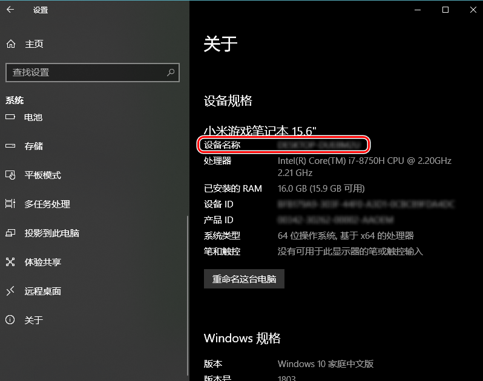

在windows命令窗口输入

>   ipconfig /all

查看MAC地址（物理地址）

之后按下图位置填入表单，并点击Add按钮

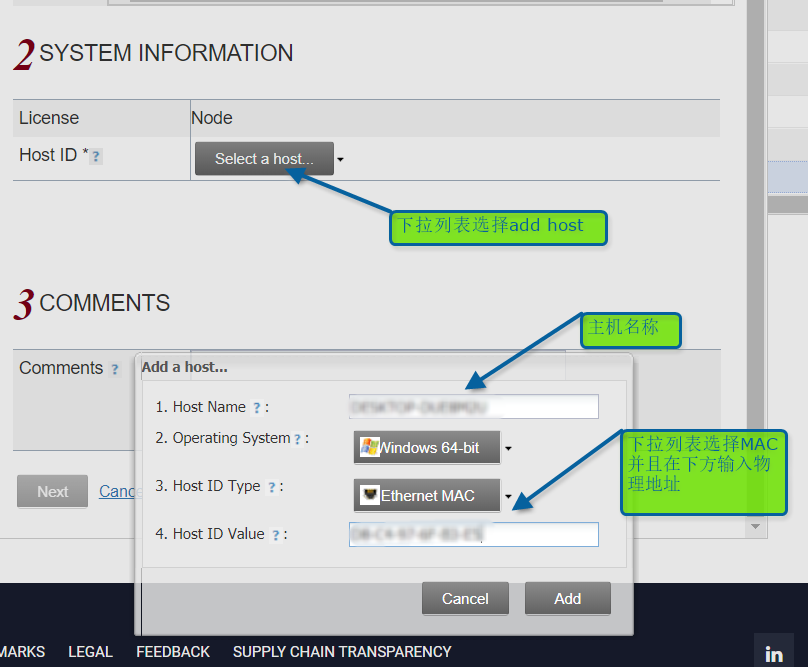

之后根据提示数次点击Next，直到完成

License文件将发送至Xilinx账号的注册邮箱

下载邮件中的附件lic文件后，打开License Manager

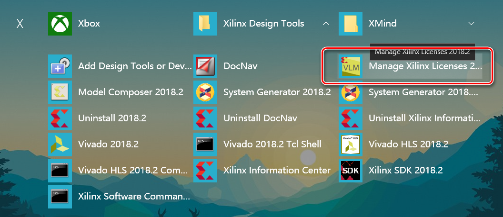

在Load License页选择Copy License，导入前述的lic文件

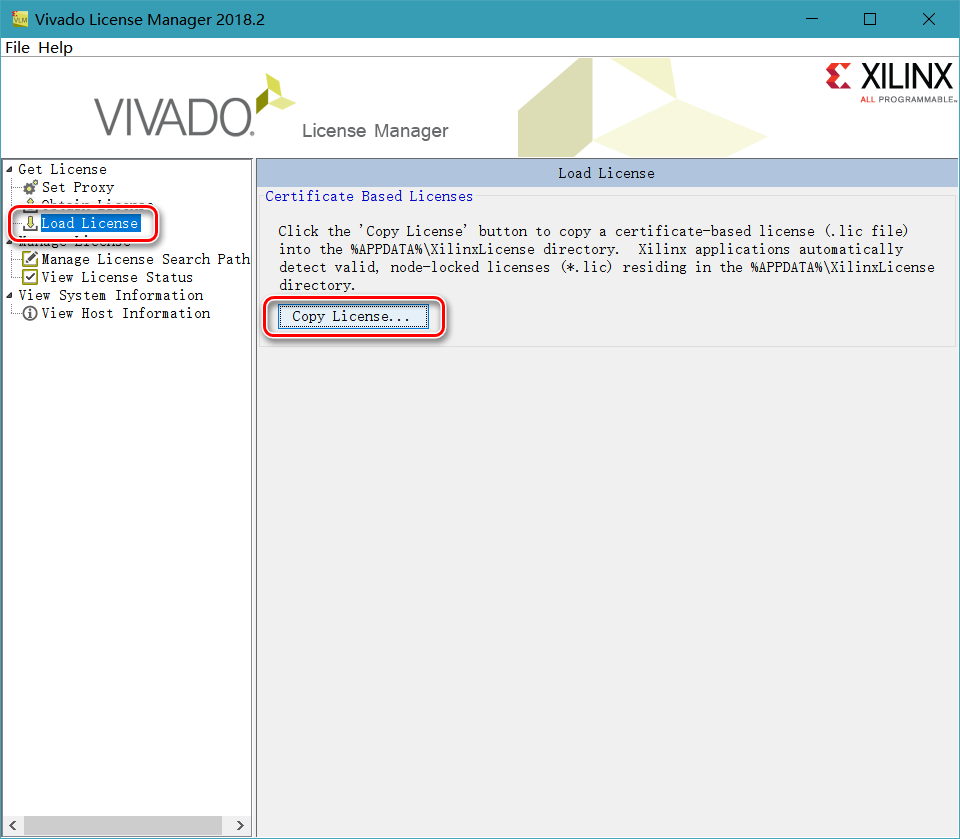

在Manage License Search Path页，添加环境变量XILINXD_LICENSE_FILE的路径后，点击Set。之后重启主机。

**在首次安装Vivado时就应当指定环境变量**

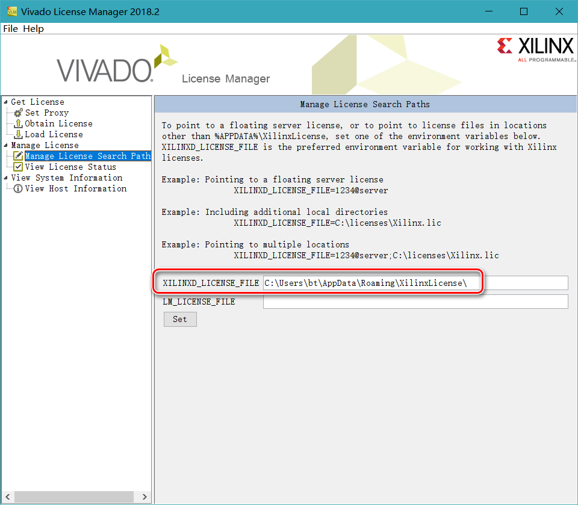

## 打开示例工程

建立Vivado工程后，新建Block Design，添加HDMI 1.4/2.0 Transmitter Subsystem的IP

双击模块打开配置窗口，在Example Design页设置Design Topology为Tx Only，之后点击OK键确认

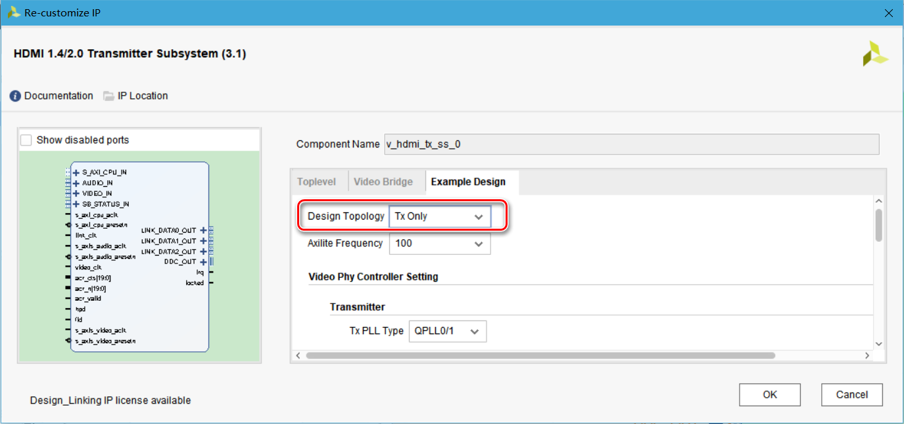

保存当前Block Design，在Source窗口找到IP模块，在右键菜单选择Open IP Example Design

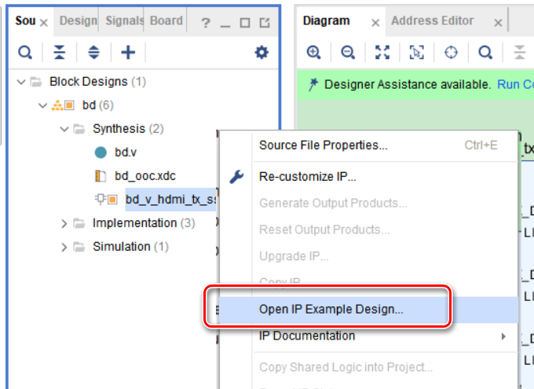

指定生成路径后，点击OK

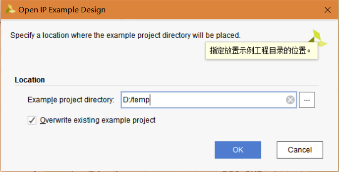

等待一段时间后，Vivado自动打开新建的示例工程

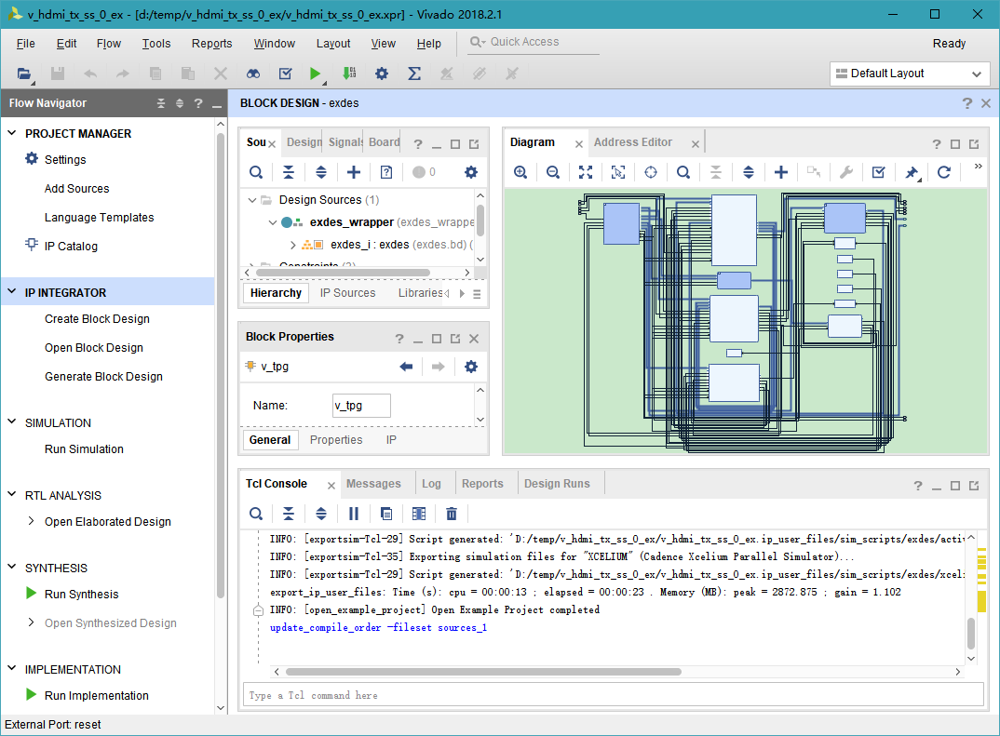

在Sources窗口，在Block Design的右键菜单选择Generate Output Products。主要是为了在工程中让License生效

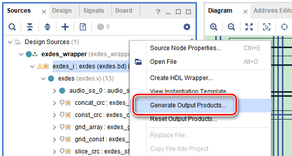

如果在Generate Output Products之前做过综合，则需要在Flow Navigator中先Reset Synthesis Run，再将Block Design执行Reset Output Products，最后再执行Generate Output Products

完成后在Flow Navigator中选择Generate Bitstream

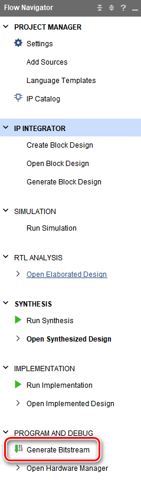

==运行至生成Bitstream阶段如果出现License相关的错误==，比如：

>[Common 17-69] Command failed: This design contains one or more cells for which bitstream generation is not permitted:
>exdes_i/v_hdmi_tx_ss/inst/v_hdmi_tx/inst (bd_3ea7_v_hdmi_tx_0_v_hdmi_tx_v3_0_0)
>If a new IP Core license was added, in order for the new license to be picked up, the current netlist needs to be updated by resetting and re-generating the IP output products before bitstream generation.

==上述错误，先在Source界面右击Block Deign选择Reset Output Products，之后在Design Runs界面右击选择Reset Runs，关闭Vivado后，再删除工程目录下的<工程名>.cache和<工程名>.runs目录下的全部内容==

重开Vivado工程后，先生成Block Design的Output Products，再生成Bitstream可以解决上述问题

正确生成Bistream后，在File菜单选择Export Hardware，选中Include bitstream后，点击OK按钮

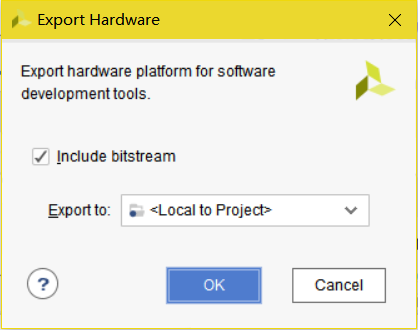

之后在File菜单选择Launch SDK

在SDK中首先从File菜单选择建立BSP工程

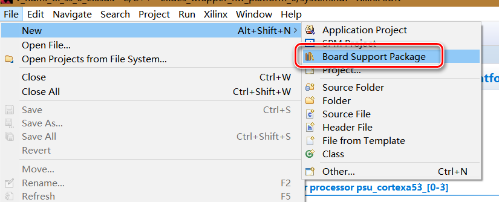

生成BSP工程后，打开system.mss文件，在v_hdmi_tx_ss选择Import Examples

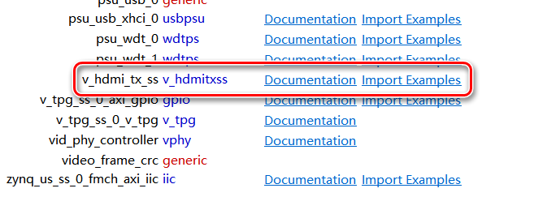

选中TxOnly_A53后点击OK，导入示例工程

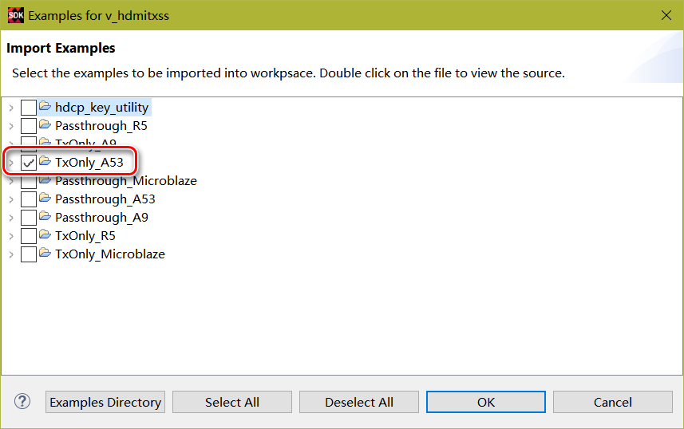

# 分析HDMI示例工程

## 输入输出

HDMI相关的输入输出管脚见ug1182 HDMI Video Output章

输入信号：

-   SI5324_LOL_IN：时钟芯片SI5324的时钟锁定标记
-   TX_HPD_IN：HDMI接口热插拔检测接口
-   TX_REFCLK_N_IN：差分参考时钟的N端，==频率未知==
-   TX_REFCLK_P_IN：差分参考时钟的P端，==频率未知==
-   ==reset：外部复位信号，连接zcu102的板上按键，按键高电平有效，则在按键未按下时，reset一直保持低电平有效复位状态==

输出信号：

-   HDMI_TX_CLK_N_OUT：输出差分参考时钟N端，频率未知
-   HDMI_TX_CLK_P_OUT：输出差分参考时钟P端，频率未知
-   HDMI_TX_DAT_N_OUT[2:0]：输出图像数据差分N端
-   HDMI_TX_DAT_P_OUT[2:0]：输出图像数据差分P端
-   LED0：LED指示灯
-   TX_DDC_OUT：Display Data Channel，显示器与HDMI交互接口，协议为IIC，使用IOBUF转为双向接口，FPGA通过此DDC读取显示器的EDID（Extended Display Identification Data）得到显示器的最大分辩率等信息
-   fmch_iic：==不理解连接位置及作用==，IIC双向接口
-   SI5324_RST_OUT：时钟芯片SI5324的复位信号
-   TX_EN_OUT：HDMI输出使能，高有效

## PL工程分析

图像数据按顺序经过4个IP模块

Video Test Pattern Generator > Video Frame CRC > HDMI 1.4/2.0 Transmitter Subsystem > Video PHY Controller

其中核心模块为HDMI模块，其它IP全部是配合HDMI模块的配置来实现功能

### Video Frame CRC

**Video Frame CRC是示例工程演示功能用的IP，没有实际作用，实际HDMI传输中不需要使用**

参考：

<https://forums.xilinx.com/t5/Video/Video-frame-crc-IP-locked-when-upgrading-from-2018-1-to-2018-3/td-p/923344>

<https://forums.xilinx.com/t5/Video/Video-Test-Pattern-Generator-v-7-0-VIvado-2017-3-can-t-find/td-p/825517>

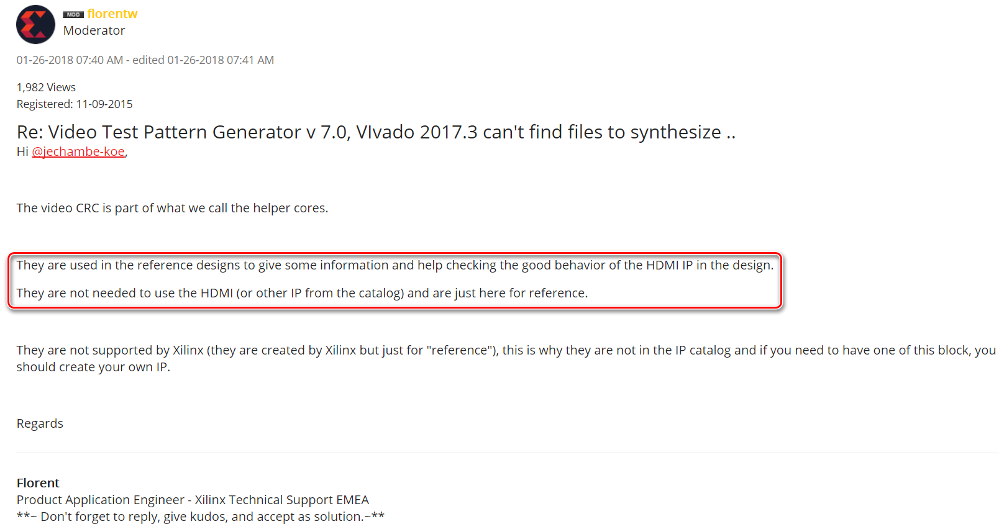

### Video Test Pattern Generator

用于生成指定图样的图像数据

用m_axis_video以AXI_Stream输出图像数据，其中：

-   tuser作为高电平有效SOF信号（帧起始，Start-Of-Frame），在首个像素点的tvalid有效时采样
-   tlast作为高电平有效的EOL信号（行结束，End-Of-Line），在一行最后一个像素点的tvalid有效时采样
-   tdata位宽见[HDMI模块的说明](#HDMI 1.4/2.0 Transmitter Subsystem)

用s_axi_CTRL使用AXI_LITE接口作为模块控制接口，通过向指定地址的寄存器写入数值实现对IP功能的配置，包括输出图样类型选择、图像长宽、颜色格式等

并且可以在配置IP界面选择，使用AXI4S SLAVE，用于以AXI_Stream输入外部图像数据，通过寄存器配置选择输出图像中外部输入图像显示的位置（其它位置显示为配置的固定图样）

### HDMI 1.4/2.0 Transmitter Subsystem

>The subsystem takes incoming video and audio streams and transfers them to an HDMI stream. The stream is then forwarded to the video PHY layer. 

**输出视频图像的分辩率，帧率，颜色格式等全部由当前IP通过寄存器数值配置，配置接口格式为AXI_Lite**

**对于帧率的控制，由其AXI Slave接口的tready信号来反压Master端的数据输出**

视频图像数据输入接口使用AXI_Stream，格式定义与Video Test Pattern Generator模块一致

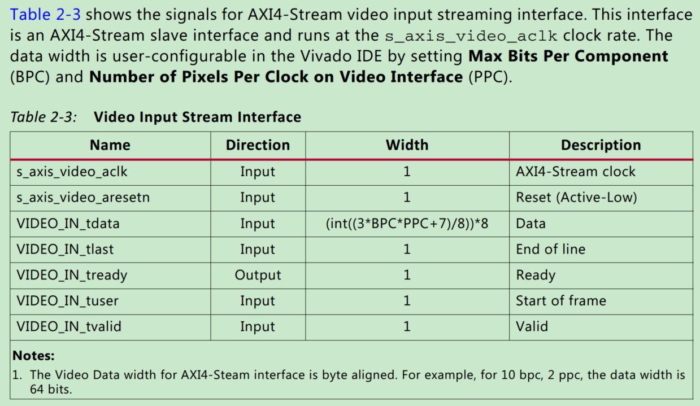

如果仅输入图像而没有音频，则按下图所述连接相应端口

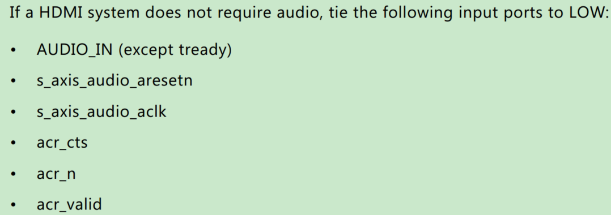

HDMI输出输出接口与Video PHY Controller连接

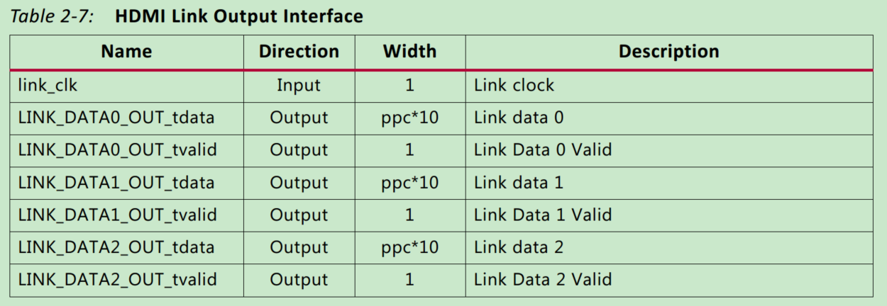

### Video PHY Controller

用于连接HDMI模块和HDMI物理接口

>The Video PHY Controller core is a feature-rich soft IP core all the necessary logic to properly interface with media access control (MAC) and perform physical-side interface (PHY) functionality.  

### 其它相关说明

Video Test Pattern Generator输出信号经由AXI4-Stream Register Slice后高位补0达成96位再进入Video Frame CRC

此AXI4-Stream Register Slice的作用是分离AXI-Stream的Master和Slave的时序路径，添加寄存器流水，用于优化时序

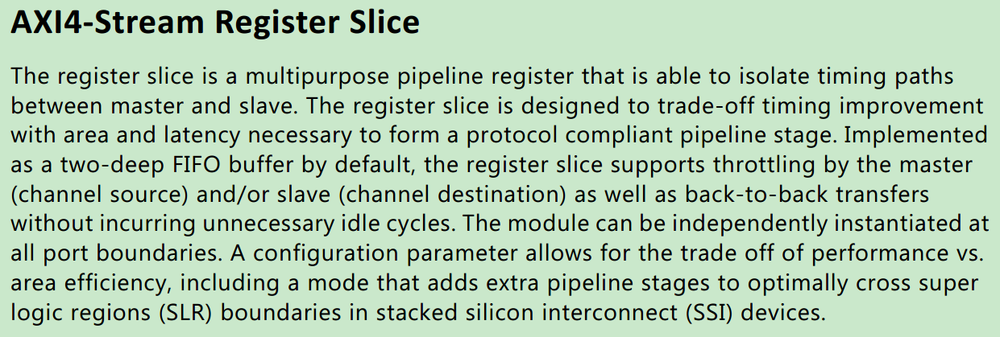

## PS工程分析

主要研究PS对Video Test Pattern Generator，HDMI 1.4/2.0 Transmitter Subsystem，Video PHY Controller这3个IP模块控制接口的操作，以及HDMI 1.4/2.0 Transmitter Subsystem模块和Video PHY Controller模块的中断处理

# 自定义HDMI视频输出工程

与示例工程的区别在于：

-   无音频信号
-   不使用Video Test Pattern Generator，用Verilog生成自定义图像数据

# HDMI视频输出试验

---

需要用IIC配置时钟吗？示例代码里好像做了相关操作

==在自建的PS程序中最好使用示例程序中的若干接口函数，比如xhdmi_menu/xhdmi_edid等