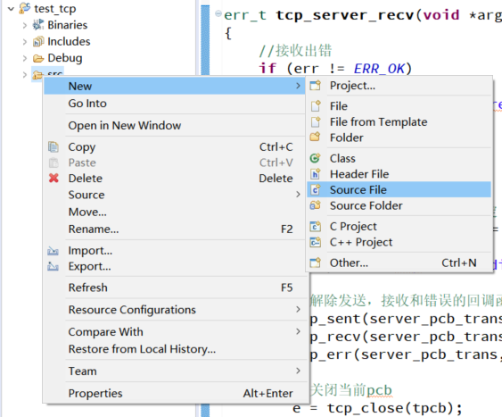
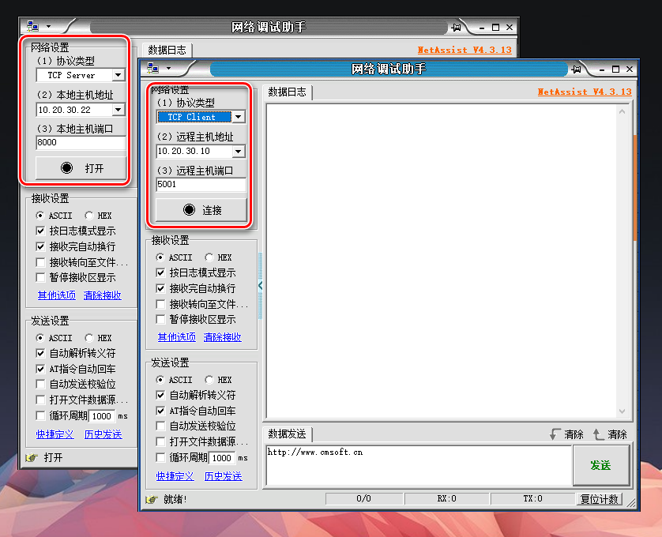
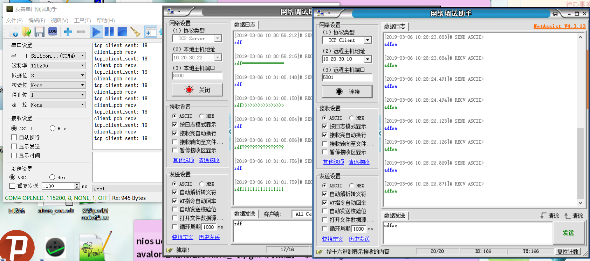

本文在PS的Standalone程序中使用lwip库通过TCP协议实现网络数据传输。

包含TCP Server和TCP Client两种形式

本文主要参考lwip的SDK内部说明和工程模板，xapp1026, xapp1306, SDK以及3篇博客：

<https://www.cnblogs.com/54zorb/p/9609021.html>

<https://www.cnblogs.com/54zorb/p/9609111.html>

<https://blog.csdn.net/firefly_cjd/article/details/79826818>

# Block Design

建立zcu102的Vivado工程，新建Block Design，并且添加zynq模块

运行Run Block Automation，双击打开zynq模块配置查看GEM接口配置


GEM3的配置与ug1182一致


保留UART和GEM3，关闭其它外设接口以及PS-PL接口


确保TTC 0已使能


保存后依次运行Generate Output Products和Create HDL Wrapper

在Flow Navigator中选择Generate Bitstream，完成后先Export Hardware，再Launch SDK

# PS程序

在SDK中可以使用lwip模板新建包含lwip库示例代码的模板工程

注意zuc102开发板生成的模板工程会在IicPhyReset()函数编译出错，将此函数注释掉，用开发板上下电代替复位（试验中发现即使不上下电能正常工作）


建完首个工程后，其它工程建立时可以选择使用已有BSP工程


本文新建空工程用于试验

建立工程后SDK进行自动编译，完成之后在BSP工程配置lwip库（否则可能出现不可理解的异常错误）

在BSP工程上，右键菜单选择Board Support Package Settings


进入Settings窗口，在Overview界面选中lwip库（如果建立的是lwip模板工程，则BSP工程已自动添加lwip库）


配置完成后点击OK

打开BSP工程中的system.mss文件，可以在最下方发现lwip库，选择Documentation可以打开说明文档


在工作工程的src文件夹上右键菜单新建C Source File



在弹出窗口选择Default C Source Template

进入新建的source文件main.c，双击打开main.c文件，写入以下代码

```c
#include <stdio.h>
#include "xparameters.h"
#include "netif/xadapter.h"
#include "lwipopts.h"
#include "xil_printf.h"
#include "sleep.h"
#include "lwip/priv/tcp_priv.h"
#include "lwip/init.h"
#include "lwip/inet.h"
#include "lwip/ip_addr.h"
#include "lwip/udp.h"
#include "xil_cache.h"

#include "xscugic.h"
#include "xttcps.h"

//定时器相关定义***************************************************
static XTtcPs TimerInstance;
static u16 Interval;
static u8 Prescaler;

#define INTC_DEVICE_ID		XPAR_SCUGIC_SINGLE_DEVICE_ID
#define TIMER_DEVICE_ID		XPAR_XTTCPS_0_DEVICE_ID
#define TIMER_IRPT_INTR		XPAR_XTTCPS_0_INTR
#define INTC_BASE_ADDR		XPAR_SCUGIC_0_CPU_BASEADDR
#define INTC_DIST_BASE_ADDR	XPAR_SCUGIC_0_DIST_BASEADDR
#define PLATFORM_TIMER_INTR_RATE_HZ (4)

//中断响应函数与main函数都访问的变量，加volatile前缀，不进入cache
volatile int TcpFastTmrFlag = 0;
volatile int TcpSlowTmrFlag = 0;

void platform_clear_interrupt( XTtcPs * TimerInstance )
{
	u32 StatusEvent;

	StatusEvent = XTtcPs_GetInterruptStatus(TimerInstance);
	XTtcPs_ClearInterruptStatus(TimerInstance, StatusEvent);
}

void timer_callback(XTtcPs * TimerInstance)
{
	/* we need to call tcp_fasttmr & tcp_slowtmr at intervals specified
	 * by lwIP. It is not important that the timing is absoluetly accurate.
	 */
	static int odd = 1;
    TcpFastTmrFlag = 1;
	odd = !odd;
	if (odd)
	{
		TcpSlowTmrFlag = 1;
	}
	platform_clear_interrupt(TimerInstance);
}

void platform_setup_timer(void)
{
	int Status;
	XTtcPs * Timer = &TimerInstance;
	XTtcPs_Config *Config;

	//设置Timer之前保证Timer已停止
	XTtcPs_Stop(Timer);

	Config = XTtcPs_LookupConfig(TIMER_DEVICE_ID);

	Status = XTtcPs_CfgInitialize(Timer, Config, Config->BaseAddress);
	if (Status != XST_SUCCESS) {
		xil_printf("In %s: Timer Cfg initialization failed...\r\n",
				__func__);
				return;
	}
	XTtcPs_SetOptions(Timer, XTTCPS_OPTION_INTERVAL_MODE | XTTCPS_OPTION_WAVE_DISABLE);
	XTtcPs_CalcIntervalFromFreq(Timer, PLATFORM_TIMER_INTR_RATE_HZ, &Interval, &Prescaler);
	XTtcPs_SetInterval(Timer, Interval);
	XTtcPs_SetPrescaler(Timer, Prescaler);
}

void platform_setup_interrupts(void)
{
	Xil_ExceptionInit();

	XScuGic_DeviceInitialize(INTC_DEVICE_ID);

	/*
	 * Connect the interrupt controller interrupt handler to the hardware
	 * interrupt handling logic in the processor.
	 */
	Xil_ExceptionRegisterHandler(XIL_EXCEPTION_ID_IRQ_INT,
			(Xil_ExceptionHandler)XScuGic_DeviceInterruptHandler,
			(void *)INTC_DEVICE_ID);
	/*
	 * Connect the device driver handler that will be called when an
	 * interrupt for the device occurs, the handler defined above performs
	 * the specific interrupt processing for the device.
	 */
	XScuGic_RegisterHandler(INTC_BASE_ADDR, TIMER_IRPT_INTR,
					(Xil_ExceptionHandler)timer_callback,
					(void *)&TimerInstance);
	/*
	 * Enable the interrupt for scu timer.
	 */
	XScuGic_EnableIntr(INTC_DIST_BASE_ADDR, TIMER_IRPT_INTR);

	return;
}

//TCP操作函数*************************************************
static struct pbuf *packet;
static unsigned char send_byte = 0x31;

static ip_addr_t ip_remote;
//发送数据缓冲
#define SEND_BUFSIZE 16

//server相关
static struct tcp_pcb *server_pcb;//TCP Server对象
static struct tcp_pcb *server_pcb_listen;//Server监听PCB
static struct tcp_pcb *server_pcb_trans;//Server建立连接后的传输用PCB
#define TCP_SERVER_PORT 5001

//client相关
static struct tcp_pcb *client_pcb;//TCP Client对象


//TCP**********************************************************************
void tcp_server_err(void *arg, err_t err)
{
	xil_printf("tcp tcp_server_err\r\n");

	//解除发送，接收和错误的回调函数绑定
	tcp_sent(server_pcb_trans, NULL);
	tcp_recv(server_pcb_trans, NULL);
	tcp_err(server_pcb_trans, NULL);

	err_t e;
	//关闭当前pcb
	e = tcp_close(server_pcb_trans);
	if (e != ERR_OK)
	{
		//关闭失败，则使用tcp_abort强行关闭
		tcp_abort(server_pcb_trans);
	}

	//传输pcb指向NULL
	server_pcb_trans = NULL;
}

err_t tcp_server_recv(void *arg, struct tcp_pcb *tpcb, struct pbuf *p, err_t err)
{
	//接收出错
	if (err != ERR_OK)
	{
		xil_printf("tcp_server recv error\r\n");
		return ERR_VAL;
	}

	err_t e;

	//client断开连接，用下述条件判定
	if ((err == ERR_OK) && (p == NULL))
	{
		xil_printf("tcp server disconnected\r\n");

		//解除发送，接收和错误的回调函数绑定
		tcp_sent(server_pcb_trans, NULL);
		tcp_recv(server_pcb_trans, NULL);
		tcp_err(server_pcb_trans, NULL);

		//关闭当前pcb
		e = tcp_close(tpcb);
		if (e != ERR_OK)
		{
			//关闭失败，则使用tcp_abort强行关闭
			tcp_abort(tpcb);
		}

		//传输pcb指向NULL
		server_pcb_trans = NULL;

		pbuf_free(p);
		return ERR_OK;
	}

	xil_printf("tcp_server recv\r\n");

	//tcp接收到数据时必须调用tcp_recved表示接收完成
	//注意tot_len表示整个pbuf链表内全部数据长度，len仅表示当前pbuf链表节点的数据长度
	tcp_recved(tpcb, p->tot_len);

	//向client返回全部pbuf节点的数据
	if (p != NULL)
	{
		struct pbuf* temp = p;

		while (temp != NULL)
		{
			//tcp_sndbuf()函数用于取得发送缓冲中可用字节数目
			//如果返回ERR_MEM，即-1，表示暂时不能发送，需要等待
			if (tcp_sndbuf(tpcb) > temp->len)
			{
				//最后的参数为1，表示分配新内存空间保存发送数据
				//tcp_write并非立即发送，当前回调函数退出时pbuf被释放，因此需要新的内存暂存发送数据
				e = tcp_write(tpcb, temp->payload, temp->len, 1);
				if (e != ERR_OK)
				{
					xil_printf("fail tcp_server tcp_write\r\n");
				}
			}

			temp = temp->next;
		}
	}

	pbuf_free(p);
	return ERR_OK;
}

err_t tcp_server_sent(void *arg, struct tcp_pcb *tpcb, u16_t len)
{
	xil_printf("tcp_server_sent: %d\r\n", len);
	return ERR_OK;
}

err_t tcp_server_accept(void *arg, struct tcp_pcb *newpcb, err_t err)
{
	//连接出错
	if ((err != ERR_OK) || (newpcb == NULL)) {
		return ERR_VAL;
	}

	//连接成功
	xil_printf("tcp server connected by: %d.%d.%d.%d port: %d\r\n",
			*((uint8_t *)&newpcb->remote_ip.addr),
			*((uint8_t *)&newpcb->remote_ip.addr + 1),
			*((uint8_t *)&newpcb->remote_ip.addr + 2),
			*((uint8_t *)&newpcb->remote_ip.addr + 3),
			newpcb->remote_port);

	//newpcb即为连接建立后用于传输的pcb
	server_pcb_trans = newpcb;

	//传输pcb相关回调函数指定传递参数为NULL
	tcp_arg(server_pcb_trans, NULL);

	//绑定接收回调函数和传输错误回调函数
	tcp_sent(server_pcb_trans, tcp_server_sent);
	tcp_recv(server_pcb_trans, tcp_server_recv);
	tcp_err(server_pcb_trans, tcp_server_err);

	return ERR_OK;
}

void tcp_server_init(void)
{
	err_t err;

	//建立PCB对象
	//指定使用IPv4
	server_pcb = tcp_new_ip_type(IPADDR_TYPE_V4);
	if (!server_pcb)
	{
		xil_printf("fail tcp server tcp_new_ip_type\r\n");
		return;
	}

	//绑定本地IP和端口，监听端口TCP_SERVER_PORT
	err = tcp_bind(server_pcb, IP_ADDR_ANY, TCP_SERVER_PORT);
	if (err != ERR_OK)
	{
		xil_printf("fail tcp server tcp_bind\r\n");

		//关闭tcp对象
		tcp_close(server_pcb);
		return;
	}

	//打开监听
	//第2个参数为允许连接的client的数目
	server_pcb_listen = tcp_listen_with_backlog(server_pcb, 1);
	if (server_pcb_listen == NULL)
	{
		xil_printf("fail tcp server tcp_listen_with_backlog\r\n");

		//关闭tcp对象
		tcp_close(server_pcb);
		return;
	}

	//监听pcb相关回调函数（连接响应回调函数）的传递参数为NULL
	tcp_arg(server_pcb_listen, NULL);

	//绑定监听pcb的连接响应回调函数
	tcp_accept(server_pcb_listen, tcp_server_accept);

	xil_printf("tcp server start listen\r\n");
}

//TCP Client***********************************************
void tcp_client_err(void *arg, err_t err)
{
	xil_printf("tcp tcp_client_err\r\n");

	//解除发送，接收和错误的回调函数绑定
	tcp_sent(client_pcb, NULL);
	tcp_recv(client_pcb, NULL);
	tcp_err(client_pcb, NULL);

	err_t e;
	//关闭当前pcb
	e = tcp_close(client_pcb);
	if (e != ERR_OK)
	{
		//关闭失败，则使用tcp_abort强行关闭
		tcp_abort(client_pcb);
	}

	//pcb指向NULL
	client_pcb = NULL;
}

err_t tcp_client_recv(void *arg, struct tcp_pcb *tpcb, struct pbuf *p, err_t err)
{
	//接收出错
	if (err != ERR_OK)
	{
		xil_printf("tcp_client_recv error\r\n");
		return ERR_VAL;
	}

	err_t e;

	//server断开连接，用下述条件判定
	if ((err == ERR_OK) && (p == NULL))
	{
		xil_printf("tcp client disconnected\r\n");

		//解除接收和错误的回调函数绑定
		tcp_sent(tpcb, NULL);
		tcp_recv(tpcb, NULL);
		tcp_err(tpcb, NULL);

		//关闭当前pcb
		e = tcp_close(tpcb);
		if (e != ERR_OK)
		{
			//关闭失败，则使用tcp_abort强行关闭
			tcp_abort(tpcb);
		}

		//传输pcb指向NULL
		client_pcb = NULL;

		pbuf_free(p);
		return ERR_OK;
	}

	xil_printf("client_pcb recv\r\n");

	//tcp接收到数据时必须调用tcp_recved表示接收完成
	//注意tot_len表示整个pbuf链表内全部数据长度，len仅表示当前pbuf链表节点的数据长度
	tcp_recved(tpcb, p->tot_len);

	//向client返回全部pbuf节点的数据
	if (p != NULL)
	{
		struct pbuf* temp = p;

		while (temp != NULL)
		{
			//tcp_sndbuf()函数用于取得发送缓冲中可用字节数目
			//如果返回ERR_MEM，即-1，表示暂时不能发送，需要等待
			if (tcp_sndbuf(tpcb) > temp->len)
			{
				//最后的参数为1，表示分配新内存空间保存发送数据
				//tcp_write并非立即发送，当前回调函数退出时pbuf被释放，因此需要新的内存暂存发送数据
				e = tcp_write(tpcb, temp->payload, temp->len, 1);
				if (e != ERR_OK)
				{
					xil_printf("fail tcp_client tcp_write\r\n");
				}
			}

			temp = temp->next;
		}
	}

	//发送client自定义数据
	if (tcp_sndbuf(tpcb) > packet->len)
	{
		//最后的参数为1，表示分配新内存空间保存发送数据
		//tcp_write并非立即发送，当前回调函数退出时pbuf被释放，因此需要新的内存暂存发送数据
		e = tcp_write(tpcb, packet->payload, packet->len, 1);
		if (e != ERR_OK)
		{
			xil_printf("fail tcp_client tcp_write\r\n");
		}

		//更新packet的数据内容
		send_byte++;
		if (send_byte == 0x40) send_byte = 0x31;
		memset(packet->payload, send_byte, SEND_BUFSIZE);
	}

	pbuf_free(p);
	return ERR_OK;
}

err_t tcp_client_sent(void *arg, struct tcp_pcb *tpcb, u16_t len)
{
	xil_printf("tcp_client_sent: %d\r\n", len);
	return ERR_OK;
}

err_t tcp_client_connected(void *arg, struct tcp_pcb *tpcb, err_t err)
{
	if (err != ERR_OK)
	{
		xil_printf("fail tcp_client_connected");

		//关闭tcp对象
		tcp_close(tpcb);

		return ERR_VAL;
	}

	//验证tpcb即为client_pcb
	xil_printf("tcp_client_connected tpcb: %d\r\n", tpcb);
	xil_printf("tcp_client_connected client_pcb: %d\r\n", client_pcb);

	//最后的参数为1，表示分配新内存空间保存发送数据
	tcp_write(client_pcb, "hello server", strlen("hello server\r\n"), 1);

	//相关回调函数指定传递参数为NULL
	tcp_arg(client_pcb, NULL);

	//绑定接收回调函数和传输错误回调函数
	tcp_sent(client_pcb, tcp_client_sent);
	tcp_recv(client_pcb, tcp_client_recv);
	tcp_err(client_pcb, tcp_client_err);

	return ERR_OK;
}

void tcp_client_init(void)
{
	err_t err;

	//建立PCB对象
	//指定使用IPv4
	client_pcb = tcp_new_ip_type(IPADDR_TYPE_V4);
	if (!client_pcb)
	{
		xil_printf("fail tcp client tcp_new_ip_type\r\n");
		return;
	}

	//绑定本地IP和端口，端口9000
	err = tcp_bind(client_pcb, IP_ADDR_ANY, 9000);
	if (err != ERR_OK)
	{
		xil_printf("fail tcp client tcp_bind\r\n");

		//关闭tcp对象
		tcp_close(client_pcb);
		return;
	}

	//连接远端TCP Server，并指定连接成功回调函数
	err = tcp_connect(client_pcb, &ip_remote, 8000, tcp_client_connected);
	if (err != ERR_OK)
	{
		xil_printf("fail tcp client tcp_connect\r\n");

		//关闭tcp对象
		tcp_close(client_pcb);
		return;
	}

	xil_printf("tcp client start\r\n");
}

int main(void)
{
	//定时器初始化*********************************************
	platform_setup_timer();
	platform_setup_interrupts();

	//建立网络接口*********************************************
	//定义网络接口对象指针
	struct netif server_netif;//网络接口对象
	struct netif* netif;
	netif = &server_netif;

	//定义mac地址
	unsigned char mac_ethernet_address[] = {0x00, 0x0a, 0x35, 0x00, 0x01, 0x02};

	//lwip库初始化
	lwip_init();

	//定义本地IP
	ip_addr_t ipaddr, netmask, gw;
	IP4_ADDR(&ipaddr,  10, 20, 30, 10);
	IP4_ADDR(&netmask, 255, 255, 255,  0);
	IP4_ADDR(&gw,      10, 20, 30,  1);

	//添加网络接口至接口列表，并且设置为默认
	if (!xemac_add(netif, &ipaddr, &netmask, &gw, mac_ethernet_address, XPAR_XEMACPS_0_BASEADDR))
	{
		xil_printf("Error adding N/W interface\r\n");
		return -1;
	}
	netif_set_default(netif);

	//将当前网络接口提至最前（不理解意义）
	netif_set_up(netif);

	//使能并且启动定时器中断
	Xil_ExceptionEnableMask(XIL_EXCEPTION_IRQ);
	XScuGic_EnableIntr(INTC_DIST_BASE_ADDR, TIMER_IRPT_INTR);
	XTtcPs_EnableInterrupts(&TimerInstance, XTTCPS_IXR_INTERVAL_MASK);
	XTtcPs_Start(&TimerInstance);

	//定义发送数据接收方的IP
	IP4_ADDR(&ip_remote, 10, 20, 30, 22);

	//建立发送数据pbuf
	//layer参数选择为PBUF_RAW表示没有除payload以外的其它路由数据参与发送
	//用pbuf_free(packet)释放
	packet = pbuf_alloc(PBUF_RAW, SEND_BUFSIZE, PBUF_POOL);
	if (packet == NULL)
	{
		xil_printf("fail pbuf_alloc");
		return -1;
	}
	//将待发送数据写入pbuf的payload中
	memset(packet->payload, send_byte, SEND_BUFSIZE);

	//启动tcp
	tcp_server_init();
	tcp_client_init();

	//程序主循环
	while (1)
	{
		//无论是UDP还是TCP都必须包含tcp_fasttmr()和tcp_slowtmr()
		if (TcpFastTmrFlag)
		{
			tcp_fasttmr();
			TcpFastTmrFlag = 0;
		}
		if (TcpSlowTmrFlag)
		{
			tcp_slowtmr();
			TcpSlowTmrFlag = 0;
		}

		//网络接口处理接收数据
		xemacif_input(netif);
	}

	return 0;
}
```

前述代码的网络功能说明：

-   PS网络IP为10.20.30.10
-   TCP Server绑定端口为5001
-   TCP Server收到数据后会将数据原样返回发送方
-   TCP Server可以接受Client反复断开重连
-   TCP Client绑定端口为9000
-   TCP Client连接的目标Server的IP为10.20.30.22，目标端口为8000
-   TCP Client连接成功后向Server发送消息
-   TCP Client接收到数据后，向Server返回数据及自定义的数据

# 试验

将zcu102板卡的网口通过网线与测试主机连接

打开windows设置界面，选择网络和Internet


在状态页选择更改适配器选项


在以太网连接图标上右键菜单选择属性


选中Internet协议版本4(TCP/IPv4)选项后，点击属性打开IPv4配置，按下图设置后，点击确定保存设置内容


将zcu102的启动模式设置为JTAG，上电启动

在windows的适配器选项窗口可见网络连接已建立

打开串口调试助手，按下图配置并且连接COM4


打开两个网络调试助手进程，如下图进行配置



注意，前述TCP Server在PS启动前打开监听，TCP Client在PS启动并且网络就绪后尝试连接

在SDK中的工作工程右键菜单选择Run As > Launch on Hardware(System Debugger)


完整试验内容如下



# 注意

tcp_write发送数据之前一定要用tcp_sndbuf判断当前发送缓冲是否可以装下待发送数据

**如果发送缓冲可用字节数目不足必须运行主循环中的以下代码才能更新tcp_sndbuf函数的返回值**

```c
if (TcpFastTmrFlag)
{
    tcp_fasttmr();
    TcpFastTmrFlag = 0;
}

if (TcpSlowTmrFlag)
{
    tcp_slowtmr();
    TcpSlowTmrFlag = 0;
}
```

