本文在PS的Standalone程序中使用lwip库通过UDP协议实现网络数据传输。

包含UDP Server和UDP Client两种形式

本文主要参考lwip的SDK内部说明和工程模板，xapp1026, xapp1306, SDK以及两篇博客：

<https://www.cnblogs.com/54zorb/p/9609021.html>

<https://www.cnblogs.com/54zorb/p/9609111.html>

# Block Design

建立zcu102的Vivado工程，新建Block Design，并且添加zynq模块

运行Run Block Automation，双击打开zynq模块配置查看GEM接口配置

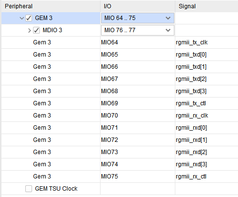

GEM3的配置与ug1182一致

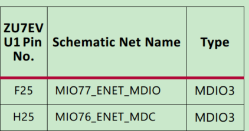

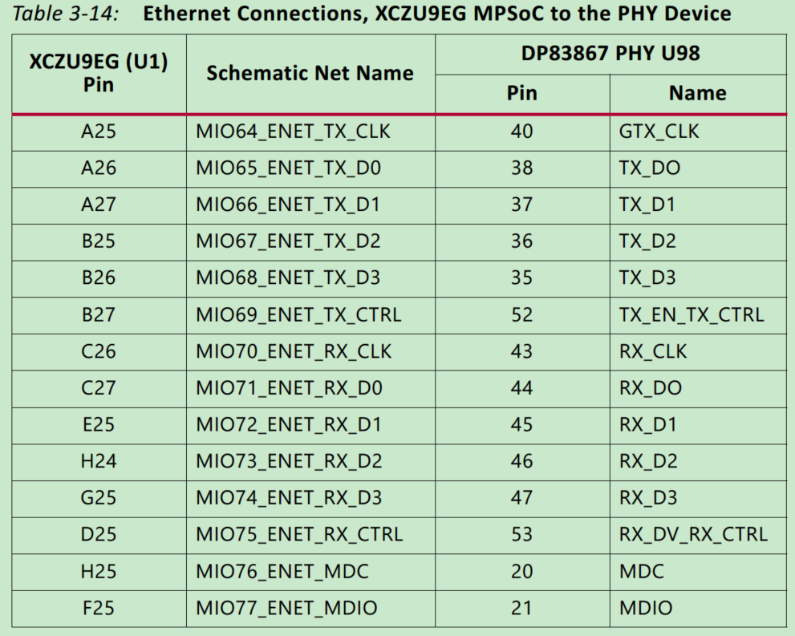

保留UART和GEM3，关闭其它外设接口以及PS-PL接口

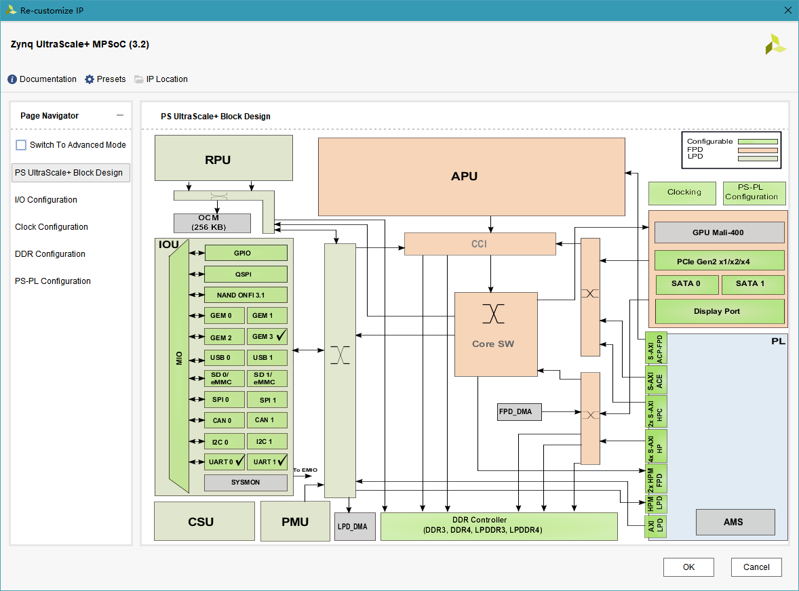

确保TTC 0已使能

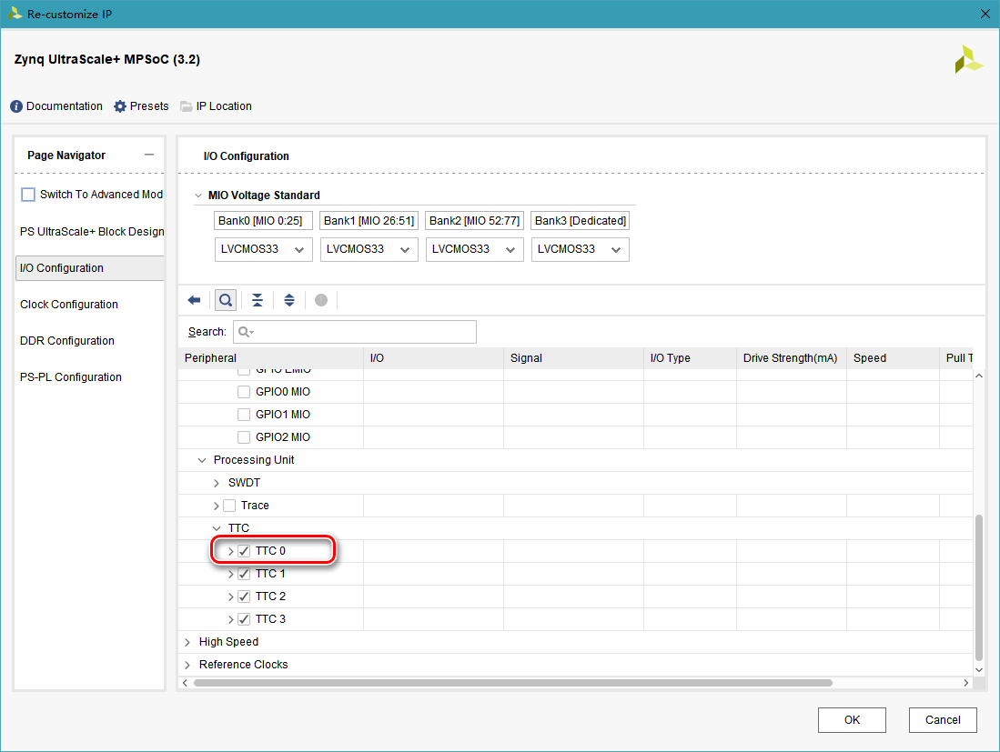

保存后依次运行Generate Output Products和Create HDL Wrapper

在Flow Navigator中选择Generate Bitstream，完成后先Export Hardware，再Launch SDK

# PS程序

在SDK中可以使用lwip模板新建包含lwip库示例代码的模板工程

注意zuc102开发板生成的模板工程会在IicPhyReset()函数编译出错，将此函数注释掉，用开发板上下电代替复位（试验中发现即使不上下电能正常工作）

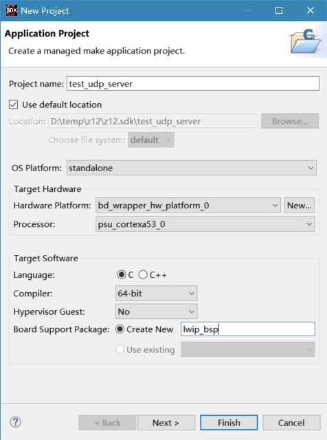

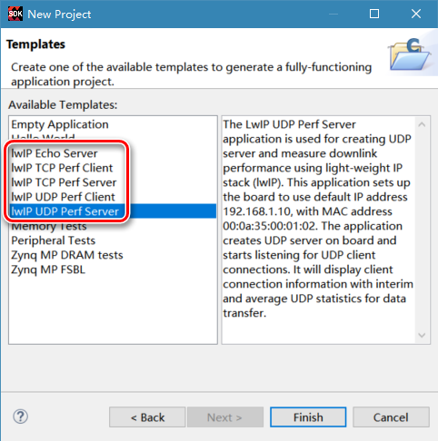

建完首个工程后，其它工程建立时可以选择使用已有BSP工程

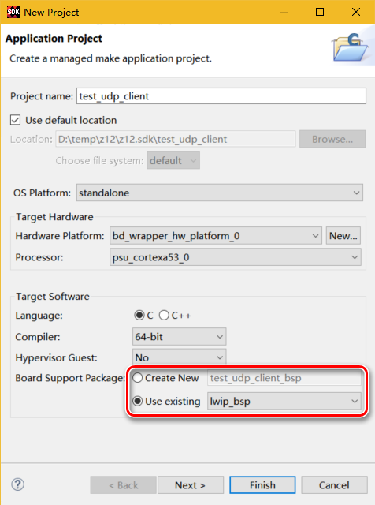

本文新建空工程用于试验

建立工程后SDK进行自动编译，完成之后在BSP工程配置lwip库（否则可能出现不可理解的异常错误）

在BSP工程上，右键菜单选择Board Support Package Settings

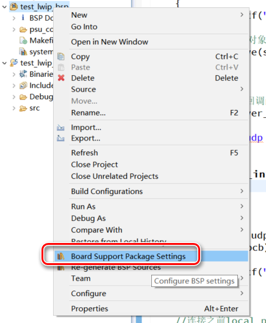

进入Settings窗口，在Overview界面选中lwip库（如果建立的是lwip模板工程，则BSP工程已自动添加lwip库）

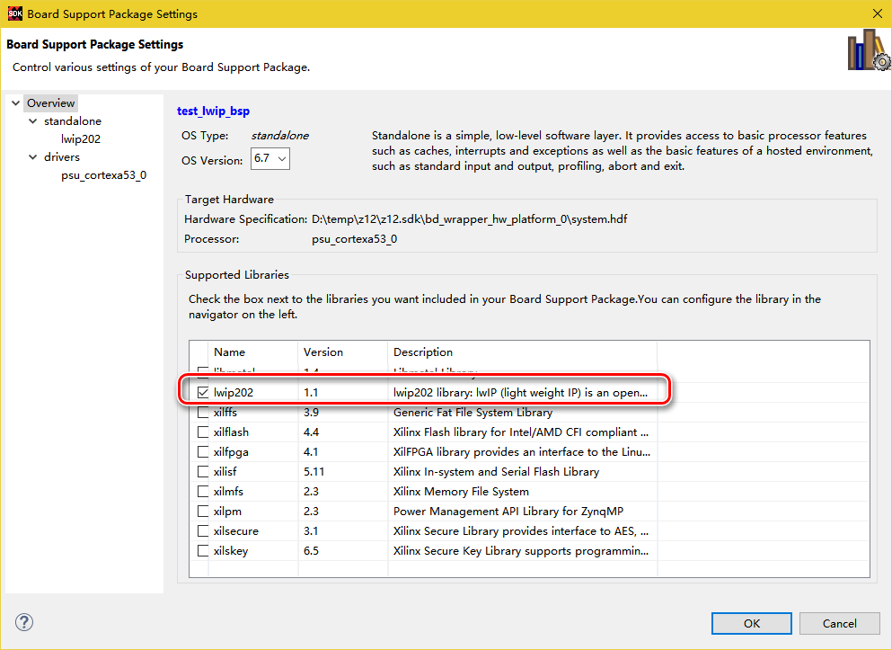

配置完成后点击OK

打开BSP工程中的system.mss文件，可以在最下方发现lwip库，选择Documentation可以打开说明文档

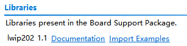

在工作工程的src文件夹上右键菜单新建C Source File

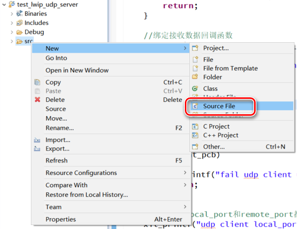

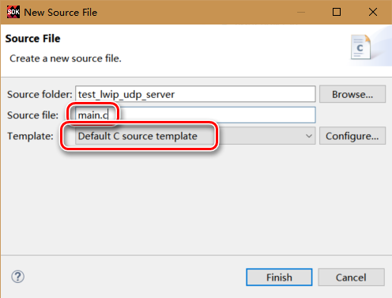

进入文件main.c，双击打开main.c文件，写入以下代码

```c
#include <stdio.h>
#include "xparameters.h"
#include "netif/xadapter.h"
#include "lwipopts.h"
#include "xil_printf.h"
#include "sleep.h"
#include "lwip/priv/tcp_priv.h"
#include "lwip/init.h"
#include "lwip/inet.h"
#include "lwip/ip_addr.h"
#include "lwip/udp.h"
#include "xil_cache.h"

#include "xscugic.h"
#include "xttcps.h"

//定时器相关定义***************************************************
static XTtcPs TimerInstance;
static u16 Interval;
static u8 Prescaler;

#define INTC_DEVICE_ID		XPAR_SCUGIC_SINGLE_DEVICE_ID
#define TIMER_DEVICE_ID		XPAR_XTTCPS_0_DEVICE_ID
#define TIMER_IRPT_INTR		XPAR_XTTCPS_0_INTR
#define INTC_BASE_ADDR		XPAR_SCUGIC_0_CPU_BASEADDR
#define INTC_DIST_BASE_ADDR	XPAR_SCUGIC_0_DIST_BASEADDR
#define PLATFORM_TIMER_INTR_RATE_HZ (4)

//中断响应函数与main函数都访问的变量，加volatile前缀，不进入cache
volatile int TcpFastTmrFlag = 0;
volatile int TcpSlowTmrFlag = 0;

void platform_clear_interrupt( XTtcPs * TimerInstance )
{
	u32 StatusEvent;

	StatusEvent = XTtcPs_GetInterruptStatus(TimerInstance);
	XTtcPs_ClearInterruptStatus(TimerInstance, StatusEvent);
}

void timer_callback(XTtcPs * TimerInstance)
{
	/* we need to call tcp_fasttmr & tcp_slowtmr at intervals specified
	 * by lwIP. It is not important that the timing is absoluetly accurate.
	 */
	static int odd = 1;
    TcpFastTmrFlag = 1;
	odd = !odd;
	if (odd)
	{
		TcpSlowTmrFlag = 1;
	}
	platform_clear_interrupt(TimerInstance);
}

void platform_setup_timer(void)
{
	int Status;
	XTtcPs * Timer = &TimerInstance;
	XTtcPs_Config *Config;

	//设置Timer之前保证Timer已停止
	XTtcPs_Stop(Timer);

	Config = XTtcPs_LookupConfig(TIMER_DEVICE_ID);

	Status = XTtcPs_CfgInitialize(Timer, Config, Config->BaseAddress);
	if (Status != XST_SUCCESS) {
		xil_printf("In %s: Timer Cfg initialization failed...\r\n",
				__func__);
				return;
	}
	XTtcPs_SetOptions(Timer, XTTCPS_OPTION_INTERVAL_MODE | XTTCPS_OPTION_WAVE_DISABLE);
	XTtcPs_CalcIntervalFromFreq(Timer, PLATFORM_TIMER_INTR_RATE_HZ, &Interval, &Prescaler);
	XTtcPs_SetInterval(Timer, Interval);
	XTtcPs_SetPrescaler(Timer, Prescaler);
}

void platform_setup_interrupts(void)
{
	Xil_ExceptionInit();

	XScuGic_DeviceInitialize(INTC_DEVICE_ID);

	/*
	 * Connect the interrupt controller interrupt handler to the hardware
	 * interrupt handling logic in the processor.
	 */
	Xil_ExceptionRegisterHandler(XIL_EXCEPTION_ID_IRQ_INT,
			(Xil_ExceptionHandler)XScuGic_DeviceInterruptHandler,
			(void *)INTC_DEVICE_ID);
	/*
	 * Connect the device driver handler that will be called when an
	 * interrupt for the device occurs, the handler defined above performs
	 * the specific interrupt processing for the device.
	 */
	XScuGic_RegisterHandler(INTC_BASE_ADDR, TIMER_IRPT_INTR,
					(Xil_ExceptionHandler)timer_callback,
					(void *)&TimerInstance);
	/*
	 * Enable the interrupt for scu timer.
	 */
	XScuGic_EnableIntr(INTC_DIST_BASE_ADDR, TIMER_IRPT_INTR);

	return;
}

//udp操作函数*************************************************
static struct pbuf *packet;
static unsigned char send_byte = 0x31;
static err_t err;
static ip_addr_t ip_remote;
//发送数据缓冲
#define SEND_BUFSIZE 16
static char send_buf[SEND_BUFSIZE];

static struct udp_pcb *server_pcb;//UDP Server对象
static struct udp_pcb *client_pcb;//UDP Client对象
#define UDP_SERVER_PORT 5001

void udp_server_recv(void *arg, struct udp_pcb *tpcb, struct pbuf *p, const ip_addr_t *addr, u16_t port)
{
	xil_printf("server recv\r\n");

	//回传数据
	udp_sendto(tpcb, p, addr, port);

	//发送数据
	err = udp_sendto(tpcb, packet, &ip_remote, 8000);
	if (err != ERR_OK)
	{
		xil_printf("fail udp_sendto\r\n");
	}
	send_byte++;
	if (send_byte == 0x39) send_byte = 0x31;
	memset(packet->payload, send_byte, SEND_BUFSIZE);

	//释放pbuf
	pbuf_free(p);
	return;
}

void udp_client_recv(void *arg, struct udp_pcb *tpcb, struct pbuf *p, const ip_addr_t *addr, u16_t port)
{
	xil_printf("client recv from sender port %d\r\n", port);

	//发送接收数据的消息
	sprintf(send_buf, "recv port:%04d", port);
	memcpy(packet->payload, send_buf, SEND_BUFSIZE);

	err = udp_sendto(tpcb, packet, &ip_remote, 8000);//发送给指定IP的指定端口
	err = udp_send(tpcb, packet);//发送给tpcb的remote_ip的remote_port

	if (err != ERR_OK)
	{
		xil_printf("fail udp_send\r\n");
	}

	//释放pbuf
	pbuf_free(p);
	return;
}

void udp_server_init(void)
{
	err_t err;

	//建立PCB对象
	server_pcb = udp_new();
	if (!server_pcb)
	{
		xil_printf("fail udp server udp_new\r\n");
		return;
	}

	//绑定本地IP和端口，UDP Server接收本地收到的发往该端口的数据包
	err = udp_bind(server_pcb, IP_ADDR_ANY, UDP_SERVER_PORT);
	if (err != ERR_OK)
	{
		xil_printf("fail udp server udp_bind\r\n");

		//清除udp对象
		udp_remove(server_pcb);
		return;
	}

	//绑定接收数据回调函数
	udp_recv(server_pcb, udp_server_recv, NULL);

	xil_printf("udp server ready\r\n");
}

void udp_client_init(void)
{
	err_t err;

	//建立PCB对象
	client_pcb = udp_new();
	if (!client_pcb)
	{
		xil_printf("fail udp client udp_new\r\n");
		return;
	}

	//连接之前local_port和remote_port都为0
	xil_printf("udp client local_port b4 connect: %d\r\n", client_pcb->local_port);
	xil_printf("udp client remote_port b4 connect: %d\r\n", client_pcb->remote_port);

	//连接远端的UDP Server，目标端口33
	//连接后可以使用udp_send函数，不用指定远端IP和端口
	err = udp_connect(client_pcb, &ip_remote, 33);
	if (err != ERR_OK)
	{
		xil_printf("fail udp client udp_connect\r\n");

		//清除udp对象
		udp_remove(client_pcb);
		return;
	}

	xil_printf("udp client local_port: %d\r\n", client_pcb->local_port);
	xil_printf("udp client remote_port: %d\r\n", client_pcb->remote_port);

	//绑定接收数据回调函数
	udp_recv(client_pcb, udp_client_recv, NULL);

	xil_printf("udp client ready\r\n");
}

int main(void)
{
	//定时器初始化*********************************************
	platform_setup_timer();
	platform_setup_interrupts();

	//建立网络接口*********************************************
	//定义网络接口对象指针
	struct netif server_netif;//网络接口对象
	struct netif* netif;
	netif = &server_netif;

	//定义mac地址
	unsigned char mac_ethernet_address[] = {0x00, 0x0a, 0x35, 0x00, 0x01, 0x02};

	//lwip库初始化
	lwip_init();

	//定义本地IP
	ip_addr_t ipaddr, netmask, gw;
	IP4_ADDR(&ipaddr,  10, 20, 30, 10);
	IP4_ADDR(&netmask, 255, 255, 255,  0);
	IP4_ADDR(&gw,      10, 20, 30,  1);

	//添加网络接口至接口列表，并且设置为默认
	if (!xemac_add(netif, &ipaddr, &netmask, &gw, mac_ethernet_address, XPAR_XEMACPS_0_BASEADDR))
	{
		xil_printf("Error adding N/W interface\r\n");
		return -1;
	}
	netif_set_default(netif);

	//将当前网络接口提至最前（不理解意义）
	netif_set_up(netif);

	//使能并且启动定时器中断
	Xil_ExceptionEnableMask(XIL_EXCEPTION_IRQ);
	XScuGic_EnableIntr(INTC_DIST_BASE_ADDR, TIMER_IRPT_INTR);
	XTtcPs_EnableInterrupts(&TimerInstance, XTTCPS_IXR_INTERVAL_MASK);
	XTtcPs_Start(&TimerInstance);

	//定义发送数据接收方的IP
	IP4_ADDR(&ip_remote, 10, 20, 30, 22);

	//建立发送数据pbuf
	//layer参数选择为PBUF_RAW表示没有除payload以外的其它路由数据参与发送
	//用pbuf_free(packet)释放
	packet = pbuf_alloc(PBUF_RAW, SEND_BUFSIZE, PBUF_POOL);
	if (packet == NULL)
	{
		xil_printf("fail pbuf_alloc");
		return -1;
	}
	//将待发送数据写入pbuf的payload中
	memset(packet->payload, send_byte, SEND_BUFSIZE);

	//启动udp
	udp_server_init();
	udp_client_init();

	//程序主循环
	while (1)
	{
		//无论是UDP还是TCP都必须包含tcp_fasttmr()和tcp_slowtmr()
		if (TcpFastTmrFlag)
		{
			tcp_fasttmr();
			TcpFastTmrFlag = 0;
		}
		if (TcpSlowTmrFlag)
		{
			tcp_slowtmr();
			TcpSlowTmrFlag = 0;
		}

		//网络接口处理接收数据
		xemacif_input(netif);
	}

	return 0;
}
```

前述代码的网络功能说明：

-   PS网络IP为10.20.30.10
-   UDP Server绑定端口为5001
-   UDP Server收到数据后会将数据原样返回发送方，并且向10.20.30.22的IP地址的8000端口发送递增数据
-   UDP Client连接的目标IP为10.20.30.22，目标端口为33
-   UDP Client接收到数据后，向10.20.30.22的IP地址的8000端口和目标Server发送文字

# 试验

将zcu102板卡的网口通过网线与测试主机连接

打开windows设置界面，选择网络和Internet

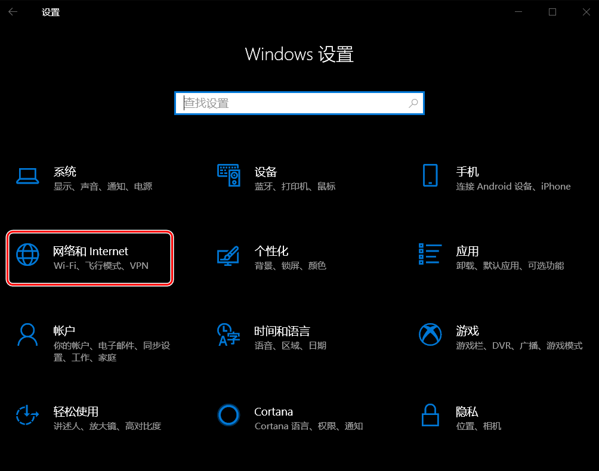

在状态页选择更改适配器选项

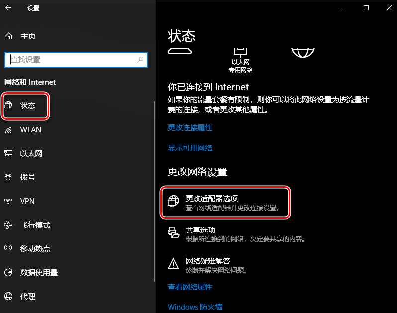

在以太网连接图标上右键菜单选择属性

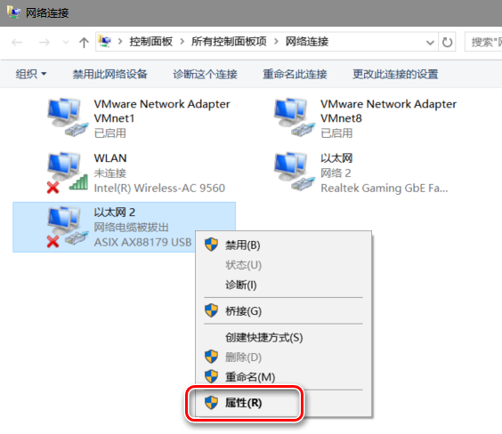

选中Internet协议版本4(TCP/IPv4)选项后，点击属性打开IPv4配置，按下图设置后，点击确定保存设置内容

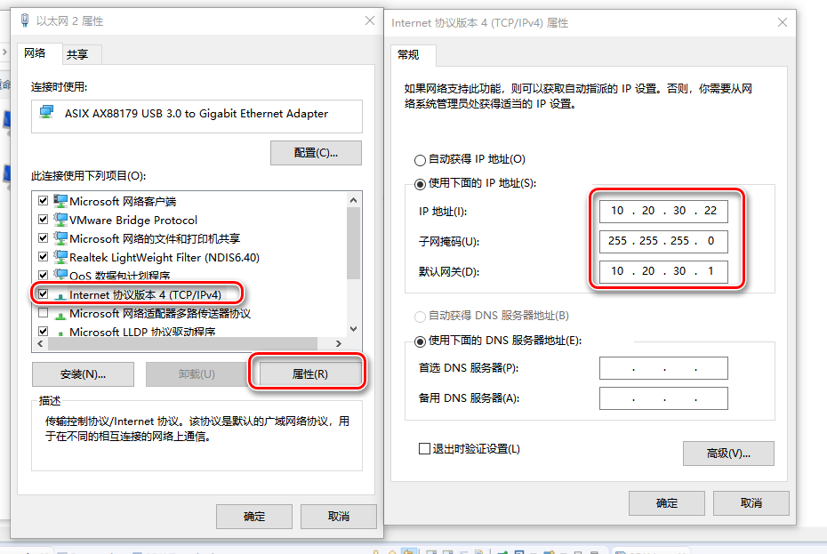

将zcu102的启动模式设置为JTAG，上电启动

在windows的适配器选项窗口可见网络连接已建立

打开网络调试助手，设置为UDP协议，选择前述设置的IP地址，根据SDK代码选择主机端口33后点击打开

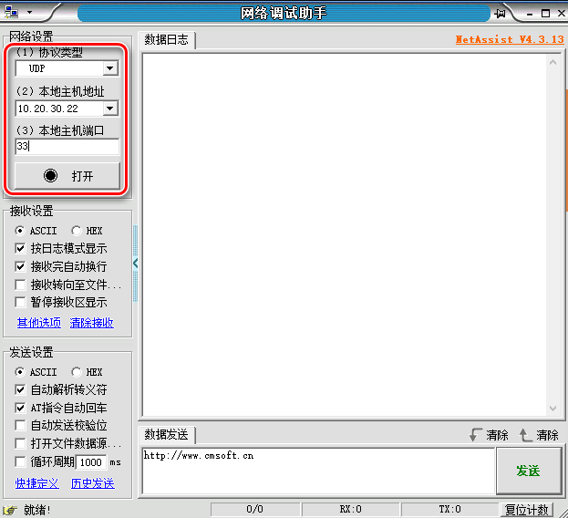

打开另一个网络调试助手进程，按如下设置

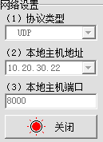

打开串口调试助手，按下图配置并且连接COM4

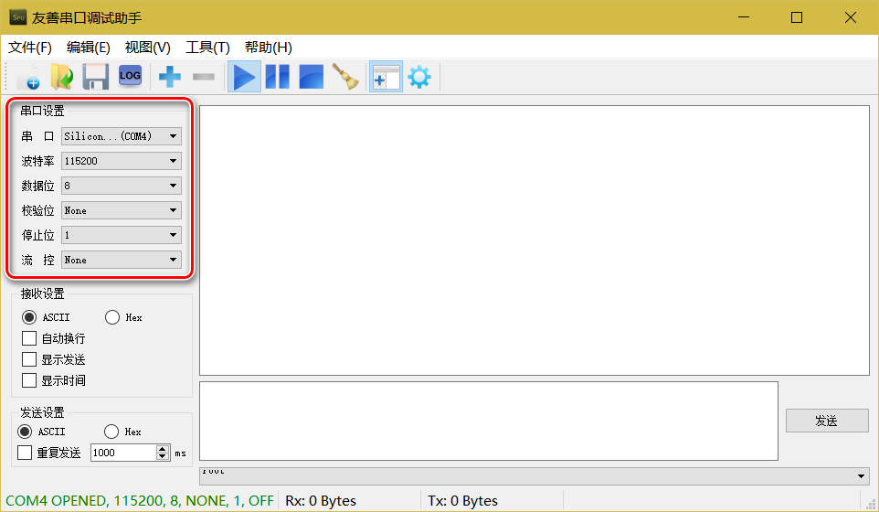

在SDK中的工作工程右键菜单选择Run As > Launch on Hardware(System Debugger)

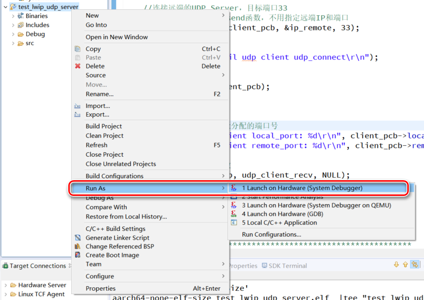

在串口助手中发现UDP Client连接后分配的端口为49153

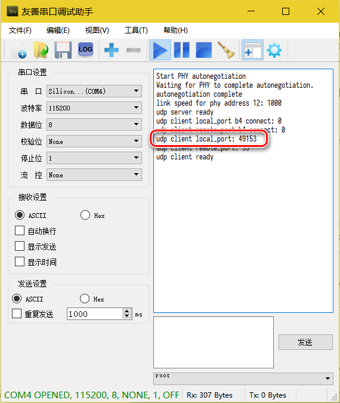

**在试验中可以发现PS端UDP Client不响应从PC端的8000端口发送数据，因为PS端UDP Client已与PC端的33端口完成连接，只响应来自PC端33接口发来的UDP数据**

完整试验内容如下

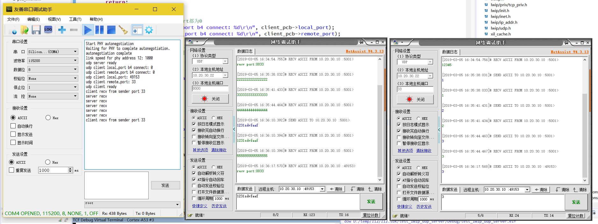

# 注意

UDP Client的Connect没有实际的数据交换，仅仅是绑定远端IP和端口。因此，即使远端的UDP Server没有启动，Connect一样正确返回。

