本试验在 PS 中使用 zynq 内部全部 4 个 A53 核分别独立运行程序，并且使用 DDR 进行数据通信。

除了在 SDK 中使用 Debug 进行运行调试外，还试验了以镜像文件的方式在 SD 卡中加载启动。

除了官方的 ug1186（本试验未使用 openamp）、xapp1079 以外，还有以下：

<https://blog.csdn.net/long_fly/article/details/79335025>

# Vivado 工程

建立  zcu102 的 Vaivado 工程，新建 Block Design，并且添加 zynq 模块

运行 Run Block Automation，并连接时钟信号：

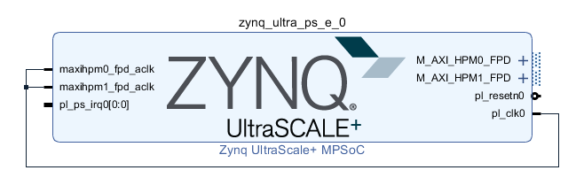

保存后依次运行 Generate Output Products 和 Create HDL Wrapper

在 Flow Navigator 中选择 Generate Bitstream，完成后先 Export Hardware，再执行 Launch SDK

# 建立 PS 工程

在 SDK 中建立 4 个 Hello World 模板工程，分别选择 4 个 A53 核，并且4个工程全部使用独立的 BSP

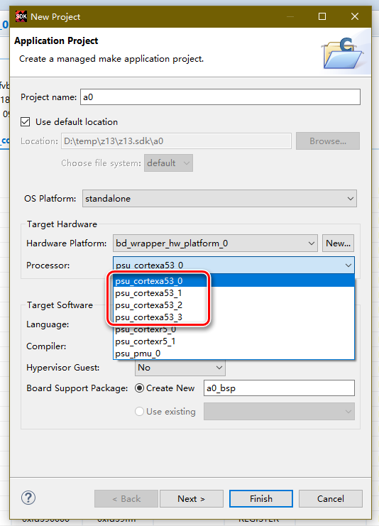

完成后的 Project Explorer 如下

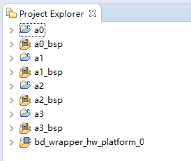

# 程序指令 DDR 空间分配

**由于 4 个 A53 核使用访问同 1 个 DDR，因此必须将 4 个程序的指令空间分开，不能重叠。**

双击打开 4 个工作工程的 lscript.ld 文件

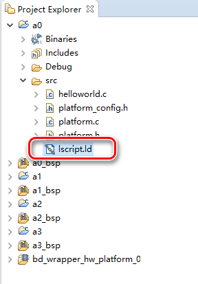

在 Section to Memory Region Mapping 部分可以发现程序指令空间全部分配至 psu_ddr_0_MEM_0

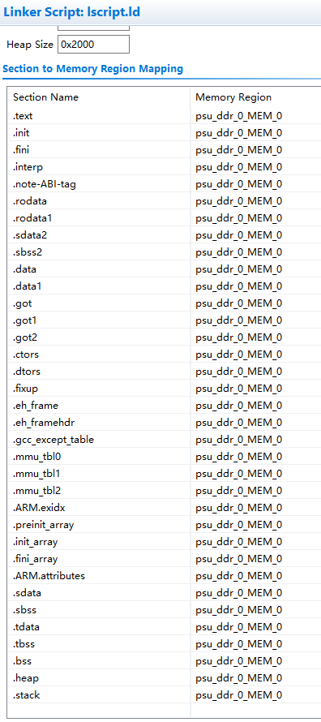

于是在 Available Memory Regions 部分双击修改 psu_ddr_0_MEM_0 的 Size

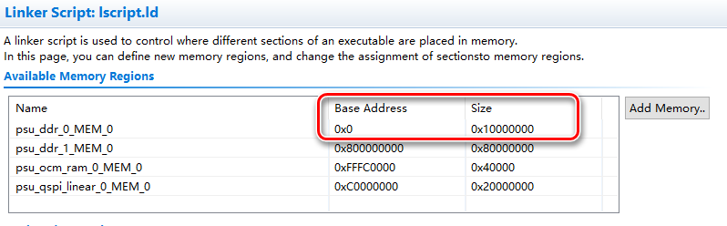

分配结果如下表：

| 单核工程 | Base Address | Size       |
| -------- | ------------ | ---------- |
| a0       | 0x0          | 0x10000000 |
| a1       | 0x10000000   | 0x10000000 |
| a2       | 0x20000000   | 0x10000000 |
| a3       | 0x30000000   | 0x10000000 |

如果 Size 大小不足则会出一类似下方的 Build 错误

>d:/program/xilinx/sdk/2018.2/gnu/aarch64/nt/aarch64-none/bin/../lib/gcc/aarch64-none-elf/7.2.1/../../../../aarch64-none-elf/bin/ld.exe: a3.elf section `.text' will not fit in region `psu_ddr_0_MEM_0'
>d:/program/xilinx/sdk/2018.2/gnu/aarch64/nt/aarch64-none/bin/../lib/gcc/aarch64-none-elf/7.2.1/../../../../aarch64-none-elf/bin/ld.exe: address 0x30001674 of a3.elf section `.init' is not within region `psu_ddr_0_MEM_0'
>d:/program/xilinx/sdk/2018.2/gnu/aarch64/nt/aarch64-none/bin/../lib/gcc/aarch64-none-elf/7.2.1/../../../../aarch64-none-elf/bin/ld.exe: address 0x300016b4 of a3.elf section `.fini' is not within region `psu_ddr_0_MEM_0'
>d:/program/xilinx/sdk/2018.2/gnu/aarch64/nt/aarch64-none/bin/../lib/gcc/aarch64-none-elf/7.2.1/../../../../aarch64-none-elf/bin/ld.exe: address 0x30003010 of a3.elf section `.mmu_tbl0' is not within region `psu_ddr_0_MEM_0'
>d:/program/xilinx/sdk/2018.2/gnu/aarch64/nt/aarch64-none/bin/../lib/gcc/aarch64-none-elf/7.2.1/../../../../aarch64-none-elf/bin/ld.exe: address 0x30006000 of a3.elf section `.mmu_tbl1' is not within region `psu_ddr_0_MEM_0'
>d:/program/xilinx/sdk/2018.2/gnu/aarch64/nt/aarch64-none/bin/../lib/gcc/aarch64-none-elf/7.2.1/../../../../aarch64-none-elf/bin/ld.exe: address 0x3000a000 of a3.elf section `.mmu_tbl2' is not within region `psu_ddr_0_MEM_0'
>d:/program/xilinx/sdk/2018.2/gnu/aarch64/nt/aarch64-none/bin/../lib/gcc/aarch64-none-elf/7.2.1/../../../../aarch64-none-elf/bin/ld.exe: address 0x30001674 of a3.elf section `.init' is not within region `psu_ddr_0_MEM_0'
>d:/program/xilinx/sdk/2018.2/gnu/aarch64/nt/aarch64-none/bin/../lib/gcc/aarch64-none-elf/7.2.1/../../../../aarch64-none-elf/bin/ld.exe: address 0x300016b4 of a3.elf section `.fini' is not within region `psu_ddr_0_MEM_0'
>d:/program/xilinx/sdk/2018.2/gnu/aarch64/nt/aarch64-none/bin/../lib/gcc/aarch64-none-elf/7.2.1/../../../../aarch64-none-elf/bin/ld.exe: address 0x30003010 of a3.elf section `.mmu_tbl0' is not within region `psu_ddr_0_MEM_0'
>d:/program/xilinx/sdk/2018.2/gnu/aarch64/nt/aarch64-none/bin/../lib/gcc/aarch64-none-elf/7.2.1/../../../../aarch64-none-elf/bin/ld.exe: address 0x30006000 of a3.elf section `.mmu_tbl1' is not within region `psu_ddr_0_MEM_0'
>d:/program/xilinx/sdk/2018.2/gnu/aarch64/nt/aarch64-none/bin/../lib/gcc/aarch64-none-elf/7.2.1/../../../../aarch64-none-elf/bin/ld.exe: address 0x3000a000 of a3.elf section `.mmu_tbl2' is not within region `psu_ddr_0_MEM_0'
>d:/program/xilinx/sdk/2018.2/gnu/aarch64/nt/aarch64-none/bin/../lib/gcc/aarch64-none-elf/7.2.1/../../../../aarch64-none-elf/bin/ld.exe: address 0x30001674 of a3.elf section `.init' is not within region `psu_ddr_0_MEM_0'
>d:/program/xilinx/sdk/2018.2/gnu/aarch64/nt/aarch64-none/bin/../lib/gcc/aarch64-none-elf/7.2.1/../../../../aarch64-none-elf/bin/ld.exe: address 0x300016b4 of a3.elf section `.fini' is not within region `psu_ddr_0_MEM_0'
>d:/program/xilinx/sdk/2018.2/gnu/aarch64/nt/aarch64-none/bin/../lib/gcc/aarch64-none-elf/7.2.1/../../../../aarch64-none-elf/bin/ld.exe: address 0x30003010 of a3.elf section `.mmu_tbl0' is not within region `psu_ddr_0_MEM_0'
>d:/program/xilinx/sdk/2018.2/gnu/aarch64/nt/aarch64-none/bin/../lib/gcc/aarch64-none-elf/7.2.1/../../../../aarch64-none-elf/bin/ld.exe: address 0x30006000 of a3.elf section `.mmu_tbl1' is not within region `psu_ddr_0_MEM_0'
>d:/program/xilinx/sdk/2018.2/gnu/aarch64/nt/aarch64-none/bin/../lib/gcc/aarch64-none-elf/7.2.1/../../../../aarch64-none-elf/bin/ld.exe: address 0x3000a000 of a3.elf section `.mmu_tbl2' is not within region `psu_ddr_0_MEM_0'
>d:/program/xilinx/sdk/2018.2/gnu/aarch64/nt/aarch64-none/bin/../lib/gcc/aarch64-none-elf/7.2.1/../../../../aarch64-none-elf/bin/ld.exe: address 0x30001674 of a3.elf section `.init' is not within region `psu_ddr_0_MEM_0'
>d:/program/xilinx/sdk/2018.2/gnu/aarch64/nt/aarch64-none/bin/../lib/gcc/aarch64-none-elf/7.2.1/../../../../aarch64-none-elf/bin/ld.exe: address 0x300016b4 of a3.elf section `.fini' is not within region `psu_ddr_0_MEM_0'
>d:/program/xilinx/sdk/2018.2/gnu/aarch64/nt/aarch64-none/bin/../lib/gcc/aarch64-none-elf/7.2.1/../../../../aarch64-none-elf/bin/ld.exe: address 0x30003010 of a3.elf section `.mmu_tbl0' is not within region `psu_ddr_0_MEM_0'
>d:/program/xilinx/sdk/2018.2/gnu/aarch64/nt/aarch64-none/bin/../lib/gcc/aarch64-none-elf/7.2.1/../../../../aarch64-none-elf/bin/ld.exe: address 0x30006000 of a3.elf section `.mmu_tbl1' is not within region `psu_ddr_0_MEM_0'
>d:/program/xilinx/sdk/2018.2/gnu/aarch64/nt/aarch64-none/bin/../lib/gcc/aarch64-none-elf/7.2.1/../../../../aarch64-none-elf/bin/ld.exe: address 0x3000a000 of a3.elf section `.mmu_tbl2' is not within region `psu_ddr_0_MEM_0'
>d:/program/xilinx/sdk/2018.2/gnu/aarch64/nt/aarch64-none/bin/../lib/gcc/aarch64-none-elf/7.2.1/../../../../aarch64-none-elf/bin/ld.exe: address 0x30001674 of a3.elf section `.init' is not within region `psu_ddr_0_MEM_0'
>d:/program/xilinx/sdk/2018.2/gnu/aarch64/nt/aarch64-none/bin/../lib/gcc/aarch64-none-elf/7.2.1/../../../../aarch64-none-elf/bin/ld.exe: address 0x300016b4 of a3.elf section `.fini' is not within region `psu_ddr_0_MEM_0'
>d:/program/xilinx/sdk/2018.2/gnu/aarch64/nt/aarch64-none/bin/../lib/gcc/aarch64-none-elf/7.2.1/../../../../aarch64-none-elf/bin/ld.exe: address 0x30003010 of a3.elf section `.mmu_tbl0' is not within region `psu_ddr_0_MEM_0'
>d:/program/xilinx/sdk/2018.2/gnu/aarch64/nt/aarch64-none/bin/../lib/gcc/aarch64-none-elf/7.2.1/../../../../aarch64-none-elf/bin/ld.exe: address 0x30006000 of a3.elf section `.mmu_tbl1' is not within region `psu_ddr_0_MEM_0'
>d:/program/xilinx/sdk/2018.2/gnu/aarch64/nt/aarch64-none/bin/../lib/gcc/aarch64-none-elf/7.2.1/../../../../aarch64-none-elf/bin/ld.exe: address 0x3000a000 of a3.elf section `.mmu_tbl2' is not within region `psu_ddr_0_MEM_0'
>d:/program/xilinx/sdk/2018.2/gnu/aarch64/nt/aarch64-none/bin/../lib/gcc/aarch64-none-elf/7.2.1/../../../../aarch64-none-elf/bin/ld.exe: region `psu_ddr_0_MEM_0' overflowed by 61616 bytes
>collect2.exe: error: ld returned 1 exit status
>make: *** [a3.elf] 错误 1

# 试验：串口通信

修改各工程的 helloworld.c 的代码，以 a0 工程为例：

```c
#include <stdio.h>
#include "platform.h"
#include "xil_printf.h"
#include "sleep.h"

int main()
{
    init_platform();

    while (1)
    {
    	print("a0\n\r");
    	sleep(1);
    }

    cleanup_platform();
    return 0;
}
```

对于 a1、a2、a3 工程，将 print 函数内容修改为对应的工程名即可

按照 zcu102_2 文档的说明连接主机，并打开串口助手

以 a0 工程作为 Debug 启动工程，在工程的 Run Configuration 中新建 System Debugger，并进入 Application 页配置 a1、a2、a3 工程

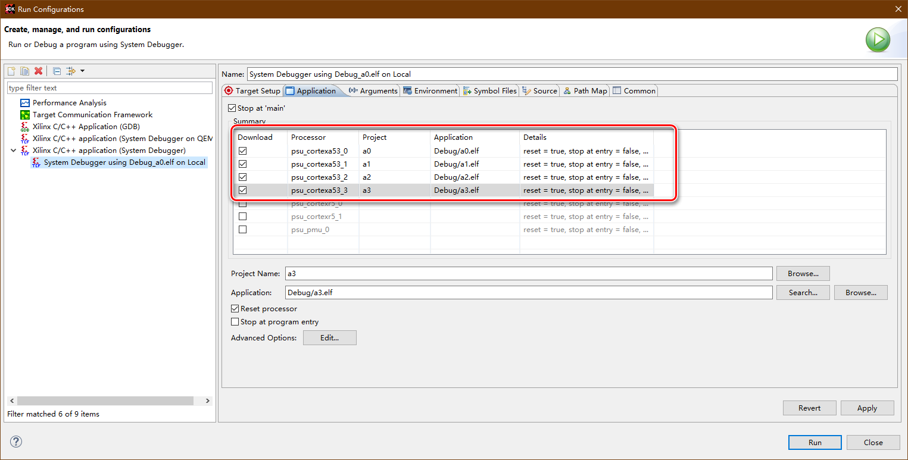

点击右下角的 Run 按钮，启动 4 个 PS 程序

串口助手收到正确的串口数据

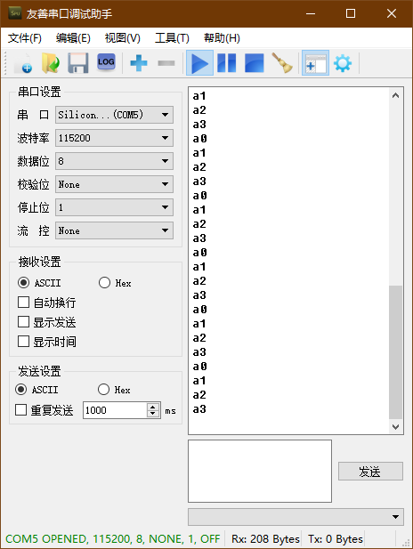

# 试验：共享 DDR 内存通信

使用 PSU_DDR_1 空间作为共享 DDR，在 a3 工程中写入数据，在 a0、a1、a2 工程中读出数据

a3 代码如下：

```c
#include <stdio.h>
#include "platform.h"
#include "xil_printf.h"
#include "sleep.h"

#define SHARED_DDR 0x800000000

int main()
{
    init_platform();

    unsigned int v = 0;

    while (1)
    {
    	*((unsigned int*)SHARED_DDR) = v;
    	xil_printf("a3 write %d\n\r", v);
    	sleep(1);
    	v++;
    }

    cleanup_platform();
    return 0;
}
```

a0 代码如下：（a1、a2 代码仅 xil_printf 函数内容不同）

```c
#include <stdio.h>
#include "platform.h"
#include "xil_printf.h"
#include "sleep.h"

#define SHARED_DDR 0x800000000

int main()
{
    init_platform();

    unsigned int v = 0;

    while (1)
    {
    	sleep(1);
    	v = *((unsigned int*)SHARED_DDR);
    	xil_printf("a0 read %d\n\r", v);
    }

    cleanup_platform();
    return 0;
}
```

按前述方法启动 PS 程序

串口助手收到正确的串口数据

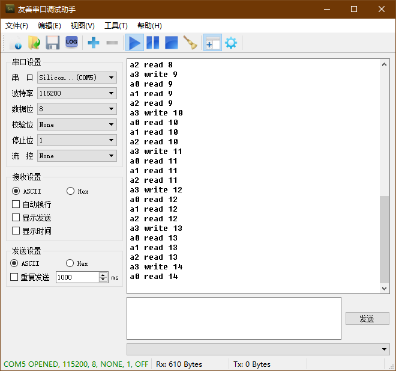

# 试验：SD 卡加载

在 psu_cortexa53_0 建立 FSBL 工程：

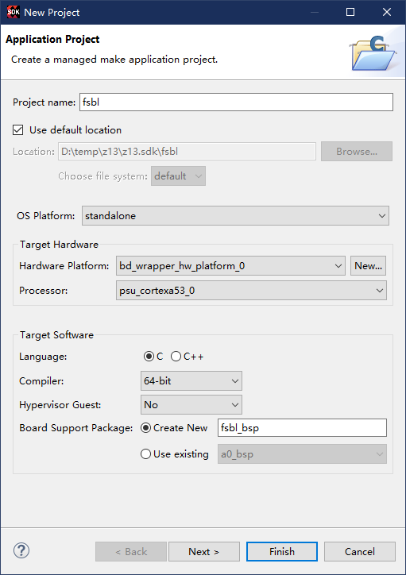

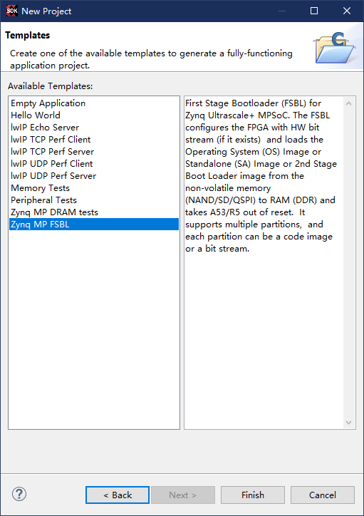

建立 PMU 工程：

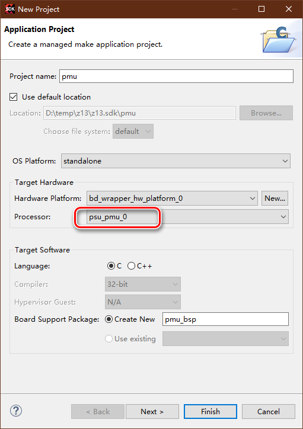

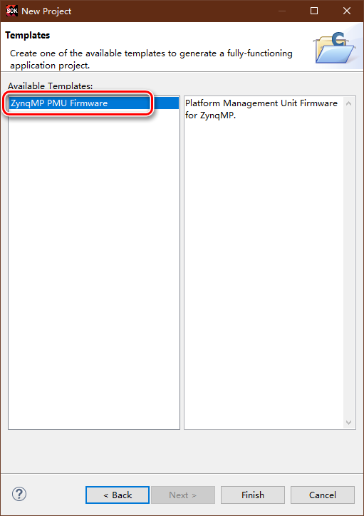

FSBL 工程和 PMU 工程 Build 完成后，在 SDK 菜单选择 Create Boot Image

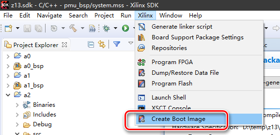

如下图所示进行配置：

- Architecture 为 Zynq MP
- Output BIF file path 路径自定，且设置之后自动更新 Output path，不要更改默认的 output.bif 和 BOOT.bin 文件名称
- Boot image partitions 使用 Add 按钮添加，注意**排列顺序前 3 必须为 FSBL、PMU、PL bit文件**，各 A53 程序 elf 的顺序无特别要求

前述的添加 Boot image partitions 按下 Add 弹出窗口如下

FSBL：

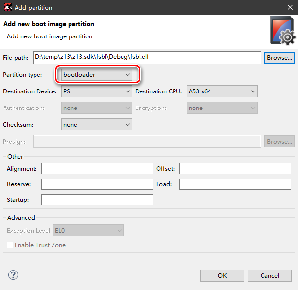

PMU：

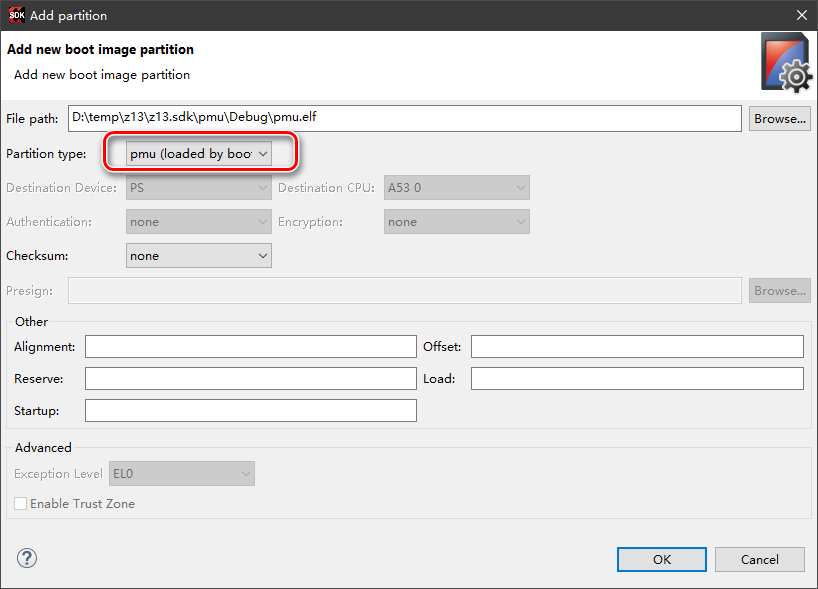

PL Bit 文件：

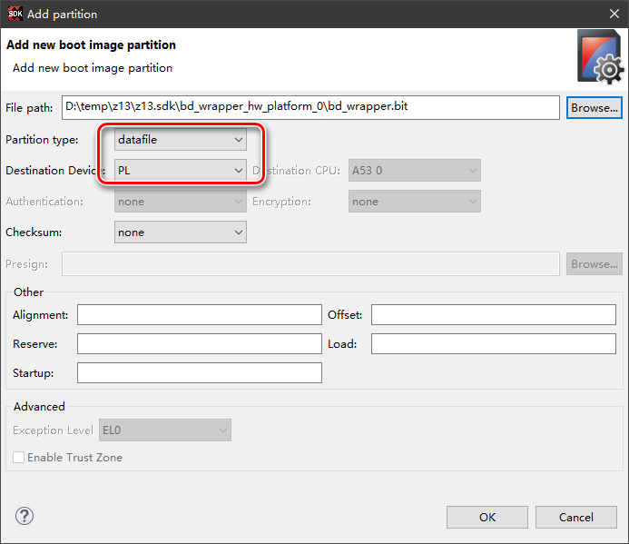

a0 elf 文件：（a1、a2、a3 注意选中正确的 Destination CPU）

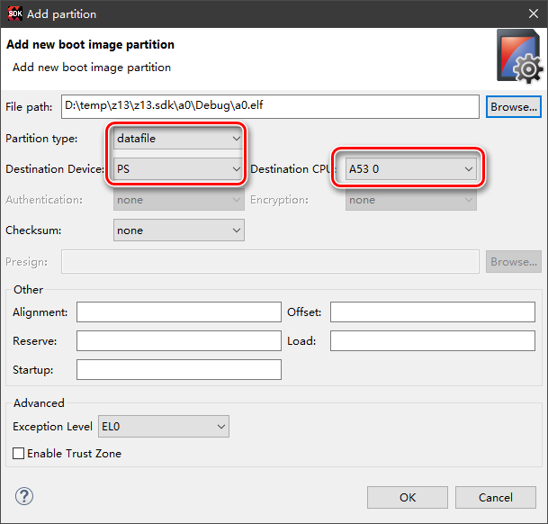

配置完成，点击窗口下方的 Create Image 按钮生成加载镜像文件 BOOT.bin

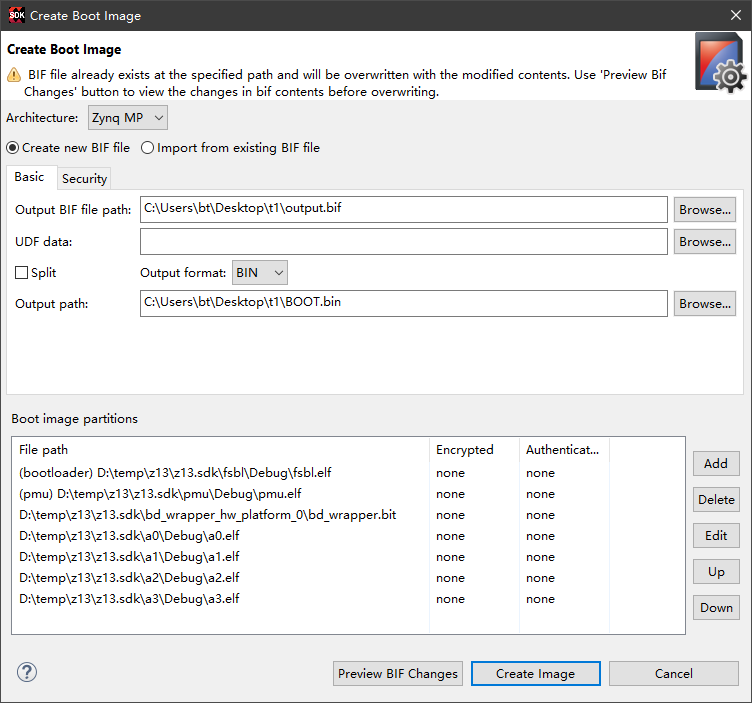

将 SD 卡格式化为 FAT32 格式，并且将 BOOT.bin 文件考入 SD 卡根目录下

将 SD 卡插入 zcu102 板卡，并且将板卡加载方式改为 SD 卡加载

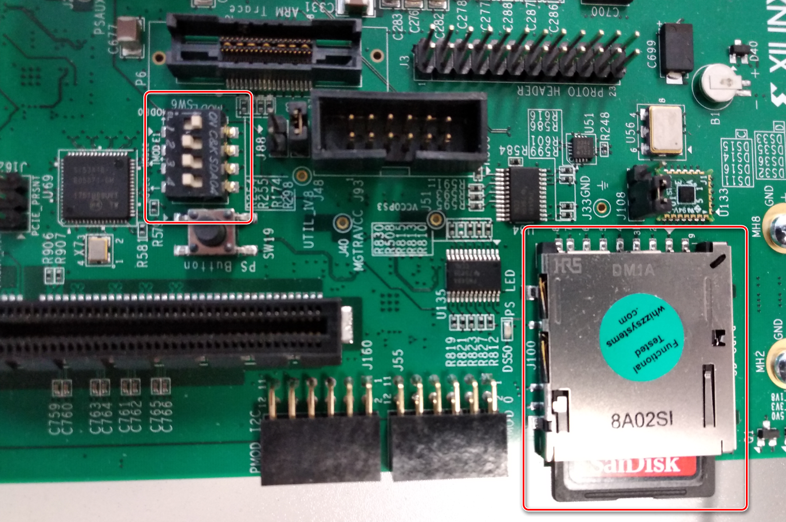

将板卡上电启动，在主机的串口助手中发现镜像加载成功

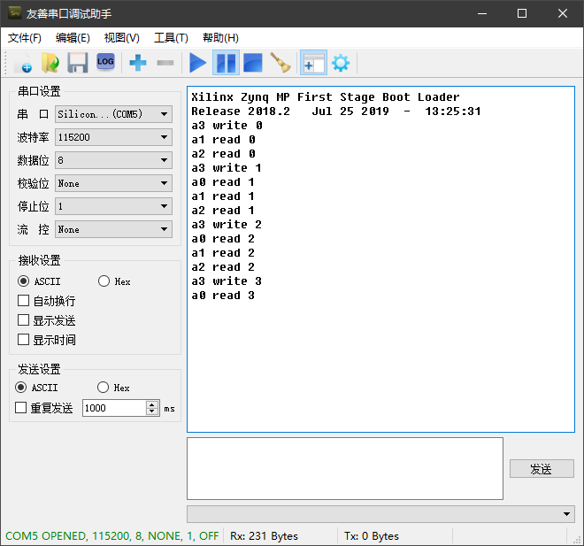

在收到的串口数据中可以发现 a0 启动较晚，可能是与 FSBL 在 a0 中运行有关

# 附记

- 本试验使用的多核间通信方式为共享 DDR 内存的方式，除此以外还有通过 On Chip Memory (OCM) 或者 Inter-processor interrupt (IPI) 方式
- 本试验使用 DDR 读写数据，但是未使用 Xil_DCacheFlushRange 函数将 DCache 中数据冲入 DDR，原因在于 SCU 已保证各 A53 核各自独立的 DCache 完全同步
  - 在 ug1085 中的说明如下：
- 在网上找到的大多数多核工作的参考资源中都提到在 BSP 工程中增加编译选项 -DUSE_AMP=1，据说使用 Inter-processor interrupt (IPI) 情况下必须添加此编译项，试验中给 a1、a2、a3 的 BSP 工程添加此编译项没有发现运行变化，因此本试验最终没有添加
  - 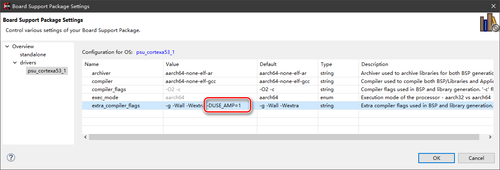
  - ug1186的说明如下：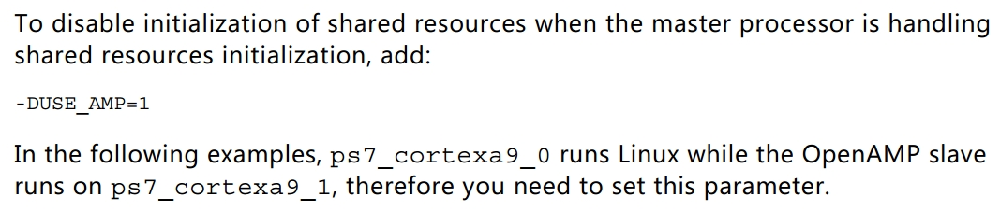

