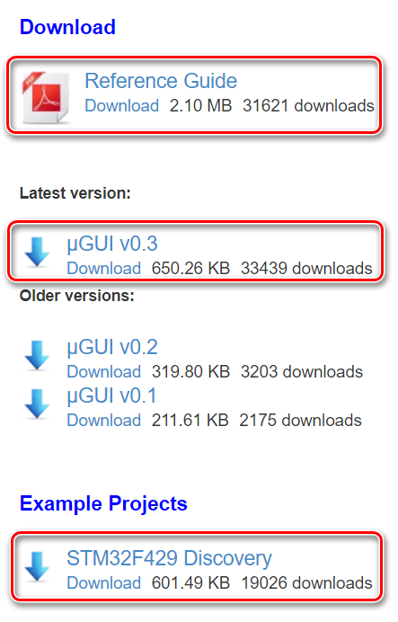

uGUI的基本工作原理是将GUI组件的像素通过数据修改或者替换的方法叠加在原始图像数据上

uGUI的使用非常简单，将下载的ugui.h和ugui.c文件导入PS工程中即可以使用，通过官网手册和代码注释可以查看详细用法

# 下载

在[官网](http://embeddedlightning.com/ugui/)下载uGUI的最新版本

在网页的下方可以找到使用手册，源代码和示例程序




# 导入PS工程

可以通过复制粘贴的方式将下载的源码文件ugui.h和ugui.c文件导入PS工程

将ugui.h中的`#include "system.h"`改为`#include "stdint.h"`

# 定义像素点绘制函数

为了让uGUI正常工作，还应当在程序中自定义像素点绘制函数，并且在uGUI的初始化函数`UG_Init()`中通过参数指定绘制函数，否则uGUI不能工作

目前使用的像素点绘制函数如下：

```c
//自定义像素点(x, y)的填充函数
static void pix_set(UG_S16 x, UG_S16 y, UG_COLOR c)
{
	//计算当前像素点在图像缓冲中的偏移
    //LINE_WIDTH为当前图像一行数据占用的字节数目
    //PIX_BYTES为当前图像中一个像素点占用的字节数目
	u32 pix_addr;
	pix_addr = y*LINE_WIDTH+x*PIX_BYTES;

	//取得配置颜色的RGB通道数值
	u8 r, g, b;
	r = (c >> 16) & 0xFF;
	g = (c >> 8) & 0xFF;
	b = c & 0xFF;

    //下方的透明度算法正确，但是uGUI底层接口调用时会在刷新GUI时出现闪烁
#ifdef GUI_ALPHA//如果有透明度要求
	//当前像素点值
	u8 ro, go, bo;
	ro = *(frame_ptr_ping+pix_addr);
	go = *(frame_ptr_ping+pix_addr+1);
	bo = *(frame_ptr_ping+pix_addr+2);

	//当前像素点值与GUI像素点值融合
	r = (u8)((float)r*GUI_ALPHA+(float)ro*(1.0F-GUI_ALPHA)+0.5F);
	g = (u8)((float)g*GUI_ALPHA+(float)go*(1.0F-GUI_ALPHA)+0.5F);
	b = (u8)((float)b*GUI_ALPHA+(float)bo*(1.0F-GUI_ALPHA)+0.5F);
#endif

    //当前图像使用ping/pong双缓冲，一个缓冲绘制GUI的同时，另一个缓冲接收原始数据
	//配置像素点的RGB值
	if (frame_flag == 0)
	{
		//刷新ping缓冲
		*(frame_ptr_ping+pix_addr) = r;
		*(frame_ptr_ping+pix_addr+1) = g;
		*(frame_ptr_ping+pix_addr+2) = b;
	}
	else
	{
		//刷新pong缓冲
		*(frame_ptr_pong+pix_addr) = r;
		*(frame_ptr_pong+pix_addr+1) = g;
		*(frame_ptr_pong+pix_addr+2) = b;
	}
}
```

# 刷新GUI图像

uGUI使用函数`UG_Update()`刷新GUI图像，在刷新GUI之前必须保证原始图像不再更改，否则原始图像的更改将会覆盖GUI图像

**每次刷新GUI图像之前，即使Window显示或者隐藏状态不变，也必须用`UG_WindowShow()`函数或者`UG_WindowHide()`函数更新全部Window的显示状态**

# 定制GUI

为了更好的匹配项目需求，大多数情况下需要对uGUI接口函数进行定制

而且uGUI的授权允许对其源码进行修改

由于项目需要，目前对以下三个功能进行了定制修改

## BMP图像绘制

uGUI的源码没有RGB888像素格式的BMP图像绘制功能，作为最普遍的像素格式，需要自行添加至uGUI中

首先添加BMP_BPP_24的宏定义，作为RGB888的格式定义

在ugui.h中找到BMP_BPP_32的宏定义（其中BPP表示Bits Per Pixel），在其下方添加：

```c
#define BMP_BPP_24 (1<<6)
```

在ugui.c中找到`UG_DrawBMP()`函数，将函数内容修改为以下代码，注意下方代码不绘制BMP图像中的白色，将白色作为透明色实现

```c
//xp指绘图起点x坐标，yp指绘图起点y坐标
void UG_DrawBMP( UG_S16 xp, UG_S16 yp, UG_BMP* bmp )
{
   UG_S16 x,y,xs;
   UG_U8 r,g,b;

   UG_U16 tmp;
   UG_COLOR c;

   if ( bmp->p == NULL ) return;

   /* Only support 16 BPP so far */
   if ((bmp->bpp == BMP_BPP_16) && (bmp->colors == BMP_RGB565))//uGUI原有的BMP绘制功能
   {
	  UG_U16* p;
      p = (UG_U16*)bmp->p;
      xs = xp;//用xs暂存形参数值
      for(y=0;y<bmp->height;y++)
      {
         xp = xs;//每行绘图的列起点
         for(x=0;x<bmp->width;x++)
         {
            tmp = *p++;
            /* Convert RGB565 to RGB888 */
            r = (tmp>>11)&0x1F;
            r<<=3;
            g = (tmp>>5)&0x3F;
            g<<=2;
            b = (tmp)&0x1F;
            b<<=3;
            c = ((UG_COLOR)r<<16) | ((UG_COLOR)g<<8) | (UG_COLOR)b;
            UG_DrawPixel( xp++ , yp , c );
         }
         yp++;
      }
   }
   else if ((bmp->bpp == BMP_BPP_24) && (bmp->colors == BMP_RGB888))//自定义
   {
	   UG_U8* p;
	   p = (UG_U8*)(bmp->p);
	   xs = xp;//用xs暂存形参数值
	   for (y = 0; y < bmp->height; ++y)
	   {
		   xp = xs;//每行绘图的列起点

		   for (x = 0; x < bmp->width; ++x)
		   {
			   b = *p;
			   g = *(p+1);
			   r = *(p+2);

			   c = ((UG_COLOR)r<<16) | ((UG_COLOR)g<<8) | (UG_COLOR)b;

			   if ((r != 0xFF) || (g != 0xFF) || (b != 0xFF))
			   {
				   //白色不绘制，作为透明显示
				   //非白色才绘制
				   UG_DrawPixel(xp, yp, c);
			   }

			   //更新指针
			   p += 3;

			   //更新绘图列坐标
			   ++xp;
		   }

		   ++yp;//更新绘图行坐标
	   }
   }
   else
   {
      return;
   }
}
```

## Window背景透明

uGUI中的Window是所有GUI组件的容器，但是Window背景不透明

如果需要Window背景透明，有2种方法：

1.  每个GUI组件使用单个Window，Window设置为无边框和标题栏，并且GUI组件占满Window。**由于uGUI中只有Window可以在建立后移动位置，这种方法可以实现GUI组件移动的效果。**
2.  修改ugui.c中的`_UG_WindowUpdate()`函数，去掉函数中绘制背景的代码

根据上述第2种方法修改后的`_UG_WindowUpdate()`函数如下：

```c
void _UG_WindowUpdate( UG_WINDOW* wnd )
{
   UG_U16 i,objcnt;
   UG_OBJECT* obj;
   UG_S16 xs,ys,xe,ye;

   xs = wnd->xs;
   ys = wnd->ys;
   xe = wnd->xe;
   ye = wnd->ye;

   wnd->state &= ~WND_STATE_UPDATE;
   /* Is the window visible? */
   if ( wnd->state & WND_STATE_VISIBLE )
   {
//      /* 3D style? */
//      if ( (wnd->style & WND_STYLE_3D) && !(wnd->state & WND_STATE_REDRAW_TITLE) )
//      {
//         _UG_DrawObjectFrame(xs,ys,xe,ye,(UG_COLOR*)pal_window);
//         xs+=3;
//         ys+=3;
//         xe-=3;
//         ye-=3;
//      }
//      /* Show title bar? */
//      if ( wnd->style & WND_STYLE_SHOW_TITLE )
//      {
//         _UG_WindowDrawTitle( wnd );
//         ys += wnd->title.height+1;
//         if ( wnd->state & WND_STATE_REDRAW_TITLE )
//         {
//            wnd->state &= ~WND_STATE_REDRAW_TITLE;
//            return;
//         }
//      }
//      /* Draw window area? */
//      UG_FillFrame(xs,ys,xe,ye,wnd->bc);

      /* Force each object to be updated! */
      objcnt = wnd->objcnt;
      for(i=0; i<objcnt; i++)
      {
         obj = (UG_OBJECT*)&wnd->objlst[i];
         if ( !(obj->state & OBJ_STATE_FREE) && (obj->state & OBJ_STATE_VALID) && (obj->state & OBJ_STATE_VISIBLE) ) obj->state |= (OBJ_STATE_UPDATE | OBJ_STATE_REDRAW);
      }
   }
   else
   {
//      UG_FillFrame(wnd->xs,wnd->xs,wnd->xe,wnd->ye,gui->desktop_color);
   }
}
```

## 添加中文显示

uGUI源码不支持中文显示

在uGUI显示中文有2种方法：

1.  将中文内容作为BMP图像显示，根据需要自行定义BMP图像的三种组件Button, TextBox和Image
2.  使用*点阵取模软件*将需要显示的中文字体加入代码，替换uGUI中现有字体

2种方法中前者简单方便，后者灵活度高适用于大规模的GUI显示

对于本人而言，使用uGUI还是用第1种方法更合适，如果必须进行大规模的GUI显示，uGUI本身已经不适用，还是用Linux+Qt更合适