SystemGenerator的具体使用方法见ug897/ug948/ug958

# 配置Matlab版本

在开始菜单打开System Generator 2018.2 MATLAB Configurator

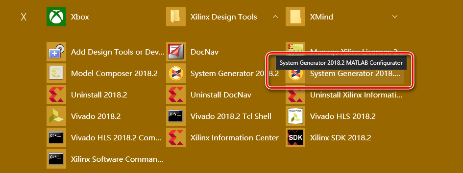

使用Find MATLAB选择对应版本的Matlab

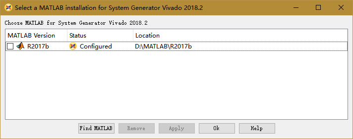

Status显示的Configured表示当前的Matlab版本R2017b与Vivado 2018.2版本完全匹配

点击OK关闭窗口

# 运行SysGen

在开始菜单打开System Generator 2018.2

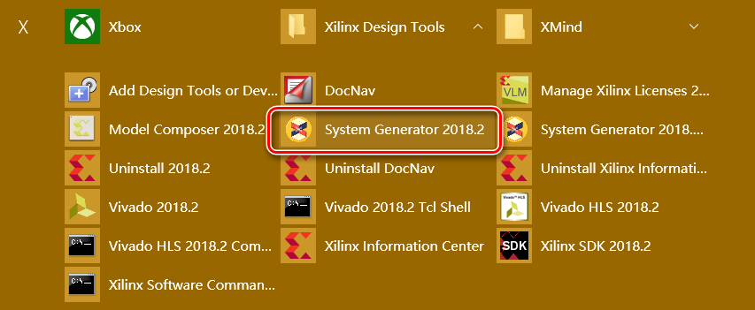

在Matlab主界面启动后将当前路径移至工作文件夹后打开Simulink

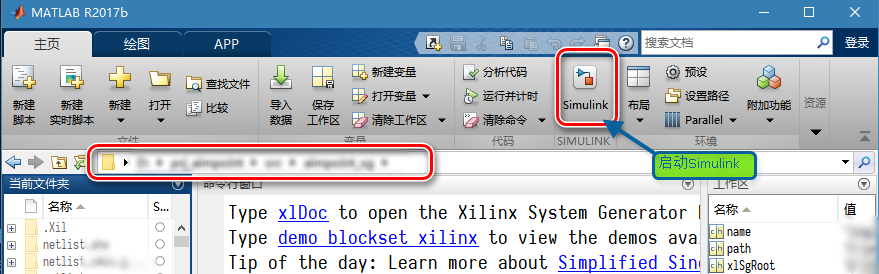

在Simulink界面选择Blank Model

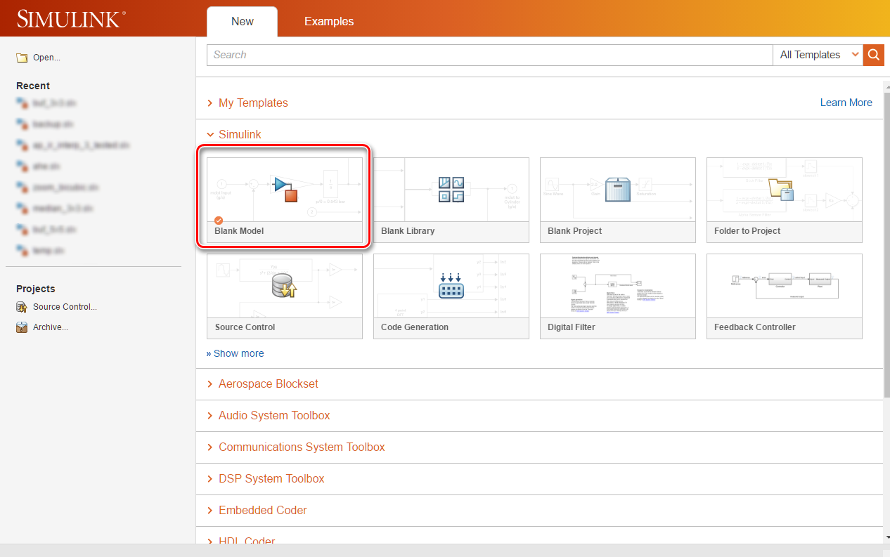

在打开的模型编辑界面，打开模块库

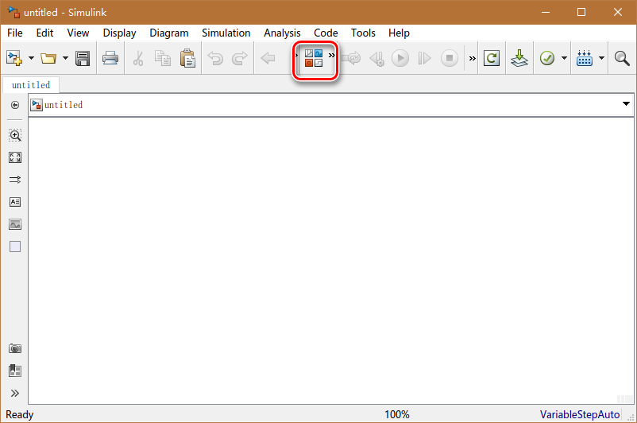

找到Xilinx库后添加System Generator模块

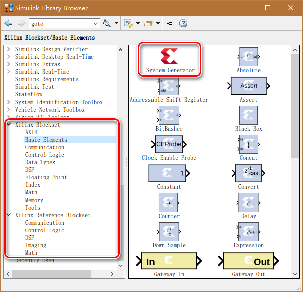

根据官方ug文档完成模型开发后保存模型，并且打开System Generator模块

在Compilation页如下配置

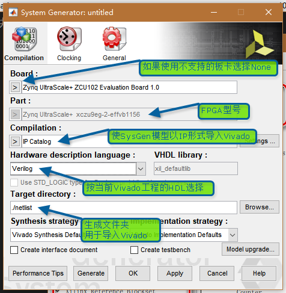

在Clocking页如下配置

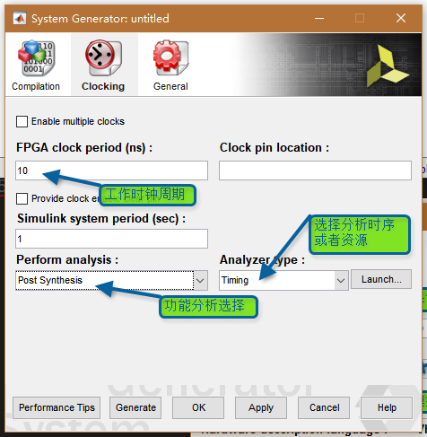

点击Generate按键后等待一段时间编译结束，并且根据Clocking页的配置显示对应的分析结果

# 导入Vivado工程

打开Vivado工程后在Flow Navigator打开Settings

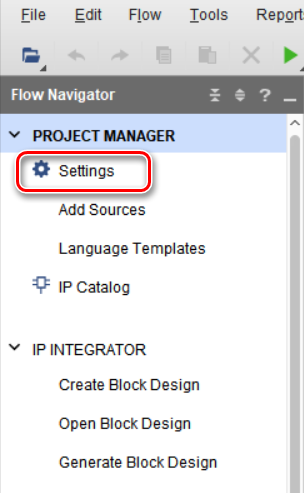

进入Settings界面的IP Repository页，并选择添加

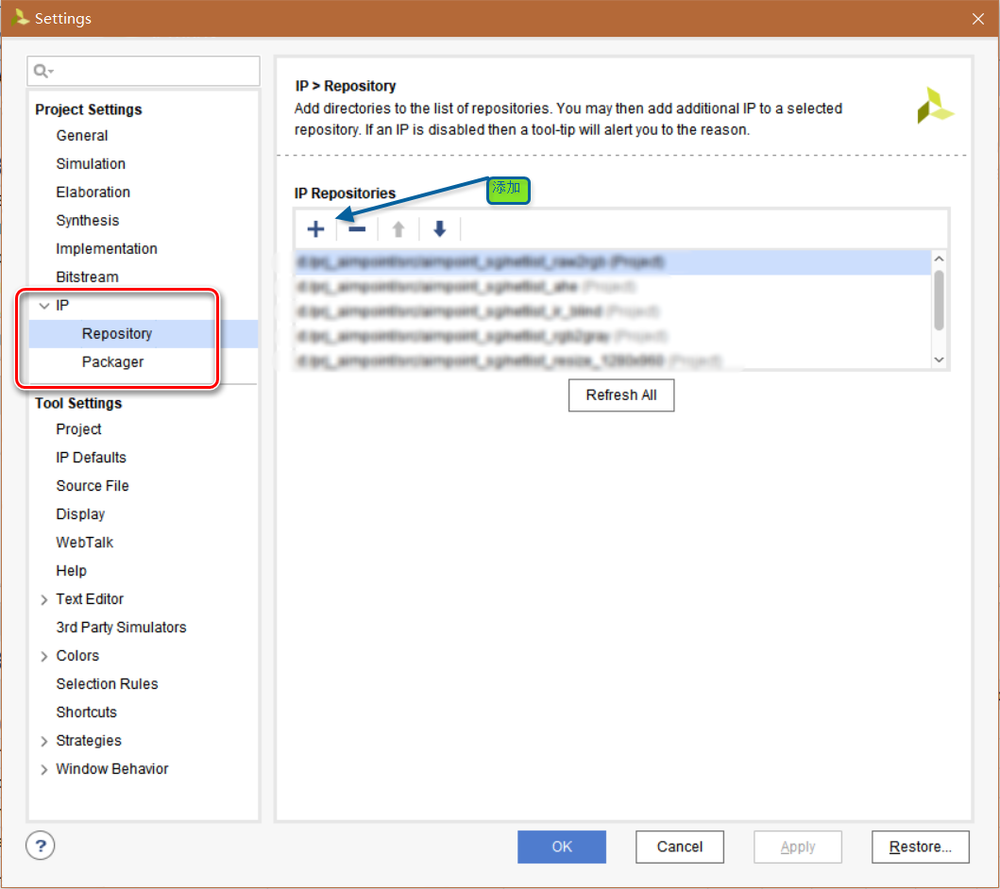

选择添加SysGen模型的生成文件夹后点击OK退出Settings界面

在Flow Navigator打开IP Catalog，并在搜索框中输入SysGen模型名称后找到IP，按照Vivado IP的正常使用方法生成IP模块

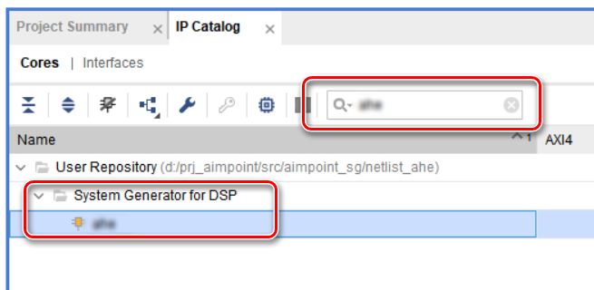

