本试验建立DDR4读写的MIG IP核，并且对其读写时序进行封装实现类似FIFO的读写接口。

测试工程已上传至<>

# 建立工程

参考之前的文档在Vivado内建立基于zcu102开发板的测试工程

# 板卡器件及对应IP

参考ug1182，在zcu102板卡上与PL连接的DDR4外部存储器件为MT40A256M16GE-075E

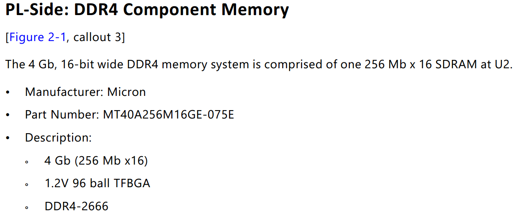

在[Micron的官方网站找到该器件](https://www.micron.com/products/dram/ddr4-sdram/part-catalog/mt40a256m16ge-075e-it)，并下载Data Sheet

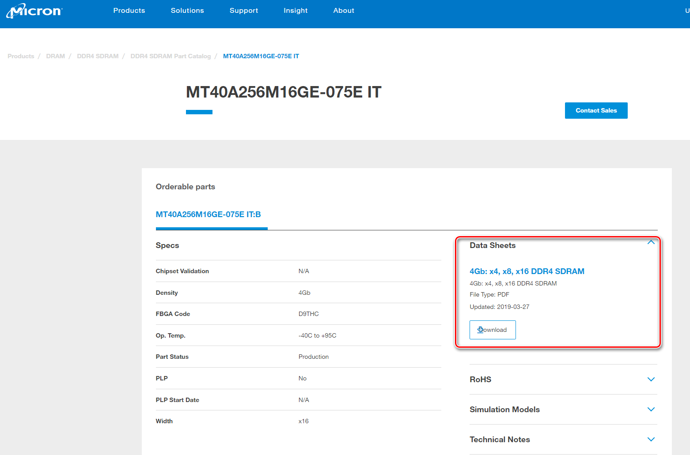

在Vivado工程中用IP Catalog中查找DDR4 SDRAM的IP核，双击并配置IP

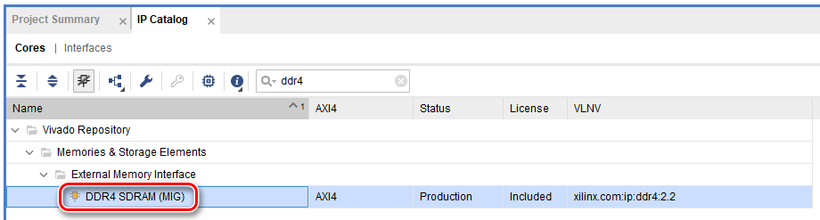

按照默认Board配置

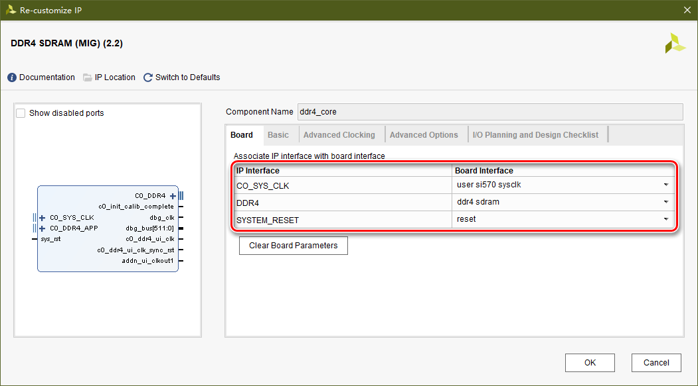

其它配置项保持默认，生成IP

# IP用户接口地址映射

IP使用默认配置的ROW COLUMN BANK的地址映射方式

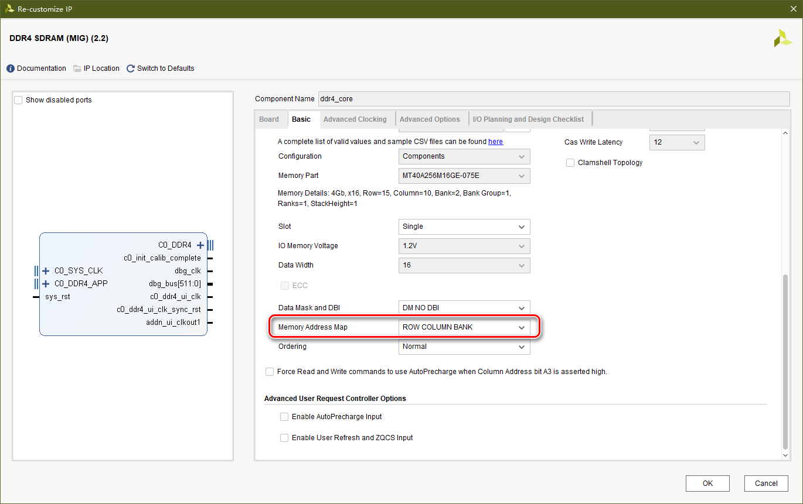

IP的用户接口时序参考IP手册pg150

根据手册的说明

> This mapping can have a significant impact on memory bandwidth utilization. "Row_COLUMN_BANK" is the recommended MEM_ADDR_ORDER setting.

因此在使用过程中直接顺序使用地址即可保证最大读写带宽，不用进行专门的地址特殊处理。

在User Interface章节查看地址映射部分（Rank指共用指令和地址的多个器件，此处不考虑）

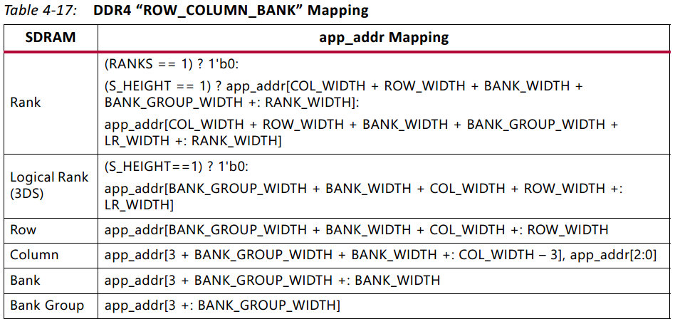

参考DDR4器件的地址分配说明

**注意：x16表示DDR4器件的数据总线DQ位宽为16**，并不是表示Bank数目

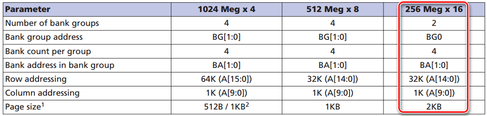

最终用户接口的app_addr分配如下：

| app_addr                        | 寻址                 |
| ------------------------------- | -------------------- |
| app_addr[3]                     | Bank Group选择       |
| app_addr[5:4]                   | Bank Group内Bank选择 |
| {app_addr[12:6], app_addr[2:0]} | Bank内Column选择     |
| app_addr[27:13]                 | Bank内Row选择        |

app_addr寻址针对的是完整的数据总线，而不是1比特数据，因此256Mbx16表示寻址范围是$256\times 1024\times 1024$，即$row\times column\times bank\times bankGroup$

# DDR4 MIG IP的读写时序

参考IP手册pg150。

读操作时序如下图所示：

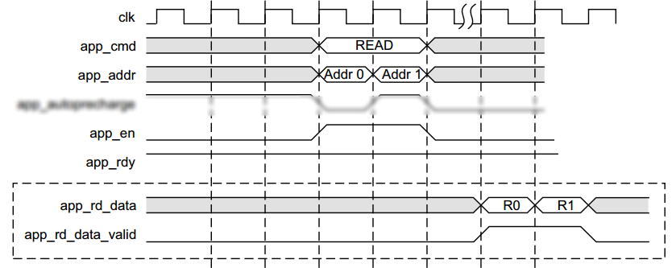

app_cmd, app_addr, app_en, app_rdy为3个指令接口信号，其中app_cmd表示读写指令，app_addr表示读写指令[对应的地址值](#IP用户接口地址映射)，app_en表示指令有效，在(app_en & app_rdy)条件下当前指令被IP接受。

读出数据为app_rd_data，app_rd_data_valid指示当前读出数据有效。读指令被IP接受后，需要等待一般不定的时间才能收到有效的读出数据。

相比较读操作时序，写操作时序非常复杂，并且

写操作时序如下图所示：

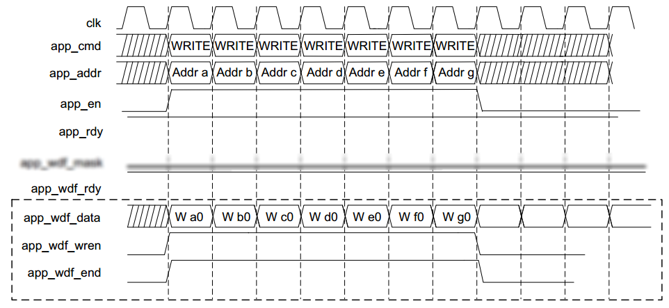

**写操作实际分为两个部分，写指令和写数据，独立与IP交互**

写指令接口信号与读指令接口信号相同，用app_cmd区分。

写数据接口信号包括app_wdf_data, app_wdf_wren, app_wdf_end, app_wdf_rdy，app_wdf_data表示数据值，app_wdf_wren表示当前数据值有效，app_wdf_end与app_wdf_wren同步，在(app_wdf_wren & app_wdf_rdy)条件下当前写数据被IP接受。

写数据与写指令的时序对齐关系如下图所示，即写数据可以提前写指令1个时钟周期或者滞后写指令1个或2个时钟周期。

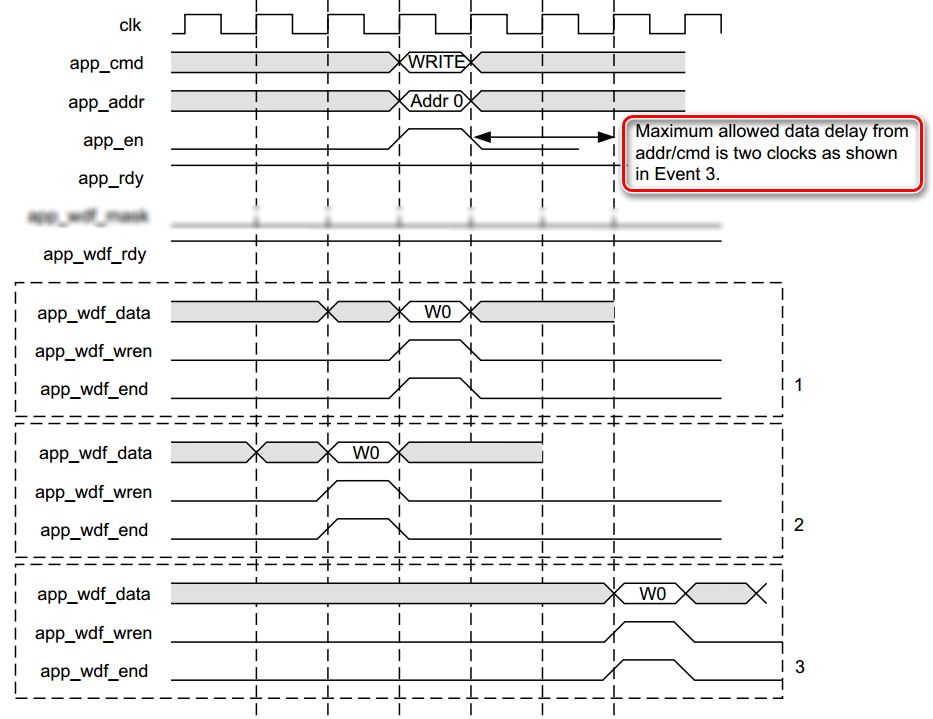

在编程实现时，最方便的实现方法是写指令和写数据同步赋值为有效，然后检查app_rdy和app_wdf_rdy的数值，分为4种情况：

1. {app_rdy, app_wdf_rdy} == 2'b11：当前写指令和写数据同时被IP接受，可以更新下个写指令和写数据
2. {app_rdy, app_wdf_rdy} == 2'b10：当前写指令被IP接受，但是写数据未被IP接受，停止写指令，保持写数据接口状态直到app_wdf_rdy值为1（测试中未出现该情况）
3. {app_rdy, app_wdf_rdy} == 2'b01：当前写数据被IP接受，但是写指令未补IP接受，停止写数据，保持写指令接口状态直到app_rdy值为1
4. {app_rdy, app_wdf_rdy} == 2'b00：当前写指令和写数据都未被IP接受，保持写指令和写数据接口状态，等待app_rdy和app_wdf_rdy的变化

在早期测试中未理解写指令和写数据相互独立，将app_en和app_wdf_wren进行同步控制，导致在出现上述3情况（2未出现）的时候，某些地址没有与应当写入的数据对齐，而且由于写指令可以接受一定范围内的写数据，导致数据与地址错误对应。

# 封装设计

DDR外部存储一般用于大数据量的缓存，使用时最好可以使用连续写或或者连续读。

对于写操作而言，写指令和写数据两个部分的相互配合导致MIG IP的用户接口无法实现连续写。

在不关心DDR存储地址的使用场景下，可以将DDR4 MIG IP封装实现类似FIFO的读写接口。

设计如下图所示：

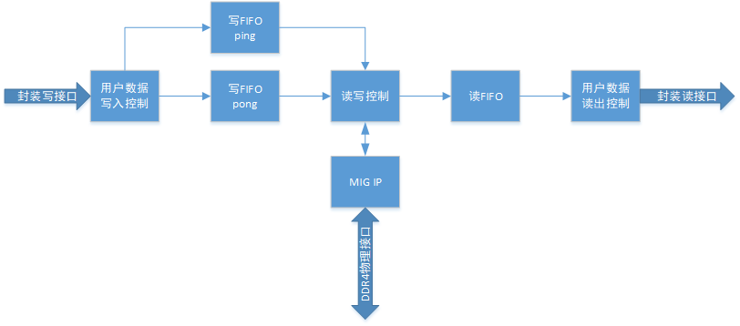

用ping/pong 2个FIFO缓存用户写入的数据，用户写入数据时交替写入2个FIFO，将数据送入IP的用户接口时，交替从2个FIFO读出数据。

使用2个FIFO的原因是为了在取出1个FIFO的读数据时，可以控制另1个FIFO的读使能，使得读出数据可以交替连续使用。

在使用1个FIFO的情况下，为了保证FIFO读数据连续，必须使用组合逻辑控制FIFO读使能，但是由于时钟频率较高（300MHz），以及写操作指令和数据的复杂配合方式，最终导致读使能的组合逻辑控制无法满足时序约束。

读FIFO只有1个的原因在于IP用户接口的读操作较为简单，从DDR4中读出的数据直接写入FIFO，并且将FIFO的读接口封装给用户使用。

除此以外，需要使用2个计数器记录当前DDR4的可写地址数目和可读地址数目，对IP用户接口读写时写操作的地址数目不能超过可写地址数，读操作的地址数目不能超过可读地址数，否则会出现DDR4的满写或者空读情况。

封装后的读写控制使用状态机实现，共6种状态：

1. 等待状态：DDR4可读数目和读FIFO可写数目都大于门限时启动读流程（按门限值数目读出DDR4数据并且写入读FIFO中），DDR4可写数目和写FIFO可读数目（2个FIFO可读数之和）都大于门限时启动写流程（按门限数目将写FIFO中的数据读出后写入DDR4中），读操作优先。
2. 读指令状态：产生门限数目个读指令并等待IP接受全部指令，完成后进入读数据状态。在当前状态下也可能接收读数据。
3. 读数据状态：等待IP送出门限数目个读数据，完成后回到等待状态。
4. 正常写状态：判断app_rdy和app_wdf_rdy状态，按照[写操作的4种情况](#DDR4 MIG IP的读写时序)进行处理，如果写指令和写数据都被IP接受则更新写指令和写数据；如果写指令或者写数据只有1个被IP接受则状态转移；如果都不被IP接受则状态保持，等待app_rdy和app_wdf_rdy的状态变化
5. 等待写数据状态：在此状态下写指令已被接受，写数据等待被IP接受（即app_wdf_rdy信号），如果被接受则更新下个写指令和写数据，并且状态回到正常写状态；如果不被接受，则保持状态等待app_wdf_rdy变化
6. 等待读数据状态：在此状态下写数据已被接受，写指令等待被IP接受（即app_rdy信号），如果被接受则更新下个写指令和写数据，并且状态回到正常写状态；如果不被接受，则保持状态等待app_rdy变化

封装代码如下：

```verilog
`timescale 1ns / 1ps

module mig_fifo(
	//MIG用户接口
	input ui_clk,//MIG用户接口时钟
	input ui_rst,//MIG用户接口复位
	
	output ui_en,//指令有效标记
	output [2:0] ui_cmd,//写指令3’b000，读指令3'b001
	output [27:0] ui_addr,//地址，每个地址对应DDR4物理层16位数据总线
	input ui_rdy,//指令被接受标记
	
	input [127:0] ui_rd_data,//读数据
	input ui_rd_data_valid,//读数据有效
	
	output ui_wdf_wren,//写数据有效标记
	output ui_wdf_end,//写数据结束，与ui_wdf_wren对齐
	output [127:0] ui_wdf_data,//写数据
	input ui_wdf_rdy,//数据可写标记，表示MIG内部缓冲可以装下新的写数据
	
	//FIFO操作接口
	input wr_en,//写使能
	output wr_able,//可写入WR_BLK个数据，写入过程中可能变为无效
	input [127:0] wr_data,//写入数据
	input rd_en,//读使能
	output rd_able,//可读出RD_BLK个数据，读出过程中可能变为无效
	output [127:0] rd_data,//读出数据，比rd_en延迟1个时钟周期
	output rd_data_valid//读出数据有效，比rd_en延迟1个时钟周期
    );
	
	//用于输出wr_able和rd_able的判断
	//外部模块一次写入的数据量
	//数值必须偶数
	parameter WR_BLK = 9'd200;//写FIFO可以写入200个数据
	parameter RD_BLK = 9'd128;//读FIFO可以读出128个数据
	
	//MIG用户接口指令值
	localparam CMD_WR = 3'b000;
	localparam CMD_RD = 3'b001;
	
	//时钟与复位
	wire clk;
	assign clk = ui_clk;
	
	wire rst;
	assign rst = ui_rst;
	
	//例化写FIFO*****************************************************************************************************
	//写FIFO由ping/pong 2个FIFO组成，用于保证在数据送入MIG用户接口时，FIFO读使能可以使用时序逻辑赋值，即读使能有效的时钟周期可以使用另1个FIFO赋值
	(*keep = "TRUE"*) reg ping_pong_flag_wr = 1'b0;//0表示写入ping，1表示写入pong
	(*keep = "TRUE"*) reg ping_pong_flag_rd = 1'b0;//0表示读出ping，1表示读出pong
	
	//注意：ping_pong_flag_rd在未加keep时上板测试发现未能赋值，可能源于vivado的综合bug
	
	reg [127:0] ping_din = 128'd0;
	reg ping_wr_en = 1'b0;
	(*keep = "TRUE"*) reg ping_rd_en = 1'b0;
	(*keep = "TRUE"*) wire [127:0] ping_dout;
	wire [8:0] ping_data_count;
	
	reg [8:0] ping_2rd = 9'd0;//可读数据量
	reg [8:0] ping_2wr = 9'd256;//可写数据量
	
	always @(posedge clk) begin
		if (rst == 1'b1) begin
			ping_2rd <= 9'd0;
			ping_2wr <= 9'd256;
		end
		else begin
			ping_2rd <= ping_data_count;
			ping_2wr <= 9'd256-ping_data_count;
		end
	end
	
	fifo_ddr4_buf fifo_wr_ping (
	.clk(clk),                  // input wire clk
	.srst(rst),                // input wire srst
	.din(ping_din),                  // input wire [127 : 0] din
	.wr_en(ping_wr_en),              // input wire wr_en
	.rd_en(ping_rd_en),              // input wire rd_en
	.dout(ping_dout),                // output wire [127 : 0] dout
	.full(),                // output wire full
	.empty(),              // output wire empty
	.data_count(ping_data_count),    // output wire [8 : 0] data_count
	.wr_rst_busy(),  // output wire wr_rst_busy
	.rd_rst_busy()  // output wire rd_rst_busy
	);
	
	reg [127:0] pong_din = 128'd0;
	reg pong_wr_en = 1'b0;
	(*keep = "TRUE"*) reg pong_rd_en = 1'b0;
	(*keep = "TRUE"*) wire [127:0] pong_dout;
	wire [8:0] pong_data_count;
	
	reg [8:0] pong_2rd = 9'd0;//可读数据量
	reg [8:0] pong_2wr = 9'd256;//可写数据量
	
	always @(posedge clk) begin
		if (rst == 1'b1) begin
			pong_2rd <= 9'd0;
			pong_2wr <= 9'd256;
		end
		else begin
			pong_2rd <= pong_data_count;
			pong_2wr <= 9'd256-pong_data_count;
		end
	end
	
	fifo_ddr4_buf fifo_wr_pong (
	.clk(clk),                  // input wire clk
	.srst(rst),                // input wire srst
	.din(pong_din),                  // input wire [127 : 0] din
	.wr_en(pong_wr_en),              // input wire wr_en
	.rd_en(pong_rd_en),              // input wire rd_en
	.dout(pong_dout),                // output wire [127 : 0] dout
	.full(),                // output wire full
	.empty(),              // output wire empty
	.data_count(pong_data_count),    // output wire [8 : 0] data_count
	.wr_rst_busy(),  // output wire wr_rst_busy
	.rd_rst_busy()  // output wire rd_rst_busy
	);
	
	//读FIFO例化*****************************************************************************
	(*keep = "TRUE"*) reg [127:0] rd_din = 128'd0;
	(*keep = "TRUE"*) reg rd_wr_en = 1'b0;
	reg rd_rd_en = 1'b0;
	wire [127:0] rd_dout;
	wire [8:0] rd_data_count;
	
	//FIFO读接口
	//外部模块在发现rd_able有效后，一次从FIFO读出RD_BLK个数据，不考虑空读的情况
	assign rd_data = rd_dout;//由于FIFO具有FWFT属性，dout与rd_en对齐
	assign rd_data_valid = rd_rd_en;//由于FIFO具有FWFT属性，
	
	always @(posedge clk) begin
		rd_rd_en <= rd_en;
	end
	
	reg [8:0] rd_2rd = 9'd0;//可读数据量
	reg [8:0] rd_2wr = 9'd256;//可写数据量
	
	always @(posedge clk) begin
		if (rst == 1'b1) begin
			rd_2rd <= 9'd0;
			rd_2wr <= 9'd256;
		end
		else begin
			rd_2rd <= rd_data_count;
			rd_2wr <= 9'd256-rd_data_count;
		end
	end
	
	fifo_ddr4_buf fifo_rd (
	.clk(clk),                  // input wire clk
	.srst(rst),                // input wire srst
	.din(rd_din),                  // input wire [127 : 0] din
	.wr_en(rd_wr_en),              // input wire wr_en
	.rd_en(rd_rd_en),              // input wire rd_en
	.dout(rd_dout),                // output wire [127 : 0] dout
	.full(),                // output wire full
	.empty(),              // output wire empty
	.data_count(rd_data_count),    // output wire [8 : 0] data_count
	.wr_rst_busy(),  // output wire wr_rst_busy
	.rd_rst_busy()  // output wire rd_rst_busy
	);
	
	//MIG用户接口状态机*********************************************************
	(*keep = "TRUE"*) reg [24:0] ddr4_2wr = 25'h1_FFF_FFF;//DDR4可写数据量，一轮写读操作结束后更新数值
	(*keep = "TRUE"*) reg [24:0] ddr4_2rd = 25'd0;//DDR4可读数据量，一轮写读操作结束后更新数值
	
	(*keep = "TRUE"*) reg [24:0] ddr4_wr_addr = 25'd0;//DDR4下个写地址，每次指令赋值时更新下个地址
	(*keep = "TRUE"*) reg [24:0] ddr4_rd_addr = 25'd0;//DDR4下个读地址，每次指令赋值时更新下个地址
	
	(*keep = "TRUE"*) reg [24:0] ui_addr_reg = 25'd0;//MIG地址高25位
	assign ui_addr = {ui_addr_reg, 3'b000};
	
	reg [2:0] ui_cmd = CMD_RD;
	reg ui_en = 1'b0;
	reg ui_wdf_wren = 1'b0;
	
	reg [127:0] ui_wdf_data = 128'd0;
	
	assign ui_wdf_end = ui_wdf_wren;
	
	(*keep = "TRUE"*) reg [8:0] cnt_cmd = 9'd1;//MIG指令计数
	(*keep = "TRUE"*) reg [8:0] cnt_data = 9'd1;//MIG数据计数，读计数rd_valid，写计数(wren & wdf_rdy)
	
	/*
	状态机
	状态机工作条件，写读操作都面向缓冲FIFO
	
	读优先
	如果DDR4内数据量和读FIFO可写数据量都大于读门限，读出数据进入读FIFO
	如果DDR4可写数据量和写FIFO可读数据量都大于写门限，读出写FIFO内数据送入DDR4
	
	注意!!
	MIG用户接口的写操作分为2个部分，指令部分与数据部分，2个部分相互独立
	({ui_en, ui_rdy} == 2'b11)表示指令被MIG接受，在此之前1个时钟周期或者之后2个时钟周期以内MIG可接受数据
	({ui_wdf_wren, ui_wdf_rdy} == 2'b11)表示写数据被MIG接受
	*/
	localparam IDLE = 6'b000_001;
	localparam RD_CMD = 6'b000_010;
	localparam RD_DATA = 6'b000_100;
	localparam WR = 6'b001_000;
	localparam WR_WAIT_DATA = 6'b010_000;
	localparam WR_WAIT_CMD = 6'b100_000;
	(*keep = "TRUE"*) reg [5:0] state = IDLE;
	
	always @(posedge clk) begin
		if (rst == 1'b1) begin
			state <= IDLE;
			
			ui_en <= 1'b0;
			ui_cmd <= CMD_RD;
			ui_addr_reg <= 25'd0;
			ui_wdf_wren <= 1'b0;
			ui_wdf_data <= 128'd0;
			
			ddr4_wr_addr <= 25'd0;
			ddr4_rd_addr <= 25'd0;
			
			ping_rd_en <= 1'b0;
			pong_rd_en <= 1'b0;
			ping_pong_flag_rd <= 1'b0;
		end
		else begin
			case (state)
				IDLE: begin
					if ((ddr4_2rd >= {16'd0, RD_BLK}) && (rd_2wr >= RD_BLK)) begin
						//启动1轮读操作，共RD_BLK次读操作
						
						//MIG指令
						ui_en <= 1'b1;
						ui_cmd <= CMD_RD;
						ui_addr_reg <= ddr4_rd_addr;
						
						//更新MIG读地址
						ddr4_rd_addr <= ddr4_rd_addr+25'd1;
						
						//状态转移
						state <= RD_CMD;
						
						ui_wdf_wren <= 1'b0;
						ui_wdf_data <= 128'd0;
						
						ddr4_wr_addr <= ddr4_wr_addr;//MIG写地址保持
						
						ping_rd_en <= 1'b0;
						pong_rd_en <= 1'b0;
						ping_pong_flag_rd <= 1'b0;
					end
					else if ((ddr4_2wr >= {16'd0, WR_BLK}) && (pong_2rd >= {1'b0, WR_BLK[8:1]})) begin//用pong判断因为pong晚于ping写入数据
						//启动1轮写操作，共WR_BLK次写操作
						
						//MIG指令接口
						ui_en <= 1'b1;
						ui_cmd <= CMD_WR;
						ui_addr_reg <= ddr4_wr_addr;
						
						//更新MIG写地址
						ddr4_wr_addr <= ddr4_wr_addr+25'd1;
						
						//MIG数据接口
						ui_wdf_wren <= 1'b1;
						ui_wdf_data <= ping_dout;//由于每次读写次数都为偶数，因此启动时一定是读取ping数据
						
						ping_rd_en <= 1'b1;//读出下个ping数据
						ping_pong_flag_rd <= 1'b1;//下次读出pong数据
						pong_rd_en <= 1'b0;
						
						//状态转移
						state <= WR;
						
						ddr4_rd_addr <= ddr4_rd_addr;//MIG读地址保持
					end
					else begin
						state <= state;
						
						ui_en <= 1'b0;
						ui_cmd <= CMD_RD;
						ui_addr_reg <= 25'd0;
						ui_wdf_wren <= 1'b0;
						ui_wdf_data <= 128'd0;
						
						ddr4_wr_addr <= ddr4_wr_addr;//MIG写地址保持
						ddr4_rd_addr <= ddr4_rd_addr;//MIG读地址保持
						
						ping_rd_en <= 1'b0;
						pong_rd_en <= 1'b0;
						ping_pong_flag_rd <= 1'b0;
					end
				end
				
				RD_CMD: begin//等待MIG接受rd_cnt个读指令
					//当前状态ui_en固定为1，MIG接受读指令只用判断ui_rdy
					if (ui_rdy == 1'b1) begin
						//读指令被接受
						case (cnt_cmd)
							RD_BLK: begin
								//一轮读指令完成，关闭读指令
								ui_en <= 1'b0;
								ui_cmd <= CMD_RD;
								ui_addr_reg <= 25'd0;
								
								//MIG读地址保持
								ddr4_rd_addr <= ddr4_rd_addr;
								
								//状态转移，等待数据全部送出
								state <= RD_DATA;
							end
							
							default: begin
								//下个读指令
								ui_en <= 1'b1;
								ui_cmd <= CMD_RD;
								ui_addr_reg <= ddr4_rd_addr;
								
								//更新MIG读地址
								ddr4_rd_addr <= ddr4_rd_addr+25'd1;
								
								//状态保持
								state <= state;
							end
						endcase
					end
					else begin
						//读指令保持
						ui_en <= 1'b1;
						ui_cmd <= CMD_RD;
						ui_addr_reg <= ui_addr_reg;
						//MIG读地址保持
						ddr4_rd_addr <= ddr4_rd_addr;
						//状态保持
						state <= state;
					end
					
					ui_wdf_wren <= 1'b0;
					ui_wdf_data <= 128'd0;
					
					ddr4_wr_addr <= ddr4_wr_addr;//MIG写地址保持
					
					ping_rd_en <= 1'b0;
					pong_rd_en <= 1'b0;
					ping_pong_flag_rd <= 1'b0;
				end
				
				RD_DATA: begin
					//等待接收rd_cnt个读数据
					case ({cnt_data, ui_rd_data_valid})
						{RD_BLK, 1'b1}: begin
							//一轮读操作全部数据已读出
							//状态转移
							state <= IDLE;
						end
						
						default: begin
							//状态保持
							state <= state;
						end
					endcase
					
					ui_en <= 1'b0;
					ui_cmd <= CMD_RD;
					ui_addr_reg <= 25'd0;
					
					ui_wdf_wren <= 1'b0;
					ui_wdf_data <= 128'd0;
					
					ddr4_rd_addr <= ddr4_rd_addr;//MIG读地址保持
					ddr4_wr_addr <= ddr4_wr_addr;//MIG写地址保持
					
					ping_rd_en <= 1'b0;
					pong_rd_en <= 1'b0;
					ping_pong_flag_rd <= 1'b0;
				end
				
				WR: begin
					//进入当前状态时，ui_en和ui_wdf_wren值都为1
					case ({ui_rdy, ui_wdf_rdy})//判断写指令和写数据被IP接受情况
						{1'b1, 1'b1}: begin
							//MIG接受写指令和写数据
							
							case (cnt_data)//在此状态下cnt_cmd和cnt_data数值相等，只判断两者之一
								WR_BLK: begin
									//1轮写操作结束
									
									//写指令结束
									ui_en <= 1'b0;
									ui_cmd <= CMD_RD;
									ui_addr_reg <= 25'd0;
									
									//MIG写地址保持
									ddr4_wr_addr <= ddr4_wr_addr;
									
									//写数据结束
									ui_wdf_wren <= 1'b0;
									ui_wdf_data <= 128'd0;
									
									//状态转移
									state <= IDLE;
									
									ping_rd_en <= 1'b0;
									pong_rd_en <= 1'b0;
									ping_pong_flag_rd <= 1'b0;
								end
								
								default: begin
									//1轮写操作未完成
									//更新下个指令
									ui_en <= 1'b1;
									ui_cmd <= CMD_WR;
									ui_addr_reg <= ddr4_wr_addr;
									
									//MIG写地址更新
									ddr4_wr_addr <= ddr4_wr_addr+25'd1;
									
									//写数据更新
									ui_wdf_wren <= 1'b1;
									case (ping_pong_flag_rd)
										1'b0: begin
											//读ping
											ui_wdf_data <= ping_dout;
											ping_rd_en <= 1'b1;
											ping_pong_flag_rd <= 1'b1;
											
											pong_rd_en <= 1'b0;
										end
										
										1'b1: begin
											//读pong
											ui_wdf_data <= pong_dout;
											pong_rd_en <= 1'b1;
											ping_pong_flag_rd <= 1'b0;
											
											ping_rd_en <= 1'b0;
										end
									endcase
									
									//状态保持
									state <= state;
								end
							endcase
						end
						
						{1'b1, 1'b0}: begin
							//MIG接受写指令，未接受写数据
							
							//指令结束
							ui_en <= 1'b0;
							ui_cmd <= CMD_RD;
							ui_addr_reg <= 25'd0;
							
							//MIG写地址保持
							ddr4_wr_addr <= ddr4_wr_addr;
							
							//写数据保持
							ui_wdf_wren <= 1'b1;
							ui_wdf_data <= ui_wdf_data;
							
							//状态转移
							state <= WR_WAIT_DATA;
							
							ping_rd_en <= 1'b0;
							pong_rd_en <= 1'b0;
							ping_pong_flag_rd <= ping_pong_flag_rd;//保持
						end
						
						{1'b0, 1'b1}: begin
							//MIG接受写数据，未接受写指令
							
							//写数据停止
							ui_wdf_wren <= 1'b0;
							ui_wdf_data <= 128'd0;
							
							//指令保持
							ui_en <= 1'b1;
							ui_cmd <= CMD_WR;
							ui_addr_reg <= ui_addr_reg;
							
							//MIG写地址保持
							ddr4_wr_addr <= ddr4_wr_addr;
							
							//状态转移
							state <= WR_WAIT_CMD;
							
							ping_rd_en <= 1'b0;
							pong_rd_en <= 1'b0;
							ping_pong_flag_rd <= ping_pong_flag_rd;//保持
						end
						
						{1'b0, 1'b0}: begin
							//写指令保持
							ui_en <= 1'b1;
							ui_cmd <= CMD_WR;
							ui_addr_reg <= ui_addr_reg;
							
							//MIG写地址保持
							ddr4_wr_addr <= ddr4_wr_addr;
							
							//写数据保持
							ui_wdf_wren <= 1'b1;
							ui_wdf_data <= ui_wdf_data;
							
							//状态保持
							state <= state;
							
							ping_rd_en <= 1'b0;
							pong_rd_en <= 1'b0;
							ping_pong_flag_rd <= ping_pong_flag_rd;//保持
						end
					endcase
					
					ddr4_rd_addr <= ddr4_rd_addr;//MIG读地址保持
				end
				
				WR_WAIT_DATA: begin
					//指令已完成，等待MIG接收写数据
					//当状状态下ui_en值为0，ui_wdf_wren值为1
					case (ui_wdf_rdy)
						1'b1: begin
							case (cnt_data)//判断数据计数
								WR_BLK: begin
									//1轮写操作结束
									
									//指令结束
									ui_en <= 1'b0;
									ui_cmd <= CMD_RD;
									ui_addr_reg <= 25'd0;
									
									//MIG写地址保持
									ddr4_wr_addr <= ddr4_wr_addr;
									
									//写数据结束
									ui_wdf_wren <= 1'b0;
									ui_wdf_data <= 128'd0;
									
									//状态转移
									state <= IDLE;
									
									ping_rd_en <= 1'b0;
									pong_rd_en <= 1'b0;
									ping_pong_flag_rd <= 1'b0;
								end
								
								default: begin
									//更新下个指令
									ui_en <= 1'b1;
									ui_cmd <= CMD_WR;
									ui_addr_reg <= ddr4_wr_addr;
									
									//MIG写地址更新
									ddr4_wr_addr <= ddr4_wr_addr+25'd1;
									
									//写数据更新
									ui_wdf_wren <= 1'b1;
									case (ping_pong_flag_rd)
										1'b0: begin
											//读ping
											ui_wdf_data <= ping_dout;
											ping_rd_en <= 1'b1;
											ping_pong_flag_rd <= 1'b1;
											
											pong_rd_en <= 1'b0;
										end
										
										1'b1: begin
											//读pong
											ui_wdf_data <= pong_dout;
											pong_rd_en <= 1'b1;
											ping_pong_flag_rd <= 1'b0;
											
											ping_rd_en <= 1'b0;
										end
									endcase
									
									//状态转移
									state <= WR;
								end
							endcase
						end
						
						1'b0: begin
							//指令结束
							ui_en <= 1'b0;
							ui_cmd <= CMD_RD;
							ui_addr_reg <= 25'd0;
							
							//MIG写地址保持
							ddr4_wr_addr <= ddr4_wr_addr;
							
							//写数据保持
							ui_wdf_wren <= 1'b1;
							ui_wdf_data <= ui_wdf_data;
							
							//状态保持
							state <= state;
							
							ping_rd_en <= 1'b0;
							pong_rd_en <= 1'b0;
							ping_pong_flag_rd <= ping_pong_flag_rd;//保持
						end
					endcase
					
					ddr4_rd_addr <= ddr4_rd_addr;//MIG读地址保持
				end
				
				WR_WAIT_CMD: begin
					//写数据已完成，等待MIG接收写指令
					//当前状态ui_wdf_wren值为0，ui_en值为1
					case (ui_rdy)
						1'b1: begin
							case (cnt_cmd)//判断指令计数
								WR_BLK: begin
									//1轮写操作结束
									
									//指令结束
									ui_en <= 1'b0;
									ui_cmd <= CMD_RD;
									ui_addr_reg <= 25'd0;
									
									//MIG写地址保持
									ddr4_wr_addr <= ddr4_wr_addr;
									
									//写数据结束
									ui_wdf_wren <= 1'b0;
									ui_wdf_data <= 128'd0;
									
									//状态转移
									state <= IDLE;
									
									ping_rd_en <= 1'b0;
									pong_rd_en <= 1'b0;
									ping_pong_flag_rd <= 1'b0;
								end
								
								default: begin
									//更新下个指令
									ui_en <= 1'b1;
									ui_cmd <= CMD_WR;
									ui_addr_reg <= ddr4_wr_addr;
									
									//MIG写地址更新
									ddr4_wr_addr <= ddr4_wr_addr+25'd1;
									
									//写数据更新
									ui_wdf_wren <= 1'b1;
									case (ping_pong_flag_rd)
										1'b0: begin
											//读ping
											ui_wdf_data <= ping_dout;
											ping_rd_en <= 1'b1;
											ping_pong_flag_rd <= 1'b1;
											
											pong_rd_en <= 1'b0;
										end
										
										1'b1: begin
											//读pong
											ui_wdf_data <= pong_dout;
											pong_rd_en <= 1'b1;
											ping_pong_flag_rd <= 1'b0;
											
											ping_rd_en <= 1'b0;
										end
									endcase
									
									//状态转移
									state <= WR;
								end
							endcase
						end
						
						1'b0: begin
							//写数据停止
							ui_wdf_wren <= 1'b0;
							ui_wdf_data <= 128'd0;
							
							//指令保持
							ui_en <= 1'b1;
							ui_cmd <= CMD_WR;
							ui_addr_reg <= ui_addr_reg;
							
							//MIG写地址保持
							ddr4_wr_addr <= ddr4_wr_addr;
							
							//状态保持
							state <= state;
							
							ping_rd_en <= 1'b0;
							pong_rd_en <= 1'b0;
							ping_pong_flag_rd <= ping_pong_flag_rd;//保持
						end
					endcase
					
					ddr4_rd_addr <= ddr4_rd_addr;//MIG读地址保持
				end
				
				default: begin
					state <= IDLE;
			
					ui_en <= 1'b0;
					ui_cmd <= CMD_RD;
					ui_addr_reg <= 25'd0;
					ui_wdf_wren <= 1'b0;
					ui_wdf_data <= 128'd0;
					
					ddr4_wr_addr <= 25'd0;
					ddr4_rd_addr <= 25'd0;
					
					ping_rd_en <= 1'b0;
					pong_rd_en <= 1'b0;
					ping_pong_flag_rd <= 1'b0;
				end
			endcase
		end
	end
	
	//1轮写读操作结束时，更新DDR4可写可读数据量
	always @(posedge clk) begin
		if (rst == 1'b1) begin
			ddr4_2wr <= 25'h1_FFF_FFF;
			ddr4_2rd <= 25'd0;
		end
		else begin
			case (state)
				IDLE,
				RD_CMD: begin
					ddr4_2wr <= ddr4_2wr;
					ddr4_2rd <= ddr4_2rd;
				end
				
				RD_DATA: begin
					case ({cnt_data, ui_rd_data_valid})
						{RD_BLK, 1'b1}: begin
							ddr4_2wr <= ddr4_2wr+{16'd0, RD_BLK};//数据读出，可写数据量增加
							ddr4_2rd <= ddr4_2rd-{16'd0, RD_BLK};//数据读出，可读数据量减小
						end
						
						default: begin
							ddr4_2wr <= ddr4_2wr;
							ddr4_2rd <= ddr4_2rd;
						end
					endcase
				end
				
				WR: begin
					case ({ui_rdy, ui_wdf_rdy, cnt_data})
						{2'b11, WR_BLK}: begin
							ddr4_2wr <= ddr4_2wr-{16'd0, WR_BLK};//数据写入，可写数据量减小
							ddr4_2rd <= ddr4_2rd+{16'd0, WR_BLK};//数据写入，可读数据量增加
						end
						
						default: begin
							ddr4_2wr <= ddr4_2wr;
							ddr4_2rd <= ddr4_2rd;
						end
					endcase			
				end
				
				WR_WAIT_DATA: begin
					case ({ui_wdf_rdy, cnt_data})
						{1'b1, WR_BLK}: begin
							ddr4_2wr <= ddr4_2wr-{16'd0, WR_BLK};//数据写入，可写数据量减小
							ddr4_2rd <= ddr4_2rd+{16'd0, WR_BLK};//数据写入，可读数据量增加
						end
						
						default: begin
							ddr4_2wr <= ddr4_2wr;
							ddr4_2rd <= ddr4_2rd;
						end
					endcase
				end
				
				WR_WAIT_CMD: begin
					case ({ui_rdy, cnt_cmd})
						{1'b1, WR_BLK}: begin
							ddr4_2wr <= ddr4_2wr-{16'd0, WR_BLK};//数据写入，可写数据量减小
							ddr4_2rd <= ddr4_2rd+{16'd0, WR_BLK};//数据写入，可读数据量增加
						end
						
						default: begin
							ddr4_2wr <= ddr4_2wr;
							ddr4_2rd <= ddr4_2rd;
						end
					endcase
				end
				
				default: begin
					ddr4_2wr <= 25'h1_FFF_FFF;
					ddr4_2rd <= 25'd0;
				end
			endcase
		end
	end
	
	//MIG接受数据计数
	always @(posedge clk) begin
		case (state)
			WR,
			WR_WAIT_DATA: begin
				cnt_data <= cnt_data+{8'd0, ui_wdf_rdy};
			end
			
			WR_WAIT_CMD: begin
				cnt_data <= cnt_data;//保持
			end
			
			RD_CMD,
			RD_DATA: begin
				cnt_data <= cnt_data+{8'd0, ui_rd_data_valid};
			end
			
			default: begin
				cnt_data <= 9'd1;
			end
		endcase
	end
	
	//MIG接受指令计数
	always @(posedge clk) begin
		case (state)
			WR,
			WR_WAIT_CMD: begin
				cnt_cmd <= cnt_cmd+{8'd0, ui_rdy};
			end
			
			WR_WAIT_DATA: begin
				cnt_cmd <= cnt_cmd;//保持
			end
			
			RD_CMD: begin
				//当前状态ui_en固定为1，只判断ui_rdy即表示指令被接受
				cnt_cmd <= cnt_cmd+{8'd0, ui_rdy};
			end
			
			default: begin
				cnt_cmd <= 9'd1;
			end
		endcase
	end
	
	//读出数据写入读FIFO
	always @(posedge clk) begin
		case (state)
			RD_CMD,
			RD_DATA: begin
				rd_wr_en <= ui_rd_data_valid;
				rd_din <= ui_rd_data;
			end
			
			default: begin
				rd_wr_en <= 1'b0;
				rd_din <= 128'd0;
			end
		endcase
	end
	
	//模块写接口数据进入写FIFO
	always @(posedge clk) begin
		if (rst == 1'b1) begin
			ping_pong_flag_wr <= 1'b0;
			ping_din <= 128'd0;
			ping_wr_en <= 1'b0;
			pong_din <= 128'd0;
			pong_wr_en <= 1'b0;
		end
		else begin
			case ({wr_en, ping_pong_flag_wr})
				{1'b1, 1'b0}: begin
					//写入ping
					ping_din <= wr_data;
					ping_wr_en <= 1'b1;
					
					pong_din <= pong_din;
					pong_wr_en <= 1'b0;
					
					ping_pong_flag_wr <= 1'b1;//切换
				end
				
				{1'b1, 1'b1}: begin
					//写入pong
					pong_din <= wr_data;
					pong_wr_en <= 1'b1;
					
					ping_din <= ping_din;
					ping_wr_en <= 1'b0;
					
					ping_pong_flag_wr <= 1'b0;//切换
				end
				
				default: begin
					ping_pong_flag_wr <= ping_pong_flag_wr;//保持
					ping_din <= ping_din;
					ping_wr_en <= 1'b0;
					pong_din <= pong_din;
					pong_wr_en <= 1'b0;
				end
			endcase
		end
	end
	
	//模块可读可写标记
	reg wr_able = 1'b0;
	reg rd_able = 1'b0;
	
	always @(posedge clk) begin
		if (rst == 1'b1) begin
			wr_able <= 1'b1;
			rd_able <= 1'b0;
		end
		else begin
			if (pong_2wr >= WR_BLK) begin
				wr_able <= 1'b1;
			end
			else begin
				wr_able <= 1'b0;
			end
			
			if (rd_2rd >= RD_BLK) begin
				rd_able <= 1'b1;
			end
			else begin
				rd_able <= 1'b0;
			end
		end
	end
	
	
endmodule

```


# 测试工程说明

测试工程对整个DDR4的全部地址范围进行持续写读，并且记录数据错误，3小时测试未发现错误。

测试工程中未使用默认的IP配置，因为默认IP配置的DDR4时钟频率为1200MHz，而测试工程中使用DDR4器件的最大频率1333MHz。

器件手册说明如下所示：

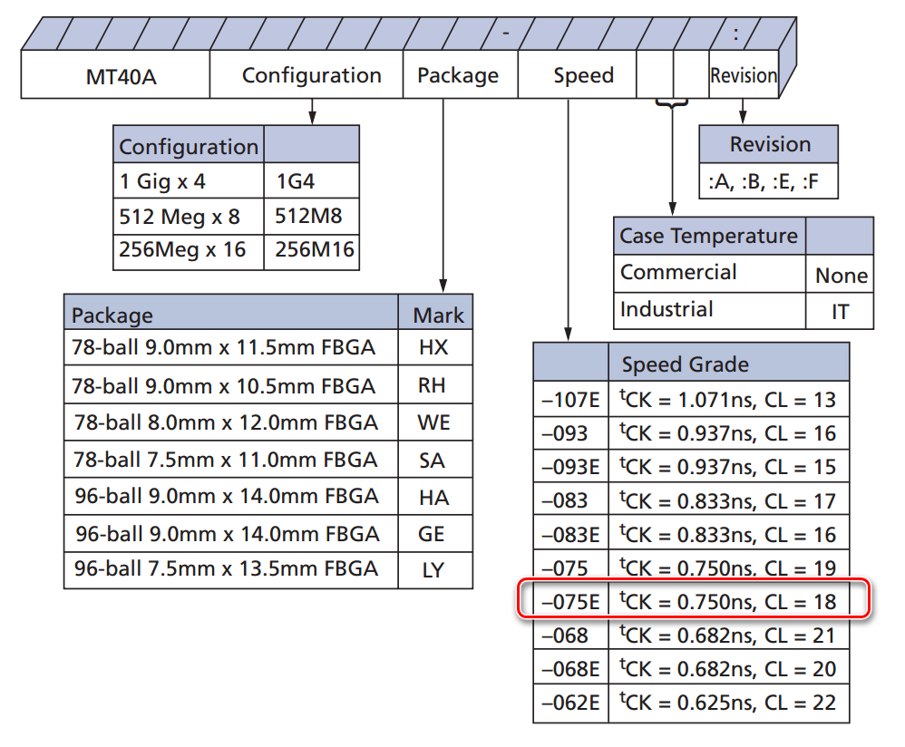

IP配置不同处如下，其它配置项保持默认：

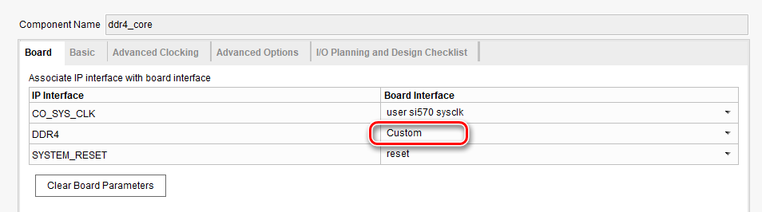

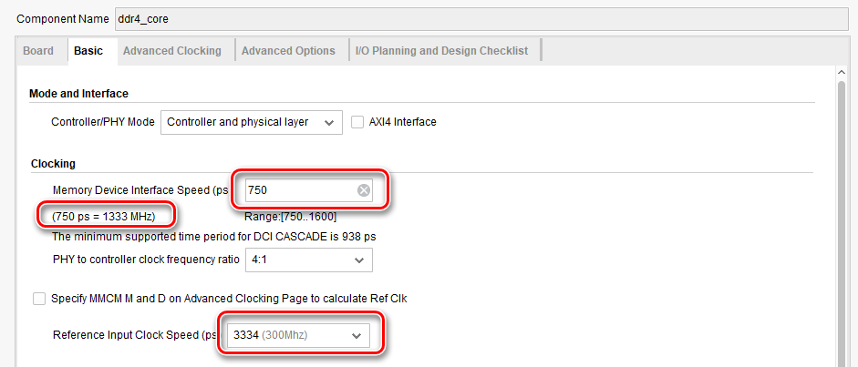

