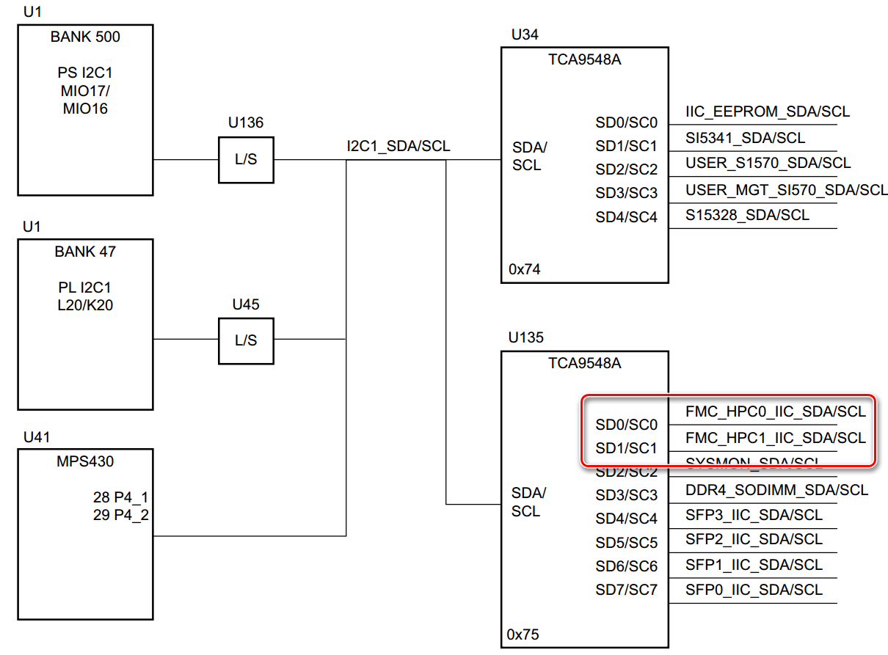
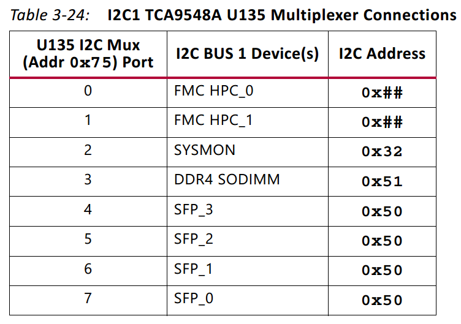
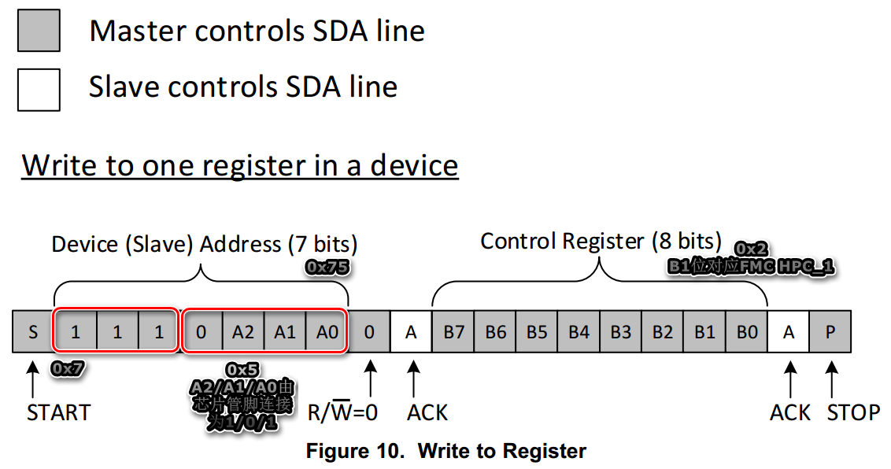
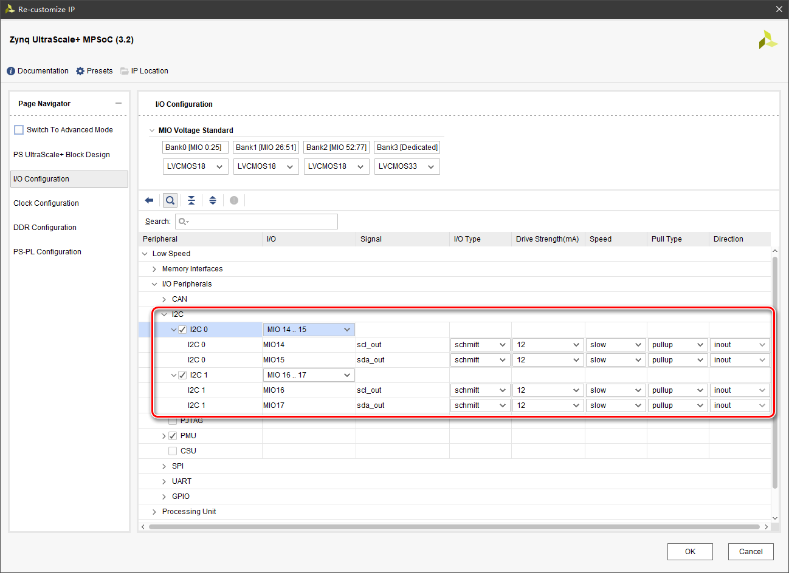
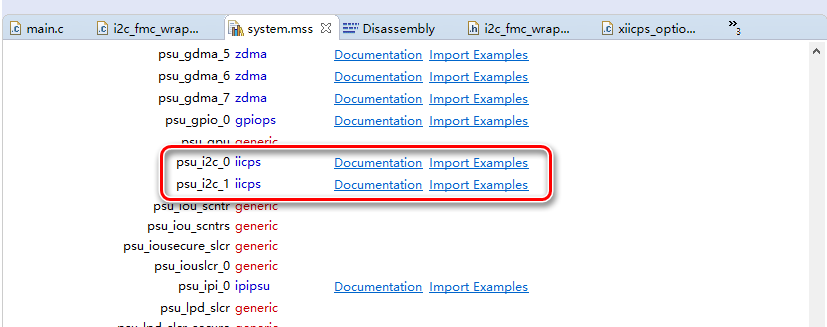

根据 ug1182，zcu102 板卡上 PS 连接 2 个 I2C 接口，分别是 I2C0(MIO 14-15) 和 I2C1(MIO 16-17)。

本试验使用 I2C1 通过 zcu102 板卡的 FMC HPC1 接口连接外设，PS 作为 I2C Master，外设作为 I2C Slave。

# I2C 接口说明

由于 PS 程序通过 API 封装函数使用 I2C 接口，因此本文不再详述 I2C 接口时序，仅描述 I2C 通信原理。

I2C 由 SCL 和 SDA 2 条双向接口连接 Master 和 Slave，一般情况下是 1 个 Master 连接多个 Slave，以字节（8 bit）为单位传输数据。

每个 Slave 通过自身配置 （内部寄存器或者外部管脚连接）的 Slave Address（或称片选地址），供 Master 在多个 Slave 中选择 1 个通信对象。

片选地址一般情况下为 7 bit，在其最低位补上 1 bit 的读写标记位，就构成1次读或写传输中 I2C Master 向 Slave 发送的首个字节，在 Master 收到对应片选地址 Slave 的正常响应后，Master 或者 Slave 向对方发送数据。由于 Master 主控传输流程，具体传输数据内容的解析根据 Slave 的内部逻辑决定。

**需要特别注意：片选地址在 Xilinx 的相关文档及 PS API 函数中都被定义为前述的 7 bit 数值，而在许多外设的手册中 I2C 片选地址被描述为最低位补 1 bit 0 值的8 bit 字节。例如外设手册中的片选地址 0x20，在 PS API 函数中应当使用 0x20>>1 作为片选地址。**

## I2C 写流程

**字节数据的解析根据 Slave 的内部逻辑决定，一般情况是前几个字节是写入数据的寄存器地址，后几个字节是写入对应寄存器的数据；对于只有单个寄存器的 Slave 外设或者处理流数据的外设，发送的字节数据中没有地址。具体应当参考外设手册。**

1. Master 发送写标记的片选字节，并得到 Slave 的响应。
2. Master 向 Slave 发送若干字节数据。

**注意：放多外设手册甚至 Xilinx 文档都容易混淆片选地址和寄存器地址，区分的方法是在描述 I2C 接口时使用的 Address 一般是指片选地址，寄存器地址完全是 Slave 的内部逻辑功能与 Master 无关。**

## I2C 读流程

读流程由 Slave 内部逻辑决定，以下流程仅针对一般情况下的寄存器数据读取。

1. Master 发送写标记的片选字节，并得到 Slave 的响应。
2. Master 向 Slave 发送读寄存器地址的字节数据。
3. Master 发送读标记的片选字节，并得到 Slave 的响应。
4. Master 等待接收 Slave 返回的对应寄存器地址读出的字节数据。

# zcu102 I2C1 的路由控制

根据 ug1182 的说明，PS 的 I2C1 接口通过 I2C 路由芯片 TCA9548A 实现单个 Master 接口对多个 Slave 的路由。



路由配置及外设地址如下表所示：



上表中的 Addr 和 Address 全部指片选地址。至于 FMC HPC_0 和 FMC HPC_1 的 0x## 地址，表示片先地址由连接该 FMC 接口的 Slave 外设自身配置决定。

参考路由芯片 TCA9548A 的手册说明，该芯片仅有单个 8 bit 寄存器，由低位至高位的数值 1 分别表示 Table 3-24 中对应 Slave 的连通，比如连接 FMC HPC_1，可以使用下图所示的配置：



在完成路由芯片的配置后，I2C1 通过 FMC HPC_1 连接外设的片选地址进行 I2C 通信。

# 配置 Block Design 中的 Zynq 模块

按之前文档所述的方法建立 Vivado 工程，添加 Block Design 后，在 Block Design 中加入 Zynq 模块，使用 Run Block Automation 或者手动配置 I2C 接口如下图所示：



注意：**在 SDK 中建立 FSBL 工程时，必须在 PS 配置中使能 I2C0 接口**。

# PS 工程

根据之前文档的说明建立 PS 工程，打开 BSP 工程的 system.mss 文件导入示例工程用于 PS API 参考



配置路由芯片的代码如下：

```c
XIicPs i2c1;
u8 i2c_switch_reg = 2;
status = XIicPs_MasterSendPolled(&i2c1, &i2c_switch_reg, 1, 0x75);
if (status != XST_SUCCESS)
{
	return XST_FAILURE;
}
while (XIicPs_BusIsBusy(&i2c1))
{
	//等待接口写入完成
}
```

片选地址为 0x20 的 Slave 外设，使用 16 bit 寄存器地址和 2 字节寄存器数据

Slave 写读寄存器操作

```c
u8 slave_addr = 0x20 >> 1;//8位片选地址右移1位转化为7位片选地址
u8 buf[4];//发送I2C字节数据，顺序由buf[0]至buf[3]
u16 register_addr = 0x3002;//寄存器地址
u16 register_data = 0xABCD;//寄存器数据

buf[0] = register_addr >> 8;//寄存器地址高8位
buf[1] = register_addr & 0xFF;//寄存器地址低8位
buf[2] = register_data >> 8;//寄存器数据高8位
buf[3] = register_data & 0xFF;//寄存器数据低8位

int status;

//向寄存器写入数据*************************************************
status = XIicPs_MasterSendPolled(&i2c1, buf, 4, slave_addr);
if (status != XST_SUCCESS)
{
	return XST_FAILURE;
}
while (XIicPs_BusIsBusy(&i2c1))
{
	//等待接口写入完成
}

//从寄存器读出数据*************************************************

//向slave写入2字节读寄存器地址
status = XIicPs_MasterSendPolled(&i2c1, buf, 2, slave_addr);
if (status != XST_SUCCESS)
{
	return XST_FAILURE;
}
while (XIicPs_BusIsBusy(&i2c1))
{
	//等待接口写入完成
}

//向slave发送读指令
status = XIicPs_MasterRecvPolled(&i2c1, &(buf[2]), 2, slave_addr);
if (status != XST_SUCCESS)
{
	return XST_FAILURE;
}
while (XIicPs_BusIsBusy(&i2c1))
{
	//等待接口读出完成
}

register_data = buf[2];
register_data = (register_data << 8) | buf[3];
```

