# 建立工程

参考之前的文档建立基于zcu102的Vivado工程，名称为zynq_1

# Block Design

在Flow Navigator > IP Integrator，选择Create Block Design

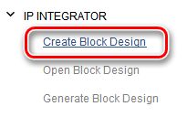

在弹出窗口输入名称

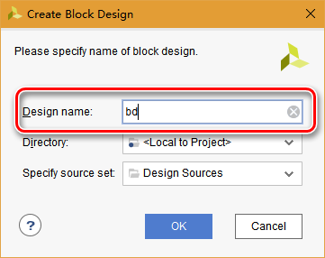

在打开的Diagram界面选择Add IP

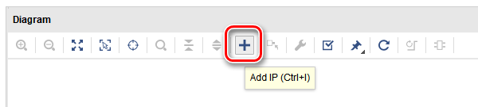

在弹出的IP搜索窗口选择Zynq UltraScale+ MPSoc，并且双击添加

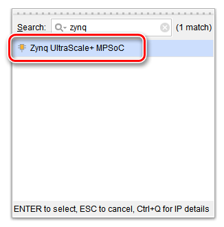

Diagram界面出现zynq模块

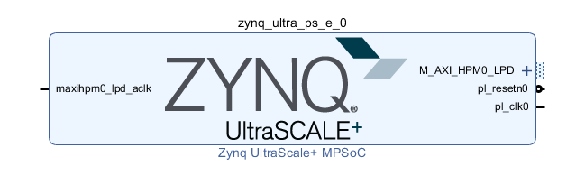

在Diagram界面顶端点击Run Block Automation

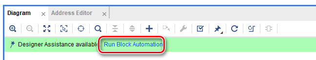

保持默认配置点击OK

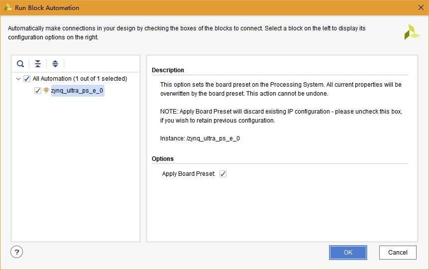

双击zynq模块打开配置窗口，在PS-PL Configuration页，关闭AXI HPM0 FPD和AXI HPM1 FPD

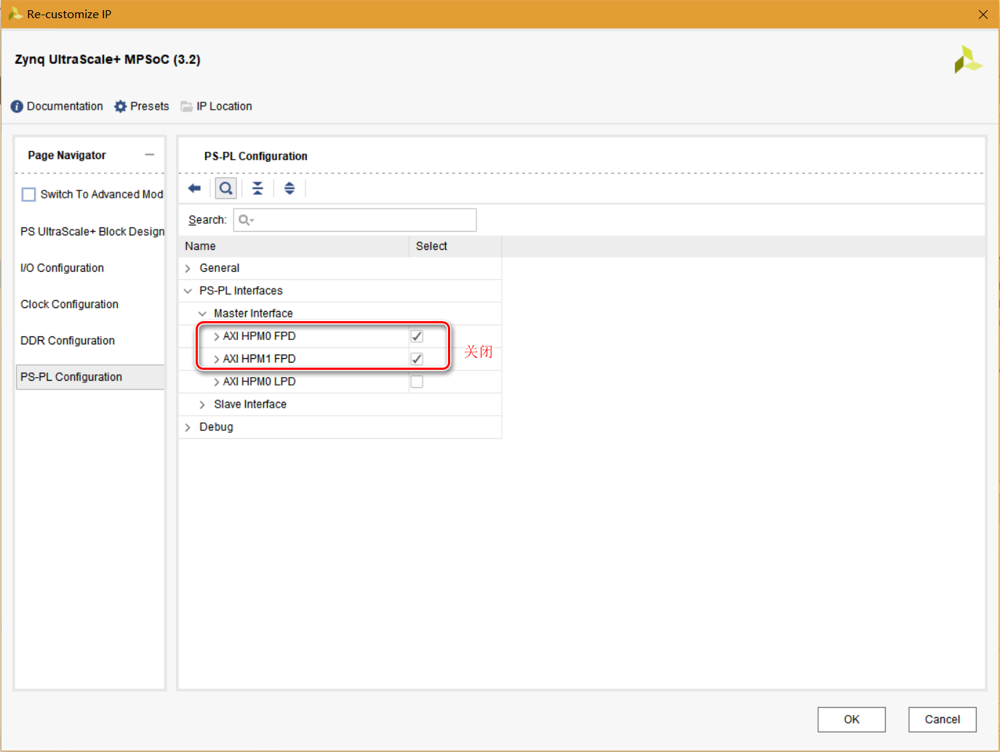

Diagram界面下，zynq模块变成如下

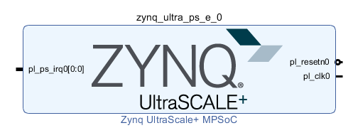

在Sources窗口右击Block Design模块，在弹出菜单中选择Generate Output Products

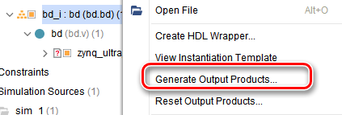

完成后，在弹出菜单中选择Create HDL Wrapper，完成后Sources窗口内容如下

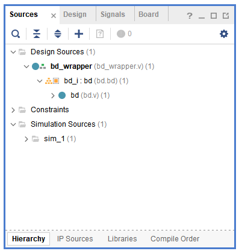

在Flow Navigator > PROGRAM AND DEBUG选择Generate Bitstream

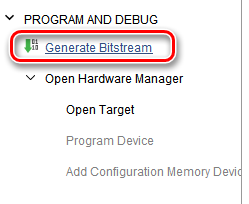

完成后在Vivado的File菜单，选择Export > Export Hardware，按默认设置点击OK

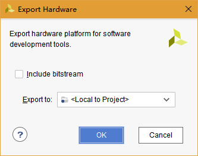

该操作在工程文件夹下建立zynq_1.sdk文件夹，并在其中建立bd_wrapper.hdf文件

完成后在File菜单，选择Launch SDK，在弹出窗口选择OK

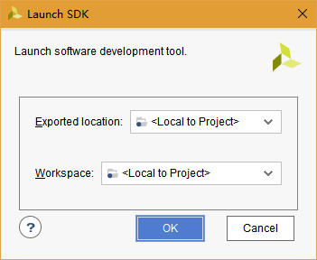

# SDK

SDK开启后，在File菜单，选择New > Application Project

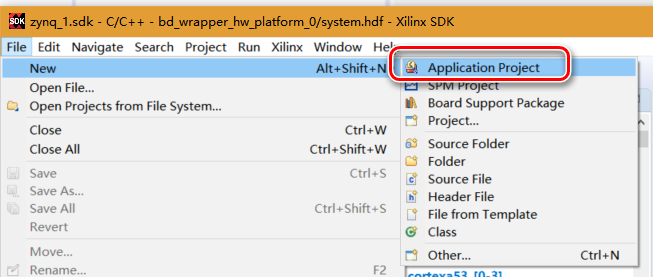

在弹出的New Project窗口如下图设置

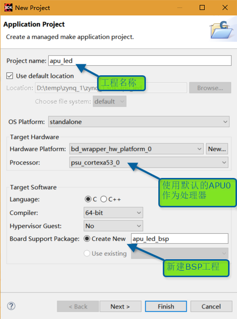

点击Next之后，选择Empty Application后，点击Finish

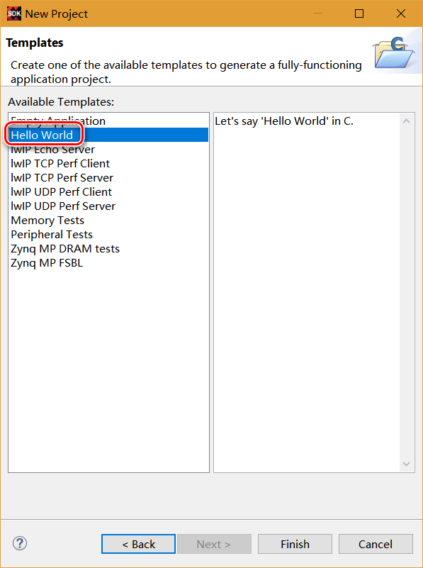

*如果需要查找gpio用法，可以在system.mss的Peripheral Drivers中找到psu_gpio_0，打开Documentation或者Import Examples*

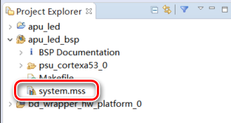

在Project Explorer中，打开apu_led工程的helloworld.c文件

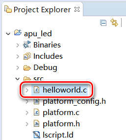

替换原有代码为以下：

```c
#include "xparameters.h"
#include "xgpiops.h"
#include "sleep.h"

XGpioPs Gpio;

int main(void)
{
	int Status;
	XGpioPs_Config *ConfigPtr;

	//根据ID，查找配置
	//参数来源于xparameters.h
	ConfigPtr = XGpioPs_LookupConfig(XPAR_XGPIOPS_0_DEVICE_ID);
    if (ConfigPtr == NULL)
	{
		return XST_FAILURE;
	}

	//初始化
	//根据配置初始化gpio对象
	Status = XGpioPs_CfgInitialize(&Gpio, ConfigPtr, ConfigPtr->BaseAddr);
	if (Status != XST_SUCCESS)
	{
		return XST_FAILURE;
	}

	//根据ug1182，按钮位于MIO22，LED位于MIO23

	//设置按钮MIO22的gpio方向
	//22表示MIO22，0表示方向为输入
	XGpioPs_SetDirectionPin(&Gpio, 22, 0);

	//设置LED MIO23的gpio方向
	//23表示MIO23，1表示方向为输出
	XGpioPs_SetDirectionPin(&Gpio, 23, 1);
	//使用MIO23的输出（默认为非使能）
	XGpioPs_SetOutputEnablePin(&Gpio, 23, 1);

	//LED值，1表示点亮，0表示关闭
	u32 led = 1;

	//工作循环
	while (TRUE)
	{
		//点亮LED
		XGpioPs_WritePin(&Gpio, 23, led);
		//持续1秒
		sleep(1);
//		//关闭LED
//		XGpioPs_WritePin(&Gpio, 23, 0);
//		//持续1秒
//		sleep(1);

		//读按钮，按下则点亮LED，若抬起则关闭
		led = XGpioPs_ReadPin(&Gpio, 22);
	}
}
```

在apu_led工程上右键选择编译

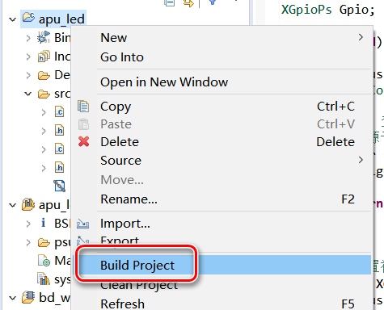

编译通过后选择运行

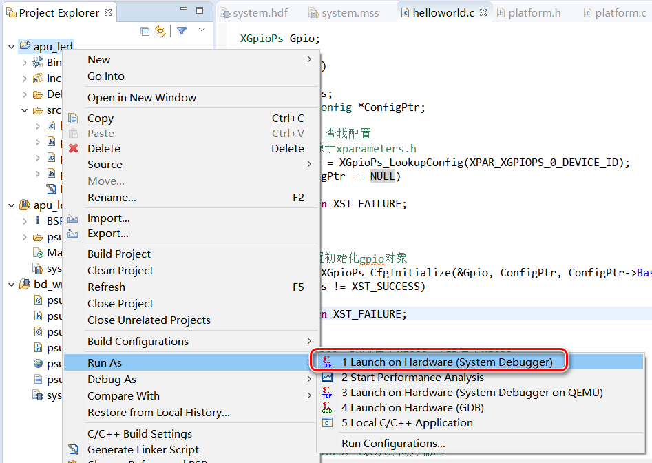

测试发现代码功能运行正常，按下按钮后LED点亮，抬起按钮则LED关闭

由于ug1182未明确标出按钮和LED的位置，下方图片供参考

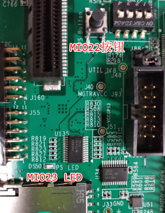

