# EMIO

EMIO是由PS负责控制，由PL负责连接管脚的GPIO

具体说明见ug1085的General Purpose I/O章节

根据Zynq MPSOC的设计，EMIO占用GPIO BANK3至5的全部32位，对应GPIO的序号78至174，共96个EMIO

但是在PS模块中引出的PL中断会默认占用高序号值的EMIO，如本实验中PS模块的pl_resetn0复位信号占用了序号174的EMIO

# Block Design

建立Vivado工程，建立Block Design

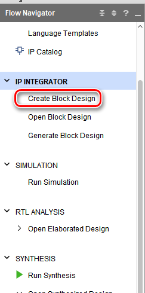


添加Zynq UltraScale+ MPSoC模块

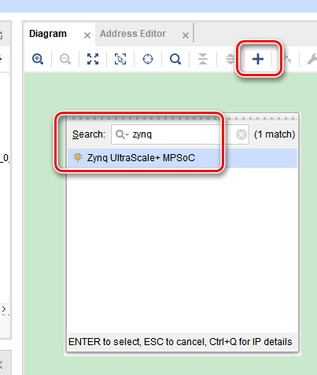

双击Zynq模块打开设置，并关闭不使用的默认配置项

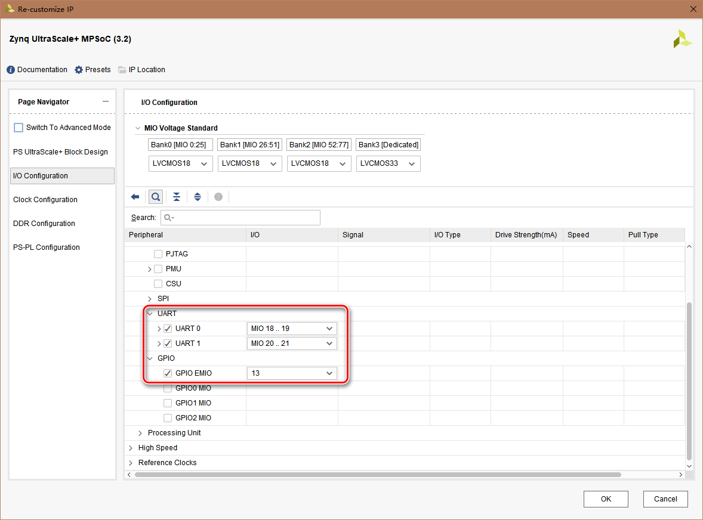

UART用于标准IO输出，与主机通过串口连接查看程序运行状况

注意与zcu102的UART管脚对应，只有上图中的MIO序号才能正确与主机串口连接

GPIO EMIO设置引出的EMIO接口数目，从低序号至高序号

当前的配置引出13个EMIO接口，对应GPIO序号为78至90

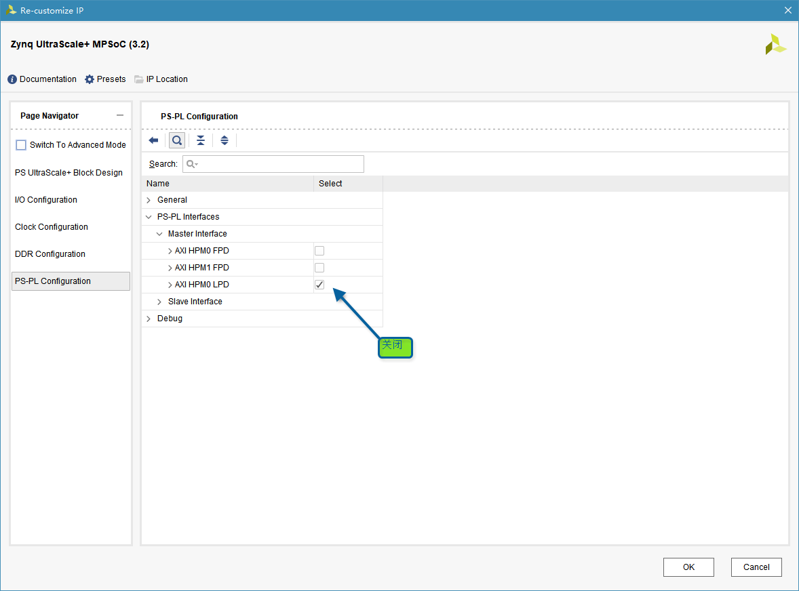

配置完成后Zynq模块出现GPIO_0的端口，*注意端口总线[12:0]对应GPIO序号[90:78]*

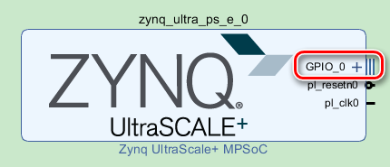

右键点击GPIO_0端口，选择Make External，用于在PL定义管脚约束

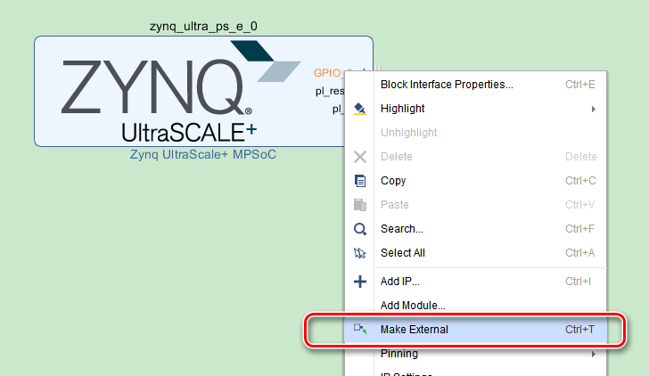

完成Block Design如下图所示

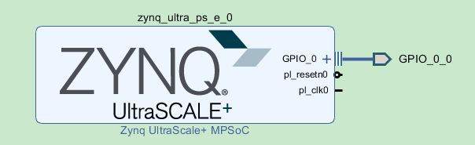

在Sources窗口，右键点击Block Design，选择Generate Output Products，在弹出窗口中配置并选择Generate

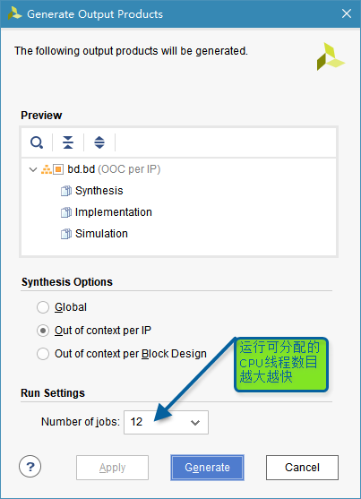

完成后右键点击Block Design，选择Create HDL Wrapper，给Block Design封装顶层HDL模块

按默认配置完成后Sources窗口如下

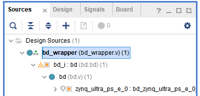

在Flow Navigator中选择Run Synthesis，完成后选择Open Synthesized Design

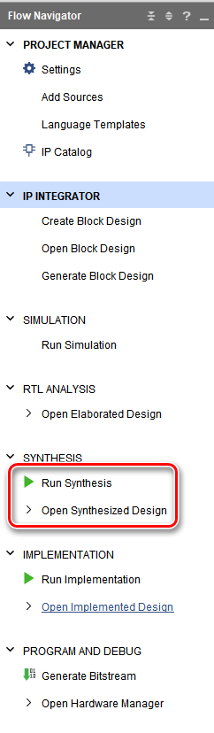

打开综合结果后，在Layout菜单选择I/O Planning

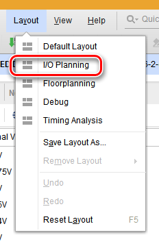

在I/O Ports窗口设置管脚和电平，参考ug1182

低8位为LED，高5位为按钮

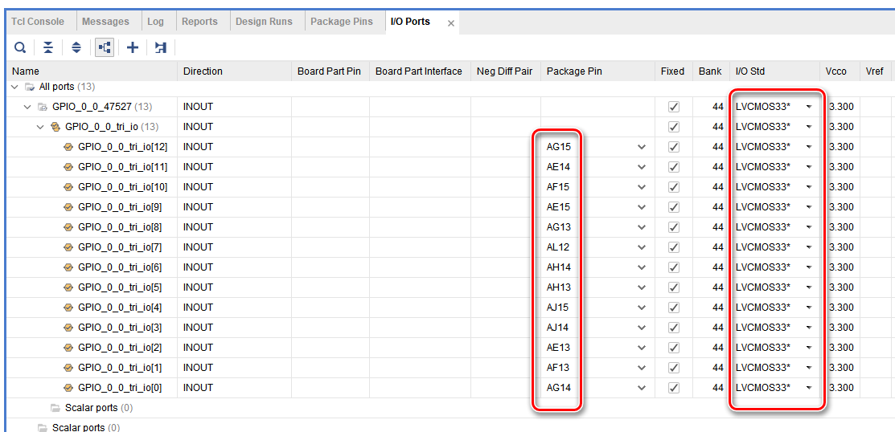

保存后，根据提示添加约束文件top.xdc

在Flow Navigator中选择Generate Bitstream

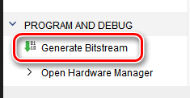

结束后在File菜单选择Export Hardware，之后选择Launch SDK

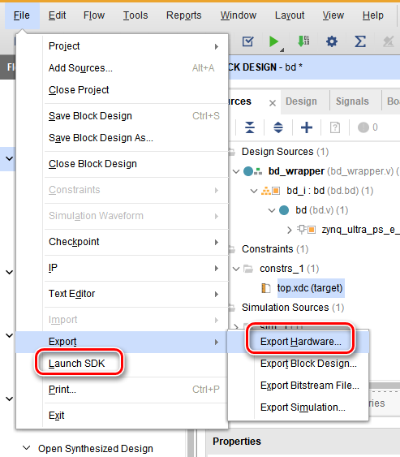

注意Export Hardware的弹出窗口选择Include Bitstream，方便SDK中加载Bit文件，否则得在SDK中手动查找

# SDK

打开SDK后在File菜单选择建立工程

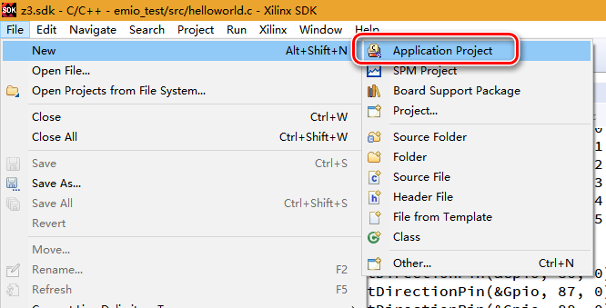

在弹出窗口中建立HelloWorld模板工程

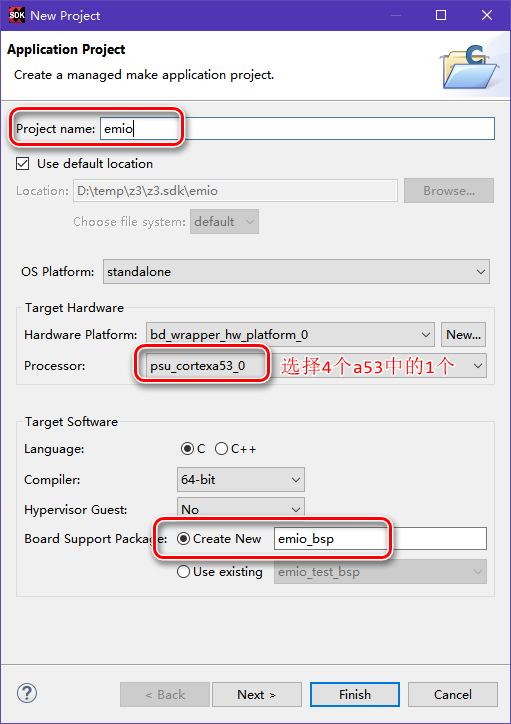

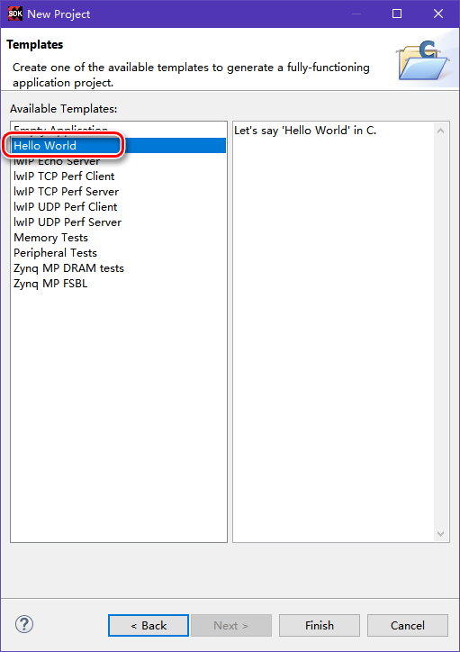

在生成的emio_test工程中双击打开helloworld.c文件进行编程

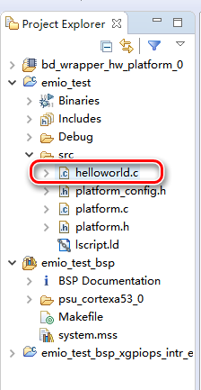

在PS程序中抓取按钮状态有2种方式：轮询（Poll）和中断（Intr）

2种方式的代码在本文最下方，实现按钮按下后对应LED点亮，按钮弹起后LED熄灭

完成代码后在emio_test工程上右键菜单选择Run Configuration

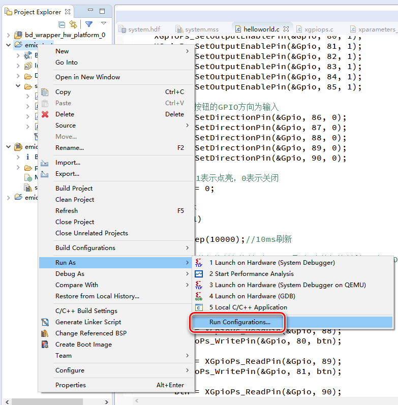

在System Debugger上右键选择New，建立新的配置，并且如下配置

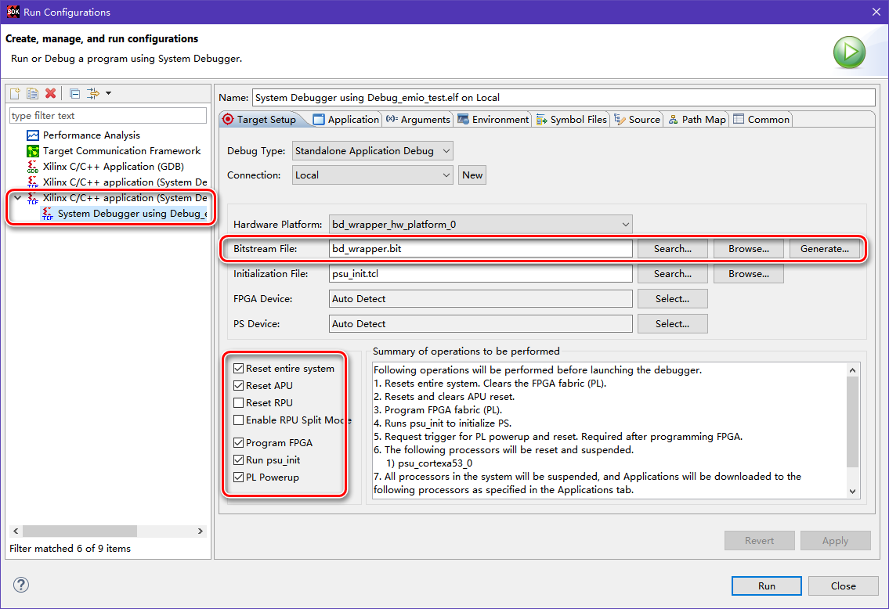

可以在此窗口选择Apply之后，按Run按钮运行，也可以在窗口关闭后，在工程上点击右键选择


Debug也可以用同样的方式设置，但是**Debug模式不会进入中断响应函数，只有Run才能正常中断**

## 轮询方式抓取按钮代码

```c
#include "xparameters.h"
#include "xgpiops.h"
#include "sleep.h"

XGpioPs Gpio;

int main(void)
{
	print("emio test begins");

	int Status;
	XGpioPs_Config *ConfigPtr;

	//根据ID，查找配置
	//参数来源于xparameters.h
	ConfigPtr = XGpioPs_LookupConfig(XPAR_XGPIOPS_0_DEVICE_ID);
    if (ConfigPtr == NULL)
	{
		return XST_FAILURE;
	}

	//初始化
	//根据配置初始化gpio对象
	Status = XGpioPs_CfgInitialize(&Gpio, ConfigPtr, ConfigPtr->BaseAddr);
	if (Status != XST_SUCCESS)
	{
		return XST_FAILURE;
	}

	//根据ug1085，EMIO的IO序号为78~173，对应95个EMIO

	//设置8个LED的GPIO方向为输出
	XGpioPs_SetDirectionPin(&Gpio, 78, 1);
	XGpioPs_SetDirectionPin(&Gpio, 79, 1);
	XGpioPs_SetDirectionPin(&Gpio, 80, 1);
	XGpioPs_SetDirectionPin(&Gpio, 81, 1);
	XGpioPs_SetDirectionPin(&Gpio, 82, 1);
	XGpioPs_SetDirectionPin(&Gpio, 83, 1);
	XGpioPs_SetDirectionPin(&Gpio, 84, 1);
	XGpioPs_SetDirectionPin(&Gpio, 85, 1);
	//使能8个LED的GPIO输出
	XGpioPs_SetOutputEnablePin(&Gpio, 78, 1);
	XGpioPs_SetOutputEnablePin(&Gpio, 79, 1);
	XGpioPs_SetOutputEnablePin(&Gpio, 80, 1);
	XGpioPs_SetOutputEnablePin(&Gpio, 81, 1);
	XGpioPs_SetOutputEnablePin(&Gpio, 82, 1);
	XGpioPs_SetOutputEnablePin(&Gpio, 83, 1);
	XGpioPs_SetOutputEnablePin(&Gpio, 84, 1);
	XGpioPs_SetOutputEnablePin(&Gpio, 85, 1);

	//设置5个按钮的GPIO方向为输入
	XGpioPs_SetDirectionPin(&Gpio, 86, 0);
	XGpioPs_SetDirectionPin(&Gpio, 87, 0);
	XGpioPs_SetDirectionPin(&Gpio, 88, 0);
	XGpioPs_SetDirectionPin(&Gpio, 89, 0);
	XGpioPs_SetDirectionPin(&Gpio, 90, 0);

	//LED值，1表示点亮，0表示关闭
	u32 btn = 0;

	//工作循环
	while (1)
	{
		usleep(10000);//10ms刷新

		//4个按钮控制各控制1个LED，最后1个按钮控制剩下4个LED
		btn = XGpioPs_ReadPin(&Gpio, 86);
		XGpioPs_WritePin(&Gpio, 78, btn);

		btn = XGpioPs_ReadPin(&Gpio, 87);
		XGpioPs_WritePin(&Gpio, 79, btn);

		btn = XGpioPs_ReadPin(&Gpio, 88);
		XGpioPs_WritePin(&Gpio, 80, btn);

		btn = XGpioPs_ReadPin(&Gpio, 89);
		XGpioPs_WritePin(&Gpio, 81, btn);

		btn = XGpioPs_ReadPin(&Gpio, 90);
		XGpioPs_WritePin(&Gpio, 82, btn);
		XGpioPs_WritePin(&Gpio, 83, btn);
		XGpioPs_WritePin(&Gpio, 84, btn);
		XGpioPs_WritePin(&Gpio, 85, btn);
	}

	print("emio test ends");
}
```

## 中断方式抓取按钮代码

中断实现主要参考SDK中的示例程序（可以通过BSP工程中的system.mss打开）

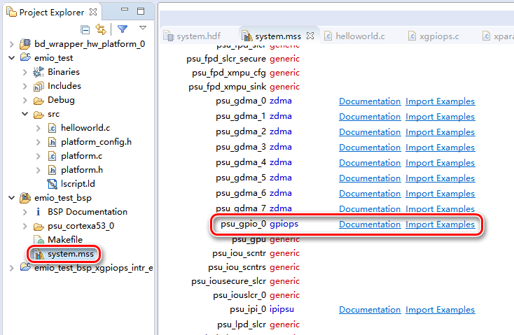

```c
#include "xparameters.h"
#include "xgpiops.h"
#include "sleep.h"
#include "xscugic.h"
#include "xil_exception.h"

XGpioPs Gpio;
XScuGic Intc;

//中断响应函数
static void IntrHandler(void *CallBackRef, u32 Bank, u32 Status)
{
	//XGpioPs_SetCallbackHandler连接中断响应函数时传入GPIO对象
	XGpioPs *Gpio = (XGpioPs *)CallBackRef;

	//LED值，1表示点亮，0表示关闭
	u32 btn = 0;

	//4个按钮控制各控制1个LED，最后1个按钮控制剩下4个LED
	btn = XGpioPs_ReadPin(Gpio, 86);
	XGpioPs_WritePin(Gpio, 78, btn);

	btn = XGpioPs_ReadPin(Gpio, 87);
	XGpioPs_WritePin(Gpio, 79, btn);

	btn = XGpioPs_ReadPin(Gpio, 88);
	XGpioPs_WritePin(Gpio, 80, btn);

	btn = XGpioPs_ReadPin(Gpio, 89);
	XGpioPs_WritePin(Gpio, 81, btn);

	btn = XGpioPs_ReadPin(Gpio, 90);
	XGpioPs_WritePin(Gpio, 82, btn);
	XGpioPs_WritePin(Gpio, 83, btn);
	XGpioPs_WritePin(Gpio, 84, btn);
	XGpioPs_WritePin(Gpio, 85, btn);
}

int main(void)
{
	print("emio test begins");

	int Status;
	XGpioPs_Config *ConfigPtr;

	//根据ID，查找配置
	//参数来源于xparameters.h
	ConfigPtr = XGpioPs_LookupConfig(XPAR_XGPIOPS_0_DEVICE_ID);
    if (ConfigPtr == NULL)
	{
		return XST_FAILURE;
	}

	//初始化
	//根据配置初始化gpio对象
	Status = XGpioPs_CfgInitialize(&Gpio, ConfigPtr, ConfigPtr->BaseAddr);
	if (Status != XST_SUCCESS)
	{
		return XST_FAILURE;
	}

	//根据ug1085，EMIO的IO序号为78~173，对应95个EMIO

	//设置8个LED的GPIO方向为输出
	XGpioPs_SetDirectionPin(&Gpio, 78, 1);
	XGpioPs_SetDirectionPin(&Gpio, 79, 1);
	XGpioPs_SetDirectionPin(&Gpio, 80, 1);
	XGpioPs_SetDirectionPin(&Gpio, 81, 1);
	XGpioPs_SetDirectionPin(&Gpio, 82, 1);
	XGpioPs_SetDirectionPin(&Gpio, 83, 1);
	XGpioPs_SetDirectionPin(&Gpio, 84, 1);
	XGpioPs_SetDirectionPin(&Gpio, 85, 1);
	//使能8个LED的GPIO输出
	XGpioPs_SetOutputEnablePin(&Gpio, 78, 1);
	XGpioPs_SetOutputEnablePin(&Gpio, 79, 1);
	XGpioPs_SetOutputEnablePin(&Gpio, 80, 1);
	XGpioPs_SetOutputEnablePin(&Gpio, 81, 1);
	XGpioPs_SetOutputEnablePin(&Gpio, 82, 1);
	XGpioPs_SetOutputEnablePin(&Gpio, 83, 1);
	XGpioPs_SetOutputEnablePin(&Gpio, 84, 1);
	XGpioPs_SetOutputEnablePin(&Gpio, 85, 1);

	//设置5个按钮的GPIO方向为输入
	XGpioPs_SetDirectionPin(&Gpio, 86, 0);
	XGpioPs_SetDirectionPin(&Gpio, 87, 0);
	XGpioPs_SetDirectionPin(&Gpio, 88, 0);
	XGpioPs_SetDirectionPin(&Gpio, 89, 0);
	XGpioPs_SetDirectionPin(&Gpio, 90, 0);

	//设置按钮的GPIO中断

	//查找中断配置
	XScuGic_Config *IntcConfig;
	IntcConfig = XScuGic_LookupConfig(XPAR_SCUGIC_SINGLE_DEVICE_ID);
	if (NULL == IntcConfig)
	{
		return XST_FAILURE;
	}

	//中断初始化
	Status = XScuGic_CfgInitialize(&Intc, IntcConfig, IntcConfig->CpuBaseAddress);
	if (Status != XST_SUCCESS)
	{
		return XST_FAILURE;
	}

	//连接GPIO中断处理函数XGpioPs_IntrHandler，由此函数分发中断至自定义的GPIO中断函数
	//GPIO中断ID定义在xparameters_ps.h
	Status = XScuGic_Connect(&Intc, XPAR_XGPIOPS_0_INTR, (Xil_ExceptionHandler)XGpioPs_IntrHandler, (void *)&Gpio);
	if (Status != XST_SUCCESS)
	{
		return Status;
	}

	//中断控制器中使能GPIO中断
	XScuGic_Enable(&Intc, XPAR_XGPIOPS_0_INTR);

	//使能硬件中断
	Xil_ExceptionInit();
	Xil_ExceptionRegisterHandler(XIL_EXCEPTION_ID_INT, (Xil_ExceptionHandler)XScuGic_InterruptHandler, &Intc);
	Xil_ExceptionEnable();

	//设置GPIO中断类型
	//根据ug1085，当前按钮全位于BANK3
	//后3个参数全是32位掩码，每一位对应当前BANK的1个GPIO接口
	//最后1个参数设置上升沿和下降沿都中断，此时倒数第2个参数无效
	XGpioPs_SetIntrType(&Gpio, XGPIOPS_BANK3, 0xFFFFFFFF, 0x00000000, 0xFFFFFFFF);

	//连接自定义的GPIO中断响应函数
	XGpioPs_SetCallbackHandler(&Gpio, (void *)&Gpio, IntrHandler);

	//使用5个按钮的GPIO中断
	//根据ug1085，当前按钮全位于BANK3
	//根据ug1085，找到按钮位于当前BANK中的位置[12:8]
	XGpioPs_IntrEnable(&Gpio, XGPIOPS_BANK3, 0b1111100000000);

	//工作循环无操作
	while (1)
	{
		;
	}

	print("emio test ends");
}
```

