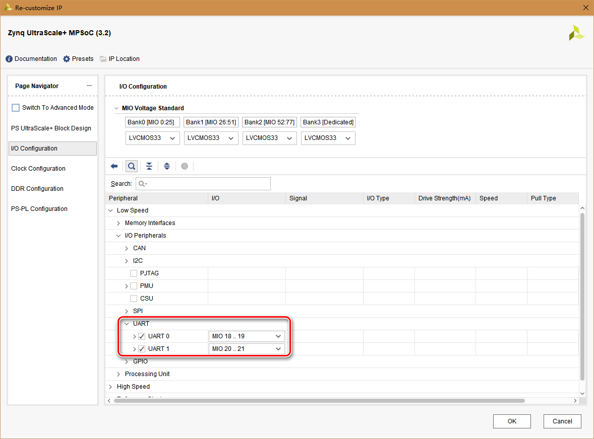
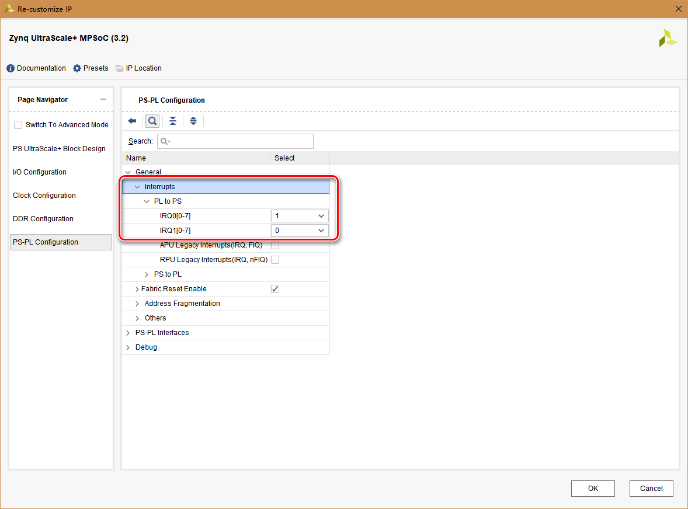
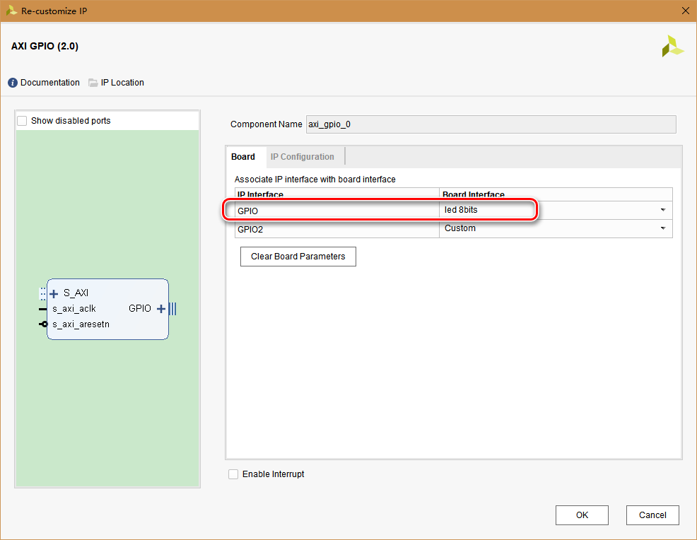
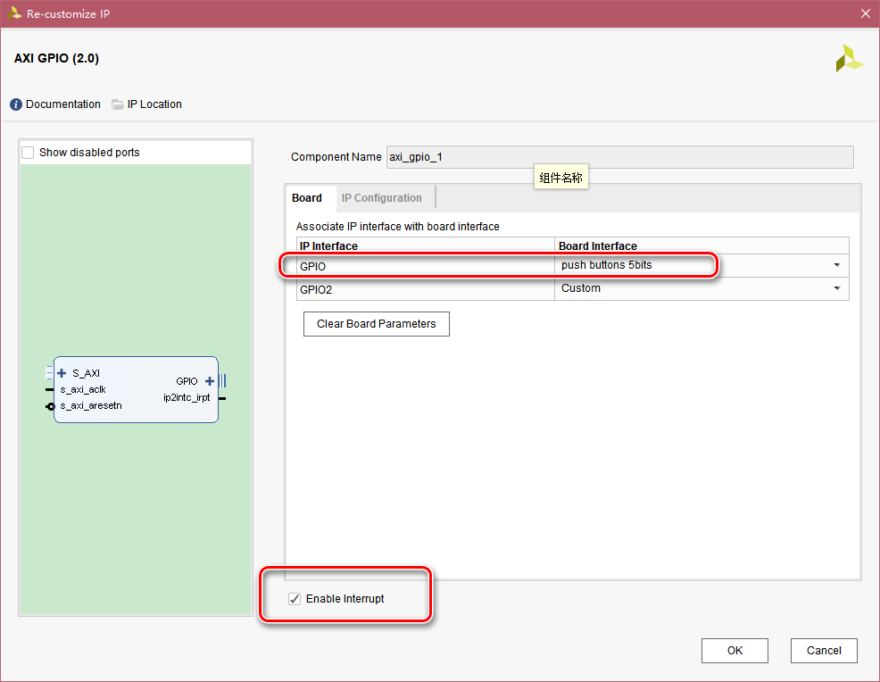
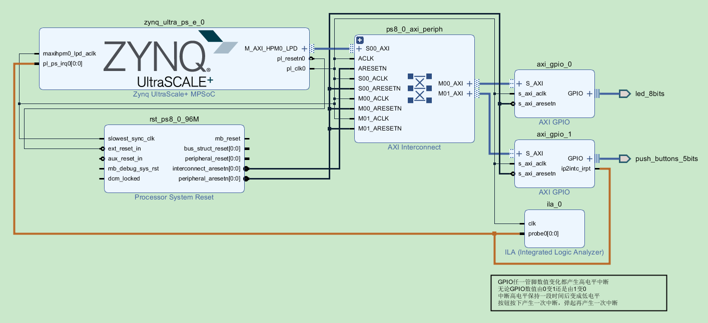
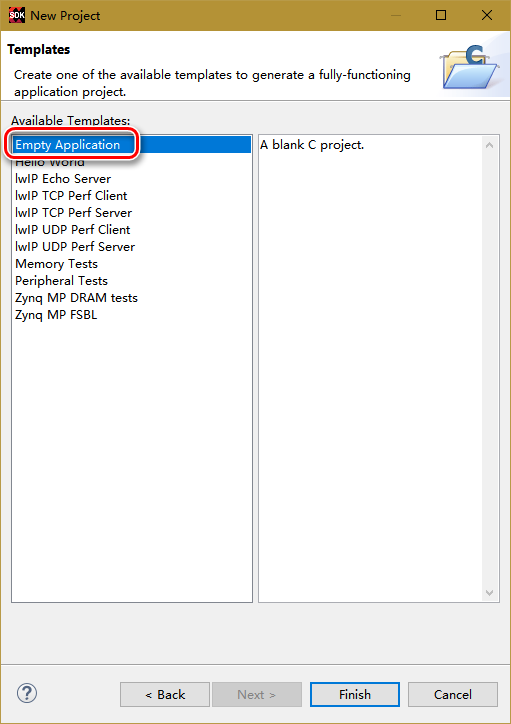
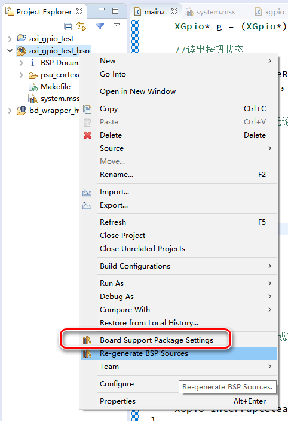
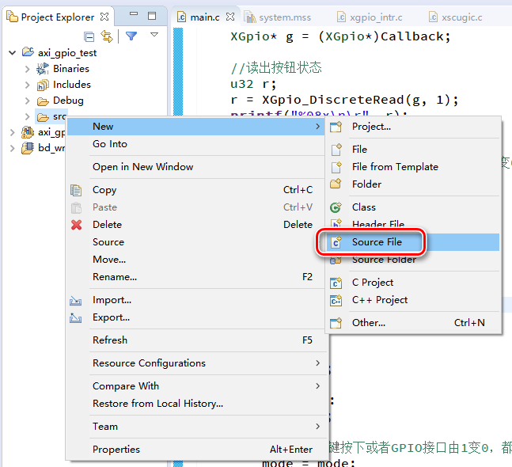
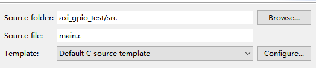

# AXI_GPIO

AXI GPIO模块将PL端连接的GPIO信号通过AXI接口与PS模块连接，PS通过AXI接口的地址映射对PL端的GPIO信号进行读写等控制

与EMIO可以实现相同的功能，区别主要在于EMIO对于少数GPIO接口进行单独的控制，而AXI GPIO可以对多个GPIO接口合并成的总线进行整体读写控制

# Block Design

建立zcu102的Vivado工程，建立Block Design，添加zynq模块，2个AXI GPIO模块和1个ILA模块（用于debug）

zynq模块保持默认设置并添加uart0，uart1用于串口调试，以及pl至ps的中断用于响应按钮操作





其实1个axi_gpio模块可以定义2个GPIO通道独立工作，为了演示操作，本试验使用的2个axi_gpio模块都只使用其中1个通道

配置图中GPIO通道在SDK编程的API函数中被认为是1通道，GPIO2通道在API中被认为是2通道

将axi_gpio_0模块双击设置为led输出，使用Board Interface可以不用手动添加管脚约束



将axi_gpio_1模块设置为按钮输入，使用Board Interface可以不用手动添加管脚约束



使能中断会添加ip2intc_irpt端口，将此端口连接至PS模块的PL中断输入端口即可在SDK中响应当前axi_gpio模块的中断

**注意：axi_gpio的中断会在任一GPIO接口数值变化时产生一段时间的高电平，无论数值由0变1还是由1变0，因此按钮按下并弹起实际会产生2次中断的高电平**

ILA模块的添加即用于验证上述说明，

使用Block Design的自动连线及手动连线后，Block Design内容如下图所示：



对Block Design先Generate Output Products，再Create HDL Wrapper

在Flow Navigator中选择Generate Bitstream，直到完成（由于使用Board Interface配置2个axi_gpio，因此不用进行手动管脚约束）

在File菜单选择Export Hardware，勾选Include Bitstream

之后在File菜单选择Launch SDK

# SDK

进入SDK后，以Empty Application模板建立工程（为演示操作才选Empty，HelloWorld模板更方便）



在BSP工程上点击右键，选择Board Support Package Settings



在standalone页设置标准输入输出为uart0，用于串口调试


在axi_gpio_test工程的src文件夹上右键选择新建source file



在弹出窗口中设置源文件名和生成模板，注意文件名需要加上.c扩展名，模板选择C source



双击打开建立的main.c文件，写入代码

具体编程原理可以查看代码注释或者从BSP工程的system.mss文件导入示例工程查看

```c
#include <stdio.h>
#include "xparameters.h"
#include "xgpio.h"
#include "sleep.h"
#include "xscugic.h"
#include "xil_exception.h"

//在中断中赋值控制LED闪烁模式
//中断中控制的标志变量用volatile声明表示不用cache
volatile u8 mode = 0;

//中断函数声明为static，可以加快速度
static void handler_btn(void* Callback)
{
	//在XScuGic_Connect设置XGpio对象指针作为参数送入
	XGpio* g = (XGpio*)Callback;

	//读出按钮状态
	u32 r;
	r = XGpio_DiscreteRead(g, 1);
	printf("%08x\n\r", r);

	//设置工作模式
	//由于AXI GPIO中断无论接口由0变1还是由1变0都会产生高电平中断给PS，根据当前逻辑不能响应接口由1变0的中断
	switch (r)
	{
	case 0b1:
		mode = 0;
		break;
	case 0b10:
		mode = 1;
		break;
	case 0b100:
		mode = 2;
		break;
	case 0b1000:
		mode = 3;
		break;
	case 0b10000:
		mode = 4;
		break;
	default://多键按下或者GPIO接口由1变0，都不响应
		mode = mode;
		break;
	}

	//清除全部中断
	XGpio_InterruptClear(g, 0b11111);
}

int main(void)
{
	int sta = -1;

	//初始化GPIO0
	//ID在xparameters.h中定义，查找/* Definitions for driver GPIO */
	XGpio g0;
	sta = XGpio_Initialize(&g0, XPAR_AXI_GPIO_0_DEVICE_ID);
	if (sta != XST_SUCCESS)
	{
		return XST_FAILURE;
	}

	//设置GPIO0，1通道每一位的传输方向为输出
	//在vivado中已设置为8位LED输出
	XGpio_SetDataDirection(&g0, 1, 0);

	//初始化GPIO1
	//ID在xparameters.h中定义，查找/* Definitions for driver GPIO */
	XGpio g1;
	sta = XGpio_Initialize(&g1, XPAR_AXI_GPIO_1_DEVICE_ID);
	if (sta != XST_SUCCESS)
	{
		return XST_FAILURE;
	}

	//设置GPIO1，1通道每一位的传输方向为输入
	//在vivado中已设置为5位按钮输入
	XGpio_SetDataDirection(&g1, 1, 0b11111);

	//设置GPIO1的中断
	XScuGic intc;
	XScuGic_Config* intc_conf;

	//查找中断设置
	intc_conf = XScuGic_LookupConfig(XPAR_SCUGIC_SINGLE_DEVICE_ID);
	if (intc_conf == NULL)
	{
		return XST_FAILURE;
	}

	//中断初始化
	sta = XScuGic_CfgInitialize(&intc, intc_conf, intc_conf->CpuBaseAddress);
	if (sta != XST_SUCCESS)
	{
		return XST_FAILURE;
	}

	//由PS模块的PL中断输入口接入的中断必须设置优先级与中断响应模式
	//0x3表示设置为上升沿触发
	XScuGic_SetPriorityTriggerType(&intc, XPAR_FABRIC_AXI_GPIO_1_IP2INTC_IRPT_INTR, 0xA0, 0x3);

	//连接中断控制函数
	//中断序号在xparameters.h中查找/* Definitions for Fabric interrupts connected to psu_acpu_gic */
	sta = XScuGic_Connect(&intc, XPAR_FABRIC_AXI_GPIO_1_IP2INTC_IRPT_INTR, (Xil_ExceptionHandler)handler_btn, &g1);
	if (sta != XST_SUCCESS)
	{
		return XST_FAILURE;
	}

	//中断控制器中使能GPIO中断
	XScuGic_Enable(&intc, XPAR_FABRIC_AXI_GPIO_1_IP2INTC_IRPT_INTR);

	//使能硬件中断
	Xil_ExceptionInit();
	Xil_ExceptionRegisterHandler(XIL_EXCEPTION_ID_INT, (Xil_ExceptionHandler)XScuGic_InterruptHandler, &intc);
	Xil_ExceptionEnable();

	//axi gpio使能中断
	//必须使用下方2个语句
	XGpio_InterruptEnable(&g1, 0b11111);//使能全部5个按钮的中断
	XGpio_InterruptGlobalEnable(&g1);

	while (1)
	{
		switch (mode)//选择5种闪烁模式
		{
		case 0:
			XGpio_DiscreteWrite(&g0, 1, 0b00000001);
			usleep(100000);
			XGpio_DiscreteWrite(&g0, 1, 0b00000010);
			usleep(100000);
			XGpio_DiscreteWrite(&g0, 1, 0b00000100);
			usleep(100000);
			XGpio_DiscreteWrite(&g0, 1, 0b00001000);
			usleep(100000);
			XGpio_DiscreteWrite(&g0, 1, 0b00010000);
			usleep(100000);
			XGpio_DiscreteWrite(&g0, 1, 0b00100000);
			usleep(100000);
			XGpio_DiscreteWrite(&g0, 1, 0b01000000);
			usleep(100000);
			XGpio_DiscreteWrite(&g0, 1, 0b10000000);
			usleep(100000);
			break;
		case 1:
			XGpio_DiscreteWrite(&g0, 1, 0b00000011);
			usleep(100000);
			XGpio_DiscreteWrite(&g0, 1, 0b00001100);
			usleep(100000);
			XGpio_DiscreteWrite(&g0, 1, 0b00110000);
			usleep(100000);
			XGpio_DiscreteWrite(&g0, 1, 0b11000000);
			usleep(100000);
			break;
		case 2:
			XGpio_DiscreteWrite(&g0, 1, 0b00001111);
			usleep(100000);
			XGpio_DiscreteWrite(&g0, 1, 0b11110000);
			usleep(100000);
			break;
		case 3:
			XGpio_DiscreteWrite(&g0, 1, 0b11111111);
			usleep(100000);
			XGpio_DiscreteWrite(&g0, 1, 0b00000000);
			usleep(100000);
			break;
		case 4:
			XGpio_DiscreteWrite(&g0, 1, 0b10000001);
			usleep(100000);
			XGpio_DiscreteWrite(&g0, 1, 0b01000010);
			usleep(100000);
			XGpio_DiscreteWrite(&g0, 1, 0b00100100);
			usleep(100000);
			XGpio_DiscreteWrite(&g0, 1, 0b00011000);
			usleep(100000);
			break;
		default://全熄灭
			XGpio_DiscreteWrite(&g0, 1, 0b00000000);
			usleep(100000);
			break;
		}
	}

	//禁用GPIO中断
	XGpio_InterruptDisable(&g1, 0b11111);

	//关闭中断响应
	XScuGic_Disable(&intc, XPAR_FABRIC_AXI_GPIO_1_IP2INTC_IRPT_INTR);
	XScuGic_Disconnect(&intc, XPAR_FABRIC_AXI_GPIO_1_IP2INTC_IRPT_INTR);

	return 0;
}
```

