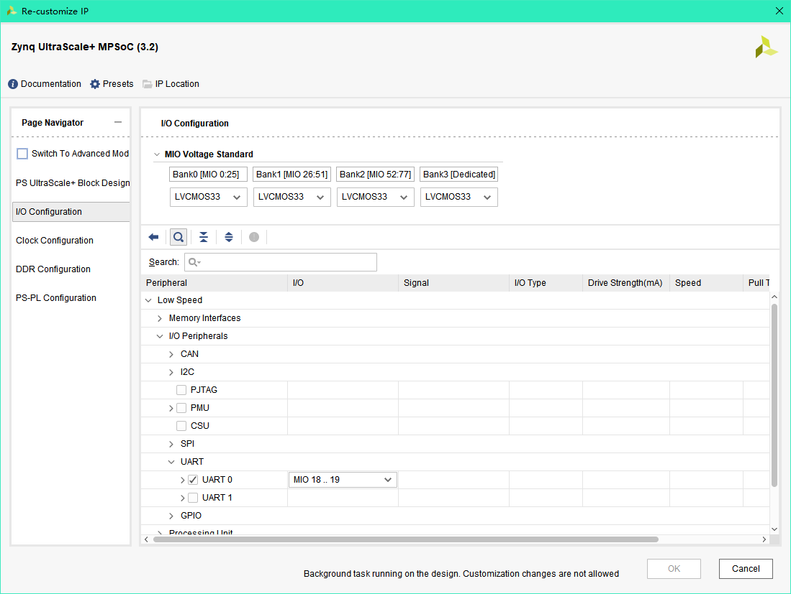
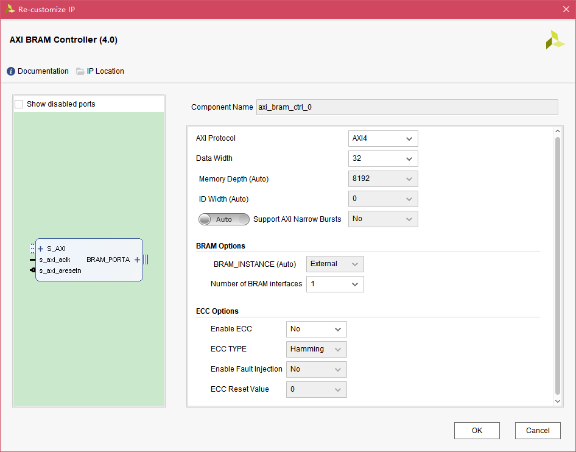
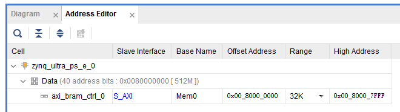
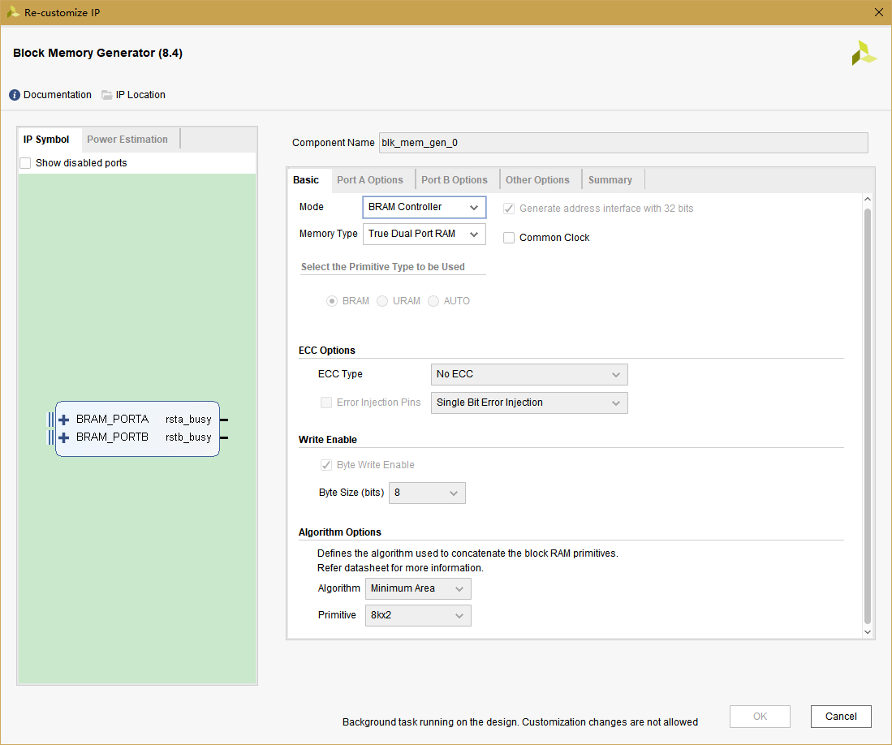
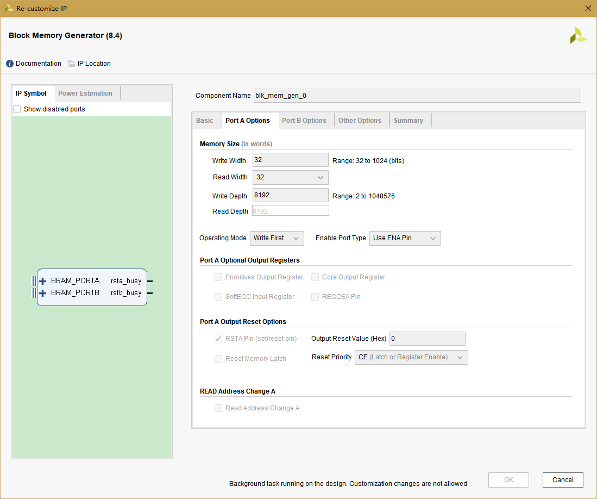
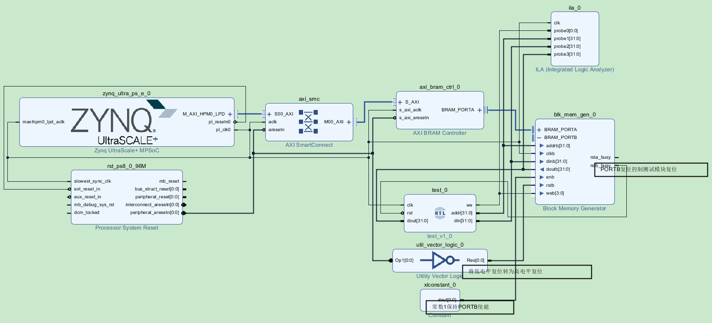

# AXI BRAM Controller

PS模块通过axi_bram模块，可以使用AXI接口读写PL内的Block RAM，实现PS与PL之间的数据互联

axi_bram需要与Block Memory Generator模块共同使用，axi_bram将PS的AXI操作转化为bram的控制接口时序

# Block Design

建立Vivado工程，并且添加Zynq模块，AXI BRAM Controller模块，Block Memory Generator模块，Utility Vector Logic模块和ILA模块

其中logic用于将低电平复位信号转为高电平接入bram，ila用于在PL中查看bram的接口操作

zynq模块在保持默认的情况下添加uart0，并且指定MIO 18 19，用于与PC串口连接



axi_bram的设置如下图所示



**注意：Memory Depth不可设置，因为深度设置是完全由PS的地址分配决定的，默认显示为1024，在Address Editor中修改并且Generate Output Products才可以更新至axi_bram模块内的Memory Depth**

经过修改的Address Editor为



32KB地址空间，由于数据总线为32bit即4B，于是axi_bram的深度为32*1024/4=8192

Block Memory Generator在使用BRAM Controller模式也是同样的方式决定深度

打开bram模块，并设置为双口控制，A口与axi_bram连接，B口与PL内的自定义测试模块连接

设置如下






在Sources窗口添加自定义的Verilog模块test，写入如下代码用于与PS配合测试

```verilog
/*
PS通过0地址控制PL读写BRAM
PS要求PL写操作前将MAX_ADDR地址写为0，然后用MAX_ADDR地址值判断是否写结束
*/
module test(
    input clk,
    input rst,
    output we,
    output [31:0] addr,
    output [31:0] din,
    input [31:0] dout
    );
	
	parameter MAX_ADDR = 32'd32764;
	
	reg we = 1'b0;
	reg [31:0] addr = 32'd0;
	assign din = addr;//写数据值即为当前地址值
	
	localparam IDLE = 3'b001;
	localparam WR = 3'b010;
	localparam RD = 3'b100;
	
	reg [2:0] state = IDLE;
	
	reg [31:0] cnt = 32'd0;
	
	always @(posedge clk) begin
		if (rst == 1'b1) begin
			state = IDLE;
		end
		else begin
			case (state)
				IDLE: begin
					if (dout == 32'd1) begin//PS向0地址写入1值表示PL开始写操作
						state <= WR;
					end
					else if (dout == 32'd2) begin//PS向0地址写入2值表示PL开始读操作
						state <= RD;
					end
					else begin
						state <= state;
					end
				end
				
				WR: begin
					if (addr == MAX_ADDR) begin//状态转移
						state <= IDLE;
					end
					else begin
						state <= state;
					end
				end
				
				RD: begin
					if (addr == MAX_ADDR) begin//状态转移
						state <= IDLE;
					end
					else begin
						state <= state;
					end
				end
				
				default: begin
					state <= IDLE;
				end
			endcase
		end
	end
	
	//写使能控制，不写0地址
	always @(posedge clk) begin
		case (state)
			WR: begin//保持depth-1个时钟周期有效
				if (addr == MAX_ADDR) begin//状态转移
					we <= 1'b0;
				end
				else begin
					we <= 1'b1;
				end
			end
			
			default: begin
				we <= 1'b0;
			end
		endcase
	end
	
	//地址控制
	always @(posedge clk) begin
		case (state)
			IDLE: begin//一直读0地址
				addr <= 32'd0;
			end
			
			WR: begin
				if (addr == MAX_ADDR) begin//状态转移
					addr <= 32'd0;
				end
				else begin
					addr <= addr+32'd4;//地址递增4，首次we为1时，addr为4
				end
			end
			
			RD: begin
				if (addr == MAX_ADDR) begin//状态转移
					addr <= 32'd0;
				end
				else begin
					addr <= addr+32'd4;//地址递增4
				end
			end
			
			default: begin
				addr <= 32'd0;
			end
		endcase
	end
	
endmodule
```

**注意与AXI BRAM Controller连接时，Block Memory Generator的地址总线addr指的是PS中内存偏移地址，在32位数据总线的情况下，addr有效值只有0，4，8，12等4字节的倍数，深度为8192时，最大的有效地址值为8191*4**

**如果Block Memory Generator是stand alone模式，则addr指的是RAM地址，即深度1024时，有效地址为0~1023**

上述代码中地址递增值为4，不是1的原因就在于addr为PS内存偏移地址

完成Verilog模块编码后，将其从Sources窗口直接用鼠标拖入Block Design，自动生成模块

配合自动连接与手动连接，Block Design连接完成后如下：



生成Bitstream后，Export Hardware，并且打开SDK

# SDK

建立helloworld模板程序，修改helloworld.c文件代码如下：

```c
#include <stdio.h>
#include "platform.h"
#include "xil_printf.h"
#include "sleep.h"

int main()
{
    print("bram test\n\r");

    //AXI BRAM的操作即根据数据位宽进行地址操作
    sleep(1);

    u32 rd = 0;
    int i = 0;

    while (1)
    {
    	//0地址写1启动PL的写操作
    	Xil_Out32(XPAR_BRAM_0_BASEADDR+0, 0x1);

    	while (1)
    	{
    		//等待10ms
			usleep(10000);

			//查看最后1个数据地址的数值是否为8191*4，表示PL完成写操作
			rd = Xil_In32(XPAR_BRAM_0_BASEADDR+8191*4);

			if (rd == (8191*4))
			{
				//0地址写0停止PL的写操作
				Xil_Out32(XPAR_BRAM_0_BASEADDR+0, 0x0);

				break;
			}
    	}

    	//更新BRAM中的数据
    	for (i = 1; i <= 8191; i += 1)
    	{
    		Xil_Out32(XPAR_BRAM_0_BASEADDR+4*i, i+1);
    	}

    	//0地址写2启动PL的读操作
    	Xil_Out32(XPAR_BRAM_0_BASEADDR+0, 0x2);

    	//等待10ms
		usleep(10000);
    }

    return 0;
}
```

**注意：在SDK编程时，axi_bram的操作即地址操作，[可读写范围与Block Design中的Address Editor一致](#Block Design)。由于数据总线位宽为4B，有效偏移地址为4B的整数倍**