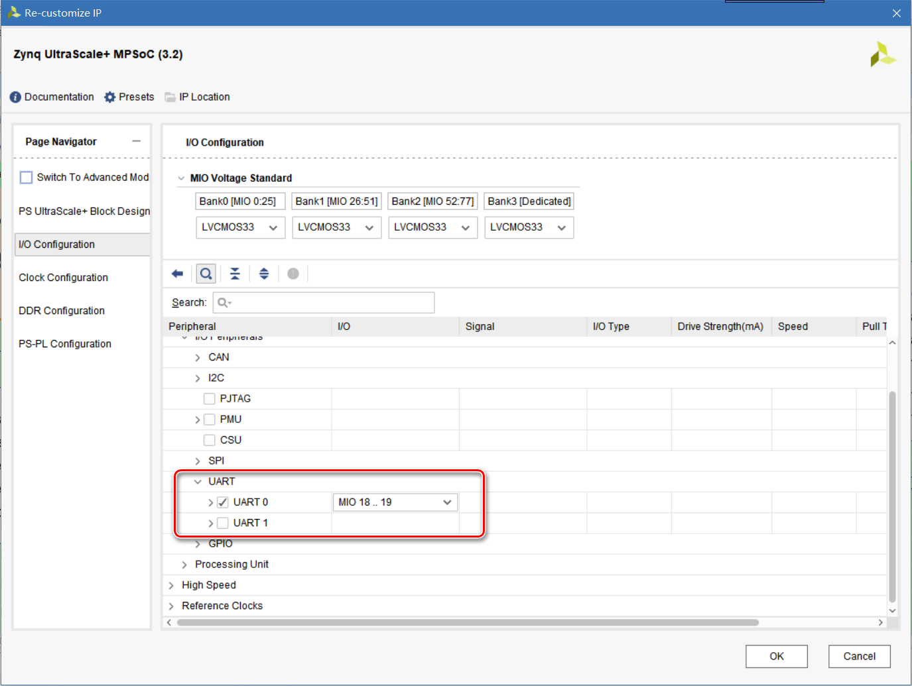
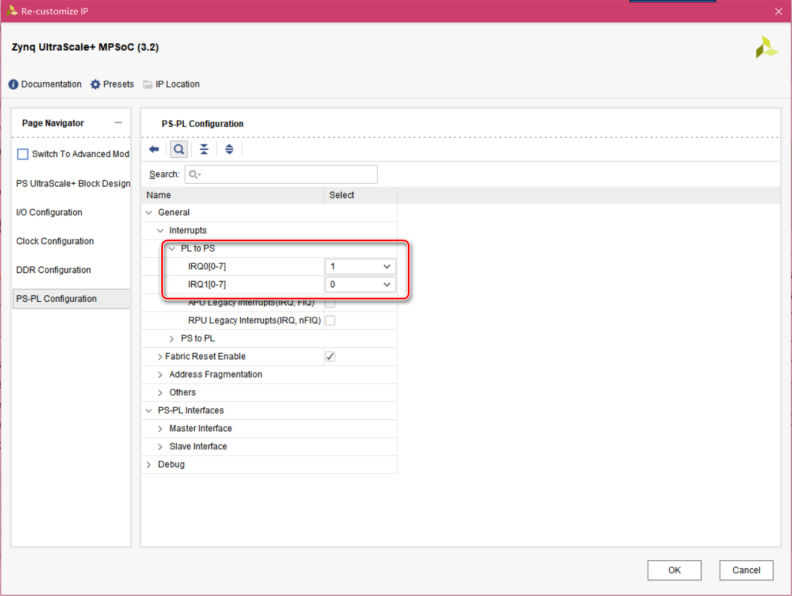
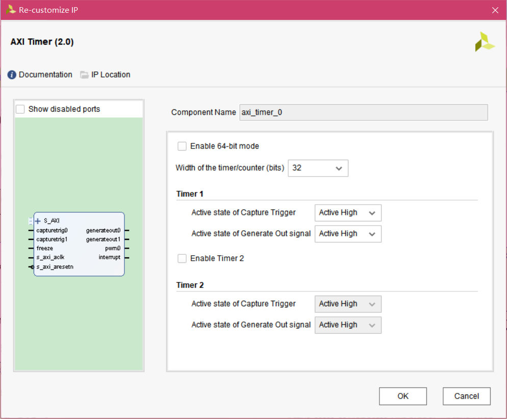
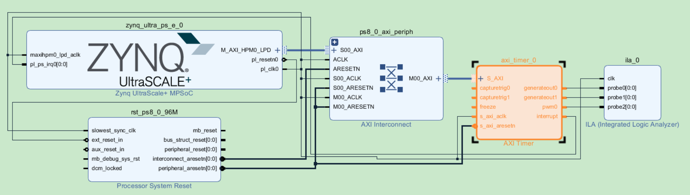
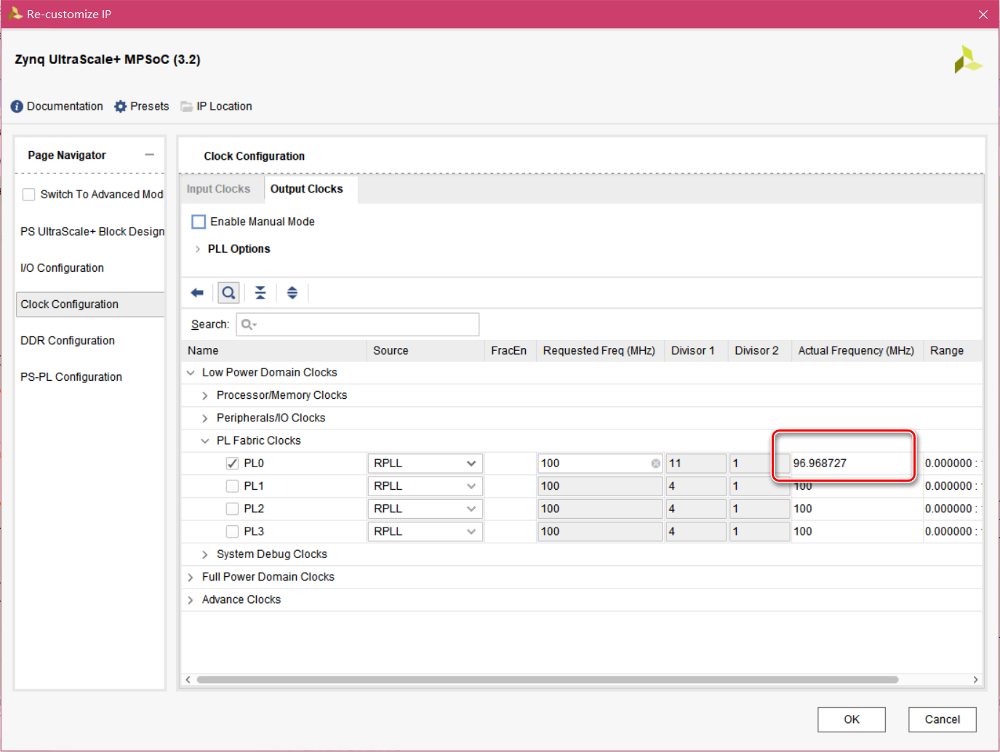
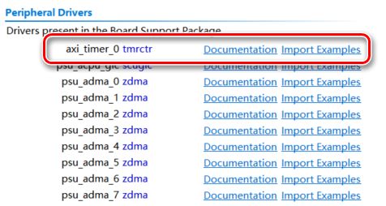

# AXI Timer

axi_timer模块即为PS可以访问的PL计数器，通过计数值以及接入axi_timer的计数时钟周期，可以在PS内取得比较精确的计时

axi_timer有2种使用方式，一种是作为计数器使用，另一种是作为定时器使用

# Block Design

建立Vivado工程，新建Block Design，并且添加zynq模块，AXI Timer模块，以及ILA模块

保持zynq模块的默认配置

使能UART0，连接至MIO 18 19，用于串口显示调试信息



添加PL至PS的中断输入接口



双击axi_timer模块，按下图设置



在Block Design中自动连接和手动连接之后，完成设计



在Vivado中生成bitstream，并且Export to Hardware，之后打开SDK

# SDK

建立helloworld模板工程，双击helloworld.c添加功能代码

注意，无论axi_timer模块作为计数器还是定时器，都是每个时钟周期计数增1或者减1，由于在Block Design中时钟输入接口来源于PS模块的时钟输出，注意需要打开PS模块设置界面确认Actual Frequency



在SDK建立的BSP工程中，xparameters.h也保存该频率值XPAR_AXI_TIMER_0_CLOCK_FREQ_HZ

具体编程参考自BSP中system.mss中导入的示例程序



## 计数器代码

```c
#include <stdio.h>
#include "platform.h"
#include "xil_printf.h"
#include "xtmrctr.h"
#include "sleep.h"


int main()
{
	print("axi_timer test\r\n");

	int sta = -1;
	//timer初始化
	XTmrCtr tmr;
	sta = XTmrCtr_Initialize(&tmr, XPAR_AXI_TIMER_0_DEVICE_ID);//ID来自于xparameters.h定义
	if (sta != XST_SUCCESS)
	{
		return XST_FAILURE;
	}

	//如果timer没有自动加载模式
	//向上计数溢出时置为0值停止计数
	//向下计数溢出时置为0xFFFFFFFF时停止计数

	//设置timer1的option为自动加载模式
    //在不设置reset value的情况下，计数寄存器循环计数
    //在设置reset value的情况下
    //计数寄存器向上计数至0xFFFFFFFF后变为reset value
    //计数寄存器向下计数至0后变为reset value
	//option为mask形式，定义见xtmrctr.h
	XTmrCtr_SetOptions(&tmr, 0, XTC_AUTO_RELOAD_OPTION);//axi_timer模块中timer1的num为0，timer2的num为1
//	XTmrCtr_SetOptions(&tmr, 0, XTC_DOWN_COUNT_OPTION);

	//timer1计数值
	u32 v = 0;

	//取得timer1的当前计数值，start之前值为0
	v = XTmrCtr_GetValue(&tmr, 0);
	printf("timer1 before start = %08x\r\n", v);

	//启动timer1
	XTmrCtr_Start(&tmr, 0);

	for (int i = 0; i < 8; ++i)
//	for (;;)
	{
		sleep(1);

		//取得timer1的当前计数值
		v = XTmrCtr_GetValue(&tmr, 0);

		//串口显示
		printf("timer1 value = %08x\r\n", v);
	}

	//关闭自动加载模式，清空全部option
	XTmrCtr_SetOptions(&tmr, 0, 0);

	//停止timer1
	XTmrCtr_Stop(&tmr, 0);

	//取得timer1的当前计数值，停止计数后，数值保持，不会复位
	v = XTmrCtr_GetValue(&tmr, 0);
	printf("timer1 after stop = %08x\r\n", v);

    return 0;
}
```

## 定时器代码：

```c
#include <stdio.h>
#include "platform.h"
#include "xil_printf.h"
#include "xtmrctr.h"
#include "sleep.h"
#include "xscugic.h"

//axi_timer自定义中断响应函数
void tmr_intr(void *CallBackRef, u8 TmrCtrNumber)
{
	XTmrCtr *ptr = (XTmrCtr *)CallBackRef;

	//取得产生中断的timer的当前计数值，复位reset value之后，接近该value的值
	u32 v = XTmrCtr_GetValue(ptr, TmrCtrNumber);

	//串口显示
	printf("timer value = %08x\r\n", v);
}

int main()
{
	print("axi_timer test\r\n");

	int sta = -1;
	//timer初始化
	XTmrCtr tmr;
	sta = XTmrCtr_Initialize(&tmr, XPAR_AXI_TIMER_0_DEVICE_ID);//ID来自于xparameters.h定义
	if (sta != XST_SUCCESS)
	{
		return XST_FAILURE;
	}

	//查找中断配置
	XScuGic_Config* intc_conf;
	intc_conf = XScuGic_LookupConfig(XPAR_SCUGIC_SINGLE_DEVICE_ID);
	if (intc_conf == NULL)
	{
		return XST_FAILURE;
	}

	//中断初始化
	XScuGic intc;
	sta = XScuGic_CfgInitialize(&intc, intc_conf, intc_conf->CpuBaseAddress);
	if (sta != XST_SUCCESS)
	{
		return XST_FAILURE;
	}

	//设置timer中断优先级及上升沿触发
	XScuGic_SetPriorityTriggerType(&intc, XPAR_FABRIC_AXI_TIMER_0_INTERRUPT_INTR, 0xA0, 0x3);

	//设置中断响应函数为axi_timer的中断响应函数XTmrCtr_InterruptHandler（非自定义）
	//由此中断响应函数将中断分发至自定义的中断响应函数
	sta = XScuGic_Connect(&intc, XPAR_FABRIC_AXI_TIMER_0_INTERRUPT_INTR, (Xil_ExceptionHandler)XTmrCtr_InterruptHandler, &tmr);
	if (sta != XST_SUCCESS)
	{
		return XST_FAILURE;
	}

	//使能中断
	XScuGic_Enable(&intc, XPAR_FABRIC_AXI_TIMER_0_INTERRUPT_INTR);

	//使能硬件中断
	Xil_ExceptionInit();
	Xil_ExceptionRegisterHandler(XIL_EXCEPTION_ID_INT, (Xil_ExceptionHandler)XScuGic_InterruptHandler, &intc);
	Xil_ExceptionEnable();

	//将axi_timer连接自定义中断响应函数
	XTmrCtr_SetHandler(&tmr, tmr_intr, &tmr);

	//如果timer没有自动加载模式
	//向上计数溢出时置为0值停止计数
	//向下计数溢出时置为0xFFFFFFFF时停止计数
	//如果timer有自动加载模式
	//无论向上还是向下计数，计数溢出时自动wrap

	//设置timer1为中断模式，中断后由硬件中断函数XScuGic_InterruptHandler，调用软件中断函数XTmrCtr_InterruptHandler，再调用自定义中断函数
	//设置timer1的option为自动加载模式，计数寄存器循环计数
	//option为mask形式，定义见xtmrctr.h
	XTmrCtr_SetOptions(&tmr, 0, XTC_DOWN_COUNT_OPTION | XTC_INT_MODE_OPTION | XTC_AUTO_RELOAD_OPTION);//axi_timer模块中timer1的num为0，timer2的num为1

	//设置timer1计数寄存器的复位值，即向上计数至0xFFFFFFFF或者向下计数至0时，reload至该值
	XTmrCtr_SetResetValue(&tmr, 0, XPAR_AXI_TIMER_0_CLOCK_FREQ_HZ);//复位值为频率值，并且向下计数则计时1秒

	//timer1计数值
	u32 v = 0;

	//取得timer1的当前计数值，start之前值为？
	v = XTmrCtr_GetValue(&tmr, 0);
	printf("timer1 before start = %08x\r\n", v);

	//启动timer1
	XTmrCtr_Start(&tmr, 0);

	while (1)
	{
		sleep(1);
	}

	//关闭自动加载模式，清空全部option
	XTmrCtr_SetOptions(&tmr, 0, 0);

	//停止timer1
	XTmrCtr_Stop(&tmr, 0);

	//取得timer1的当前计数值，停止计数后，数值保持，不会复位
	v = XTmrCtr_GetValue(&tmr, 0);
	printf("timer1 after stop = %08x\r\n", v);

    return 0;
}
```

