从本文档开始将介绍PS和PL之间通过AXI总线互联。

三种AXI总线协议为

-   AXI_LITE：性能较低的地址映射传输，一次只能传输4字节

-   AXI_STREAM：高速流数据传输，无地址映射，不能直接与PS连接

-   AXI（又称AXI_FULL）：性能较高的地址映射传输

---

**AXI_LITE一般用于小规模的数据交互，比如参数、指令或者状态信息**

本文档用AXI_LITE总线实现2项功能：

1.  PS读写PL的寄存器读取板上按钮状态控制LED灯开关
2.  PL读写PS的DDR内存

# axi lite时序

**下文中生成的AXI_LITE接口的IP模块自带的示例代码可以修改后使用，AXI_LITE的接口时序来源于示例代码的参考**

## 写操作时序

1.  master：同时设置awvalid和wvalid有效
2.  slave：等待awvalid和wvalid同时有效，同时将awready和wready设置1
3.  slave：在awvalid awready wvalid wready同时为1的情况下，bvalid设1，同时取出awaddr和wdata
4.  master：收到awready将awvalid设0，收到wready将wvalid设0
5.  master：收到bvalid将bready设1，下个时钟周期设0
6.  slave：收到bready将bvalid设0

## 读操作时序

1.  master：设置arvalidy为1
2.  slave：收到arvalid将arready设1，下个时钟周期设0
3.  slave：在arready arvalid同时为1的情况下，rvalid设1，axi_rresp设0有效
4.  master：收到arready将arvalid设0
5.  master：收到rvalid将rready设1，下个时钟周期设0
6.  slave：收到rready将rvalid设1
7.  master：在rready rvalid同时为1的情况下，检查rdata数值

# 建立工程

与之前相同的方法建立zcu102的Vivado工程

# 配置Zynq模块

建立Block Design，并添加Zynq模块

选择Run Block Automation

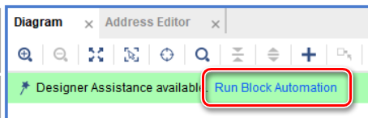

在弹出窗口中按照默认配置选择OK

双击打开Zynq模块配置，在PS-PL Configuration页进行如下配置

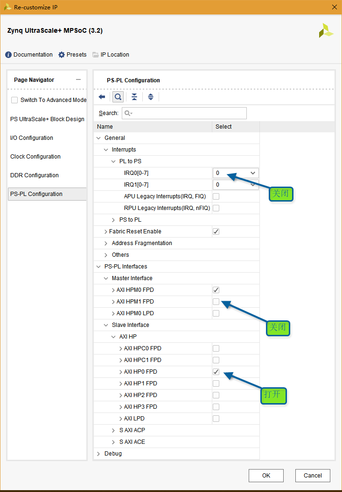

使用pl_clk0作为PL端工作时钟，并且连接2个AXI接口的aclk

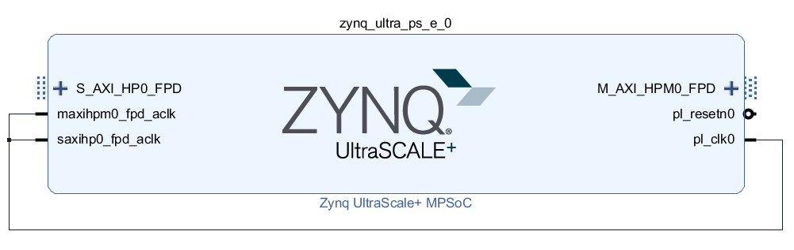

# 自定义Slave AXI_LITE接口的IP模块

在Tools菜单选择Create and Package New IP


在弹出窗口中选中Create AXI4 Peripheral

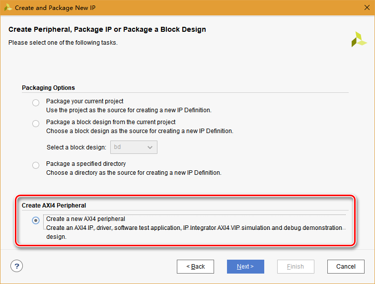

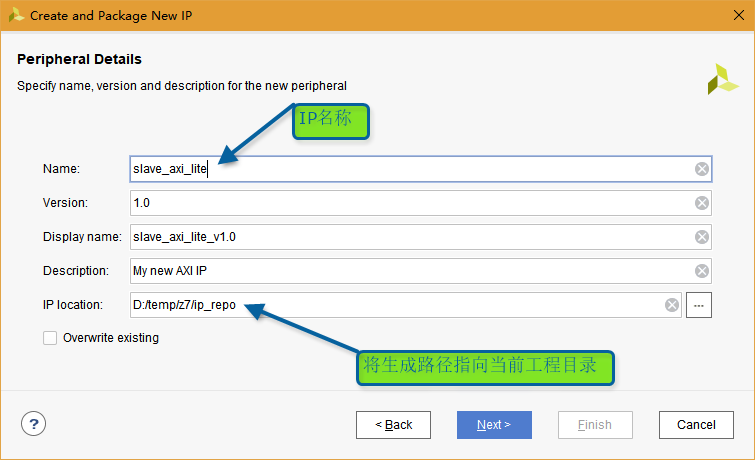


选择Edit IP后点击Finish

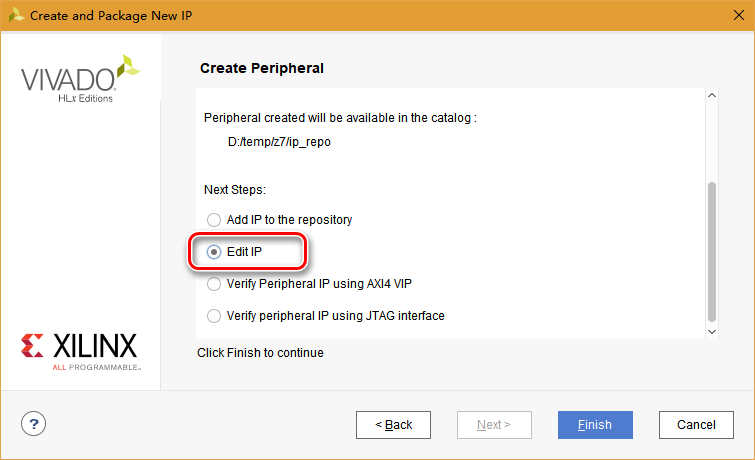

之后弹出当前IP的Vivado工程

在Sources窗口双击打开接口模块

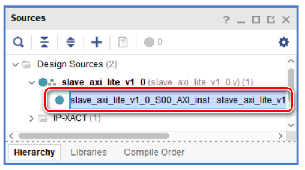

在代码注释中指示的位置**（非必须）**添加自定义的模块端口

**注意：端口定义必须加上wire**

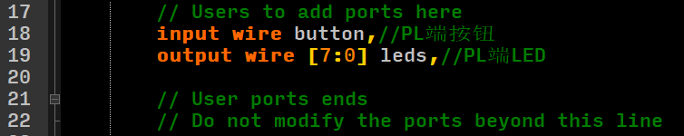

根据代码所示，前述步骤配置的4个32位寄存器分别为slv_reg0~3

**若当前IP在PS端的基地址为base_addr，则slv_reg0读写地址为base_addr，slv_reg1读写地址为base_addr+4，svl_reg2和3以此类推**

将slv_reg0用于写入PL端LED，slv_reg1用于读取PL端按钮

根据注释位置（位置非必须）添加以下代码

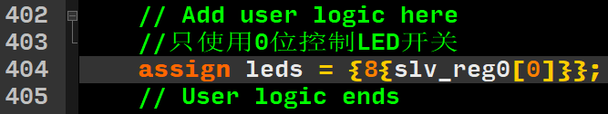

并修改读操作赋值

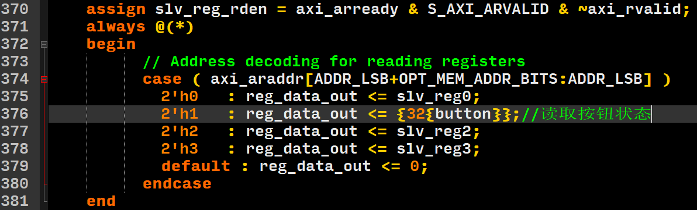

打开IP的顶层模块，进行如下修改

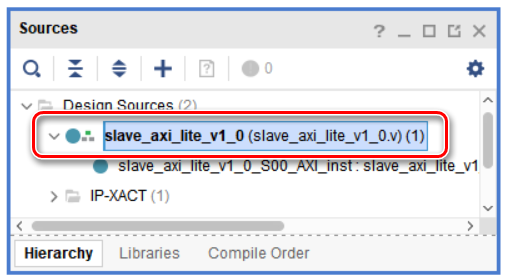


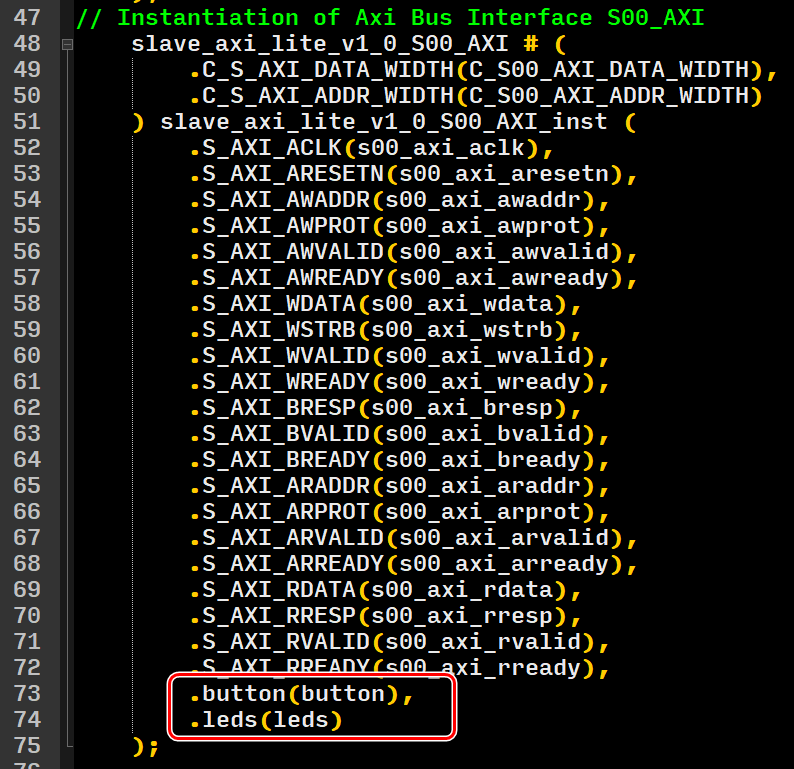

在当前IP的Vivado工程界面，在Tools菜单选择Create and Package IP

选择Package your current project

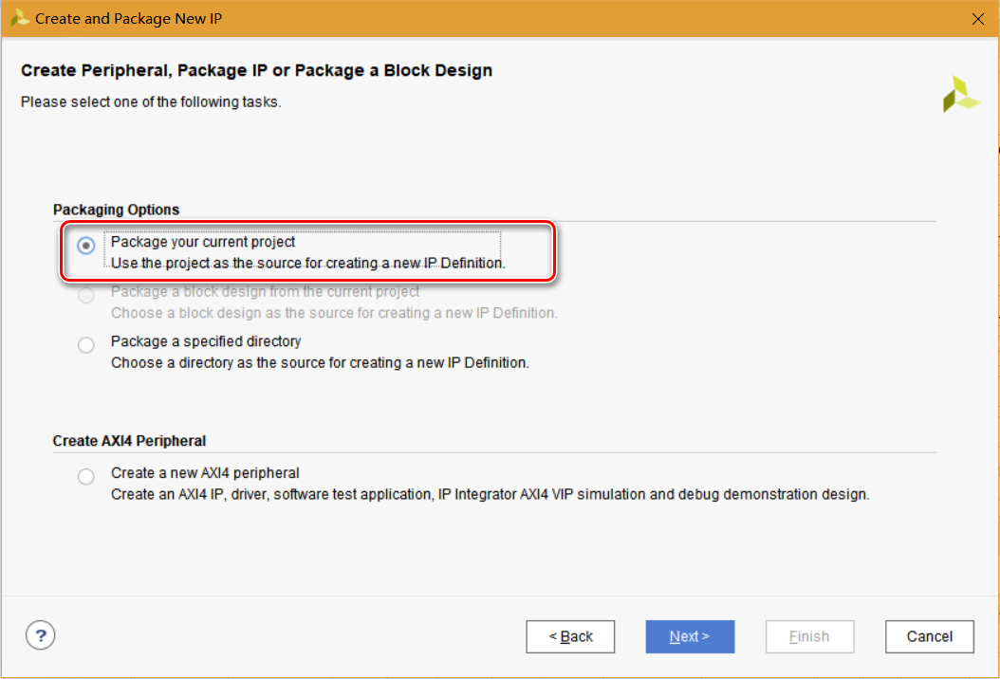

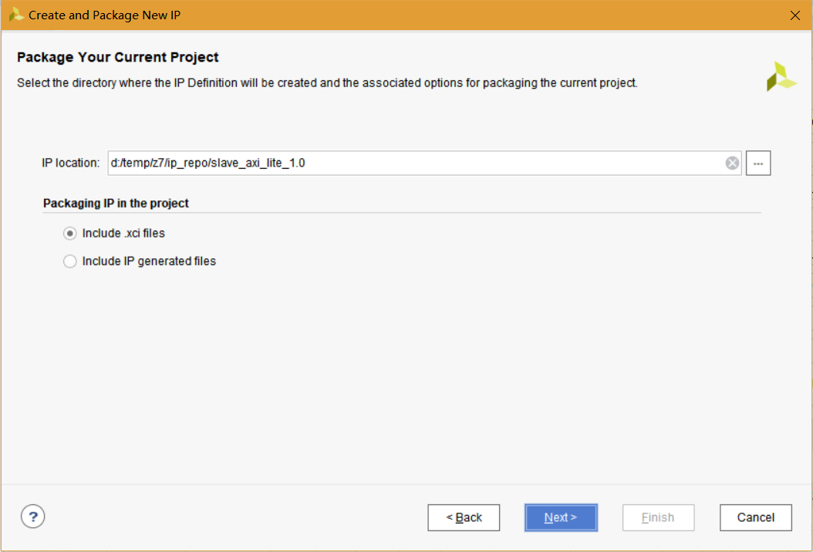

在弹出窗口选择Overwrite


最后点击Finish

完成后关闭当前IP的Vivado工程

# 自定义Master AXI_LITE接口的IP模块

参考[Slave AXI_LITE的模块的生成](#自定义Slave AXI_LITE接口的IP模块)，进行如下配置

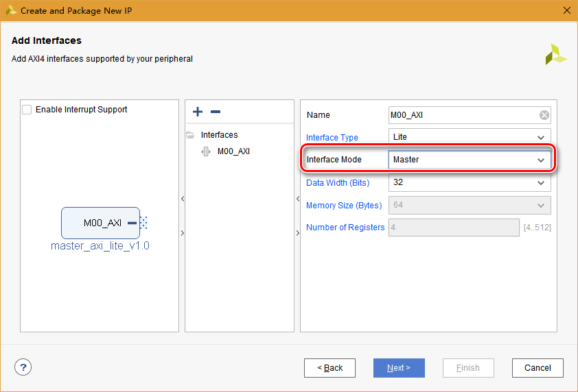

最后选择Edit IP打开IP的Vivado工程

由于默认生成的示例代码过于复杂，因此根据AXI_LITE接口时序全部重写，并添加读写接口

进入Vivado工程后，使用与[自定义Slave接口IP相同的方式](#自定义Slave AXI_LITE接口的IP模块)修改接口模块和顶层模块如下

## 接口模块代码

```verilog

`timescale 1 ns / 1 ps

	module master_axi_lite_v1_0_M00_AXI #
	(
		// Users to add parameters here

		// User parameters ends
		// Do not modify the parameters beyond this line

		// The master will start generating data from the C_M_START_DATA_VALUE value
		parameter  C_M_START_DATA_VALUE	= 32'hAA000000,
		// The master requires a target slave base address.
    // The master will initiate read and write transactions on the slave with base address specified here as a parameter.
		parameter  C_M_TARGET_SLAVE_BASE_ADDR	= 32'h40000000,
		// Width of M_AXI address bus. 
    // The master generates the read and write addresses of width specified as C_M_AXI_ADDR_WIDTH.
		parameter integer C_M_AXI_ADDR_WIDTH	= 32,
		// Width of M_AXI data bus. 
    // The master issues write data and accept read data where the width of the data bus is C_M_AXI_DATA_WIDTH
		parameter integer C_M_AXI_DATA_WIDTH	= 32,
		// Transaction number is the number of write 
    // and read transactions the master will perform as a part of this example memory test.
		parameter integer C_M_TRANSACTIONS_NUM	= 4
	)
	(
		// Users to add ports here
        //写接口
        input wire wr_en,//写使能
        input wire [31:0] wr_addr,//相对写地址，与写使能对齐
        input wire [31:0] wr_data,//写数据，与写使能对齐
        output wire wr_done,//写结束，单个时钟周期有效
        //读接口
        input wire rd_en,//读使能，单个时钟周期有效
        input wire [31:0] rd_addr,//相对读地址，与读使能对齐
        output wire rd_valid,//读出数据有效，单个时钟周期有效
        output wire [31:0] rd_data,//读出数据
        output wire rd_done,//读结束，单个时钟周期有效

		// User ports ends
		// Do not modify the ports beyond this line

		// // Initiate AXI transactions
		// input wire  INIT_AXI_TXN,
		// // Asserts when ERROR is detected
		// output reg  ERROR,
		// // Asserts when AXI transactions is complete
		// output wire  TXN_DONE,
		// AXI clock signal
		input wire  M_AXI_ACLK,
		// AXI active low reset signal
		input wire  M_AXI_ARESETN,
		// Master Interface Write Address Channel ports. Write address (issued by master)
		output wire [C_M_AXI_ADDR_WIDTH-1 : 0] M_AXI_AWADDR,
		// Write channel Protection type.
    // This signal indicates the privilege and security level of the transaction,
    // and whether the transaction is a data access or an instruction access.
		output wire [2 : 0] M_AXI_AWPROT,
		// Write address valid. 
    // This signal indicates that the master signaling valid write address and control information.
		output wire  M_AXI_AWVALID,
		// Write address ready. 
    // This signal indicates that the slave is ready to accept an address and associated control signals.
		input wire  M_AXI_AWREADY,
		// Master Interface Write Data Channel ports. Write data (issued by master)
		output wire [C_M_AXI_DATA_WIDTH-1 : 0] M_AXI_WDATA,
		// Write strobes. 
    // This signal indicates which byte lanes hold valid data.
    // There is one write strobe bit for each eight bits of the write data bus.
		output wire [C_M_AXI_DATA_WIDTH/8-1 : 0] M_AXI_WSTRB,
		// Write valid. This signal indicates that valid write data and strobes are available.
		output wire  M_AXI_WVALID,
		// Write ready. This signal indicates that the slave can accept the write data.
		input wire  M_AXI_WREADY,
		// Master Interface Write Response Channel ports. 
    // This signal indicates the status of the write transaction.
		input wire [1 : 0] M_AXI_BRESP,
		// Write response valid. 
    // This signal indicates that the channel is signaling a valid write response
		input wire  M_AXI_BVALID,
		// Response ready. This signal indicates that the master can accept a write response.
		output wire  M_AXI_BREADY,
		// Master Interface Read Address Channel ports. Read address (issued by master)
		output wire [C_M_AXI_ADDR_WIDTH-1 : 0] M_AXI_ARADDR,
		// Protection type. 
    // This signal indicates the privilege and security level of the transaction, 
    // and whether the transaction is a data access or an instruction access.
		output wire [2 : 0] M_AXI_ARPROT,
		// Read address valid. 
    // This signal indicates that the channel is signaling valid read address and control information.
		output wire  M_AXI_ARVALID,
		// Read address ready. 
    // This signal indicates that the slave is ready to accept an address and associated control signals.
		input wire  M_AXI_ARREADY,
		// Master Interface Read Data Channel ports. Read data (issued by slave)
		input wire [C_M_AXI_DATA_WIDTH-1 : 0] M_AXI_RDATA,
		// Read response. This signal indicates the status of the read transfer.
		input wire [1 : 0] M_AXI_RRESP,
		// Read valid. This signal indicates that the channel is signaling the required read data.
		input wire  M_AXI_RVALID,
		// Read ready. This signal indicates that the master can accept the read data and response information.
		output wire  M_AXI_RREADY
	);

	assign M_AXI_AWPROT	= 3'b000;
	assign M_AXI_WSTRB	= 4'b1111;
	assign M_AXI_ARPROT	= 3'b001;
    
    reg [31:0] M_AXI_AWADDR_REG = 32'd0; assign M_AXI_AWADDR = M_AXI_AWADDR_REG;
    reg M_AXI_AWVALID_REG = 1'b0; assign M_AXI_AWVALID = M_AXI_AWVALID_REG;
    reg [31:0] M_AXI_WDATA_REG = 32'd0; assign M_AXI_WDATA = M_AXI_WDATA_REG;
    reg M_AXI_WVALID_REG = 1'b0; assign M_AXI_WVALID = M_AXI_WVALID_REG;
    reg M_AXI_BREADY_REG = 1'b0; assign M_AXI_BREADY = M_AXI_BREADY_REG;
    
    reg [31:0] M_AXI_ARADDR_REG = 32'd0; assign M_AXI_ARADDR = M_AXI_ARADDR_REG;
    reg M_AXI_ARVALID_REG = 1'b0; assign M_AXI_ARVALID = M_AXI_ARVALID_REG;
    reg M_AXI_RREADY_REG = 1'b0; assign M_AXI_RREADY = M_AXI_RREADY_REG;
    
	// Add user logic here
    
	//写操作*******************************************************************
	always @(posedge M_AXI_ACLK) begin
        if (wr_en == 1'b1) begin
			//地址和数据同时有效
			M_AXI_WDATA_REG <= wr_data;
			M_AXI_WVALID_REG <= 1'b1;
        end
        else if ((M_AXI_WVALID_REG == 1'b1) && (M_AXI_WREADY == 1'b1)) begin
			//收到slave响应
			M_AXI_WDATA_REG <= M_AXI_WDATA_REG;
			M_AXI_WVALID_REG <= 1'b0;
        end
		else begin
			//保持
			M_AXI_WDATA_REG <= M_AXI_WDATA_REG;
			M_AXI_WVALID_REG <= M_AXI_WVALID_REG;
		end
    end
	
	always @(posedge M_AXI_ACLK) begin
		if (wr_en == 1'b1) begin
			//地址和数据同时有效
			M_AXI_AWADDR_REG <= wr_addr;
			M_AXI_AWVALID_REG <= 1'b1;
		end
		else if ((M_AXI_AWVALID_REG == 1'b1) && (M_AXI_AWREADY == 1'b1)) begin
			//收到slave响应
			M_AXI_AWADDR_REG <= M_AXI_AWADDR_REG;
			M_AXI_AWVALID_REG <= 1'b0;
		end
		else begin
			//收到slave响应
			M_AXI_AWADDR_REG <= M_AXI_AWADDR_REG;
			M_AXI_AWVALID_REG <= M_AXI_AWVALID_REG;
		end
	end
	
	always @(posedge M_AXI_ACLK) begin
		case (M_AXI_BREADY_REG)
			1'b0: begin
				//收到bvalid即设置为1
				if (M_AXI_BVALID == 1'b1) begin
					M_AXI_BREADY_REG <= 1'b1;
				end
				else begin
					M_AXI_BREADY_REG <= M_AXI_BREADY_REG;
				end
			end
			
			1'b1: begin
				//高电平仅1个时钟周期
				M_AXI_BREADY_REG <= 1'b0;
			end
		endcase
	end
	
	assign wr_done = M_AXI_BREADY_REG;
	
	//读操作************************************************
	always @(posedge M_AXI_ACLK) begin
		if (rd_en == 1'b1) begin
			M_AXI_ARADDR_REG <= rd_addr;
			M_AXI_ARVALID_REG <= 1'b1;
		end
		else if ((M_AXI_ARVALID_REG == 1'b1) && (M_AXI_ARREADY == 1'b1)) begin
			M_AXI_ARADDR_REG <= M_AXI_ARADDR_REG;
			M_AXI_ARVALID_REG <= 1'b0;
		end
		else begin
			//保持
			M_AXI_ARADDR_REG <= M_AXI_ARADDR_REG;
			M_AXI_ARVALID_REG <= M_AXI_ARVALID_REG;
		end
	end
	
	always @(posedge M_AXI_ACLK) begin
		case (M_AXI_RREADY_REG)
			1'b0: begin
				if (M_AXI_RVALID == 1'b1) begin
					M_AXI_RREADY_REG <= 1'b1;
				end
				else begin
					M_AXI_RREADY_REG <= M_AXI_RREADY_REG;
				end
			end
			
			1'b1: begin
				M_AXI_RREADY_REG <= 1'b0;
			end
		endcase
	end
	
	assign rd_done = M_AXI_RREADY_REG;
	assign rd_valid = M_AXI_RREADY_REG;
	
	reg [31:0] rd_data_reg = 32'd0;
	assign rd_data = rd_data_reg;
	
	always @(posedge M_AXI_ACLK) begin
		if ((M_AXI_RVALID == 1'b1) && (M_AXI_RREADY_REG == 1'b0)) begin
			rd_data_reg <= M_AXI_RDATA;
		end
		else begin
			rd_data_reg <= rd_data_reg;
		end
	end

	// User logic ends

	endmodule

```

## 顶层模块代码

```verilog

`timescale 1 ns / 1 ps

	module master_axi_lite_v1_0 #
	(
		// Users to add parameters here

		// User parameters ends
		// Do not modify the parameters beyond this line


		// Parameters of Axi Master Bus Interface M00_AXI
		parameter  C_M00_AXI_START_DATA_VALUE	= 32'hAA000000,
		parameter  C_M00_AXI_TARGET_SLAVE_BASE_ADDR	= 32'h40000000,
		parameter integer C_M00_AXI_ADDR_WIDTH	= 32,
		parameter integer C_M00_AXI_DATA_WIDTH	= 32,
		parameter integer C_M00_AXI_TRANSACTIONS_NUM	= 4
	)
	(
		// Users to add ports here
        //写接口
        input wire wr_en,//写使能
        input wire [31:0] wr_addr,//相对写地址，与写使能对齐
        input wire [31:0] wr_data,//写数据，与写使能对齐
        output wire wr_done,//写结束，单个时钟周期有效
        //读接口
        input wire rd_en,//读使能，单个时钟周期有效
        input wire [31:0] rd_addr,//相对读地址，与读使能对齐
        output wire rd_valid,//读出数据有效，单个时钟周期有效
        output wire [31:0] rd_data,//读出数据
        output wire rd_done,//读结束，单个时钟周期有效

		// User ports ends
		// Do not modify the ports beyond this line


		// Ports of Axi Master Bus Interface M00_AXI
		// input wire  m00_axi_init_axi_txn,
		// output wire  m00_axi_error,
		// output wire  m00_axi_txn_done,
		input wire  m00_axi_aclk,
		input wire  m00_axi_aresetn,
		output wire [C_M00_AXI_ADDR_WIDTH-1 : 0] m00_axi_awaddr,
		output wire [2 : 0] m00_axi_awprot,
		output wire  m00_axi_awvalid,
		input wire  m00_axi_awready,
		output wire [C_M00_AXI_DATA_WIDTH-1 : 0] m00_axi_wdata,
		output wire [C_M00_AXI_DATA_WIDTH/8-1 : 0] m00_axi_wstrb,
		output wire  m00_axi_wvalid,
		input wire  m00_axi_wready,
		input wire [1 : 0] m00_axi_bresp,
		input wire  m00_axi_bvalid,
		output wire  m00_axi_bready,
		output wire [C_M00_AXI_ADDR_WIDTH-1 : 0] m00_axi_araddr,
		output wire [2 : 0] m00_axi_arprot,
		output wire  m00_axi_arvalid,
		input wire  m00_axi_arready,
		input wire [C_M00_AXI_DATA_WIDTH-1 : 0] m00_axi_rdata,
		input wire [1 : 0] m00_axi_rresp,
		input wire  m00_axi_rvalid,
		output wire  m00_axi_rready
	);
// Instantiation of Axi Bus Interface M00_AXI
	master_axi_lite_v1_0_M00_AXI # ( 
		.C_M_START_DATA_VALUE(C_M00_AXI_START_DATA_VALUE),
		.C_M_TARGET_SLAVE_BASE_ADDR(C_M00_AXI_TARGET_SLAVE_BASE_ADDR),
		.C_M_AXI_ADDR_WIDTH(C_M00_AXI_ADDR_WIDTH),
		.C_M_AXI_DATA_WIDTH(C_M00_AXI_DATA_WIDTH),
		.C_M_TRANSACTIONS_NUM(C_M00_AXI_TRANSACTIONS_NUM)
	) master_axi_lite_v1_0_M00_AXI_inst (
		// .INIT_AXI_TXN(m00_axi_init_axi_txn),
		// .ERROR(m00_axi_error),
		// .TXN_DONE(m00_axi_txn_done),
		.M_AXI_ACLK(m00_axi_aclk),
		.M_AXI_ARESETN(m00_axi_aresetn),
		.M_AXI_AWADDR(m00_axi_awaddr),
		.M_AXI_AWPROT(m00_axi_awprot),
		.M_AXI_AWVALID(m00_axi_awvalid),
		.M_AXI_AWREADY(m00_axi_awready),
		.M_AXI_WDATA(m00_axi_wdata),
		.M_AXI_WSTRB(m00_axi_wstrb),
		.M_AXI_WVALID(m00_axi_wvalid),
		.M_AXI_WREADY(m00_axi_wready),
		.M_AXI_BRESP(m00_axi_bresp),
		.M_AXI_BVALID(m00_axi_bvalid),
		.M_AXI_BREADY(m00_axi_bready),
		.M_AXI_ARADDR(m00_axi_araddr),
		.M_AXI_ARPROT(m00_axi_arprot),
		.M_AXI_ARVALID(m00_axi_arvalid),
		.M_AXI_ARREADY(m00_axi_arready),
		.M_AXI_RDATA(m00_axi_rdata),
		.M_AXI_RRESP(m00_axi_rresp),
		.M_AXI_RVALID(m00_axi_rvalid),
		.M_AXI_RREADY(m00_axi_rready),
        .wr_en(wr_en),
        .wr_addr(wr_addr),
        .wr_data(wr_data),
        .wr_done(wr_done),
        .rd_en(rd_en),
        .rd_addr(rd_addr),
        .rd_valid(rd_valid),
        .rd_data(rd_data),
        .rd_done(rd_done)
	);

	// Add user logic here

	// User logic ends

	endmodule

```

最后，参考[Slave AXI_LITE的模块的生成](#自定义Slave AXI_LITE接口的IP模块)，打包IP

# 建立Verilog的master端测试模块

在Sources窗口创建新verilog模块，命名为master_test.v，用于连接master_axi_lite的读写接口进行测试

代码如下：

```verilog
module master_test(
    (*keep = "TRUE"*) input clk,
    (*keep = "TRUE"*) input rstn,
    (*keep = "TRUE"*) output wr_en,
    (*keep = "TRUE"*) output [31:0] wr_addr,
    (*keep = "TRUE"*) output [31:0] wr_data,
    (*keep = "TRUE"*) input wr_done,
    
    (*keep = "TRUE"*) output rd_en,
    (*keep = "TRUE"*) output [31:0] rd_addr,
    (*keep = "TRUE"*) input rd_valid,
    (*keep = "TRUE"*) input [31:0] rd_data,
    (*keep = "TRUE"*) input rd_done
    );
    
    parameter [31:0] BASE_ADDR = 32'h7000_0000;
    parameter [31:0] MAX_ADDR = 32'h7800_0000;
    
    reg wr_en = 1'b0;
    reg [31:0] wr_addr = BASE_ADDR;
    assign wr_data = wr_addr;
    
    reg rd_en = 1'b0;
    reg [31:0] rd_addr = BASE_ADDR;
    
    reg [31:0] cnt = 32'd0;//等待时间2秒
    
    
    //状态机
    parameter [4:0] IDLE = 5'b00001;
    parameter [4:0] WR = 5'b00010;
    parameter [4:0] WR_DONE = 5'b00100;
    parameter [4:0] RD = 5'b01000;
    parameter [4:0] RD_DONE = 5'b10000;
    
    reg [4:0] state = IDLE;
    always @(posedge clk) begin
        if (rstn == 1'b0) begin
            state = IDLE;
        end
        else begin
            case (state)
                IDLE: begin
                    if (cnt == 32'd200_000_000) begin
                        state <= WR;
                    end
                    else begin
                        state <= state;
                    end
                end
                
                WR: begin
                    state <= WR_DONE;
                end
                
                WR_DONE: begin
                    if (wr_done == 1'b1) begin
                        state <= RD;
                    end
                    else begin
                        state <= state;
                    end
                end
                
                RD: begin
                    state <= RD_DONE;
                end
                
                RD_DONE: begin
                    if (rd_done == 1'b1) begin
                        state <= WR;
                    end
                    else begin
                        state <= state;
                    end
                end
                
                default: begin
                    state = IDLE;
                end
            endcase
        end
    end
    
    always @(posedge clk) begin
        if (rstn == 1'b0) begin
            cnt <= 32'd0;
        end
        else begin
            if (state == IDLE) begin
                cnt <= cnt+32'd1;
            end
            else begin
                cnt <= 32'd0;
            end
        end
    end
    
    always @(posedge clk) begin
        if (rstn == 1'b0) begin
            wr_en <= 1'b0;
            wr_addr <= BASE_ADDR;
        end
        else begin
            case (state)
                WR: begin
                    wr_en <= 1'b1;
                    wr_addr <= wr_addr;
                end
                
                WR_DONE: begin
                    wr_en <= 1'b0;
                    
                    if (wr_done == 1'b1) begin
                        //更新写地址
                        if (wr_addr == MAX_ADDR) begin
                            wr_addr <= BASE_ADDR;
                        end
                        else begin
                            wr_addr <= wr_addr+32'd4;
                        end
                    end
                    else begin
                        wr_addr <= wr_addr;
                    end
                end
                
                default: begin
                    wr_en <= 1'b0;
                    wr_addr <= wr_addr;
                end
            endcase
        end
    end
    
    always @(posedge clk) begin
        if (rstn == 1'b0) begin
            rd_en <= 1'b0;
            rd_addr <= BASE_ADDR;
        end
        else begin
            case (state)
                RD: begin
                    rd_en <= 1'b1;
                    rd_addr <= rd_addr;
                end
                
                RD_DONE: begin
                    rd_en <= 1'b0;
                    
                    if (rd_done == 1'b1) begin
                        //更新读地址
                        if (rd_addr == MAX_ADDR) begin
                            rd_addr <= BASE_ADDR;
                        end
                        else begin
                            rd_addr <= rd_addr+32'd4;
                        end
                    end
                    else begin
                        rd_addr <= rd_addr;
                    end
                end
                
                default: begin
                    rd_en <= 1'b0;
                    rd_addr <= rd_addr;
                end
            endcase
        end
    end
    
    //统计错误
    (*keep = "TRUE"*) reg [31:0] error_cnt = 32'd0;
    
    always @(posedge clk) begin
        if ((state == RD_DONE) && (rd_valid == 1'b1) && (rd_data != rd_addr)) begin
            error_cnt <= error_cnt+32'd1;
        end
        else begin
            error_cnt <= error_cnt;
        end
    end
    
endmodule

```

# 实现Vivado工程

回到之前建立的Zynq工程

在PROJECT MANAGER内打开Settings，在IP > Repository页确认前述2个IP的路径已添加


向Block Design中添加2个自定义的AXI_LITE模块

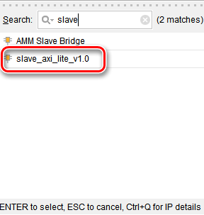

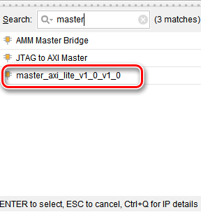

之后从Sources窗口将master_test.v文件用鼠标拖动至Diagram窗口，自动生成master_test的模块

在Block Design点击Run Connection Automation

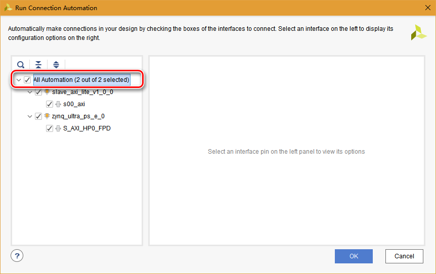

点击OK后，Block Design完成自动连接

之后手动连接master_test与master_axi_lite模块的接口

完成连接后的Diagram如下：

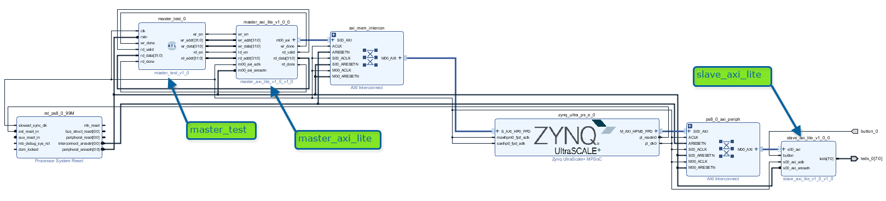

在Block Design上右键菜单执行Generate Output Products，完成后在右键菜单执行Create HDL Wrapper

在Flow Navigator中Run Synthesis，完成后，打开Synthesized Design，从Layout菜单打开I/O Planning窗口设置button和leds管脚

保存并新建xdc约束文件top.xdc

接下来在Flow Navigator中SYNTHESIS下选择Set Up Debug，添加master_test中的测试信号

最终的top.xdc文件内容如下：

```verilog
set_property PACKAGE_PIN AG14 [get_ports {leds_0[0]}]
set_property PACKAGE_PIN AF13 [get_ports {leds_0[1]}]
set_property PACKAGE_PIN AE13 [get_ports {leds_0[2]}]
set_property PACKAGE_PIN AJ14 [get_ports {leds_0[3]}]
set_property PACKAGE_PIN AJ15 [get_ports {leds_0[4]}]
set_property PACKAGE_PIN AH13 [get_ports {leds_0[5]}]
set_property PACKAGE_PIN AH14 [get_ports {leds_0[6]}]
set_property PACKAGE_PIN AL12 [get_ports {leds_0[7]}]
set_property IOSTANDARD LVCMOS33 [get_ports {leds_0[7]}]
set_property IOSTANDARD LVCMOS33 [get_ports {leds_0[6]}]
set_property IOSTANDARD LVCMOS33 [get_ports {leds_0[5]}]
set_property IOSTANDARD LVCMOS33 [get_ports {leds_0[4]}]
set_property IOSTANDARD LVCMOS33 [get_ports {leds_0[3]}]
set_property IOSTANDARD LVCMOS33 [get_ports {leds_0[1]}]
set_property IOSTANDARD LVCMOS33 [get_ports {leds_0[0]}]
set_property IOSTANDARD LVCMOS33 [get_ports {leds_0[2]}]
set_property PACKAGE_PIN AF15 [get_ports button_0]
set_property IOSTANDARD LVCMOS33 [get_ports button_0]

create_debug_core u_ila_0 ila
set_property ALL_PROBE_SAME_MU true [get_debug_cores u_ila_0]
set_property ALL_PROBE_SAME_MU_CNT 1 [get_debug_cores u_ila_0]
set_property C_ADV_TRIGGER false [get_debug_cores u_ila_0]
set_property C_DATA_DEPTH 2048 [get_debug_cores u_ila_0]
set_property C_EN_STRG_QUAL false [get_debug_cores u_ila_0]
set_property C_INPUT_PIPE_STAGES 0 [get_debug_cores u_ila_0]
set_property C_TRIGIN_EN false [get_debug_cores u_ila_0]
set_property C_TRIGOUT_EN false [get_debug_cores u_ila_0]
set_property port_width 1 [get_debug_ports u_ila_0/clk]
connect_debug_port u_ila_0/clk [get_nets [list bd_i/zynq_ultra_ps_e_0/inst/pl_clk0]]
set_property PROBE_TYPE DATA_AND_TRIGGER [get_debug_ports u_ila_0/probe0]
set_property port_width 32 [get_debug_ports u_ila_0/probe0]
connect_debug_port u_ila_0/probe0 [get_nets [list {bd_i/master_test_0/rd_data[0]} {bd_i/master_test_0/rd_data[1]} {bd_i/master_test_0/rd_data[2]} {bd_i/master_test_0/rd_data[3]} {bd_i/master_test_0/rd_data[4]} {bd_i/master_test_0/rd_data[5]} {bd_i/master_test_0/rd_data[6]} {bd_i/master_test_0/rd_data[7]} {bd_i/master_test_0/rd_data[8]} {bd_i/master_test_0/rd_data[9]} {bd_i/master_test_0/rd_data[10]} {bd_i/master_test_0/rd_data[11]} {bd_i/master_test_0/rd_data[12]} {bd_i/master_test_0/rd_data[13]} {bd_i/master_test_0/rd_data[14]} {bd_i/master_test_0/rd_data[15]} {bd_i/master_test_0/rd_data[16]} {bd_i/master_test_0/rd_data[17]} {bd_i/master_test_0/rd_data[18]} {bd_i/master_test_0/rd_data[19]} {bd_i/master_test_0/rd_data[20]} {bd_i/master_test_0/rd_data[21]} {bd_i/master_test_0/rd_data[22]} {bd_i/master_test_0/rd_data[23]} {bd_i/master_test_0/rd_data[24]} {bd_i/master_test_0/rd_data[25]} {bd_i/master_test_0/rd_data[26]} {bd_i/master_test_0/rd_data[27]} {bd_i/master_test_0/rd_data[28]} {bd_i/master_test_0/rd_data[29]} {bd_i/master_test_0/rd_data[30]} {bd_i/master_test_0/rd_data[31]}]]
create_debug_port u_ila_0 probe
set_property PROBE_TYPE DATA_AND_TRIGGER [get_debug_ports u_ila_0/probe1]
set_property port_width 32 [get_debug_ports u_ila_0/probe1]
connect_debug_port u_ila_0/probe1 [get_nets [list {bd_i/master_test_0/rd_addr[0]} {bd_i/master_test_0/rd_addr[1]} {bd_i/master_test_0/rd_addr[2]} {bd_i/master_test_0/rd_addr[3]} {bd_i/master_test_0/rd_addr[4]} {bd_i/master_test_0/rd_addr[5]} {bd_i/master_test_0/rd_addr[6]} {bd_i/master_test_0/rd_addr[7]} {bd_i/master_test_0/rd_addr[8]} {bd_i/master_test_0/rd_addr[9]} {bd_i/master_test_0/rd_addr[10]} {bd_i/master_test_0/rd_addr[11]} {bd_i/master_test_0/rd_addr[12]} {bd_i/master_test_0/rd_addr[13]} {bd_i/master_test_0/rd_addr[14]} {bd_i/master_test_0/rd_addr[15]} {bd_i/master_test_0/rd_addr[16]} {bd_i/master_test_0/rd_addr[17]} {bd_i/master_test_0/rd_addr[18]} {bd_i/master_test_0/rd_addr[19]} {bd_i/master_test_0/rd_addr[20]} {bd_i/master_test_0/rd_addr[21]} {bd_i/master_test_0/rd_addr[22]} {bd_i/master_test_0/rd_addr[23]} {bd_i/master_test_0/rd_addr[24]} {bd_i/master_test_0/rd_addr[25]} {bd_i/master_test_0/rd_addr[26]} {bd_i/master_test_0/rd_addr[27]} {bd_i/master_test_0/rd_addr[28]} {bd_i/master_test_0/rd_addr[29]} {bd_i/master_test_0/rd_addr[30]} {bd_i/master_test_0/rd_addr[31]}]]
create_debug_port u_ila_0 probe
set_property PROBE_TYPE DATA_AND_TRIGGER [get_debug_ports u_ila_0/probe2]
set_property port_width 32 [get_debug_ports u_ila_0/probe2]
connect_debug_port u_ila_0/probe2 [get_nets [list {bd_i/master_test_0/wr_addr[0]} {bd_i/master_test_0/wr_addr[1]} {bd_i/master_test_0/wr_addr[2]} {bd_i/master_test_0/wr_addr[3]} {bd_i/master_test_0/wr_addr[4]} {bd_i/master_test_0/wr_addr[5]} {bd_i/master_test_0/wr_addr[6]} {bd_i/master_test_0/wr_addr[7]} {bd_i/master_test_0/wr_addr[8]} {bd_i/master_test_0/wr_addr[9]} {bd_i/master_test_0/wr_addr[10]} {bd_i/master_test_0/wr_addr[11]} {bd_i/master_test_0/wr_addr[12]} {bd_i/master_test_0/wr_addr[13]} {bd_i/master_test_0/wr_addr[14]} {bd_i/master_test_0/wr_addr[15]} {bd_i/master_test_0/wr_addr[16]} {bd_i/master_test_0/wr_addr[17]} {bd_i/master_test_0/wr_addr[18]} {bd_i/master_test_0/wr_addr[19]} {bd_i/master_test_0/wr_addr[20]} {bd_i/master_test_0/wr_addr[21]} {bd_i/master_test_0/wr_addr[22]} {bd_i/master_test_0/wr_addr[23]} {bd_i/master_test_0/wr_addr[24]} {bd_i/master_test_0/wr_addr[25]} {bd_i/master_test_0/wr_addr[26]} {bd_i/master_test_0/wr_addr[27]} {bd_i/master_test_0/wr_addr[28]} {bd_i/master_test_0/wr_addr[29]} {bd_i/master_test_0/wr_addr[30]} {bd_i/master_test_0/wr_addr[31]}]]
create_debug_port u_ila_0 probe
set_property PROBE_TYPE DATA_AND_TRIGGER [get_debug_ports u_ila_0/probe3]
set_property port_width 32 [get_debug_ports u_ila_0/probe3]
connect_debug_port u_ila_0/probe3 [get_nets [list {bd_i/master_test_0/wr_data[0]} {bd_i/master_test_0/wr_data[1]} {bd_i/master_test_0/wr_data[2]} {bd_i/master_test_0/wr_data[3]} {bd_i/master_test_0/wr_data[4]} {bd_i/master_test_0/wr_data[5]} {bd_i/master_test_0/wr_data[6]} {bd_i/master_test_0/wr_data[7]} {bd_i/master_test_0/wr_data[8]} {bd_i/master_test_0/wr_data[9]} {bd_i/master_test_0/wr_data[10]} {bd_i/master_test_0/wr_data[11]} {bd_i/master_test_0/wr_data[12]} {bd_i/master_test_0/wr_data[13]} {bd_i/master_test_0/wr_data[14]} {bd_i/master_test_0/wr_data[15]} {bd_i/master_test_0/wr_data[16]} {bd_i/master_test_0/wr_data[17]} {bd_i/master_test_0/wr_data[18]} {bd_i/master_test_0/wr_data[19]} {bd_i/master_test_0/wr_data[20]} {bd_i/master_test_0/wr_data[21]} {bd_i/master_test_0/wr_data[22]} {bd_i/master_test_0/wr_data[23]} {bd_i/master_test_0/wr_data[24]} {bd_i/master_test_0/wr_data[25]} {bd_i/master_test_0/wr_data[26]} {bd_i/master_test_0/wr_data[27]} {bd_i/master_test_0/wr_data[28]} {bd_i/master_test_0/wr_data[29]} {bd_i/master_test_0/wr_data[30]} {bd_i/master_test_0/wr_data[31]}]]
create_debug_port u_ila_0 probe
set_property PROBE_TYPE DATA_AND_TRIGGER [get_debug_ports u_ila_0/probe4]
set_property port_width 1 [get_debug_ports u_ila_0/probe4]
connect_debug_port u_ila_0/probe4 [get_nets [list bd_i/master_test_0/rd_done]]
create_debug_port u_ila_0 probe
set_property PROBE_TYPE DATA_AND_TRIGGER [get_debug_ports u_ila_0/probe5]
set_property port_width 1 [get_debug_ports u_ila_0/probe5]
connect_debug_port u_ila_0/probe5 [get_nets [list bd_i/master_test_0/rd_en]]
create_debug_port u_ila_0 probe
set_property PROBE_TYPE DATA_AND_TRIGGER [get_debug_ports u_ila_0/probe6]
set_property port_width 1 [get_debug_ports u_ila_0/probe6]
connect_debug_port u_ila_0/probe6 [get_nets [list bd_i/master_test_0/rd_valid]]
create_debug_port u_ila_0 probe
set_property PROBE_TYPE DATA_AND_TRIGGER [get_debug_ports u_ila_0/probe7]
set_property port_width 1 [get_debug_ports u_ila_0/probe7]
connect_debug_port u_ila_0/probe7 [get_nets [list bd_i/master_test_0/wr_done]]
create_debug_port u_ila_0 probe
set_property PROBE_TYPE DATA_AND_TRIGGER [get_debug_ports u_ila_0/probe8]
set_property port_width 1 [get_debug_ports u_ila_0/probe8]
connect_debug_port u_ila_0/probe8 [get_nets [list bd_i/master_test_0/wr_en]]
set_property C_CLK_INPUT_FREQ_HZ 300000000 [get_debug_cores dbg_hub]
set_property C_ENABLE_CLK_DIVIDER false [get_debug_cores dbg_hub]
set_property C_USER_SCAN_CHAIN 1 [get_debug_cores dbg_hub]
connect_debug_port dbg_hub/clk [get_nets u_ila_0_pl_clk0]

```

在Flow Navigator中PROGRAM AND DEBUG选择Generate Bitstream

完成后在File菜单选择Export > Export Hardware，注意选中Include bitstream

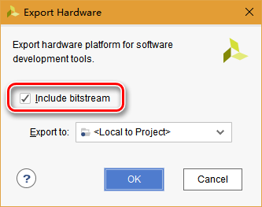

之后在File菜单选择Launch SDK

# SDK编程

默认建立的bd_wrapper_hw_platform_0工程目录中已包含前文生成的bit配置文件

根据HelloWorld模板建立test_axi_lite工程

SDK工程用于测试slave_axi_lite，即按钮控制led开关

修改helloworld.c文件代码如下：

```c
#include <stdio.h>
#include "platform.h"
#include "xil_printf.h"
#include "xil_io.h"
#include "sleep.h"


int main()
{
    init_platform();

    print("Hello World\n\r");

    Xil_Out32(XPAR_SLAVE_AXI_LITE_V1_0_0_BASEADDR, 1);//点亮LED

    u32 led = 1;
    u32 button = 0;

    while (1)
    {
    	usleep(100000);

    	button = Xil_In32(XPAR_SLAVE_AXI_LITE_V1_0_0_BASEADDR+4);
    	if (button == 0xFFFFFFFF)
    	{
    		//打印消息
    		print("button pressed\n\r");

    		//复位
    		button = 0;

    		//按钮按下
    		if (led == 0)
    		{
    			led = 1;
    		}
    		else
    		{
    			led = 0;
    		}

    		Xil_Out32(XPAR_SLAVE_AXI_LITE_V1_0_0_BASEADDR, led);
    	}
    }

    cleanup_platform();
    return 0;
}
```

在test_axi_lite工程选择Debug Configurations

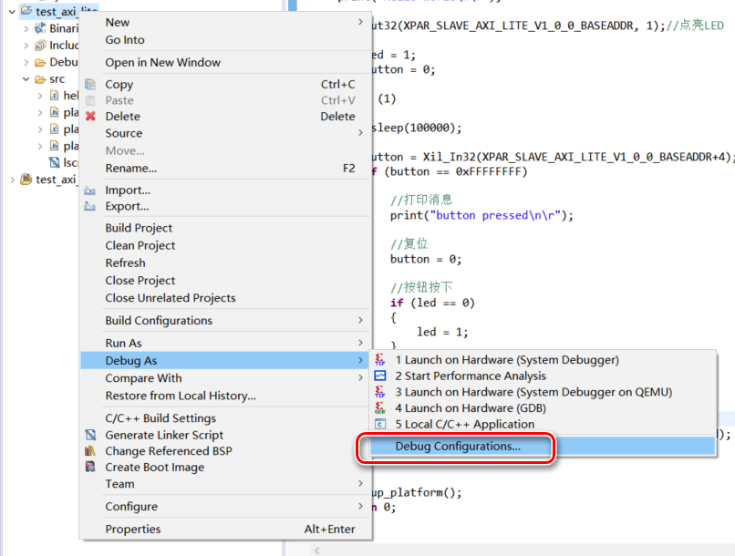

配置如下：

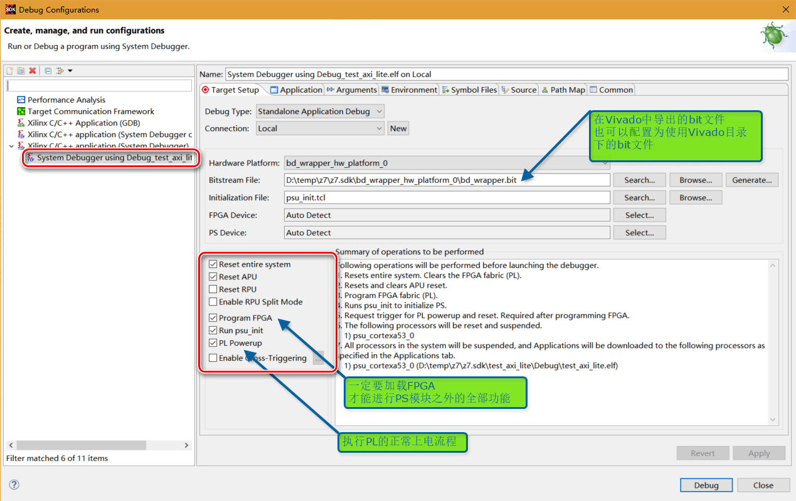

**注意，一定不能在Vivado中加载FPGA，再启动PS程序。PL程序会在PS载入过程中被清除！！！**

在SDK中启动调试

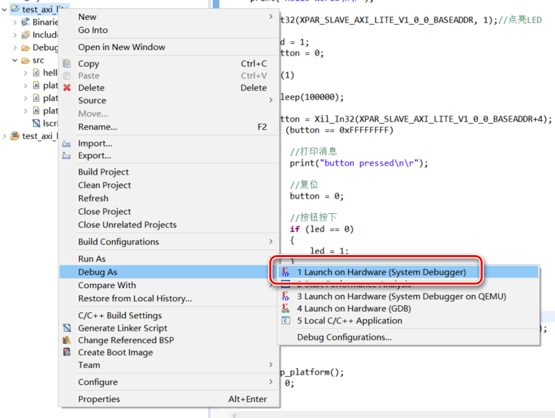

发现按钮控制led开关功能正确

回到Vivado，从Hardware Manager进入Debugl界面，测试发现master_test运行正确：

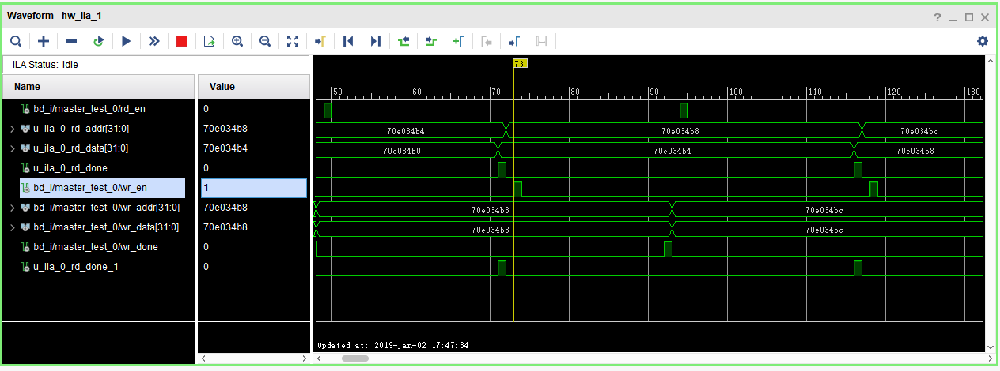

