# AXI_STREAM的时序

AXI_STREAM接口一般用于大规模持续的无地址映射关系的流数据传输

数据从master单向流动至slave，

参考自定义IP生成的示例代码进行说明

master端接口如下：

```verilog
// Master Stream Ports. TVALID indicates that the master is driving a valid transfer, A transfer takes place when both TVALID and TREADY are asserted. 
output wire  M_AXIS_TVALID,
// TDATA is the primary payload that is used to provide the data that is passing across the interface from the master.
output wire [C_M_AXIS_TDATA_WIDTH-1 : 0] M_AXIS_TDATA,
// TSTRB is the byte qualifier that indicates whether the content of the associated byte of TDATA is processed as a data byte or a position byte.
output wire [(C_M_AXIS_TDATA_WIDTH/8)-1 : 0] M_AXIS_TSTRB,
// TLAST indicates the boundary of a packet.
output wire  M_AXIS_TLAST,
// TREADY indicates that the slave can accept a transfer in the current cycle.
input wire  M_AXIS_TREADY
```

slave端接口如下：

```verilog
// Ready to accept data in
output wire  S_AXIS_TREADY,
// Data in
input wire [C_S_AXIS_TDATA_WIDTH-1 : 0] S_AXIS_TDATA,
// Byte qualifier
input wire [(C_S_AXIS_TDATA_WIDTH/8)-1 : 0] S_AXIS_TSTRB,
// Indicates boundary of last packet
input wire  S_AXIS_TLAST,
// Data is in valid
input wire  S_AXIS_TVALID
```

在master端：

M_AXIS_TDATA, M_AXIS_TSTRB, M_AXIS_TLAST信号全部与M_AXIS_TVALID同步，**在M_AXIS_TVALID与M_AXIS_TREADY同时为1的情况下完成M_AXIS_TDATA的一次传输**

M_AXIS_TLAST用于指示此次流传输的最后1个M_AXIS_TDATA

在slave端：

**在S_AXIS_TREADY和S_AXIS_TVALID都为1时取用数据**

S_AXIS_TSTRB用于指示当前S_AXIS_TDATA内的有效字节，S_AXIS_TLAST表示此次流传输结束，根据功能需要执行流传输结束的相应处理

代码实现时，master和slave主要通过tvalid和tready相互配合完成传输，可以在master端先设置tvalid为1等待slave端的tready，也可以slave端将tready设置为1等待master端的tvalid

注意：

-   **由于PS模块的AXI接口是地址映射接口，如果PL需要通过axi_stream与PS进行数据传输，则需要经由dma模块进行axi_stream与axi_full传输协议的相互转化**

-   **在AXI术语中，TVALID指示有效的TDATA被正确响应表示一次Burst，多个Burst组成1个Packet，Packet中用TLAST表示最后1个Burst对应的TVALID位置**

---

# AXI Direct Memory Access

axi_dma用于实现axi_stream流传输的地址映射

在Block Design中加入axi_dma模块，进行如下图所示的配置

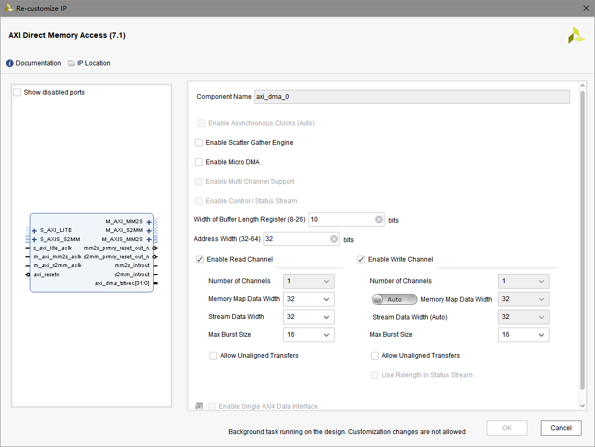

-   Scatter Gather Engine用于散内存传输，使用连续的虚拟内存地址映射至非连续的物理内存地址，效率较低并且使用更复杂，暂不研究

-   Micro DMA是简化的DMA，暂不研究

-   **Width of Buffer Length Register是DMA的32位传输长度寄存器中用于表示一次传输（Transfer）字节数目的位数，上图配置为10，表示调用传输函数一次最大传输的数据量为2^10^-1字节**
-   Max Burst Size表示axi_dma模块所有AXI接口可接受的最大的Burst数目，只有小于该值的Burst数目的传输才能被axi_dma模块正确解析。**在PS中一次transfer即为1个packet，只产生1个有效tlast，burst数目必须小于当前Max Burst Size的设置值**

在Block Design中的axi_dma端口如下：

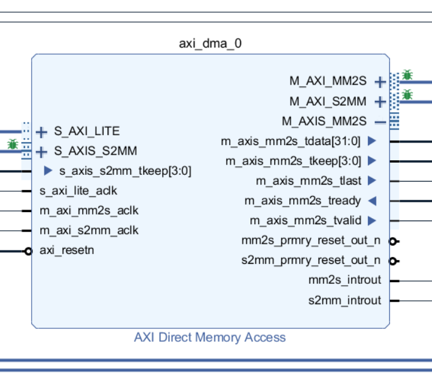

-   S_AXI_LITE：用于与PS端的AXI Master连接，接收PS的控制指令，执行DMA写入或者DMA接收
-   S_AXIS_S2MM：axi_dma模块的写接口，将数据从PL发送给PS
-   M_AXIS_MM2S：axi_dma模块的读接口，将数据从PS送入PL
-   M_AXI_S2MM：与PS的AXI SLAVE连接，用于PL向PS写入数据
-   M_AXI_MM2S：与PS的AXI SLAVE连接，用于PL读入PS数据
-   s2mm_introut：完成一次数据从PL发送给PS的Transfer后产生的中断信号，连接PS的PL中断接口
-   mm2s_introut：完成一次数据从PS送入PL的Transfer后产生的中断信号，连接PS的PL中断接口

注意：

*mm表示memory mapped，即内存映射，代表AXI_FULL协议，对应PS端的AXI接口*

*s表示stream，代码AXI_STREAM协议*

*AXIS中的S表示Stream*

**数据由PL至PS的工作流程：S2MM**

1.  PS通过S_AXI_LITE接口送入指令，指令包含目标内存地址，即memory map
2.  S_AXIS_S2MM的s_axis_s2mm_tready信号拉高，允许数据进入axi_dma模块，外部与之连接的MASTER可以通过该tready信号判断写入时机
3.  M_AXI_S2MM按照AXI_FULL的协议，用写指令将数据送给PS模块

**数据由PS至PL的工作流程：MM2S**

1.  PS通过S_AXI_LITE接口送入指令，指令包含数据源内存地址，即memory map
2.  M_AXI_MM2S按照AXI_FULL的协议，用读指令从PS模块中读出数据
3.  M_AXIS_MM2S将m_axis_mm2s_tvalid信号拉高，表示有数据可以送出，外部与之连接的SLAVE可以通过该tvalid信号判断读出时机

# AXI4-Stream Data FIFO

axi_dma不具备数据缓冲的能力，高速数据传输时PL很难完全配合PS发送DMA指令的时机，因此需要使用FIFO进行数据缓冲

本实验对PL至PS的数据进行FIFO缓冲

在Block Design中加入AXI4-Stream Data FIFO模块，进行如下图所示的配置

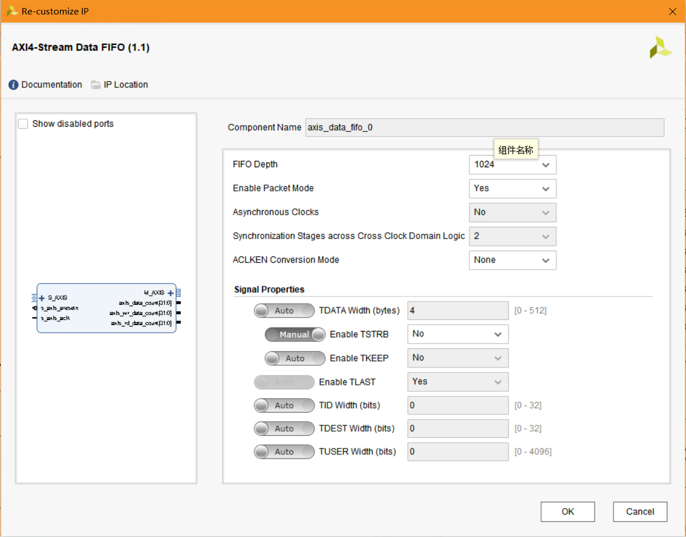

-   Enabele Packet Mode表示按Packet传输，见[AXI_STREAM的时序说明](#AXI_STREAM的时序)
-   Signal Porperties与FIFO出入数据的AXI接口对应就可以了
-   TID，TDEST，TUSER暂不考虑

在Block Design中的模块端口如下：

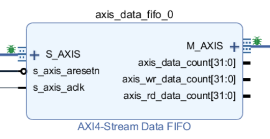

-   S_AXIS：数据写接口，FIFO可写入的情况下s_axis_tready信号会拉高，只要对端MASTER送入s_axis_tvalid高电平即可以进行数据写入
-   M_AXIS：数据读接口，FIFO数据可读出的情况下m_axis_tvalid信号会拉高，只要对端SLAVE送入m_axis_tready高电平即可进行数据读取
-   **读接口Packet中的Burst数目与写接口保持一致**

# 自定义数据源IP

在Vivado的Tools菜单，选择Create and Package New IP，建立Create a new AXI peripheral

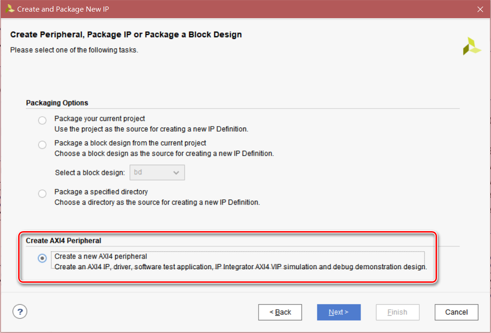

根据之前文档的说明建立AXI STREAM协议的Master接口模块

代码如下：**注意第39行及其注释，见[Block Design中的说明](#完整Block Design)**

```verilog

`timescale 1 ns / 1 ps

	module data_src_v1_0_M00_AXIS #
	(
		// Users to add parameters here

		// User parameters ends
		// Do not modify the parameters beyond this line

		// Width of S_AXIS address bus. The slave accepts the read and write addresses of width C_M_AXIS_TDATA_WIDTH.
		parameter integer C_M_AXIS_TDATA_WIDTH	= 32,
		// Start count is the number of clock cycles the master will wait before initiating/issuing any transaction.
		parameter integer C_M_START_COUNT	= 32
	)
	(
		// Users to add ports here

		// User ports ends
		// Do not modify the ports beyond this line

		// Global ports
		input wire  M_AXIS_ACLK,
		// 
		input wire  M_AXIS_ARESETN,
		// Master Stream Ports. TVALID indicates that the master is driving a valid transfer, A transfer takes place when both TVALID and TREADY are asserted. 
		output wire  M_AXIS_TVALID,
		// TDATA is the primary payload that is used to provide the data that is passing across the interface from the master.
		output wire [C_M_AXIS_TDATA_WIDTH-1 : 0] M_AXIS_TDATA,
		// TSTRB is the byte qualifier that indicates whether the content of the associated byte of TDATA is processed as a data byte or a position byte.
		output wire [(C_M_AXIS_TDATA_WIDTH/8)-1 : 0] M_AXIS_TSTRB,
		// TLAST indicates the boundary of a packet.
		output wire  M_AXIS_TLAST,
		// TREADY indicates that the slave can accept a transfer in the current cycle.
		input wire  M_AXIS_TREADY
	);
	
	//BURST数目，必须与axi_dma模块的s2mm一次transfer的数据量大小一致，目前在SDK中设置为128字节
	parameter BURST_NUM = 8'd32;
	
	//BUSRT数目减1，用于生成tlast
	//注意不能用计算公式用于比较判断，仿真正确，但是在Block Design中可能会自动扩位导致出错
	wire [7:0] BURST_NUM_M1;
	assign BURST_NUM_M1 = (BURST_NUM-8'd1);
	
	//导入时钟
	wire clk;
	assign clk = M_AXIS_ACLK;
	
	//导入复位
	wire rstn;
	assign rstn = M_AXIS_ARESETN;
	
	//定义输出端口
	reg tvalid = 1'b0;
	reg [31:0] tdata = 32'd0;
	reg tlast = 1'b0;
	
	assign M_AXIS_TVALID = tvalid;
	assign M_AXIS_TDATA = tdata;
	assign M_AXIS_TLAST = tlast;
	
	assign M_AXIS_TSTRB = 4'b1111;
	
	//burst计数器
	reg [7:0] cnt_burst = 8'd1;
	
	//测试状态机
	reg state = 1'b0;
	
	always @(posedge clk) begin
		if (rstn == 1'b0) begin
			state <= 1'b0;
		end
		else begin
			case (state)
				1'b0: begin
					if (cnt_burst == 8'd10) begin
						state <= 1;
					end
					else begin
						state <= state;
					end
				end
				
				1'b1: begin
					if ({tvalid, M_AXIS_TREADY, cnt_burst} == {1'b1, 1'b1, BURST_NUM}) begin
						state <= 1'b0;
					end
					else begin
						state <= state;
					end
				end
			endcase
		end
	end
	
	//计数器用于控制状态机转移
	always @(posedge clk) begin
		if (rstn == 1'b0) begin
			cnt_burst <= 8'd1;
		end
		else begin
			case (state)
				1'b0: begin
					if (cnt_burst == 8'd10) begin
						cnt_burst <= 8'd1;
					end
					else begin
						cnt_burst <= cnt_burst+8'd1;
					end
				end
				
				1'b1: begin
					if ({tvalid, M_AXIS_TREADY} == 2'b11) begin
						if (cnt_burst == BURST_NUM) begin
							//一次流传输最后1个burst被slave接收
							cnt_burst <= 8'd1;
						end
						else begin
							cnt_burst <= cnt_burst+8'd1;
						end
					end
					else begin
						cnt_burst <= cnt_burst;
					end
				end
				
				default: begin
					cnt_burst <= 8'd1;
				end
			endcase
		end
	end
	
	//输出接口
	always @(posedge clk) begin
		if (rstn == 1'b0) begin
			tvalid <= 1'b0;
			tdata <= 32'd0;
			tlast <= 1'b0;
		end
		else begin
			case (state)
				1'b1: begin
					if ({tvalid, M_AXIS_TREADY, cnt_burst} == {1'b1, 1'b1, BURST_NUM}) begin
						//与状态转移同步
						tvalid <= 1'b0;
					end
					else begin
						tvalid <= 1'b1;
					end
					
					//slave确认接收数据后，数值增1
					if ({tvalid, M_AXIS_TREADY} == 2'b11) begin
						tdata <= tdata+32'd1;
					end
					else begin
						tdata <= tdata;
					end
					
					//倒数第2个burst被接收
					if ({tlast, tvalid, M_AXIS_TREADY, cnt_burst} == {1'b0, 1'b1, 1'b1, BURST_NUM_M1}) begin
						tlast <= 1'b1;
					end
					else if ({tlast, tvalid, M_AXIS_TREADY, cnt_burst} == {1'b1, 1'b1, 1'b1, BURST_NUM}) begin
						//与状态转移同步
						tlast <= 1'b0;
					end
					else begin
						//保持
						tlast <= tlast;
					end
				end
				
				default: begin
					tvalid <= 1'b0;
					tlast <= 1'b0;
					tdata <= tdata;
				end
			endcase
		end
	end
	

	endmodule
```

关于上述代码有以下几点说明：

-   module关键字后接#的方式声明parameter可以让parameter被Block Design识别，在Block Design双击模块可以对parameter进行数值设置
-   无论输入输出端口都必须加上wire关键字声明

-   **上述代码第163行的cnt_burst与BURST_NUM_M1的比较不能在比较代码中用计算公式**
    -   **使用(BURST_NUM-8'd1)进行比较，可以正确仿真，但是Block Design的解析可能对计算进行了扩位，导致比较永不成立**，无法出现Packet要求的tlast
    -   tlast不存在，会导致axi_dma进行s2mm传输时出现Transfer指令后虽然可以接收数据但是无法结束的情况（在dma的状态寄存器SR中出现DMAIntErr），参考<https://forums.xilinx.com/t5/Embedded-Processor-System-Design/AXI-DMA-with-custom-AXI-streaming-IP-in-Zynq/td-p/303917>

# 配置PS模块

向Block Design添加Zynq模块，配置AXI端口

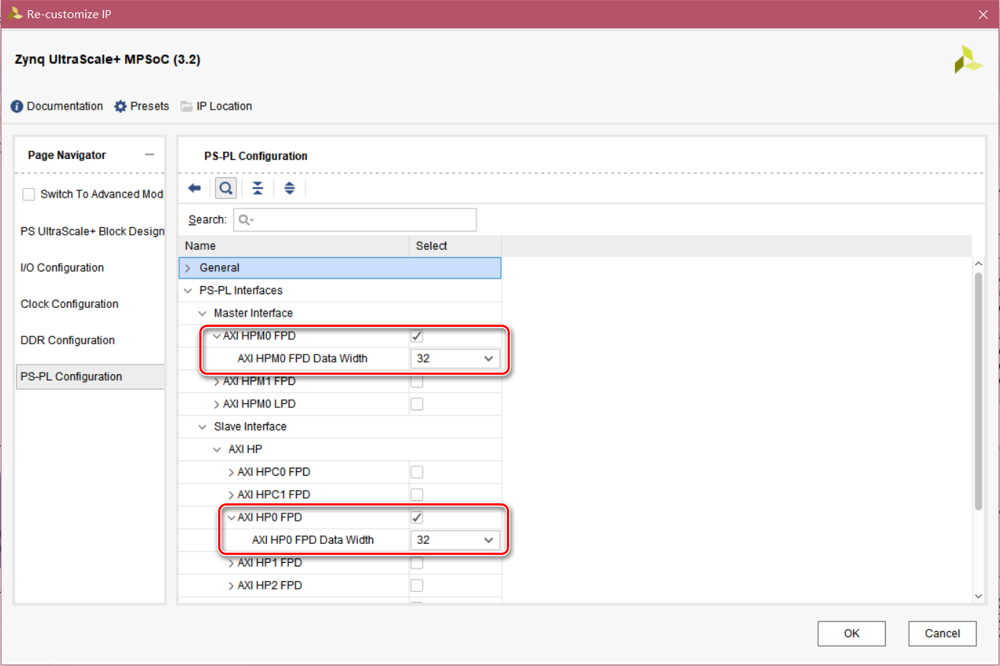

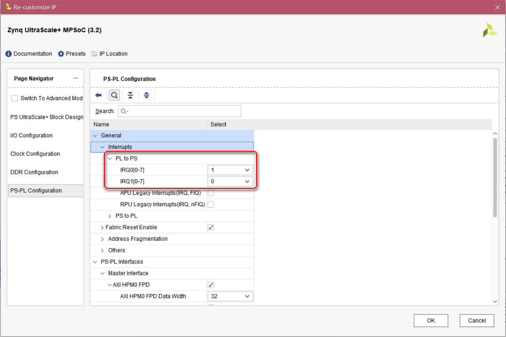

# 完整Block Design

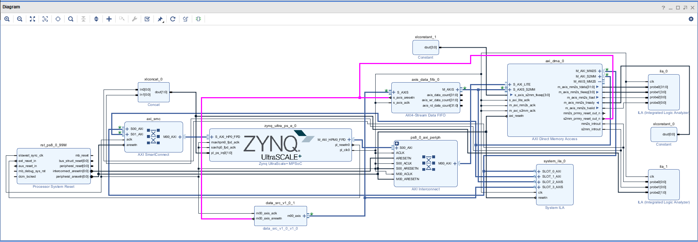

**上述设计有以下几点说明**：

1.  各模块的AXI接口由于模块本身设计可能不完全匹配，不是Master连Slave就可以正确工作的。尤其对于tkeep或者tstrb之类的信号，前者表示Packet中最后1个Burst中tdata总线上哪几个字节有效，如果传输数据量并非tdata字节数的整数倍则需要使用；后者表示每个Burst中tdata总线上哪几个字节有效。比如：上述设计中FIFO模块的M_AXIS不包含tkeep信号，而axi_dma模块的S_AXIS_S2MM包含tkeep，因此需要将axi_dma模块的s_axis_s2mm_tkeep连接常数4'b1111

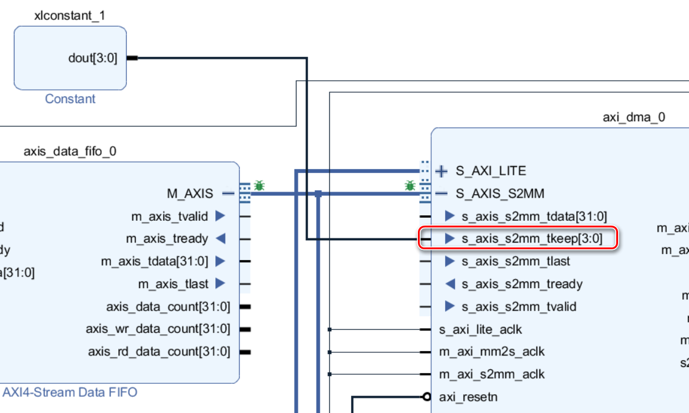

2.  axi_dma模块2个传输完成中断合并后接入PS的PL中断输入接口，方便PS编程处理


3.  S2MM传输的数据源和FIFO连接axi_dma模块的s2mm_prmry_reset_out_n复位信号（见Block Design中的紫色高亮信号线），理由如下：

    -   **注意注意：axi_dma模块S2MM传输的全部数据量对于其S_AXIS_S2MM端口而言必须是1个完整的Packet，完成的标志即s_axis_s2mm_tlast出现高电平，如果此时数据量不足PS传输指令的数据量，传输仍然结束并且通过dma的buffer length寄存器返回已传输的数据量**
    -   **axi_dma模块内部S2MM通道可以缓冲16字节的数据量，即复位结束后通过s_axis_s2mm_tready高电平可以收入16字节数据，如果数据源或者FIFO的复位与S2MM通道复位不同步，则axi_dma模块复位后数据可能丢失，而数据源却认为已经发送，导致数据量出错，从而S2MM传输错误**
    -   **AXI4-Stream Data FIFO模块的输入输出接口的Packet格式完全一样，即S_AXIS进入数据的Packet中Burst数目与M_AXIS送出数据的Packet中的Burst数目一样。于是数据源送出的Packet中的tlast的位置必须精确控制到与PS传输指令要求的数据量一致**

4.  在信号连线上右键选择Debug，可以将信号用于调试，如果根据Block Design的自动连接提示会将Debug信号连接至System ILA模块，与普通ILA模块的差别在于可以显示调试中AXI接口的状态

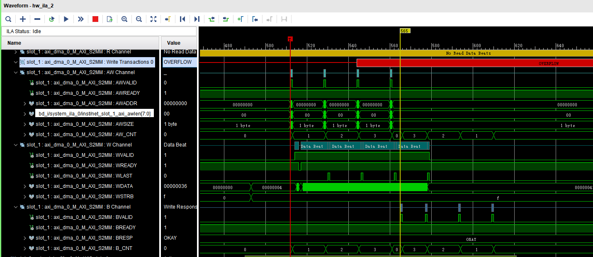

注意上图中红色的OVERFLOW提示，是由System ILA模块的Number Of Outstanding Read/Write Transactions决定的，传输Burst数目超过设置值即会出现，但是未发现调试数据出现异常

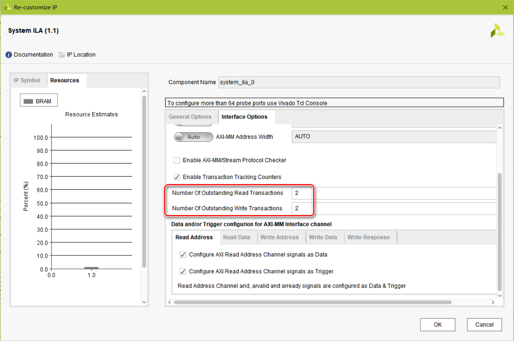

5.  axi_dma模块的M_AXIS_MM2S用于PS至PL的数据传输，由于数据仅用于查看，因此连接至ILA模块。为了保证数据持续输出，将m_axis_mm2s_tready信号连接常数1'b1

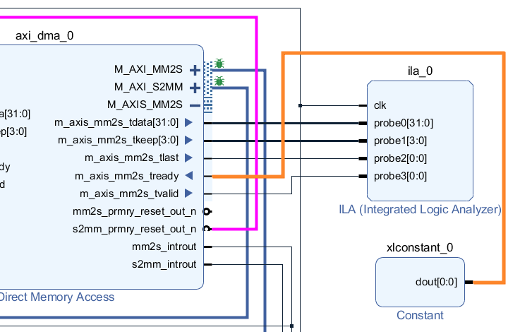

# PS编程

完成BIT文件生成后在Vivado的File菜单选择Export Hardware，并勾选Include bitstream（如果不选中则配置FPGA时需要手动添加）

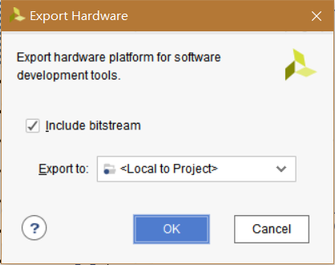

在File菜单选择Launch SDK，建立SDK工程

在SDK中建立APU0的helloworld模板工程

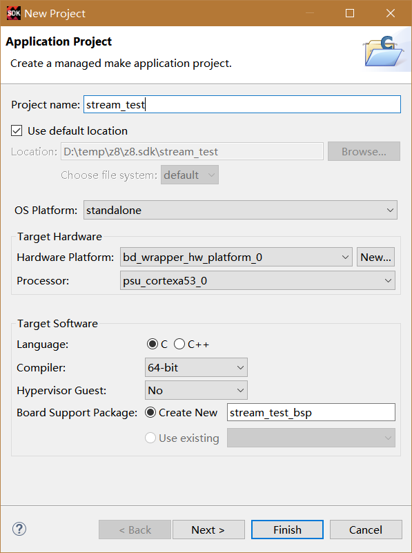

代码如下：

```c
#include <stdio.h>
#include "platform.h"
#include "xil_printf.h"
#include "xaxidma.h"
#include "xscugic.h"
#include "sleep.h"

//DDR内存范围内设置DMA发送和接收缓冲区
#define MEM_BASE_ADDR		0x01000000
#define TX_BUFFER_BASE		(MEM_BASE_ADDR + 0x00100000)
#define RX_BUFFER_BASE		(MEM_BASE_ADDR + 0x00300000)
#define TRANS_SIZE 128//发送字节数目，必须小于axi_dma模块IP配置的width of buffer length register对应的缓冲大小2^width-1，并且transfer的数据量即为一次AXI_Stream的packeto数据量

u8 *TxBufferPtr = (u8*)TX_BUFFER_BASE;
u8 *RxBufferPtr = (u8*)RX_BUFFER_BASE;

//中断使用的标志变量不能cache
volatile int TxDone;
volatile int RxDone;
volatile int Error;

/* Timeout loop counter for reset
 */
#define RESET_TIMEOUT_COUNTER	10000

//中断函数声明为static，可以加快速度
static void handler_tx(void* Callback)
{
	printf("handler_tx\n\r");
	//连接中断响应函数时设置Callback为axi_dma对象
	XAxiDma* AxiDmaInst = (XAxiDma*)Callback;

	//取出当前中断
	u32 IrqStatus;
	IrqStatus = XAxiDma_IntrGetIrq(AxiDmaInst, XAXIDMA_DMA_TO_DEVICE);

	//确认当前中断被接收
	XAxiDma_IntrAckIrq(AxiDmaInst, IrqStatus, XAXIDMA_DMA_TO_DEVICE);

	//未收到有效中断
	if (!(IrqStatus & XAXIDMA_IRQ_ALL_MASK)) {

		return;
	}

	//收到中断提示为错误
	if ((IrqStatus & XAXIDMA_IRQ_ERROR_MASK)) {
		//设置错误标记
		Error = 1;

		//复位dma，直到完成才退出中断响应函数
		XAxiDma_Reset(AxiDmaInst);

		//看门狗控制复位完成等待
		int TimeOut = RESET_TIMEOUT_COUNTER;
		while (TimeOut)
		{
			if (XAxiDma_ResetIsDone(AxiDmaInst))
			{
				break;
			}
			TimeOut -= 1;
		}

		return;
	}

	//当前中断类型为传输完成，表示tx传输结束
	if ((IrqStatus & XAXIDMA_IRQ_IOC_MASK)) {
		TxDone = 1;
	}
}

static void handler_rx(void* Callback)
{
	printf("handler_rx\n\r");
	//连接中断响应函数时设置Callback为axi_dma对象
	XAxiDma* AxiDmaInst = (XAxiDma*)Callback;

	//取出当前中断
	u32 IrqStatus;
	IrqStatus = XAxiDma_IntrGetIrq(AxiDmaInst, XAXIDMA_DEVICE_TO_DMA);

	//确认当前中断被接收
	XAxiDma_IntrAckIrq(AxiDmaInst, IrqStatus, XAXIDMA_DEVICE_TO_DMA);

	//未收到有效中断
	if (!(IrqStatus & XAXIDMA_IRQ_ALL_MASK)) {

		return;
	}

	//收到中断提示为错误
	if ((IrqStatus & XAXIDMA_IRQ_ERROR_MASK)) {
		//设置错误标记
		Error = 1;

		//复位dma，直到完成才退出中断响应函数
		XAxiDma_Reset(AxiDmaInst);

		//看门狗控制复位完成等待
		int TimeOut = RESET_TIMEOUT_COUNTER;
		while (TimeOut)
		{
			if (XAxiDma_ResetIsDone(AxiDmaInst))
			{
				break;
			}
			TimeOut -= 1;
		}

		return;
	}

	//当前中断类型为传输完成，表示tx传输结束
	if ((IrqStatus & XAXIDMA_IRQ_IOC_MASK)) {
		RxDone = 1;
	}
}

int main()
{
    printf("axi stream test begins\n\r");

    //需要中断响应函数中响应其指针，因此定义为静态全局变量
    XAxiDma axi_dma;
    XScuGic intc;

    //查找axi_dma配置
    XAxiDma_Config* dma_config = NULL;
    dma_config = XAxiDma_LookupConfig(XPAR_AXIDMA_0_DEVICE_ID);
    if (dma_config == NULL)
    {
    	printf("XAxiDma_LookupConfig failed\n\r");
    }

    //axi_dma初始化
    int status = -1;

    status = XAxiDma_CfgInitialize(&axi_dma, dma_config);
    if (status != XST_SUCCESS)
    {
    	printf("XAxiDma_CfgInitialize failed\n\r");
    }
    else
    {
    	printf("XAxiDma_CfgInitialize passed\n\r");
    }

    //查找中断配置
    XScuGic_Config* intc_config = NULL;
    intc_config = XScuGic_LookupConfig(XPAR_SCUGIC_SINGLE_DEVICE_ID);
    if (intc_config == NULL)
    {
    	printf("XScuGic_LookupConfig failed\n\r");
    }

    //中断初始化
    status = XScuGic_CfgInitialize(&intc, intc_config, intc_config->CpuBaseAddress);
    if (status != XST_SUCCESS)
    {
    	printf("XScuGic_CfgInitialize failed\n\r");
    }

    //设置中断优先级和触发方式
	//优先级0xA0，触发方式0x3表示上升沿触发
	XScuGic_SetPriorityTriggerType(&intc, XPAR_FABRIC_AXI_DMA_0_MM2S_INTROUT_INTR, 0xA0, 0x3);
	XScuGic_SetPriorityTriggerType(&intc, XPAR_FABRIC_AXI_DMA_0_S2MM_INTROUT_INTR, 0xA0, 0x3);

	//绑定axi_dma中断响应函数
	//将axi_dma作为中断函数参数
	status = XScuGic_Connect(&intc, XPAR_FABRIC_AXI_DMA_0_MM2S_INTROUT_INTR, (Xil_InterruptHandler)handler_tx, &axi_dma);
	if (status != XST_SUCCESS)
	{
		printf("XScuGic_Connect failed\n\r");
	}

	status = XScuGic_Connect(&intc, XPAR_FABRIC_AXI_DMA_0_S2MM_INTROUT_INTR, (Xil_InterruptHandler)handler_rx, &axi_dma);
	if (status != XST_SUCCESS)
	{
		printf("XScuGic_Connect failed\n\r");
	}

	XScuGic_Enable(&intc, XPAR_FABRIC_AXI_DMA_0_MM2S_INTROUT_INTR);
	XScuGic_Enable(&intc, XPAR_FABRIC_AXI_DMA_0_S2MM_INTROUT_INTR);

	//使能硬件中断
	Xil_ExceptionInit();
	Xil_ExceptionRegisterHandler(XIL_EXCEPTION_ID_INT, (Xil_ExceptionHandler)XScuGic_InterruptHandler, &intc);
	Xil_ExceptionEnable();

	//axi_dma使能中断，依据示例程序先禁用再使能
	/* Disable all interrupts before setup */
	XAxiDma_IntrDisable(&axi_dma, XAXIDMA_IRQ_ALL_MASK, XAXIDMA_DMA_TO_DEVICE);
	XAxiDma_IntrDisable(&axi_dma, XAXIDMA_IRQ_ALL_MASK, XAXIDMA_DEVICE_TO_DMA);
	/* Enable all interrupts */
	XAxiDma_IntrEnable(&axi_dma, XAXIDMA_IRQ_ALL_MASK, XAXIDMA_DMA_TO_DEVICE);
	XAxiDma_IntrEnable(&axi_dma, XAXIDMA_IRQ_ALL_MASK, XAXIDMA_DEVICE_TO_DMA);

	//中断标志变量初始化
	TxDone = 0;
	RxDone = 0;
	Error = 0;

	//发送数值
	u8 tx_val = 255;

	u32 sr;//状态寄存器
	u32 trans_len_r;//传输长度寄存器

	while (1)
	{
		//设置发送缓冲数值
		memset(TxBufferPtr, tx_val, TRANS_SIZE);
		tx_val += 1;

		//cache中数据进入内存用于DMA发送
		Xil_DCacheFlushRange((INTPTR)TxBufferPtr, TRANS_SIZE);

		sr = XAxiDma_ReadReg(axi_dma.TxBdRing.ChanBase, XAXIDMA_SR_OFFSET);
		trans_len_r = XAxiDma_ReadReg(axi_dma.TxBdRing.ChanBase, XAXIDMA_BUFFLEN_OFFSET);

		//启动发送dma
		status = XAxiDma_SimpleTransfer(&axi_dma, (UINTPTR)TxBufferPtr, TRANS_SIZE, XAXIDMA_DMA_TO_DEVICE);
		if (status != XST_SUCCESS)
		{
			printf("XAxiDma_SimpleTransfer XAXIDMA_DMA_TO_DEVICE failed\n\r");
			return XST_FAILURE;
		}

		sr = XAxiDma_ReadReg(axi_dma.TxBdRing.ChanBase, XAXIDMA_SR_OFFSET);
		trans_len_r = XAxiDma_ReadReg(axi_dma.TxBdRing.ChanBase, XAXIDMA_BUFFLEN_OFFSET);

		usleep(10000);

		sr = XAxiDma_ReadReg(axi_dma.TxBdRing.ChanBase, XAXIDMA_SR_OFFSET);
		trans_len_r = XAxiDma_ReadReg(axi_dma.TxBdRing.ChanBase, XAXIDMA_BUFFLEN_OFFSET);

//		//Poll等待发送完成，无论是否使能中断，使能中断时无论是否响应中断，都可以正常工作
//		while (XAxiDma_Busy(&axi_dma, XAXIDMA_DMA_TO_DEVICE))
//		{
//			;
//		}

		//Interrupt等待发送完成
		while (TxDone == 0)
		{
			;
		}
		TxDone = 0;

		if (Error == 1)
		{
			printf("handler_tx error\n\r");
			return XST_FAILURE;
		}

		sr = XAxiDma_ReadReg(axi_dma.RxBdRing[0].ChanBase, XAXIDMA_SR_OFFSET);
		trans_len_r = XAxiDma_ReadReg(axi_dma.RxBdRing[0].ChanBase, XAXIDMA_BUFFLEN_OFFSET);

		//启动接收dma
		status = XAxiDma_SimpleTransfer(&axi_dma, (UINTPTR)RxBufferPtr, TRANS_SIZE, XAXIDMA_DEVICE_TO_DMA);
		if (status != XST_SUCCESS)
		{
			printf("XAxiDma_SimpleTransfer XAXIDMA_DMA_TO_DEVICE failed\n\r");
			return XST_FAILURE;
		}

		sr = XAxiDma_ReadReg(axi_dma.RxBdRing[0].ChanBase, XAXIDMA_SR_OFFSET);
		trans_len_r = XAxiDma_ReadReg(axi_dma.RxBdRing[0].ChanBase, XAXIDMA_BUFFLEN_OFFSET);

		usleep(10000);

		sr = XAxiDma_ReadReg(axi_dma.RxBdRing[0].ChanBase, XAXIDMA_SR_OFFSET);
		trans_len_r = XAxiDma_ReadReg(axi_dma.RxBdRing[0].ChanBase, XAXIDMA_BUFFLEN_OFFSET);

//		//Poll等待发送完成，无论是否使能中断，使能中断时无论是否响应中断，都可以正常工作
//		while (XAxiDma_Busy(&axi_dma, XAXIDMA_DEVICE_TO_DMA))
//		{
//			;
//		}

		//Interrupt等待接收完成
		while (RxDone == 0)
		{
			;
		}
		RxDone = 0;

		if (Error == 1)
		{
			printf("handler_rx error\n\r");
			return XST_FAILURE;
		}

		//cache中数据进入内存
		//XAXIDMA_DEVICE_TO_DMA传输时，DEVICE数据首先进入cache
		//如果要debug查看内存中数值，则需要先flush cache
		//如果只是取用数据，则不必要flush
		Xil_DCacheFlushRange((INTPTR)RxBufferPtr, TRANS_SIZE);

		sleep(1);
	}

	//关闭中断
	XScuGic_Disconnect(&intc, XPAR_FABRIC_AXI_DMA_0_MM2S_INTROUT_INTR);
	XScuGic_Disconnect(&intc, XPAR_FABRIC_AXI_DMA_0_S2MM_INTROUT_INTR);

    return 0;
}

```

上述代码有几点需要注意的内容：

1.  代码第12行：设置一次传输的数据量，[必须小于axi_dma的buffer length register的宽度所决定的数据量](#AXI Direct Memory Access)。并且[必须与PL端数据源发送的Packet大小一致](#完整Block Design)
2.  代码第18行：中断响应函数中进行设置并且在main函数中使用的变量不能cache，必须加上volatile声明，否则可能判断出错
3.  代码第24行：手动复位axi_dma模块需要加上看门狗，保证复位结束才能正常工作
4.  代码第239至250行，277至288行：传输完成有2种方式，用XAxiDma_Busy函数Poll轮询或者中断响应，根据实际需要选择使用。需要特别说明的是轮询方式无论中断是否使能，以及使能以后是否响应都可以正常工作
5.  代码第218行和300行：Xil_DCacheFlushRange用于将cache中的数据flush冲入内存。之前没想到的是，**XAXIDMA_DEVICE_TO_DMA传输时数据首先会进入cache**
6.  **注意：中断响应函数在debug模式下不会进入，只有run模式才能进入中断响应函数！！！！！**