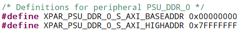
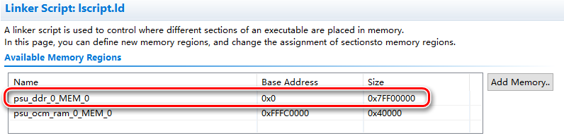
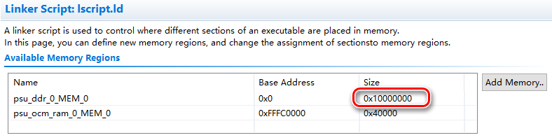

PS工程建立后在BSP工程的在xparameters.h文件中定义了可访问的DDR内存空间范围

需要注意的是，此空间范围包括两个部分，**程序指令空间和用户空间**

在编程时如果将数据写入程序指令空间则可能出现不可理解的异常状况，因此**程序中读写DDR内存应当尽量避开程序指令空间**

**程序指令空间的定义在工作工程的linker script文件lscript.ld中**

双击打开lscript.ld文件

默认建立的PS工程的程序指令空间分配如下图：

与完整的DDR内存空间相比，可以发现程序指令空间几乎占满全部内存空间

可用的用户空间只有0x7FF00000~0x7FFFFFFF，共计1MB

对于功能比较复杂的程序而言完全不够用，因此需要减少程序指令空间

**直接在lscript.ld文件中双击修改Size即可**

如果工作工程Build正确，则表示当前程序指令空间Size足够，否则Build失败