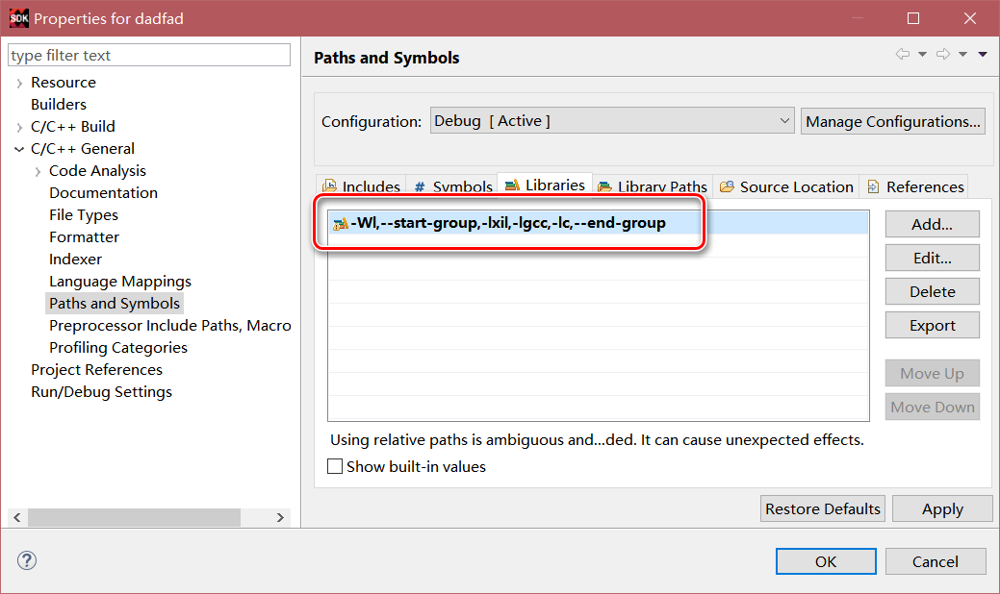
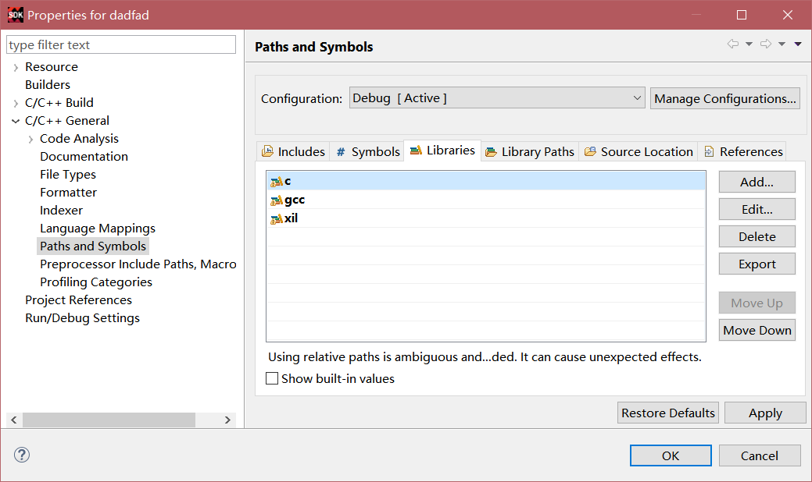
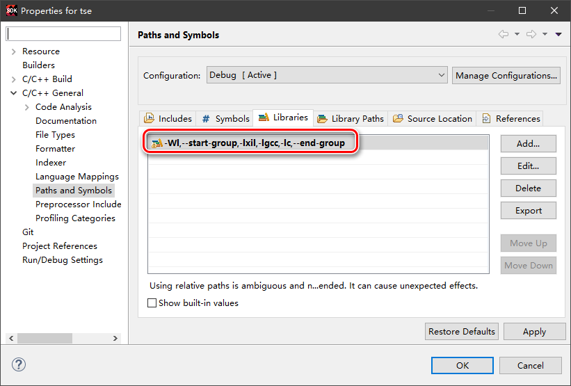
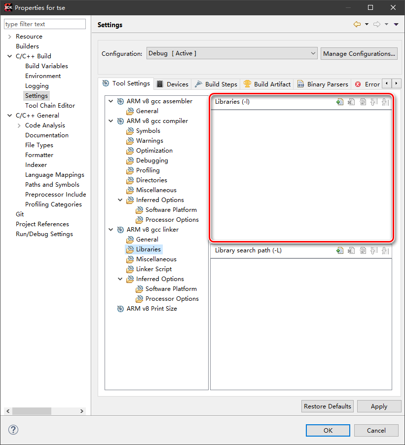
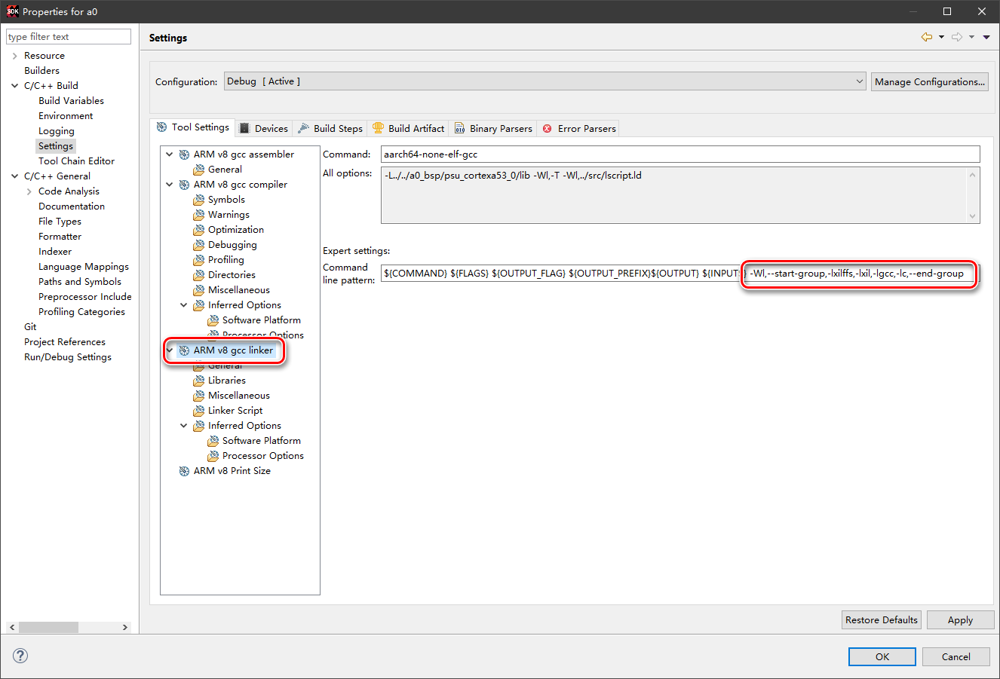
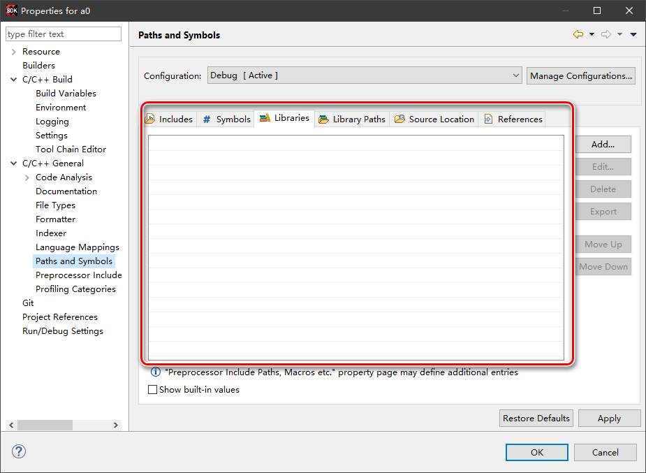
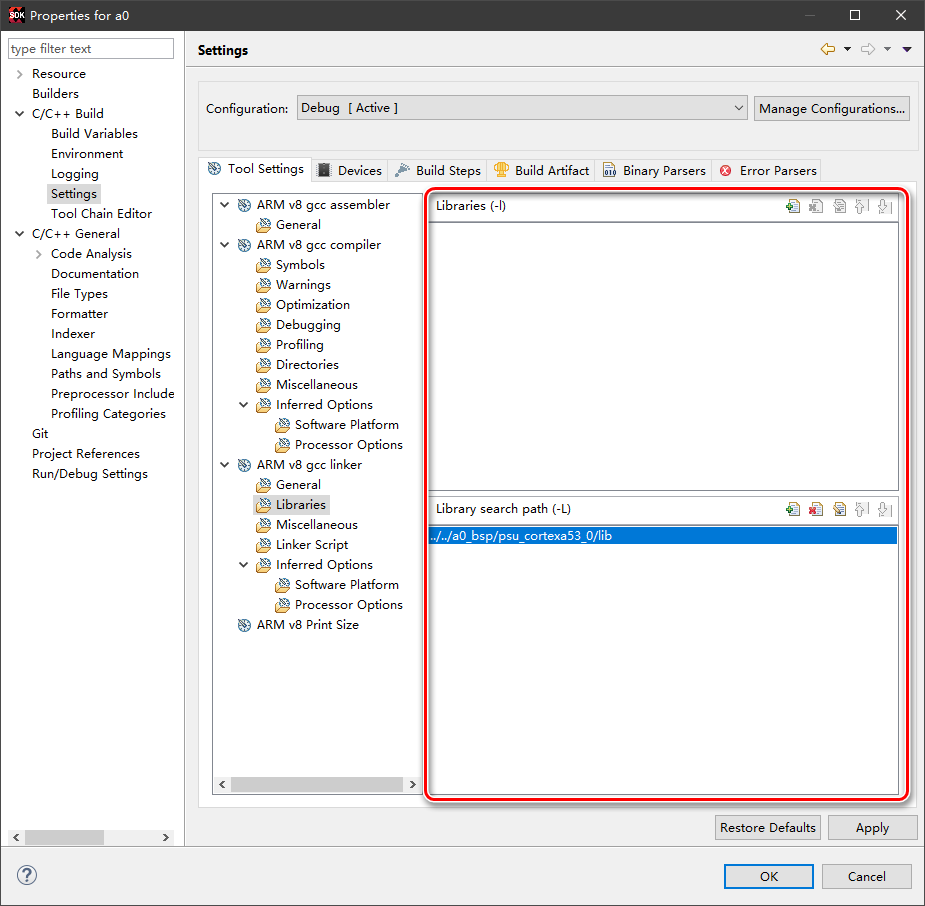

**在SDK中开发PS程序时，如果改动工程配置中的Path and Symbols中Libraires参数，则可能出现链接时undefined reference的错误**

因为添加的静态库失效，没有链接，原因在于改动Libraries之后，gcc的链接指令多出一个-l指令，与SDK建立工程时默认的Libraries的指令格式不匹配，导致链接失败

比如新建工程时，在工程上右键菜单选择Properties，弹出的属性窗口内打开Paths and Symbols，进入Libraries页

可以看到默认使用-Wl添加了xil, gcc和c这3个静态库

如果点击Cancel按钮关闭窗口，Build工程时链接指令为

>   aarch64-none-elf-gcc -Wl,-T -Wl,../src/lscript.ld -L../../dadfad_bsp/psu_cortexa53_0/lib -o "dadfad.elf"  ./src/helloworld.o ./src/platform.o   ==-Wl,--start-group,-lxil,-lgcc,-lc,--end-group==

链接正确，生成elf文件

如果点击OK按钮关闭窗口（没有任何改动），则Build工程师链接指令变为

>aarch64-none-elf-gcc -L../../dadfad_bsp/psu_cortexa53_0/lib -Wl,-T -Wl,../src/lscript.ld -o "dadfad.elf"  ./src/helloworld.o ./src/platform.o   ==-l-Wl,--start-group,-lxil,-lgcc,-lc,--end-group==

错误提示为

>d:/xilinx/sdk/2018.2/gnu/aarch64/nt/aarch64-none/bin/../lib/gcc/aarch64-none-elf/7.2.1/../../../../aarch64-none-elf/bin/ld.exe: cannot find -l-Wl,--start-group,-lxil,-lgcc,-lc,--end-group
>collect2.exe: error: ld returned 1 exit status
>make: *** [dadfad.elf] 错误 1

与正确的链接指令的差异在于在-Wl之前多出了-l，导致出现不可识别的指令，因此链接失败

**解决办法：**

删除默认的Libraries配置语句，改成常规的顺序添加方式，**注意静态库之间的依赖顺序**

链接指令变为：

>   aarch64-none-elf-gcc -L../../dadfad_bsp/psu_cortexa53_0/lib -Wl,-T -Wl,../src/lscript.ld -o "dadfad.elf"  ./src/helloworld.o ./src/platform.o   ==-lc -lgcc -lxil==

链接正确完成

# 前述方法仍不能解决的编译错误

SDK配置库时有两个位置工程Properties窗口的C/C++ General>Paths and Symbols页和C/C++ Build>Settings>ARM v8 gcc linker>Libraries页

新建工程时，编译正确

Paths and Symbols页有正确配置如下：

Libraries页没有配置内容：

如果在Paths and Symbols页点击OK或者Apply，则会出现如下错误

>aarch64-none-elf-gcc -L../../tse_bsp/psu_cortexa53_1/lib -Wl,-T -Wl,../src/lscript.ld -o "tse.elf"  ./src/helloworld.o ./src/platform.o   -l-Wl,--start-group,-lxil,-lgcc,-lc,--end-group
>d:/program/xilinx/sdk/2018.2/gnu/aarch64/nt/aarch64-none/bin/../lib/gcc/aarch64-none-elf/7.2.1/../../../../aarch64-none-elf/bin/ld.exe: cannot find -l-Wl,--start-group,-lxil,-lgcc,-lc,--end-group
>collect2.exe: error: ld returned 1 exit status
>make: *** [tse.elf] 错误 1

与前述错误一致，因为上述操作会在Libraries页产生配置内容：

如果按照新建工程时Libraries页配置为无内容，修改后Paths and Symbols页也同步被删除内容，导致编译出错。

按前文所述的办法修改后，可以解决问题。

但是在某些情况下仍然会出现不可理解的编译错误，比如：

>aarch64-none-elf-gcc -L../../a0_bsp/psu_cortexa53_0/lib -Wl,-T -Wl,../src/lscript.ld -o "a0.elf" ./src/dma_wrapper.o ./src/main.o ./src/sd_file_wrapper.o -lxilffs -lc -lgcc -lxil
>d:/program/xilinx/sdk/2018.2/gnu/aarch64/nt/aarch64-none/bin/../aarch64-none-elf/libc/usr/lib\libc.a(lib_a-sbrkr.o): In function `_sbrk_r':
>sbrkr.c:(.text+0x1c): undefined reference to `_sbrk'
>collect2.exe: error: ld returned 1 exit status
>make: *** [a0.elf] 错误 1

发现在BSP工程添加或者删除功能库（比如xilffs），引起BSP重新编译，并且工作工程的编译配置回复到新建工程时的状态，这种情况下编译正确。

但是如果在工作工程手动添加或者删除功能库的话，将又会出现前述的编译错误。

为了解决这个问题，**需要直接修改linker的命令行，添加命令行参数-Wl,--start-group,-lxilffs,-lxil,-lgcc,-lc,--end-group**

并且在Paths and Symbols页删除Libraries的全部内容

完成后的Libraries页内容如下：

**如果工作工程后续需要增删功能库，同样也只能以linker命令行的方式修改**

上述方法可以实现正确编译。