[TOC]

### 声明

本文由笔者本人原创完成，部分文字内容或者图片来源于网络，如涉及侵权请联系本人删除。

本文全部内容仅经过本人有限验证，不能保证内容完全正确，在实际项目中应用仍需根据应用场景自行修改并进行完备测试。

### 概述

目前实时图像处理的硬件主要是 FPGA、GPU 和 DSP 三类。从笔者的开发经验来看，FPGA 以其实时性和灵活性占据主流；GPU 虽然不及DSP应用广泛，但是随着开发技术逐步升级和性能逐步提升，以及 DSP 技术自身的没落（个人观点，不讨论），GPU 在某些特定场景下可能是更优于 FPGA 的首选。

本文主要说明基于 Xilinx FPGA 的实时图像处理。虽然 FPGA 开发用的 HDL 语言与 Intel FPGA（前身 Altera）通用，但是比较开发工具软件差异的话，还是 Xilinx 开发效率更高。

本文相关程序的开发软件环境为：

- Vivado 2018.2.1 System Edition
- Matlab 2017b

算法中的计算部分主要使用 Vivado 中的 System Generator 工具软件（下文简称sysgen），其具体使用方法见 Xilinx 官方文档：UG897 和 UG958。

sysgen 的开发基于 Matlab 的 Simulink 环境，使用 Xilinx 提供的功能模块在图形化界面进行 FPGA 开发，从原理上来说是**使用图像化的功能模块来模拟 HDL 语言的功能**。

Xilinx 的原文说的是 *Model Based DSP Design*，虽然主要应用于 DSP（数字信号处理），不是 ISP（Image Signal Processing），但是数字图像也是数字信号的一种，计算方法和原理差异不大。

使用 sysgen 的好处在于直观的图形开发环境以及与 Matlab 环境的完美融合，在仿真激励的生成和仿真结果分析时可以直接使用 Matlab 强大的数学计算库。相比较传统的基于 HDL 的仿真使用数据文件进行数据导入导出后才能进行仿真处理，sysgen 可以将这部分过程直接融入仿真流程，大幅减少了仿真的工作量。但是 sysgen 相比较灵活的 HDL 语言，也有一个比较大的劣势在于很难实现复杂的 FPGA 逻辑（比如状态机）。

除了 sysgen 以外，Xilinx 还有许多基于高级语言（c 语言，相较于 HDL 语言）的新的开发工具软件，如 HLS、SDSoc 等，笔者接触不多（无实际项目经验），但是直觉上认为这些软件只是用于降低 FPGA 的入门难度，*提升开发效率，却在运行效率上做出了较大的妥协*。随着编译器（或者综合工具）技术的提升，未来一定会成为 FPGA 开发的主流，但是现阶段还是有限使用为好。

本文主要分为3个部分，首先说明了基本设计原则，包括代码、端口定义和数据缓冲等；之后是本文的主要内容，包括常用功能模块和常用算法模块。

注意：本文内容全部源于笔者自身的设计经验，并非“标准答案”，也许有更好的设计方法，欢迎各位朋友讨论。

### 基本设计原则

#### Verilog + sysgen

本文的全部设计使用 Verilog 语言，每个算法模块都以 Verilog 语言模块包含 sysgen IP 的方式构成。

根据 Verilog 和 sysgen 各自的开发优势，由 Verilog 负责复杂的逻辑处理（数据缓冲、状态机、参数更新等），由 sysgen 负责数值计算。

#### 图像数据流水线格式

所有的图像处理算法按顺序串联成流水线依次执行，流水线上的图像数据使用统一的格式。

```verilog
//输入图像数据
input [7:0] in_pix;//输入像素值，如果单通道灰度则只有1个端口in_gray，如果3通道RGB，则有3个并行端口in_r/in_g/in_b；数据位宽根据实际情况设置
input in_fv;//输入高电平有效帧同步，表示in_pix在1帧图像内的范围；上升沿与1帧内首个lv上升沿对齐，下降沿与1帧内最后1个lv下降沿对齐；2帧之间fv至少有1个时钟周期的低电平
input in_lv;//输入高电平有效行同步，表示in_pix在1行图像数据内的范围；2行之间lv至少有1个时钟周期的低电平
input [15:0] in_x;//输入列坐标，如果列数目为COLS，则数值范围0~(COLS-1)；为保证通用性，数据位宽固定为16位；在fv与lv同时有效时数值有效，不考虑非有效情况下的坐标值
input [15:0] in_y;//输入行坐标，如果行数目为ROWS，则数值范围0~(ROWS-1)；为保证通用性，数据位宽固定为16位；在fv与lv同时有效时数值有效，不考虑非有效情况下的坐标值
//输出图像数据
output [7:0] out_pix;
output out_fv;
output out_lv;
output [15:0] out_x;
output [15:0] out_y;
```

#### 参数更新流程

如果对于单帧图像数据精确性要求不高，在不会导致进出算法模块数据流错误的情况下（即不影响上下游算法模块），算法模块可以从模块端口直接取用参数。

但是如果对于单帧图像数据精确性较高要求，则参数更新流程应当保证在一帧图像计算过程中参数值固定不变。

典型的算法模块参数端口定义如下：

```verilog
input param_valid;//高有效参数有效标记，在外部模块或者外围设备更新参数开始之前，将valid信号置为低电平无效，所有参数更新完成后将valid信号回复高电平有效
input param_en;//高有效算法使能，在算法非使能情况下，将输入图像数据直接送出至输出端口；在非使能情况下，是否与使能情况下保持一致的数据延迟根据项目需求而定
input [7:0] param_a;//根据算法原理定义的1个或者多个算法参数；如果有浮点数参数，在Verilog中不作特殊处理，而是参数进入sysgen后将其定义为浮点数
input [31:0] param_b;
```

外部模块或者外围设备更新参数的流程：

1. valid 信号置为低电平；
2. 更新全部参数值；
3. valid 信号置为高电平，表示参数有效。

算法模块内，对包括算法使能参数在内的全部算法参数定义对应的参数寄存器，算法模块使用参数寄存器中的参数值，而不是模块端口的参数值。在**输入 fv（in_fv）的下降沿（不是输出fv）**处检查 valid 信号是否有效：如果为高电平有效，则将当前模块端口的参数值写入参数寄存器；如果为低电平无效，则保持当前参数寄存器值。

注意：valid 信号即可以针对当前项目中所有的算法参数，也可以为每个算法单独定义 valid 信号。但是每个算法独立的 valid 信号没有必要，因为在单独更新某一个算法的参数过程中，如果其它算法模块发现 valid 无效依然会保持其原有的参数寄存器值，不受参数更新影响，在参数更新完成后，也只有指定的算法模块参数被新参数替换。

#### 片外缓冲设计

许多图像处理算法或者输入输出逻辑都需要进行数据缓冲，如果 FPGA 片上 RAM 资源足够，使用 RAM 缓冲数据当然是最理想的情况，但是大多数情况需要缓冲的数据量实在太大。

因此片外 DDR 数据缓冲基本上是 FPGA 图像处理的标配。

这种情况下 DDR 缓冲的数据读写，及其与算法或者输入输出流程的匹配将是除图像算法以外最复杂的逻辑设计。

DDR 缓冲逻辑为了保证读写效率，必须与算法及数据流深度耦合，因此几乎没有太大的通用性考量，但是**所有的片外缓冲设计必须包含数据流反压**，数据流下游模块在处理不及时的情况下必须要求上游模块暂停数据下传，否则将造成数据丢失，甚至破坏整个图像处理的数据流水线。

### 基础功能模块

本章节说明几个在多种图像算法中都需要使用的基础功能模块，为了与 sysgen 的图像算法实现相匹配，以下模块全部使用 sysgen 设计。

#### 行列坐标生成

虽然在[图像数据流水线中已包含行列坐标](#图像数据流水线格式)，但是一些算法由于其本身的设计必须由行有效信号 lv 重新生成行列坐标。

令图像的列数目为 COLS，行数目为 ROWS。

列坐标范围 0~(COLS-1)。

行坐标范围 0~(ROWS-1)。

基本设计思想是使用 2 个计数器分别计算列坐标和行坐标，当列坐标计数器计数至最大列坐标时，行坐标值增 1 。

模块 Subsystem 封装后如下所示：

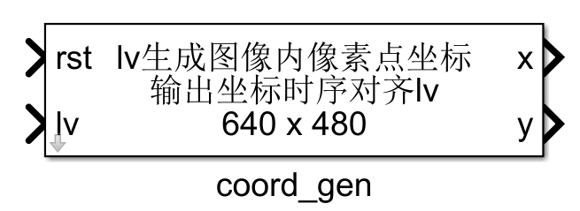

rst 用于复位坐标计数，lv 为输入的行有效信号，x 和 y 分别为输出的列坐标与行坐标。

在 Subsystem 的 mask 中定义列数目 cols 变量和行数目 rows 变量：

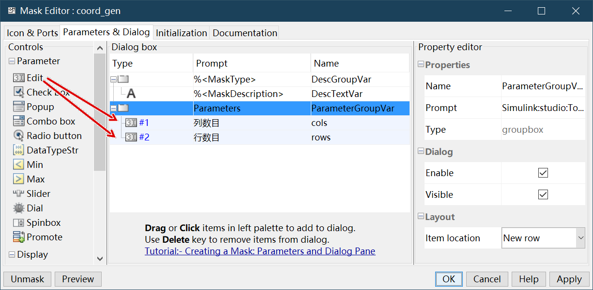

双击 Subsystem 弹出参数设置窗口：

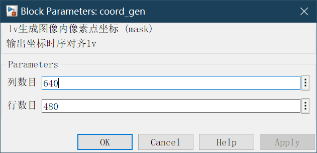

列坐标计数器的配置如下：

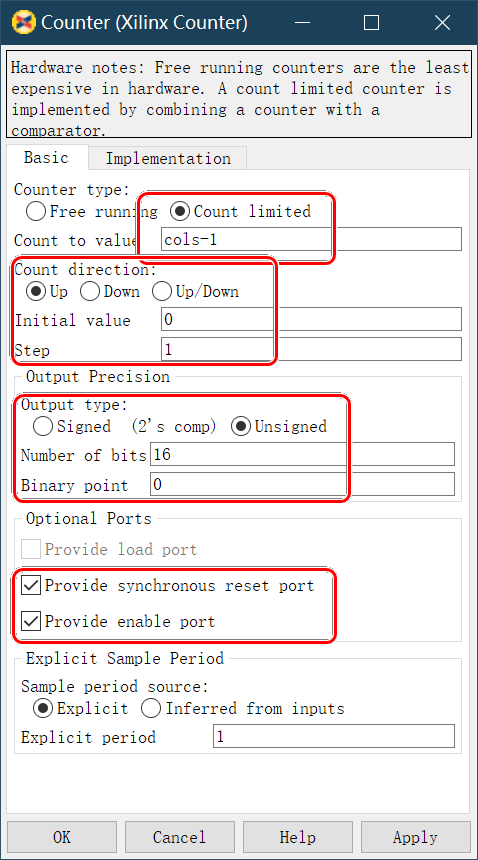

行坐标计数器配置如下：

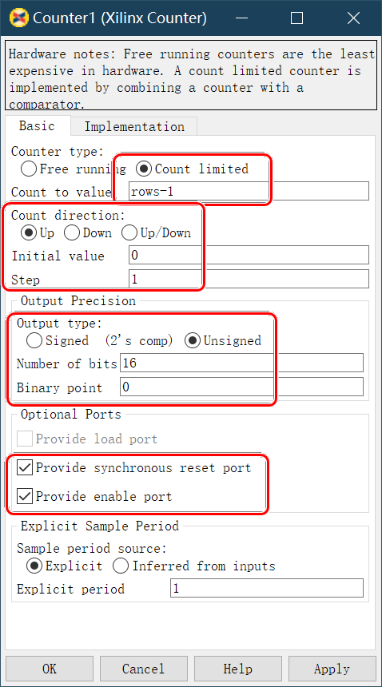

完整设计：

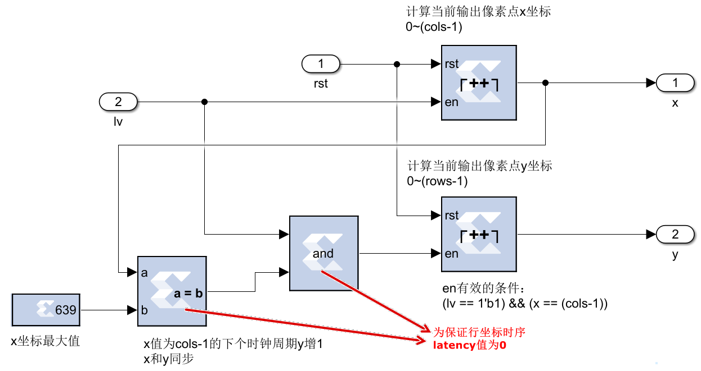

#### 浮点数与无符号整数转换

图像处理算法在 sysgen 中实现，大多使用定点整数计算，并且为了与图像算法原理一致，定点整数也仅限于无符号整数。

对于必须与小数相乘的算法，在 sysgen 实现时可以用乘以无符号整数后再进行截去低位的办法实现等效计算。但是如果小数计算的数值在不同情况下有多种不确定的数值，则无法用先乘法再截位的办法模拟，只能使用浮点数进行计算。

由此必须将定点无符号整数转化为浮点数，完成计算后将浮点数计算结果转化为定点无符号整数输出。

#### 无符号整数转为浮点数

无符号整数转为浮点数的 Subsystem 封装如下：

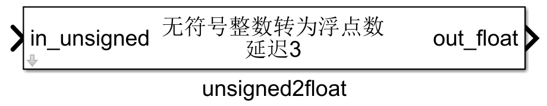

in_unsigned 是输入的无符号整数，out_float 是数值相等的浮点数。

在 Subsystem 的 mask 中定义参数转化延迟 delay，方便计算流水线时序对齐：

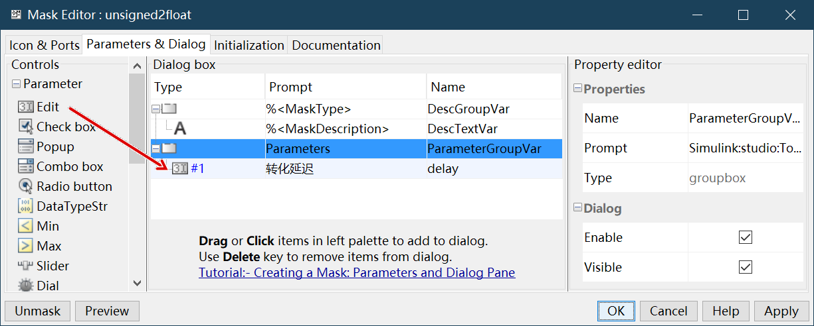

双击 Subsystem 弹出参数设置窗口：

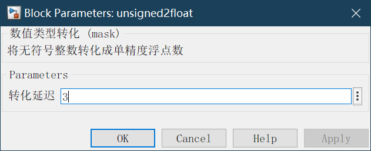

数值类型转化的功能主要由 Convert 模块实现，模块配置如下：

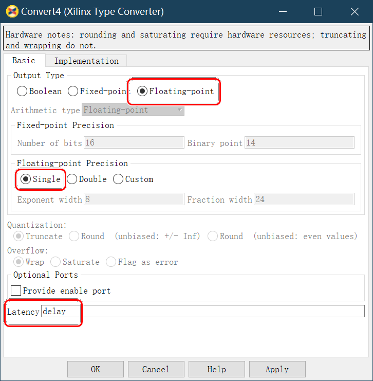

但是由于 Convert 模块只能将有符号整数转化为浮点数，因此输入的无符号整数需要由 Concat 模块经过高位补 0 再由 Reinterpret 模块解释为有符号整数（正数二进制补码）再送入整数转化为浮点数的 Convert 模块。

Reinterpret 模块的配置如下：

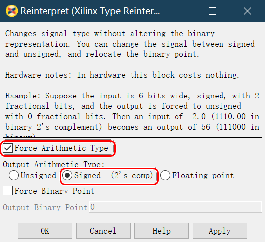

完整设计：
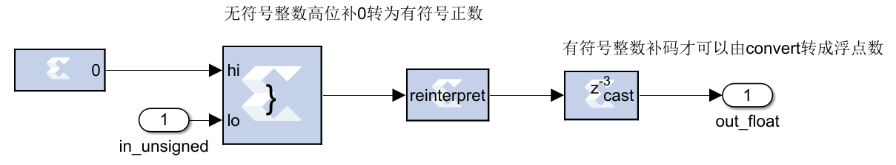

#### 浮点数转为无符号整数

浮点数转为无符号整数的 Subsystem 封装如下：

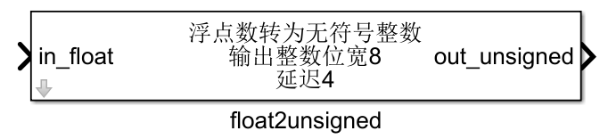

in_float 是输入的浮点数，out_unsigned 是输出的无符号整数，在转化过程中如果输入浮点数值小于 0，则输出整数值为 0，如果输入浮点数值大于当前设置位宽的满量程值，则输出该满量程值。

在 Subsystem 中定义参数输出位宽 width 和转化延迟 delay：

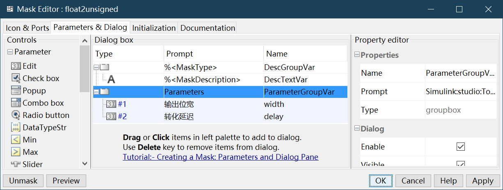

双击 Subsystem 弹出参数设置窗口：

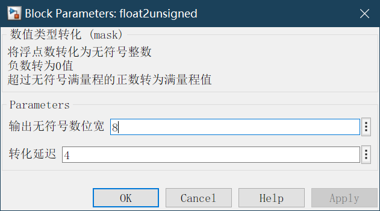

具体实现时，首先用 Convert 模块将浮点数转化为有符号整数补码，Convert 模块配置如下：

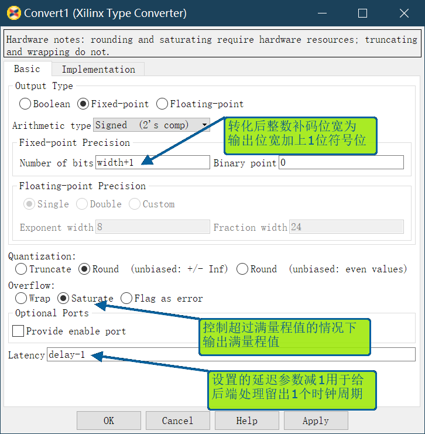

Convert 输出的有符号整数补码再经过 Convert 模块转化为无符号整数，第 2 级 Convert 模块配置如下：

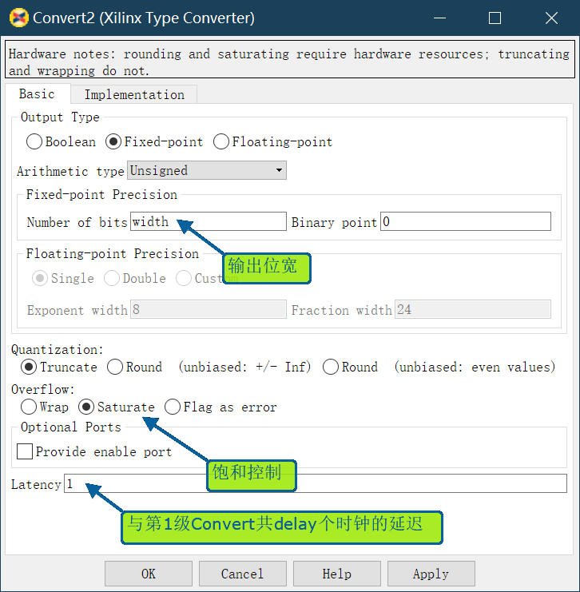

完整设计：

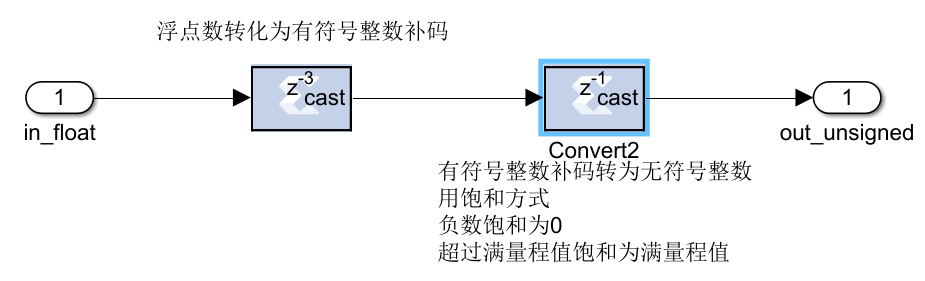

#### 正浮点数向下取整

在插值计算过程中，常常需要计算浮点数的坐标值，并且将该浮点值向下取整以找到邻近的坐标。这种情况下就可以使用正浮点数向下取整模块。

除了用于向下取整，得到输出的整数值后，输出值加 1 可以得到向上取整的结果，用输入浮点数减去向下取整的数值可以得到浮点数的小数部分。

由于 **Convert 模块将浮点数转为整数时只能使用 round 近似**，因此向下取整的基本原理在于将正浮点数减去 0.5 后，再使用 round 进行四舍五入。

但是仿真发现，**浮点数小数部分的 round 计算并非四舍五入**，下图是输入浮点值减 0.5 后的round输出，延迟为 6：

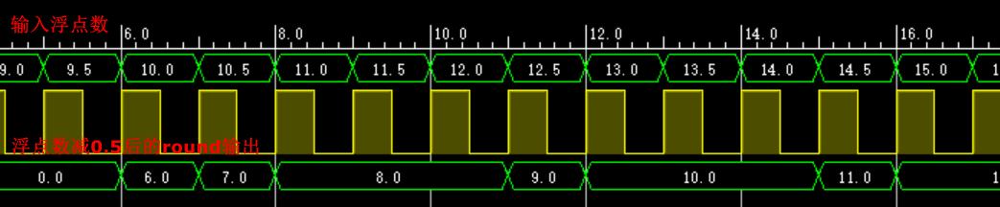

图中可以发现 10.0、10.5、1.0 的输出值全部为 10，明显不符合预期。

为了解决这个 round 错误，减 0.5 改成减 0.499，仿真输出正确：

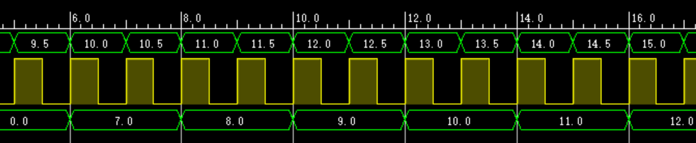

Subsystem 封装如下：

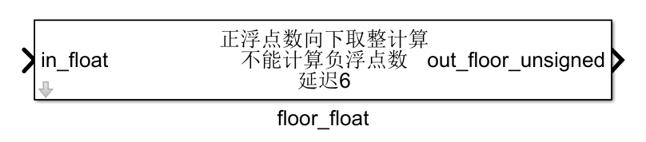

在 Subsystem 中定义输出无符号整数位宽：


完整设计：

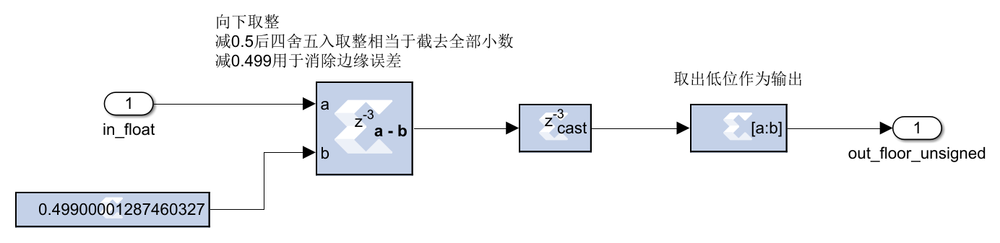

Convert 模块的配置如下：

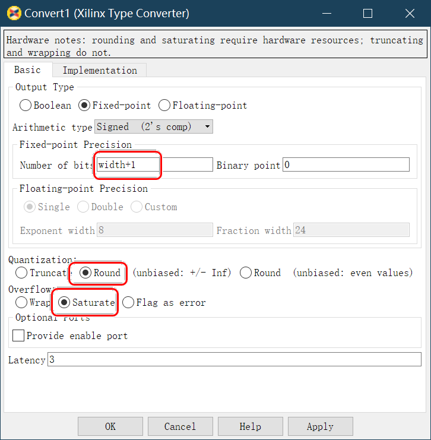

截取低位输出的 Slice 模块配置如下：

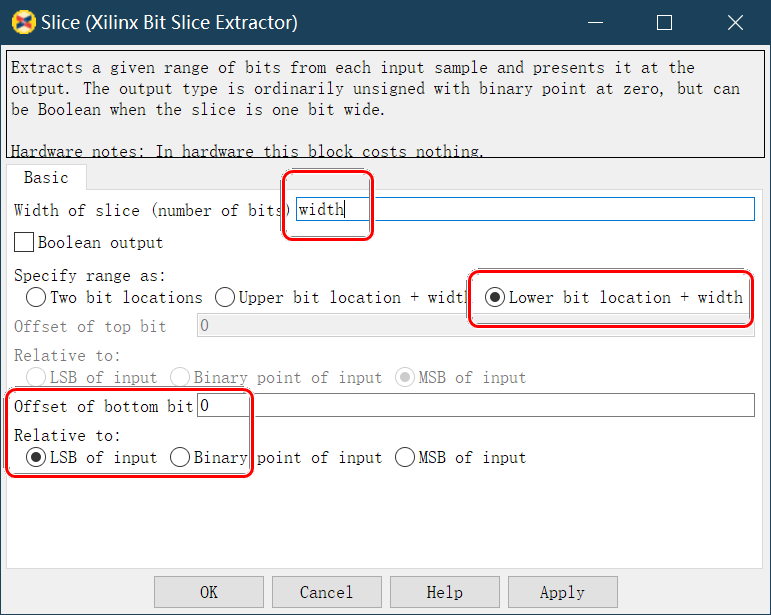


#### 二维缓冲

二维缓冲的功能是将串行的像素点数据转化为并行的多个像素点的滑窗，**将滑窗内的坐标中心点作为当前并行数据对应的像素点**，一般用于插值计算或者二维卷积。

由于二维缓冲主要是逻辑控制，不涉及数值计算，最简单的方法是使用 Verilog 实现，但是由于二维缓冲在图像处理算法中应用十分广泛，做成 sysgen 模块更适合在 sysgen 中直接调用。

根据图像处理原理，大部分计算用的滑窗都是 $3\times 3$ 或者 $5\times 5$，设计思想一致。

下文以 $3\times 3$ 的二维缓冲为例说明设计方法。

Subsystem 封装如下：

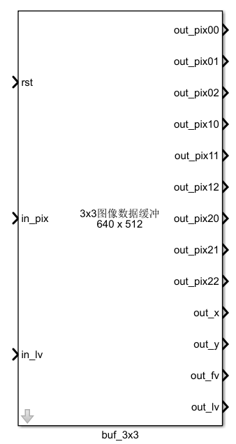

rst 为高电平复位，用于复位缓冲数据。

in_pix 为输入的串行像素点值。

in_lv 为输入的行有效信号。

out_pix00~22 为输出的并行像素点数据，序号对应各像素点在当前滑窗内的坐标，其中滑窗中心点 pix11 作为当前并行数据对应的像素点。

out_x、out_y、out_fv、out_lv分别指示当前点 pix11 的列坐标，行坐标，帧有效和行有效信号，具体时序与[图像数据流水线格式](#图像数据流水线格式)的说明一致。

$3\times 3$ 二维缓冲的实现原理是用 FIFO 进行行缓冲，用寄存器进行列缓冲。

行缓冲设计：

- 前 1 个 FIFO 的读数据接口连接下个 FIFO 的写数据接口；
- 每个 FIFO 都设置 FWFT 属性，使用读使能信号与读数据同步；
- 每个 FIFO 都使用 lv 信号同时作为读使能和写使能信号，但是只有 FIFO 首次装入 1 行数据后才产生读使能。

##### 1 行数据缓冲

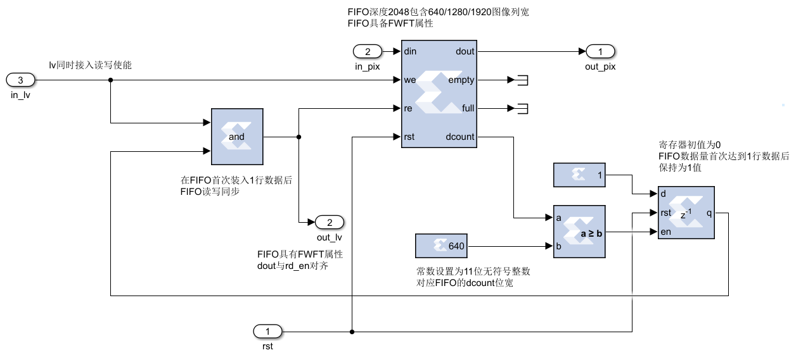

注意：out_lv 与 in_lv 没有时延，只有组合逻辑 and ，以保证所有连接的行缓冲模块的读写使能同步。

FIFO 模块配置如下，**必须选中 First Word Fall Through，保证 dout 与 re 高电平对齐**。

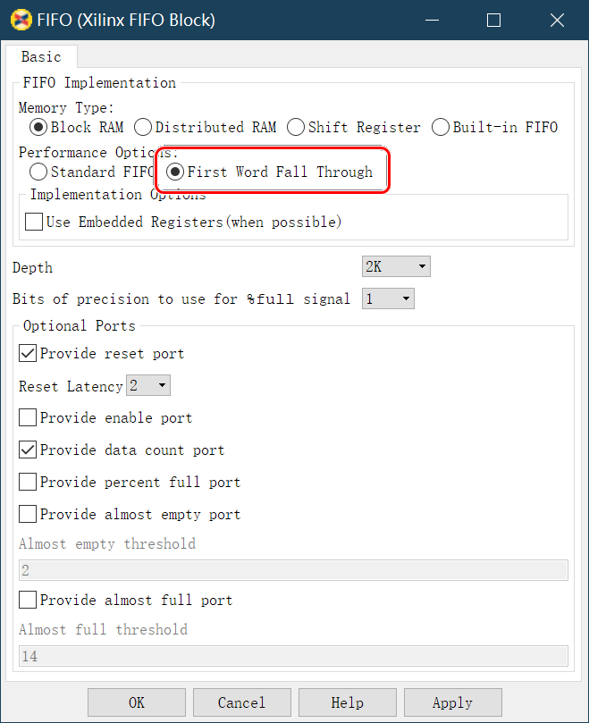

通过 FIFO 的 FWFT 属性，实现 out_pix 与 out_lv 时序对齐。

##### 3 行缓冲连接

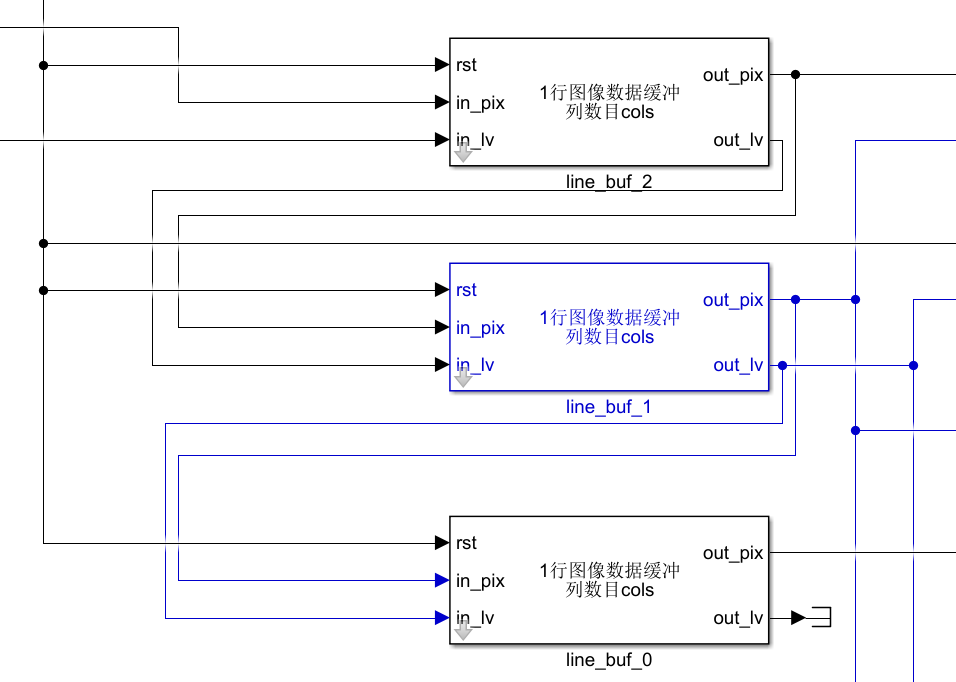

输入数据由 line_buf_2 进入，再转入 line_buf_1，最后到达 line_buf_0，上游行缓冲模块的输出接入下游行缓冲模块的输入。

012 的序号表示时间由先至后，以 line_buf_1 的输出作为当前像素点。

考虑 line_buf_1 输出边缘行的情况：

- 在 line_buf_1 输出为 0 行数据时，line_buf_0 的 out_pix 无效，用 line_buf_1 的数据替换 line_buf_0 的输出数据；
- 在 line_buf_1 输出最后 1 行的数据时，line_buf_2 的 out_pix 无效，用 line_buf_1 的数据替换 line_buf_2 的输出数据。

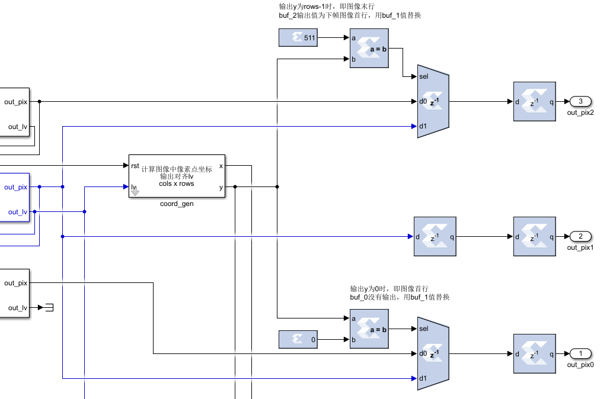

将 line_buf_1 输出的 lv 送入[行列坐标生成模块](#行列坐标生成) coord_gen，将 coord_gen 输出的行坐标与常数值比较，判断是否为首行或者末行，用 Mux 模块在指定的行坐标情况下用 line_buf_1 的输出分别替换 line_buf_0 或者 line_buf_2 的输出。

最后的部分是送出行列坐标以及帧有效和行有效信号，注意控制延迟与 out_pix 时序对齐：

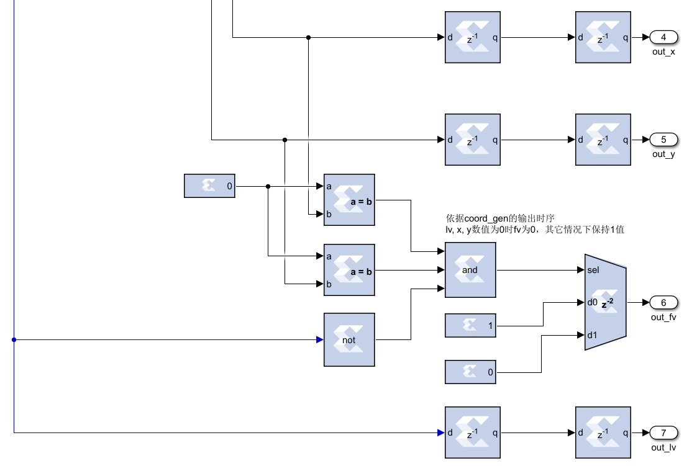

##### 3 列数据缓冲

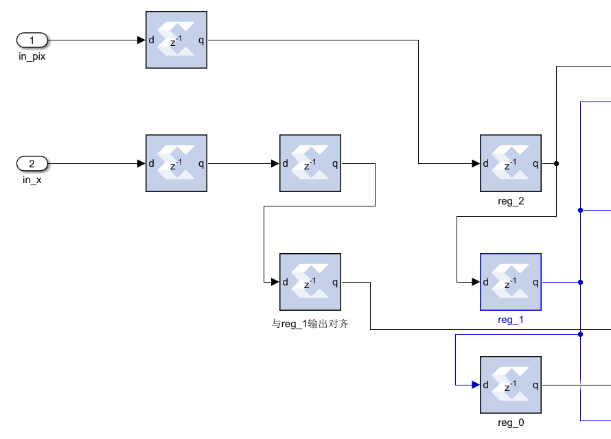

输入数据由 reg_2 进入，再转入 reg_1，最后到达 reg_0，上游寄存器的输出接入下游寄存器的输入。

012 的序号表示时间由先至后，以 reg_1 的输出作为当前像素点。

考虑 reg_1 输出边缘列的情况：

- 在 reg_1 输出为 0 列数据时，reg_0 的输出无效，用 reg_1 的数据替换 reg_0 的输出数据；
- 在 reg_1 输出最后 1 列的数据时，reg_2 的输出无效，用 reg_1 的数据替换 reg_2 的输出数据。

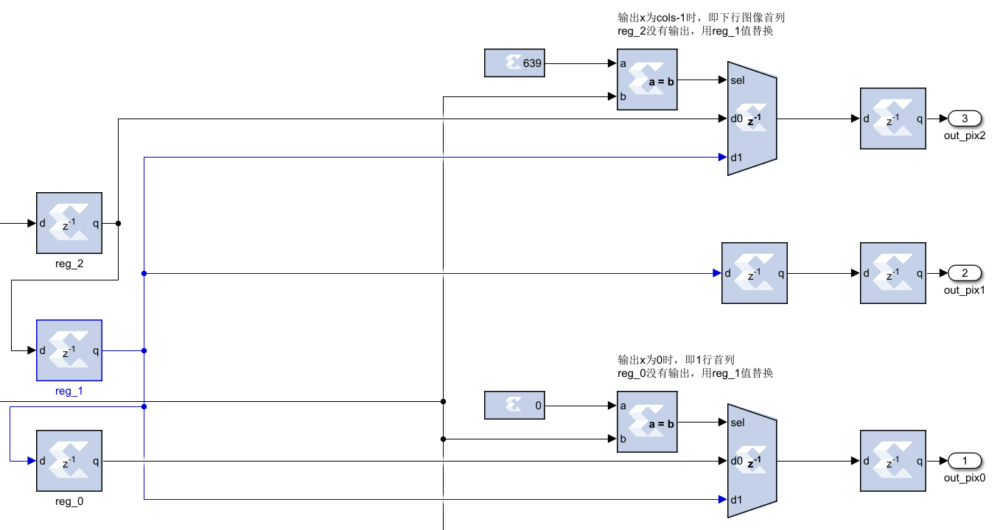

将输入的列坐标 in_x 与常数比较（注意与 reg_1 输出对齐时序），判断当前 reg_1 输出是首列或者末列，用 Mux 模块在指定的列坐标下用 reg_1 数据分别替换 reg_0 或者 reg_2 的输出数据。

最后的部分是送出行列坐标以及帧有效和行有效信号，注意控制延迟与 out_pix 时序对齐。

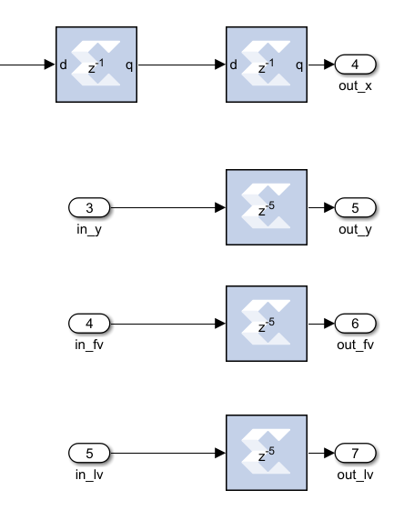

##### 组装构成

将 3 行缓冲模块并行输出的 3 行数据分别接入 3 列数据缓冲模块，完成 $3\times 3$ 二维缓冲模块的组装：

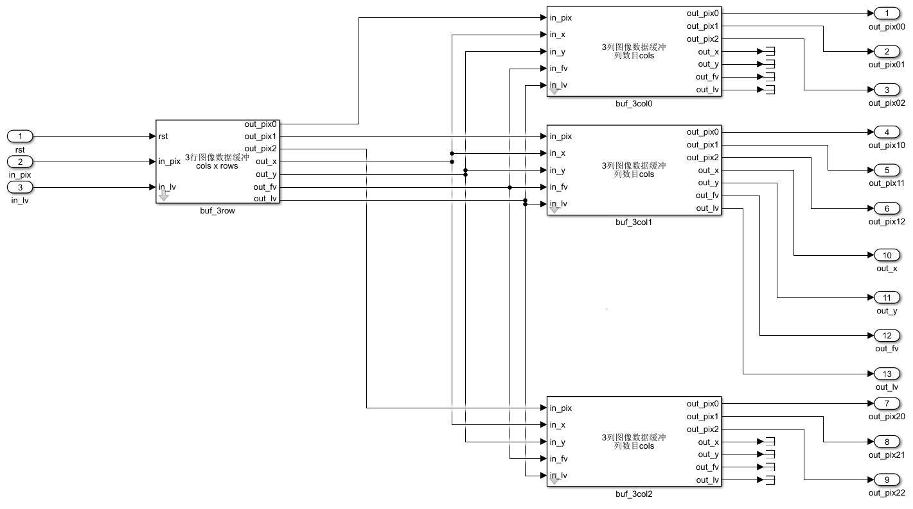

注意：二维缓冲模块输出的行列坐标及帧有效和行有效信号与 out_pix11 对齐。

##### 二维缓冲的截取

大多数二维缓冲的使用场景都是奇数行奇数列并且行列数目相同的二维缓冲，某些特殊的算法可能并不符合前述的要求，这时可以对已有的二维缓冲模块输出进行截取后送出符合当前算法要求的二维缓冲数据。

**二维缓冲输出数据截取的关键在于确定当前像素点的坐标位置**。

仍然以 $3\times 3$ 二维缓冲为例，如果需要截取得到 $2\times 2$ 的二维缓冲，首先需要确定在 $2\times 2$ 缓冲内当前像素点（即 $3\times 3$ 二维缓冲输出的 pix11）的坐标

如果当前像素点坐标为 (0, 0)，则截取 $3\times 3$ 缓冲的像素点为：
$$
\left(\begin{array}
{}
pix11 & pix12\\
pix21 & pix22
\end{array}\right)
$$
如果当前像素点坐标为 (1, 1)，则截取 $3\times 3$ 缓冲的像素点为：
$$
\left(\begin{array}
{}
pix00 & pix01\\
pix10 & pix11
\end{array}\right)
$$
如果需要单纯的行缓冲或者列缓冲，则可以使用相同的办法截取[行缓冲模块](#3行缓冲连接)或者[列数据缓冲](#3列数据缓冲)的输出数据。

#### 二维卷积滤波

二维卷积是常用的图像处理算法，即[图像滑窗内的并行数据](#二维缓冲)按滑窗内的坐标与卷积核函数对应坐标的参数相乘后，将所有乘法积值相加得到卷积滤波结果。

但是由于卷积核函数大多数情况下都包含小数部分，在 FPGA 内执行浮点数乘法将占用大量资源。比较常用的处理方法是将核函数内各元素数值都乘以 2 的指数，将小数部分放大至整数部分，并且根据核函数的生成原理选择足够大的指数值以保证各元素间的差异。最终在 FPGA 实现时可以将小数乘法转化为整数乘法，在所有元素的乘法积值相加后通过截去低位的方式实现除以前述的 2 的指数的计算。

以 $2\times 2$ 的二维卷积为例，原始核函数包含小数部分：
$$
\left(\begin{array}
{}
kernel00 & kernel01\\
kernel10 & kernel11
\end{array}\right)
$$
乘以 $2^N$ 将小数部分放大至整数部分：
$$
\frac{1}{2^N}\times 
\left(\begin{array}
{}
k00 & k01\\
k10 & k11
\end{array}\right)
$$
其中，
$$
k00=floor(2^N\times kernel00)\\
k01=floor(2^N\times kernel01)\\
k10=floor(2^N\times kernel10)\\
k11=floor(2^N\times kernel11)
$$
**函数 floor() 表示丢弃小数部分，仅保留整数部分。原因在于必须前述的近似算法的计算结果不会大于原始核函数的计算结果。**

因为图像的二维滤波算法根据其原理必须保证计算结果仍然在像素点位宽的量程以内，用于计算产生新的像素点值，即，
$$
1\geq(kernel00+kernel01+kernel10+kernel11)
$$
如果不使用 floor() 函数，而采用四舍五入的办法消除小数位，则可能出现计算结果超过像素点位宽满量程的情况，导致出错，或者额外的数值饱和判断逻辑。

sysgen 二维卷积滤波的示意如下：

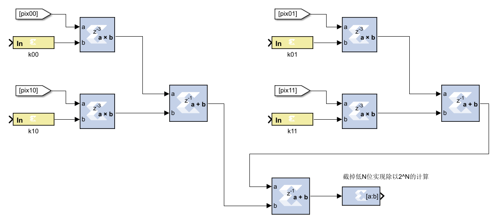

流水线最末端的 Slice 模块，即完成截去低 N 位的 2^N^ 的除法运算，又截去由乘法和加法扩位产生的高无效位。

Slice 模块配置如下：


#### 双线性插值

双线性插值是常用的插值算法，是许多图像处理算法的组成部分。

双线性插值由包围当前目标像素点的4个像素点的数值通过与当前像素点的相对位置偏移进行插值计算。

如下图所示：

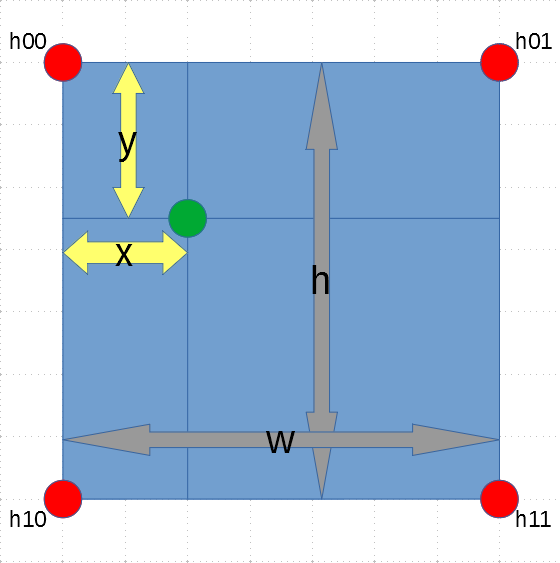

由 4 个红点的数值通过双线性插值计算中间绿点的数值 g。

公式如下：
$$
g=(\frac{w-x}{w}\times h00+\frac{x}{w}\times h01)\times\frac{h-y}{h}+(\frac{w-x}{w}\times h10+\frac{x}{w}\times h11)\times\frac{y}{h}
$$
在 FPGA 实现时，为了不进行除法计算，最好通过算法设计将 $w\times h$ 的数值设置为 2 的指数，这样就可以通过截去低位的方法实现除法。

在 sysgen 中使用 Slice 模块截去低位时使用与[二维卷积滤波相同的截位办法](#二维卷积滤波)。

乘法系数及输入的 4 个像素点值根据算法设计取得。

具体的 sysgen 实现可以参考[下文中自适应直方图均衡](#自适应直方图均衡)部分的说明。

### 常用算法模块

#### RGB 图像转灰度图像

RGB 图像转灰度图像的计算，即由当前像素点的 RGB 值计算 YUV 色域的 Y 通道的数值

RGB 计算 Y 通道数值的计算公式：
$$
Y=0.299\times R+0.587\times G+0.114\times B
$$
在 FPGA 实现时，为了节约计算资源，将小数乘法转为整数乘法后截去低位

计算公式改为：
$$
Y=\frac{19595\times R+38469\times G+7472\times B}{2^{16}}
$$
除以 2^16^ 的计算在 FPGA 中用截去低 16 位实现。

sysgen 中实现 RGB 转灰度的示意图如下：

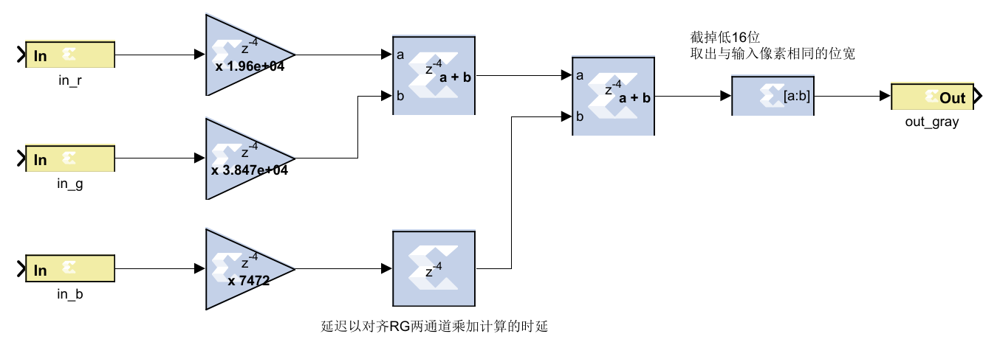

用 CMult 模块实现与常整数的乘法，19595 模块配置如下：

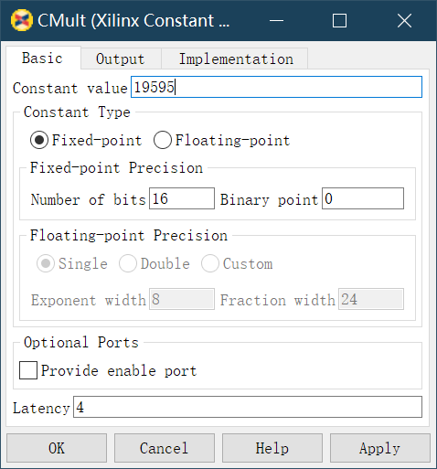

常数值位宽定义为 16 位方便与其它各乘法统一积值位宽，38469 模块和 7472 模块同样使用位宽 16 的配置。

最后的除以 2^16^ 的计算用 Slice 模块截去低 16 位后，向高位取与输入像素点相同的位宽。

由于 $1=\frac{19595+38469+7472}{2^{16}}$，算法原理就保证了 Y 值有效范围与 RGB 一致，因此使用与输入 RGB 相同的位宽。

Slice 模块的配置如下：

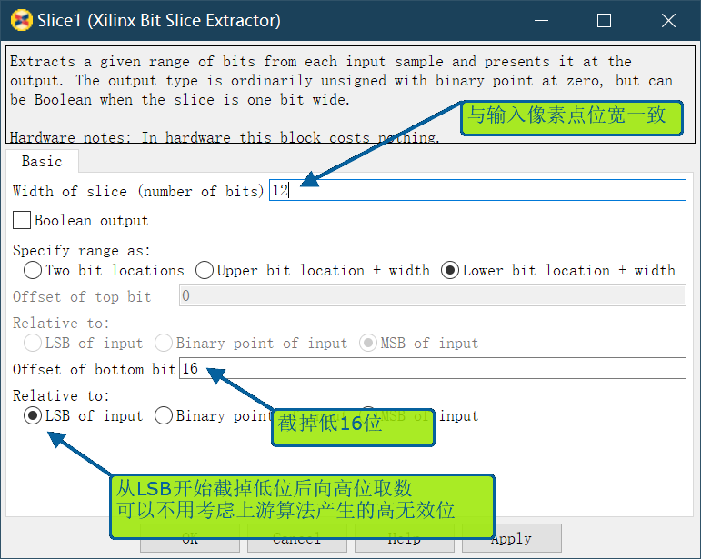

#### Debayer

Debayer 算法译成中文为解 Bayer 格式。

Bayer 格式指的是大多数彩色图像传感器在每个像素点位置只感应 RGB 三通道中一个通道的颜色，用于节约制造成本。而且由于人眼对绿色较为敏感，50% 的像素点感应 G，25% 的像素点感应 R，25% 的像素点感应 B。

不同型号的图像传感器像素点的 RGB 分布不同，比较典型的分布如下图所示：

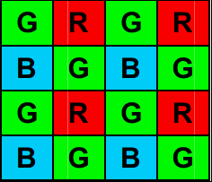

由于每个像素点只有 1 个颜色通道的数值，对于其不包含的 2 个颜色通道的数据，由其周边 $3\times 3$（G通道使用$5\times 5$）范围内对应颜色通道的均值表示。

在 sysgen 实现时，需要**根据当前像素点的行列坐标的奇偶选择对应颜色通道的计算方法**。

图像数据首先进入 [$5\times 5$二维缓冲](#二维缓冲)模块，取出用于计算的全部缓冲数据，及缓冲后的像素点坐标 buf_x 和 buf_y：

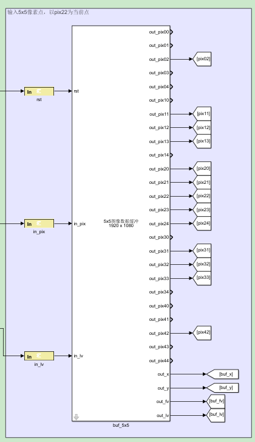

用 Slice 模块截取缓冲后像素点坐标的最低位 LSB ，用于判断坐标值的奇偶：

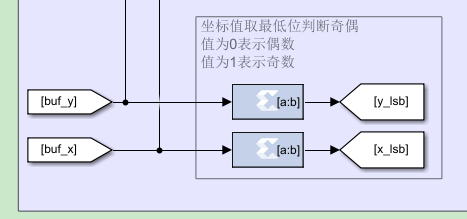

Slice 模块配置如下：

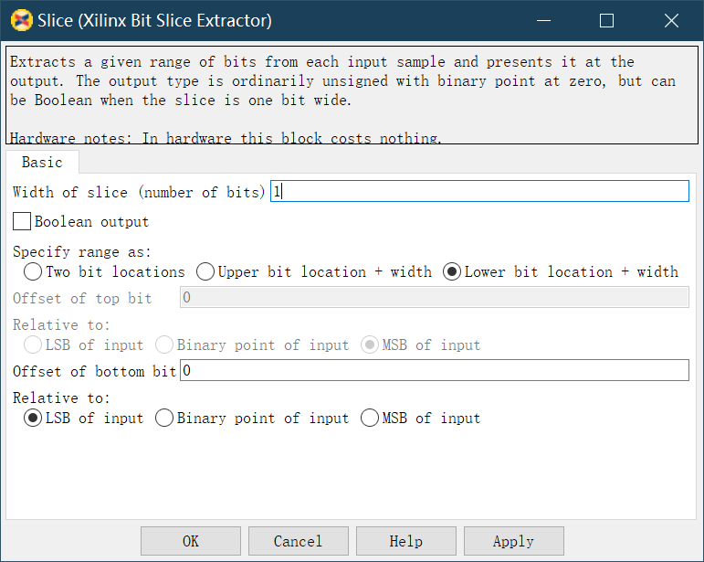

行列坐标的 LSB 用 Concat 模块合并为 2 比特，送入 Mux 模块根据行列坐标奇偶状态在 4 个计算通道中选择：

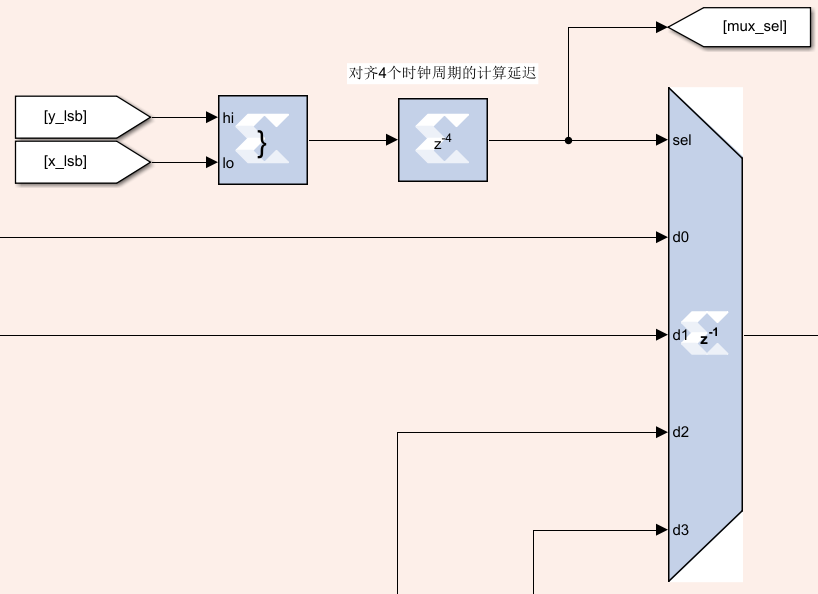

##### R 通道计算

位置示意图中心点为当前用于计算的像素点，$5\times 5$ 二维缓冲输出并行像素点中，pix22 为当前像素点，对应位置示意图中心点。

将以下 4 种情况的计算结果对齐时序后送入前述的行列奇偶判断 Mux 中进行输出选择。

偶行偶列：周边只有 pix21 和 pix23 为 R 通道，由此 2 值的均值作为当前像素点的R值。

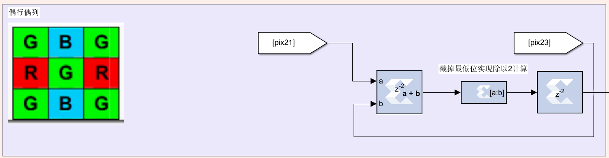

偶行奇列：当前像素点即为 R 通道，直接取用 pix22 的数值。

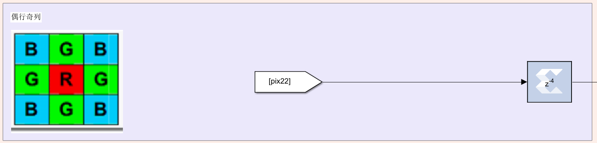

奇行偶列：周边有 pix11、pix13、pix31、pix33 为 R 通道，由此 4 值的均值作为当前像素点的 R 值。

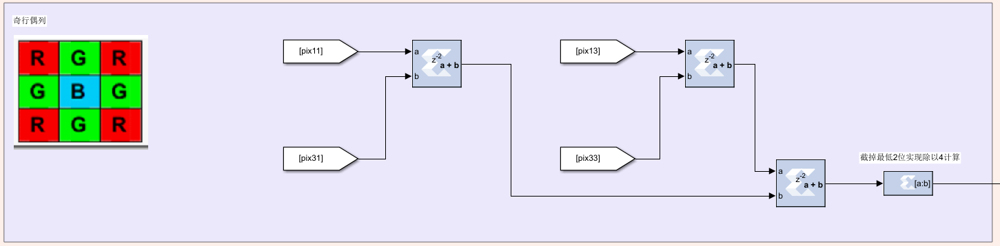

奇行奇列：周边有 pix12 和 pix32 为 R 通道，由此 2 值的均值作为当前像素点的 R 值。

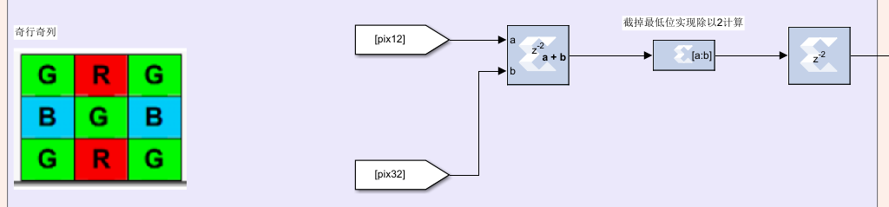

##### B 通道计算

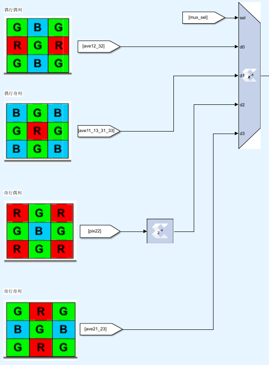

送入 Mux 的 4 路计算结果，根据 B 通道的位置进行排序，共用 R 通道部分的计算结果：

- ave12_32 指向 pix12 和 pix32 的均值

- ave11_13_31_33 指向 pix11、pix13、pix31、pix33 的均值

- ave21_23 指向 pix21 和 pix23 的均值 

##### G 通道的计算

G 通道的计算最为特殊，不单纯时周边 G 通道像素点的均值，还需要判断 RB 通道的

偶行偶列与奇行奇列都为 G 通道，直接取 pix22 值：

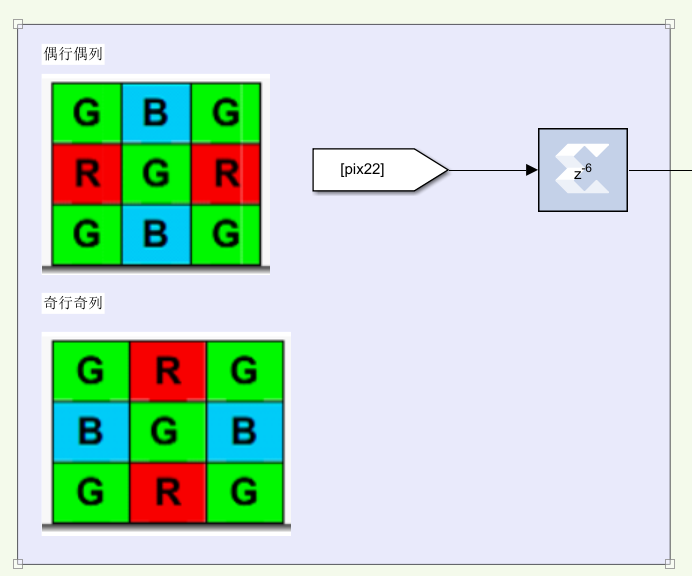

偶行奇列和奇行偶列的计算原理如下：

偶行奇列：

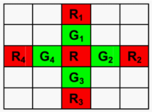
$$
G(R)=\begin{cases}
\frac{G1+G3}{2}&\lvert R1-R3\rvert<\lvert R2-R4\rvert\\
\frac{G2+G4}{2}&\lvert R1-R3\rvert>\lvert R2-R4\rvert\\
\frac{G1+G2+G3+G4}{4}&\lvert R1-R3\rvert=\lvert R2-R4\rvert
\end{cases}
$$
奇行偶列：

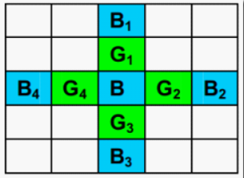
$$
G(B)=\begin{cases}
\frac{G1+G3}{2}&\lvert B1-B3\rvert<\lvert B2-B4\rvert\\
\frac{G2+G4}{2}&\lvert B1-B3\rvert>\lvert B2-B4\rvert\\
\frac{G1+G2+G3+G4}{4}&\lvert B1-B3\rvert=\lvert B2-B4\rvert
\end{cases}
$$
完整的计算如下：

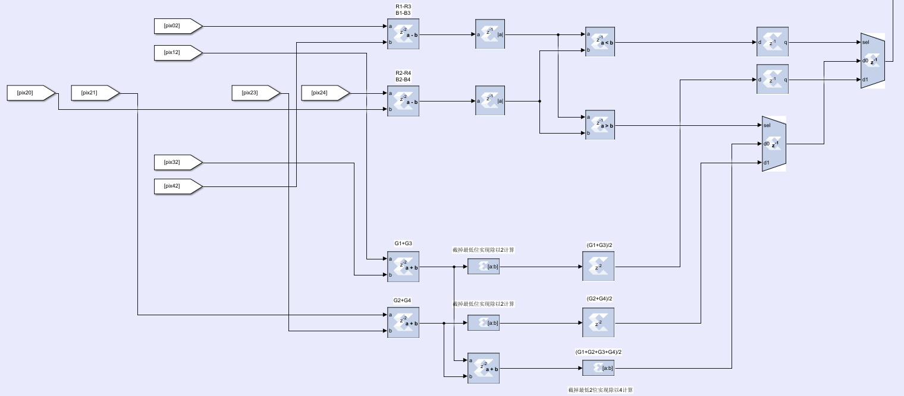

差值绝对值的比较，用 2 级 Mux 进行选择：

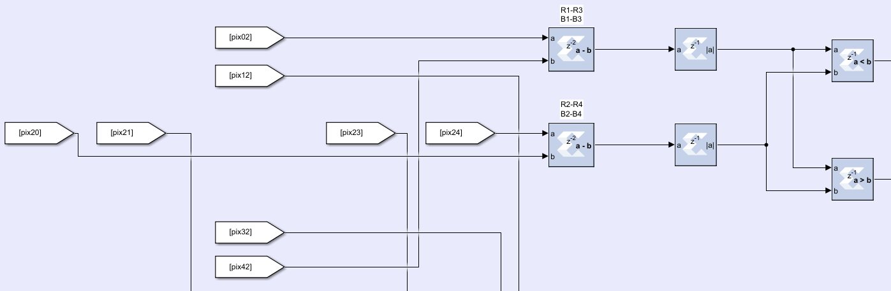

3 种均值计算结果作为 2 级 Mux 的输入：

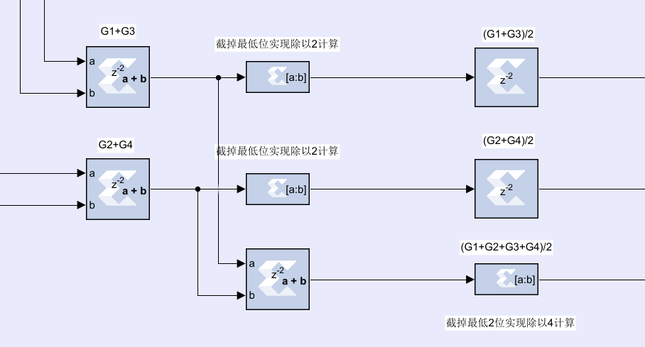

#### 中值滤波去噪

中值滤波是一种算法简单，效果较好的“高性价比”去噪算法。

**但是需要注意的是，中值滤波的副作用是对小目标造成变形，比如图像中的小矩形经中值滤波后矩形 4 角几乎失去锐度。**

算法原理是使用图像内二维滑窗的中值（全部像素点数值排序位于中间位置的数值为中值）代替当前像素点值。

如下图的 $3\times 3$ 滑窗内，处于滑窗中心的当前像素点值为 8，滑窗内全部 9 个像素点的中值为 5，中值滤波即用数值 5 代替当前像素点值 8：

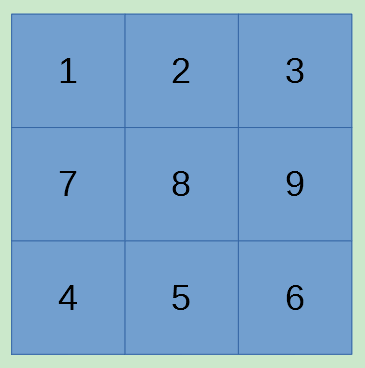

以 $3\times 3$ 中值滤波为例，首先将图像数据送入 $3\times 3$ [二维缓冲](#二维缓冲)，再将并行输出的 9 个像素点进行冒泡排序找到中值后输出：

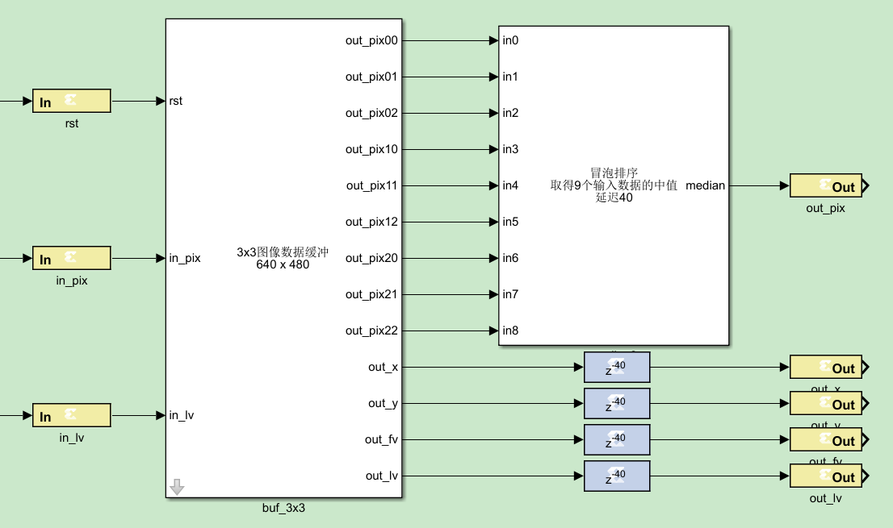

冒泡排序的基本原理是多个数值间两两顺序比较找到最大值，称为一轮冒泡。

两数值比较模块设计如下：

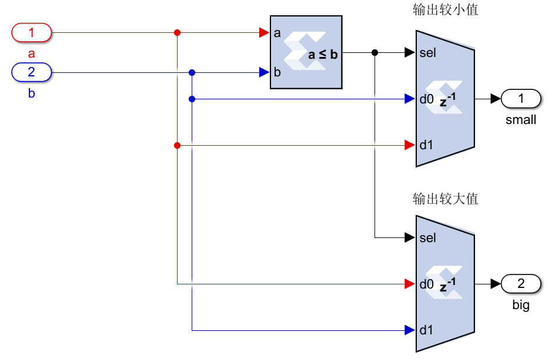

将模块作 Subsystem 封装后组成冒泡模块：

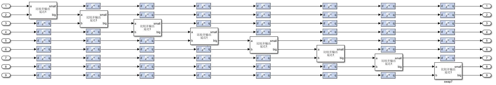

经过 8 次比较后，最大值出现在输出端口 9。

5 个冒泡模块串联，5 轮冒泡之后在输出端口 5 找到中值 median：

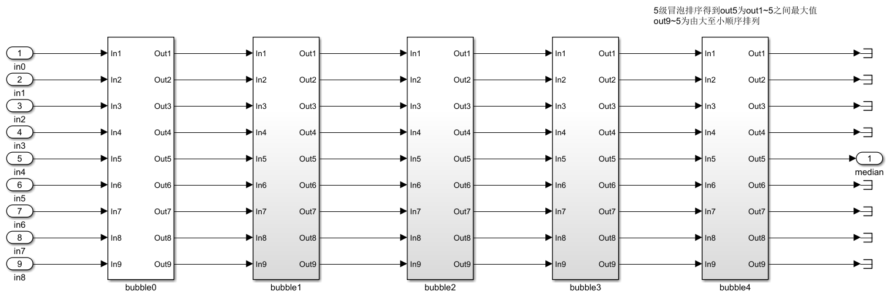

实际上图中的方法出现了部分逻辑资源浪费，bubble0 的输出中 out9 已是最大值，在 bubble1 中只要找到 in1 至 in8 的最大值即可，同理，下级的 bubble 模块都可以减少一次两两比较，一直到 bubble4 中只要找到 in1 至 in5 之间的最大值即可。但是为了设计直观，仍然使用上图的设计方法。

注意整个冒泡排序找中值的延迟为5级冒泡完整的时延 $8\times 5=40$。

#### 直方图均衡

直方图均衡算法通过将各颜色通道的像素点数值间距拉大，实现在当前颜色通道内像素点数值的大幅差异，增强视觉效果。除此以外，在图像传感器输入的像素值位宽与实际用于显示的像素值位宽不一致的情况下，**直方图均衡算法也常用于像素点位宽的转换**。

对于 RGB 图像，可以先将其转化为 YUV 图像，仅对 Y 通道执行直方图均衡算法后，再由 YUV 图像转化为 RGB 图像，实现彩色图像的增强。

一般情况下直方图均衡用于灰度图像。

以像素值位宽 8 为例，说明直方图均衡算法。

定义直方图数组为 hist[256]（2^8^=256），每个数组元素的数值表示当前图像帧内灰度值等于其序号的像素点的个数。

设当前像素值为 x，经过直方图均衡计算后输出的像素值为 y，一帧图像内的像素点总数为 N，则有以下公式：
$$
y=(2^8-1)\times \frac{\sum^{x}_{k=0}{hist[k]}}{N}
$$
对上述公式的解释：小于等于当前像素值的点的数目在整帧所有像素点中所占比例，即为该像素值的增强输出值与满量程的比值。

设当前图像所有像素点的最小值为 min，则其对应的输出值为 0，因为没有比 min 值更小的像素值输入。

设当前图像所有像素点的最大值为 max，则其对应的输出值为 $2^8-1$，因为所有像素点都小于或者等于 max。

注意：

- (2^8^-1) 指的是输出像素点的满量程值，如果输入输出像素值位宽不同，若输出位宽为 P，则 (2^8^-1) 用 (2^P^-1) 替换。

- hist[256] 中的 256 源于输入像素点的可能值范围，即 0 至 255，若输入位宽为 Q，则 hist[256] 用 hist[2^Q^] 替换。

根据计算公式，可以发现直方图均衡算法的计算复杂度较低，而在逻辑处理上较为复杂，因此比较适合使用 Verilog 语言而不是 sysgen 实现。

在 FPGA 实现中，首先需要改变直方图统计的算法，因为直方图数值 hist 本身不参与计算，参与计算的是 $\sum^x_{k=0}{hist[k]}$，因此在数据输入过程中直接统计计算 $\sum$ 数值。

除了直方图统计方法外，另一个特殊处理是**用前一帧图像的直方图统计结果计算当前图像帧的直方图均衡**。

因为，直方图统计算法只有收到当前图像的全部数据后才能得到结果，接收当前帧全部数据后再执行直方图均衡计算一方面需要对当前图像帧数据进行一帧的缓冲，另一方面需要至少等待一帧图像数据的传输时间才能启动运算。由于前后2帧图像之间具有一定的连续性，变化差异不至于太大，计算产生的误差是可以接受的，用前一帧的直方图统计结果可以直接在当前图像帧数据的输入流水线中计算。

为了实现这种处理，需要同时进行直方图均衡计算和直方图统计 2 种计算。因此采用 ping/pong 切换的方法控制两个直方图统计数组进行循环切换。即使用 ping 组用于计算的时候，用 pong 组进行统计；使用 pong 组计算的时候，用 ping 组进行统计。

最后在直方图均衡计算中 $\times\frac{2^8-1}{N}$的计算，根据具体数值选择乘以整数常数后除以 2 的指数，除法用截去低位的办法实现。

计算过程中还有一点需要注意的是，**由于使能前一帧的统计结果用于当前帧的计算，帧间差异以及计算误差可能产生小于 0 或者大于满量程的均衡计算结果，需要在计算过程中进行判断并且做饱和处理**。

直方图统计的 Verilog 代码可参考以下：

```verilog
//用ping/pong切换方式写入hist数组，防止更新数值的同时进行读出
//计算直方图增强时使用前一帧的统计值
//注意下方hist并非实际直方图，而是直方图累加值
//累加最大值为640*480=307200，共19位
reg [18:0] hist_ping[255:0];//输入Gray数值位宽为8
reg [18:0] hist_pong[255:0];

genvar i;
generate
	for (i=0; i < 256; i=i+1)
	begin: hist_gen
		always @(posedge clk) begin
			case ({fv_d1, in_fv, hist_flag})
				{1'b1, 1'b0, 1'b0}: begin//用输入fv的下降沿复位hist
					//hist_flag下个时钟周期将切换至pong写入，因此复位pong
					hist_pong[i] <= 19'd0;
					//ping保持
					hist_ping[i] <= hist_ping[i];
				end
				
				{1'b1, 1'b0, 1'b1}: begin//用输入fv的下降沿复位hist
					//hist_flag下个时钟周期将切换至ping写入，因此复位ping
					hist_ping[i] <= 19'd0;
					//pong保持
					hist_pong[i] <= hist_pong[i];
				end
				
				default: begin//直方图累加计算
					case ({in_fv, in_lv, hist_flag})
						{1'b1, 1'b1, 1'b0}: begin//写入ping
							if (in_gray <= i) begin
								//累加Gray值小于当前序号i的像素点
								hist_ping[i] <= hist_ping[i]+19'd1;
							end
							else begin
								//当前像素点Gray值大于i，保持
								hist_ping[i] <= hist_ping[i];
							end
							
							//pong保持
							hist_pong[i] <= hist_pong[i];
						end
						
						{1'b1, 1'b1, 1'b1}: begin//写入pong
							if (in_gray <= i) begin
								//累加Gray值小于当前序号i的像素点
								hist_pong[i] <= hist_pong[i]+19'd1;
							end
							else begin
								//当前像素点Gray值大于i，保持
								hist_pong[i] <= hist_pong[i];
							end
							
							//ping保持
							hist_ping[i] <= hist_ping[i];
						end
						
						default: begin
							hist_ping[i] <= hist_ping[i];
							hist_pong[i] <= hist_pong[i];
						end
					endcase
				end
			endcase
		end
	end
endgenerate
```

最大值最小值的统计与直方图统计一样使用 ping/pong 切换的方式统计：

```verilog
//统计帧最大值和最小值，ping/pong切换与直方图数据一致
reg [7:0] max_ping = 8'h00;
reg [7:0] min_ping = 8'hFF;

reg [7:0] max_pong = 8'h00;
reg [7:0] min_pong = 8'hFF;

always @(posedge clk) begin
    case ({fv_d1, in_fv, hist_flag})
        {1'b1, 1'b0, 1'b0}: begin//fv下降沿复位max/min
            //下个时钟周期切换至pong，当前复位pong
            max_pong <= 8'h00;
            min_pong <= 8'hFF;
            
            //ping保持
            max_ping <= max_ping;
            min_ping <= min_ping;
        end
        
        {1'b1, 1'b0, 1'b1}: begin//fv下降沿复位max/min
            //下个时钟周期切换至ping，当前复位ping
            max_ping <= 8'h00;
            min_ping <= 8'hFF;
            
            //pong保持
            max_pong <= max_pong;
            min_pong <= min_pong;
        end
        
        default: begin//记录max/min值
            case ({in_fv, in_lv, hist_flag})
                {1'b1, 1'b1, 1'b0}: begin//写入ping
                    //记录max
                    if (in_gray > max_ping) begin
                        max_ping <= in_gray;
                    end
                    else begin
                        max_ping <= max_ping;
                    end
                    
                    //记录min
                    if (in_gray < min_ping) begin
                        min_ping <= in_gray;
                    end
                    else begin
                        min_ping <= min_ping;
                    end
                    
                    //pong保持
                    max_pong <= max_pong;
                    min_pong <= min_pong;
                end
                
                {1'b1, 1'b1, 1'b1}: begin//写入pong
                    //记录max
                    if (in_gray > max_pong) begin
                        max_pong <= in_gray;
                    end
                    else begin
                        max_pong <= max_pong;
                    end
                    
                    //记录min
                    if (in_gray < min_pong) begin
                        min_pong <= in_gray;
                    end
                    else begin
                        min_pong <= min_pong;
                    end
                    
                    //ping保持
                    max_ping <= max_ping;
                    min_ping <= min_ping;
                end
                
                default: begin
                    //ping保持
                    max_ping <= max_ping;
                    min_ping <= min_ping;
                    
                    //pong保持
                    max_pong <= max_pong;
                    min_pong <= min_pong;
                end
            endcase
        end
    endcase		
end
```

根据当前输入的像素值选择直方图统计数值：

```verilog
//直方图数组输出
reg [18:0] out_hist = 19'd0;

always @(posedge clk) begin
    case (hist_flag)
        1'b0: begin//当前读出pong
            if (in_gray > max_pong) begin
                //当前Gray值大于最大值，则按最大值输出
                out_hist <= hist_pong[max_pong];
            end
            else if (in_gray < min_pong) begin
                //当前Gray值小于最小值，则按最小值输出
                out_hist <= hist_pong[min_pong];
            end
            else begin
                //按当前Gray值输出
                out_hist <= hist_pong[in_gray];
            end
        end
        
        1'b1: begin//当前读出ping
            if (in_gray > max_ping) begin
                //当前Gray值大于最大值，则按最大值输出
                out_hist <= hist_ping[max_ping];
            end
            else if (in_gray < min_ping) begin
                //当前Gray值小于最小值，则按最小值输出
                out_hist <= hist_ping[min_ping];
            end
            else begin
                //按当前Gray值输出
                out_hist <= hist_ping[in_gray];
            end
        end
    endcase
end
```

##### 自适应直方图均衡

自适应直方图均衡算法与普通均衡算法的不同点在于它通过计算图像多个局部区域的直方图，重新分布亮度，以此增强图像显示效果，该算法更适合于提高图像的局部对比度和细节部分。

如果图像中包括明显亮的或者暗的区域，普通直方图均衡算法可能会造成这些区域的细节丢失，而自适应直方图均衡算法则可以将这些区域的图像细节进行增强。

自适应直方图均衡的算法首先将图像分为若干互不重叠的图像子块，在图像子块中按照与普通均衡算法。

相同的方式进行直方图统计，得到子块中各输入像素值对应的输出像素值。

由于各图像子块间直方图分布不一致，每个子块独立执行普通均衡算法的情况下，在子块边缘处会出现明显的分界线。为解决边缘处的分界线，采用[双线性插值](#双线性插值)的办法。

以每个子块中心坐标作为该子块的坐标，首先找到包围当前像素点坐标的 4 个图像子块，当前像素点值在此 4 个子块内的普通均衡算法输出值分别为 h00, h01, h10, h11。

使用[双线性插值](#双线性插值)部分的示意图，即用下图中 4 个红点像素插值计算绿点像素的数值。


双线性插值的部分可以使用 sysgen 实现。

在 sysgen 中定义 h00 的坐标为 (x0, y0)，h11 的坐标为 (x1, y1)，为方便双线性插值中的除法计算，在原图分块时就设定：

- x1-x0=128

- y1-y0=128 

计算列插值系数如下：

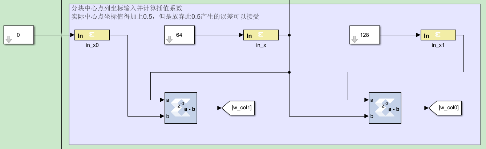

计算行插值系数如下：

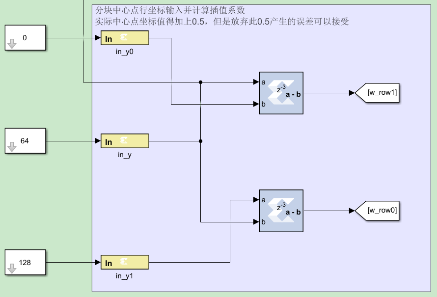

首先进行列方向的插值计算：

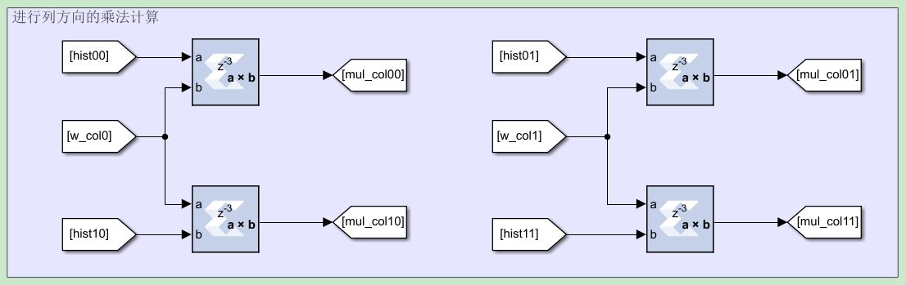

之后进行行方向的插值计算：

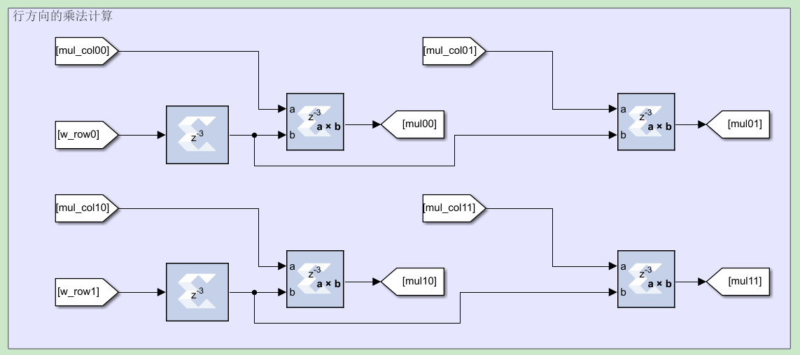

各插值项相加得到双线性插值的结果，注意下图中使用的截去低 14 位实现除法计算：

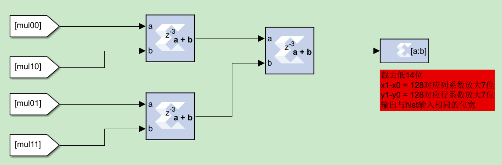

除了上述的双线性插值计算以外，用 Verilog 实现图像分块的普通直方图均衡计算，每个分块的直方图均衡算法定义为单独的 Verilog 模块，并且由上文所述每个分块大小为 $128\times 128$，于是可以将输入像素点行列坐标截去低 7 位后用于判断当前像素点所属的分块。

另外一个处理技巧是判断包围当前像素点的 4 个图像子块。

首先通过当前像素点与其所在分块的中心点的相对位置关系计算 4 个图像子块的序号：

```verilog
//选择包围当前像素点的4个分块
//每个分块中心点按照分块坐标系而言为(63.5, 63.5)
//以分块中心点将分块分为4个象限
//用当前像素点坐标的低7位判断当前点在其分块中的4个象限
//由于分块为128x128，则分块序号用像素点坐标截去低7位表示
//列坐标判断

//定义4个分块序号(x_ind, y_ind)
reg [8:0] x_ind_00 = 9'd0;
reg [8:0] x_ind_01 = 9'd0;
reg [8:0] x_ind_10 = 9'd0;
reg [8:0] x_ind_11 = 9'd0;

reg [8:0] y_ind_00 = 9'd0;
reg [8:0] y_ind_01 = 9'd0;
reg [8:0] y_ind_10 = 9'd0;
reg [8:0] y_ind_11 = 9'd0;

always @(posedge clk) begin
	if (in_x[6:0] < 7'd64) begin
		//当前点在分块的左半边
		x_ind_00 <= in_x[15:7]-9'd1;
		x_ind_10 <= in_x[15:7]-9'd1;
		x_ind_01 <= in_x[15:7];
		x_ind_11 <= in_x[15:7];
	end
	else begin
		//当前点在分块的右半边
		x_ind_00 <= in_x[15:7];
		x_ind_10 <= in_x[15:7];
		x_ind_01 <= in_x[15:7]+9'd1;
		x_ind_11 <= in_x[15:7]+9'd1;
	end
end

always @(posedge clk) begin
	if (in_y[6:0] < 7'd64) begin
		//当前点在分块的上半边
		y_ind_00 <= in_y[15:7]-9'd1;
		y_ind_01 <= in_y[15:7]-9'd1;
		y_ind_10 <= in_y[15:7];
		y_ind_11 <= in_y[15:7];
	end
	else begin
		//当前点在分块的下半边
		y_ind_00 <= in_y[15:7];
		y_ind_01 <= in_y[15:7];
		y_ind_10 <= in_y[15:7]+9'd1;
		y_ind_11 <= in_y[15:7]+9'd1;
	end
end
```

上述代码的原理示意图，红框表示当前像素点所在的图像子块，4 种填充色的 4 角指示包围当前像素点的 4 个子块的中心点：

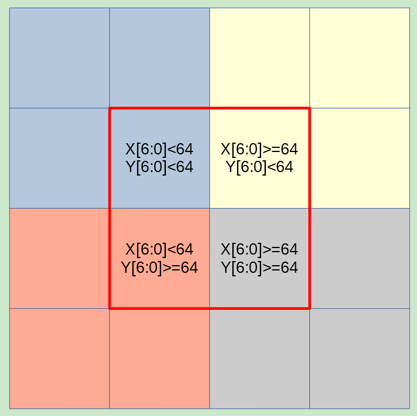

如果上图中红框表示的当前分块位于整幅图像的边缘，则 4 个填充色很可能有部分位于图像以外，于是需要对边缘进行判断，如下方代码所示：

```verilog
//定义函数进行边缘控制
//分块列序号边缘控制函数
function [8:0] func_x_ind;
	input x_ind;
	begin
		if (x_ind[8] == 1'b1) begin
			//由减9'd1计算得到负值，表示序号小于0，用0值代替
			func_x_ind = 9'd0;
		end
		else if (x_ind[8:0] > 所有分块的最大列序号) begin
			//由加9'd1得到序号大于最大值，用最大值代替
			func_x_ind = 所有分块的最大列序号;
		end
		else begin
			//序号在有效范围内
			func_x_ind = x_ind;
		end
	end
endfunction

//分块行序号边缘控制函数
function [8:0] func_y_ind;
	input y_ind;
	begin
		if (y_ind[8] == 1'b1) begin
			//由减9'd1计算得到负值，表示序号小于0，用0值代替
			func_y_ind = 9'd0;
		end
		else if (y_ind[8:0] > 所有分块的最大行序号) begin
			//由加9'd1得到列序号大于最大值，用最大值代替
			func_y_ind = 所有分块的最大行序号;
		end
		else begin
			//序号在有效范围内
			func_y_ind = y_ind;
		end
	end
endfunction

//定义4个分块序号(x, y)
//实际用于4分块选择
reg [8:0] x_00 = 9'd0;
reg [8:0] x_01 = 9'd0;
reg [8:0] x_10 = 9'd0;
reg [8:0] x_11 = 9'd0;

reg [8:0] y_00 = 9'd0;
reg [8:0] y_01 = 9'd0;
reg [8:0] y_10 = 9'd0;
reg [8:0] y_11 = 9'd0;

always @(posedge clk) begin
	x_00 <= func_x_ind(x_ind_00);
	x_01 <= func_x_ind(x_ind_01);
	x_10 <= func_x_ind(x_ind_10);
	x_11 <= func_x_ind(x_ind_11);

	y_00 <= func_y_ind(y_ind_00);
	y_01 <= func_y_ind(y_ind_01);
	y_10 <= func_y_ind(y_ind_10);
	y_11 <= func_y_ind(y_ind_11);
end
```

##### 仿真结果

下方仿真图像并非上述代码仿真得到，仅用于示意 2 种直方图均衡算法的处理差异。

输入图像为 $1280\times 960$ 分辨率，自适应直方图算法使用 $320\times 320$ 的分辨率划分 $4\times 3$ 个图像子块：

试验图片来源于：<http://www.netbian.com/>

原始图像：

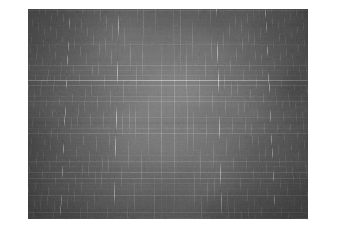

普通直方图均衡输出：

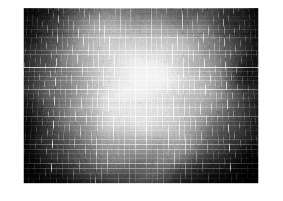

自适应直方图均衡输出：

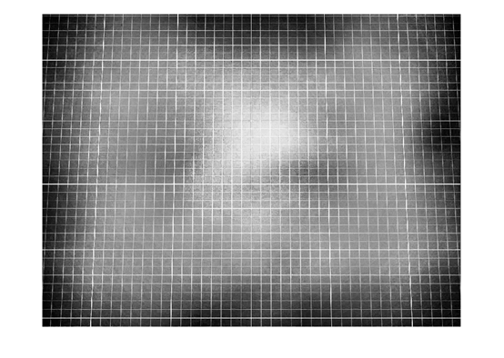

##### 附

实际应用直方图均衡的过程中会发现，直方图均衡占用的 LUT 资源相当巨大，**原因在于以像素点值作为超大寄存器组的数据索引**。

而且前述使用 ping/pong 进行统计切换的方法可以优化成**只用一个写寄存器组进行统计，在一帧完成后，下一帧开始之前，将统计数据存入另一个读寄存器组，输出的数值由读寄存器组进行索引得到。**

#### 锐化

锐化即在图像上增强显示图像内容的边缘成分，放大图像中边缘像素点与其周围像素点的差值。

根据边缘成分的计算方法，常用的方法有高斯滤波锐化、拉普拉斯滤波锐化和索贝尔锐化。**一般情况下，索贝尔锐化效果更好。**

高斯滤波锐化将原始图像 x 减去高斯滤波（相当于低通滤波）后得到的平滑图像 gaussian(x)，计算得到边缘图像 z：
$$
z=x-gaussian(x)
$$
拉普拉斯滤波锐化直接使用拉普拉斯滤波（相当于高通滤波）得到边缘成分，典型的拉普拉斯滤波系数如下：
$$
\left(
\begin{array}
{ccc}
0&-1&0\\
-1&4&-1\\
0&-1&0
\end{array}
\right)
$$

$$
\left(
\begin{array}
{ccc}
-1&-1&-1\\
-1&8&-1\\
-1&-1&-1
\end{array}
\right)
$$

索贝尔锐化使用 2 个滤波器分别计算得到列方向和行方向的边缘成分，g~x~ 和 g~y~ 分别为列方向和行方行的滤波系数：
$$
g_x=\left(
\begin{array}
{ccc}
-1&0&1\\
-2&0&2\\
-1&0&1
\end{array}
\right)
$$

$$
g_y=\left(
\begin{array}
{ccc}
1&2&1\\
0&0&0\\
-1&-2&-1
\end{array}
\right)
$$

令 G~x~ 和 G~y~ 分别为上述 2 个滤波系数的滤波结果，则边缘值 z 如下：
$$
z=\sqrt{{G_x}^2+{G_y}^2}
$$
为方便计算近似为：
$$
z=\lvert G_x\rvert+\lvert G_y\rvert
$$
锐化图像的计算公式如下：
$$
y=\begin{cases}
x+a\times z & \lvert z\rvert>T\\
x&\lvert z\rvert\leq T
\end{cases}
$$
上式中 **a 值为锐化强度**，一般选择范围是 $0\leq a \leq 1.5$，为防止出现过度锐化，可以将 **a 值取为0.5**（经验值，根据图像场景调节）。

上式中 **T 值为锐化门限**，控制算法只对边缘强度大于 T 值的部分进行锐化，对于平滑区域保持不变，像素位宽为 8 的情况下，可以将 **T 值取为8**（经验值，根据图像场景调节）。

使用灰度图像，以 $3\times 3$ 的高斯滤波器为例，说明 FPGA 实现方法，典型的高斯滤波系数如下：
$$
\frac{1}{16}\times\left(
\begin{array}
{ccc}
1&2&1\\
2&4&2\\
1&2&1
\end{array}
\right)
$$
系数矩阵中心的 4 对应的是当前像素点的加权值，则 z 值计算对应的二维卷积核：
$$
\frac{1}{16}\times\left(
\begin{array}
{ccc}
-1&-2&-1\\
-2&(16-4)&-2\\
-1&-2&-1
\end{array}
\right)
$$
在计算 z 值时，即可以使用上方公式直接用二维卷积计算，也可以根据其原理先计算 gaussian(x)，再计算 x-gaussian(x)。滤波系数中 2、4 值的乘法可以分别通过低位补 1 位 0 和低位补 2 位 0 的方法实现，第一种方法滤波系数中心的 12，如果不使用乘法器，则需要分解为 $\times 4$和 $\times 8$，再将 2 个积值相加，计算麻烦；先滤波再计算减法的方法则更为简便。

**PS：在其它卷积算法中，如果卷积系数比较复杂（不能使用加减或者移位计算），必须使用乘法（甚至除法）的情况下，将卷积计算前后其它的算法合并至卷积系数，用一次卷积完成多个计算步骤，可以减少计算量。**

在后续的锐化强度计算中，由于 a=0.5，则 $\times a$ 的计算可以用截去低位的办法实现除以 2。

具体的 sysgen 设计如下：

输入图像数据首先进入 [$3\times 3$二维缓冲](#二维缓冲)：

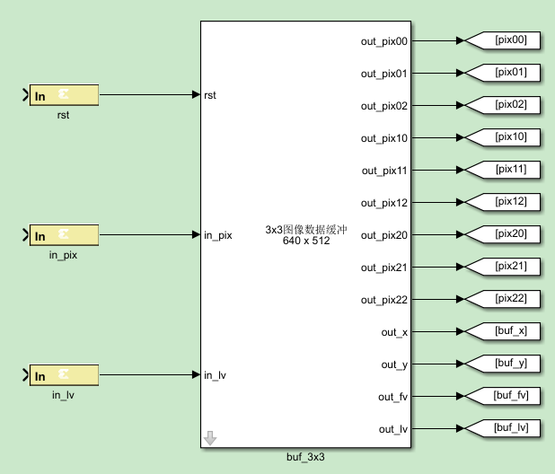

用移位方法实现卷积系数的乘法计算：

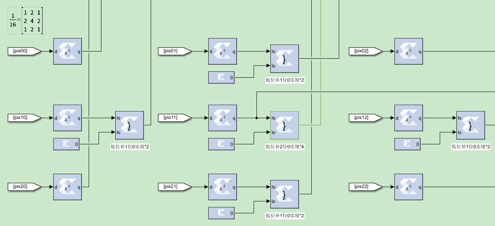

将卷积系数乘法结果相加，并用截去低位的办法实现 $\times\frac{1}{16}$：

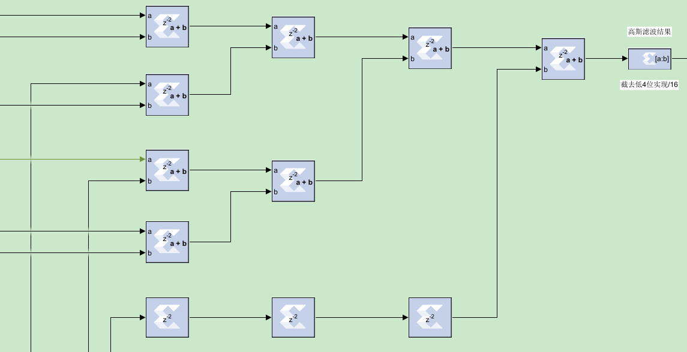

锐化计算：

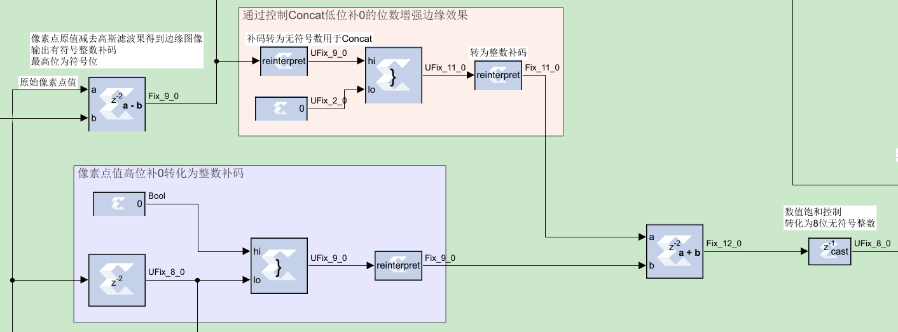

上图中红色高亮区域中实现 $a\times z$的计算，但是将 a 值通过低位补 0 的方式设置为 4，用于增强视觉效果。

如果使用前文所述的 a 值为 0.5 的边缘增强系数，则使用如下所示的模块：

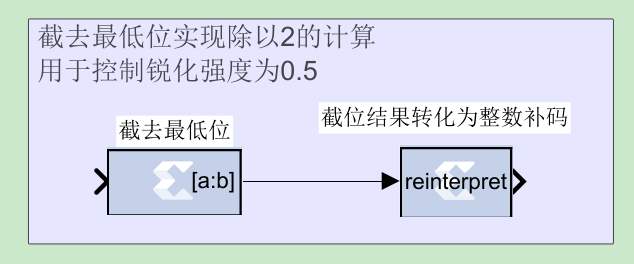

锐化门限控制，T 值为 8，由于是有符号整数补码的绝对值比较，因此分别比较 +8与 -8，再用 or 合并比较结果：

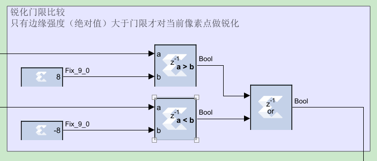

高斯滤波后完整的锐化设计：

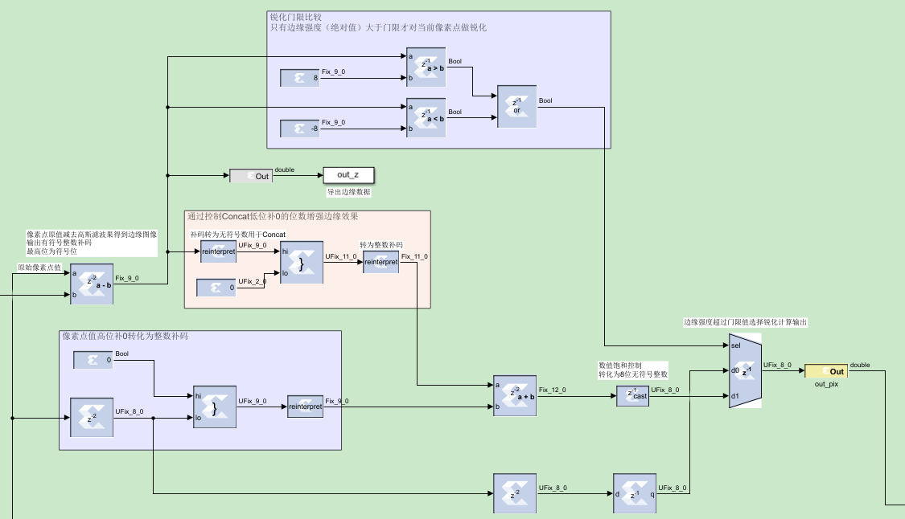

仿真结果如下。

试验图片来源于：<https://unsplash.com/>

输入原始图像：


锐化，参数 a=1，T=0：

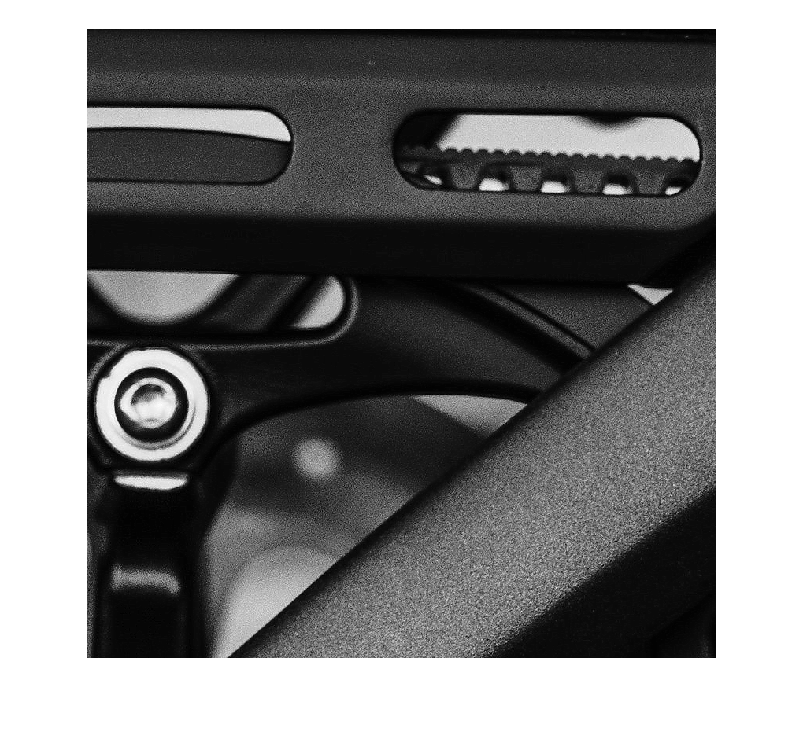

锐化，参数 a=16，T=0（为加强锐化效果选择该参数）：

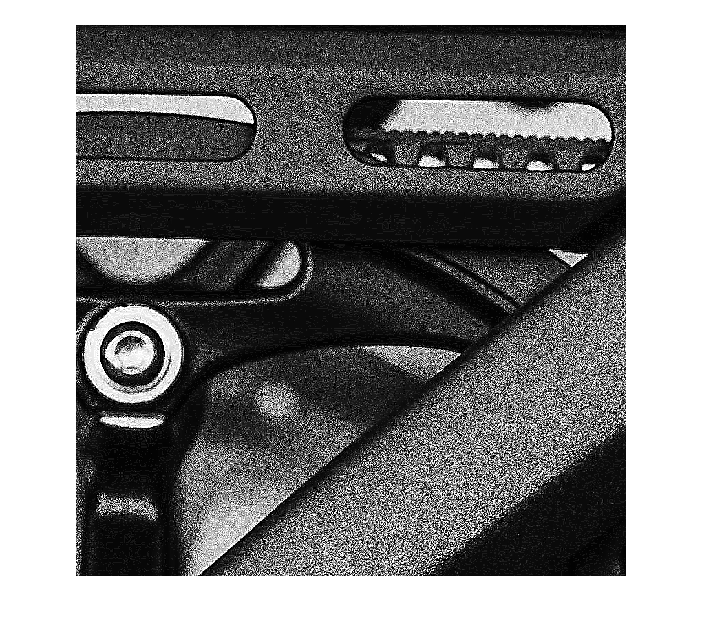

最后附上拉普拉斯滤波锐化的输出图像，参数 a=1，T=0，供参考比较：

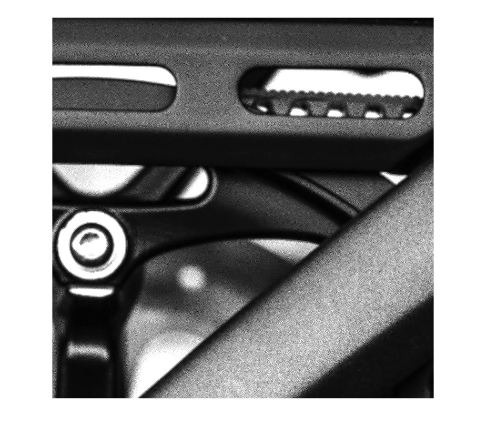

#### 亮度及对比度调节

**亮度及对比度需要根据数值配合一齐调节**，以达到更新的视觉效果。

如果是 RGB 彩色图像，亮度与对比度调节需要在所有颜色通道上进行相同的调节。

设当前像素点位宽为 8，则像素值范围 0~255。

设当前像素点值为 x，调节输出像素点值为 y。

设亮度参数b范围 -1~1，则有亮度调节公式:
$$
yb=x+255\times b\\
y=\begin{cases}
0&yb\leq0\\
255&yb\geq255\\
yb&0<yb<255
\end{cases}
$$
设对比度参数c范围 -1~1，对比度门限 th，则有对比度调节公式：
$$
yc=\begin{cases}
x\geq th? 255:0&c=1\\
x+(x-th)\times(\frac{1}{1-c}-1)&0\leq c<1\\
x+(x-th)\times c&c<0
\end{cases}\\
y=\begin{cases}
0&yc\leq0\\
255&yc\geq255\\
yb&0<yc<255
\end{cases}
$$
前述公式仅用于亮度或者对比度单独调节的情况，**实际情况下需要将亮度对比度一同调节，并且在对比度数值大于 0 的情况下先调节亮度，在对比度数值小于 0 的情况下先调整对比度**

在 FPGA 实现中，将亮度参数 b 定义为 16 位有符号整数，用补码表示（整字节数定义，方便外部配置参数值），数值范围 -255 至 255，单独计算亮度的方法：
$$
y=x+b
$$
计算结果再经过 0 至 255 范围的饱和控制，得到亮度调节的结果。

将对比度参数 c 定义为 16 位有符号整数，用补码表示，范围 -255 至 255，单独计算对比度的方法：
$$
y=\begin{cases}
x\geq 128?255:0&c=255\\
x+(x-128)\times\frac{c}{255-c}&0\leq c<255\\
x+(x-128)\times \frac{c}{255}&c<0
\end{cases}
$$
计算结果再经过 0 至 255 范围的饱和控制，得到对比度调节的结果。

由于亮度及对比度调节需要根据对比度参数选择不同的先后顺序，因此 FPGA 计算时分为两条计算流水线，完成计算后再根据对比度参数选择对应的计算流水线的输出。

对比度参数 c 值大于等于 0 的计算流水线：

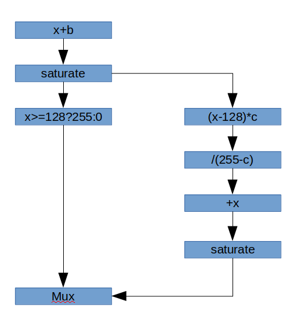

sysgen 中的实现如下：

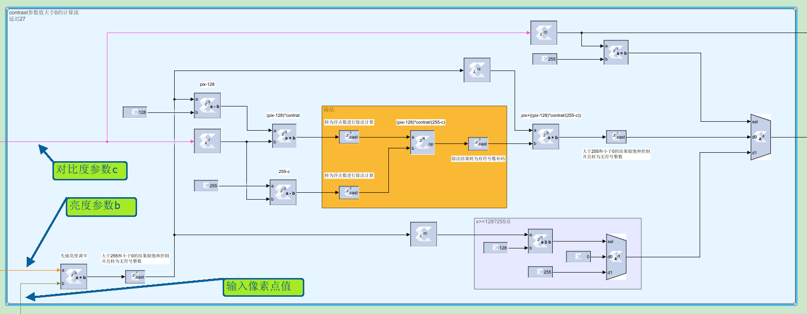

注意上图中橙色背景的除法计算，Divide 模块的配置如下：

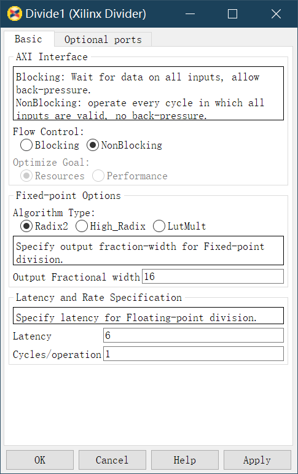

注意在 Divide 输入数据需要用 Convert 模块先由有符号整数补码转为浮点数，并且需要将 Divide 输出由 Convert 模块将浮点数转为有符号整数补码。

最后输出之前用于饱和控制的 Convert 模块的配置如下，注意 Overflow 配置为 Saturate：

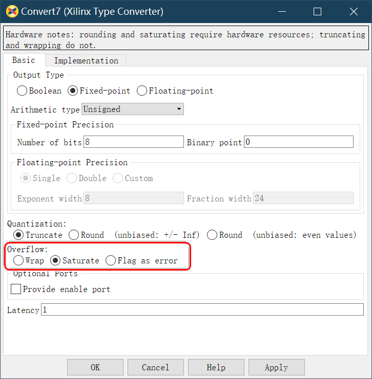

对比度参数 c 值小于 0 的计算流水线：

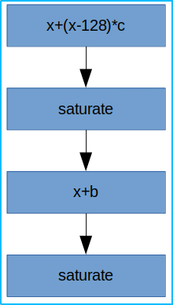

sysgen 中的实现如下：

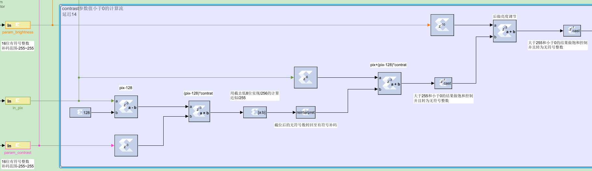

注意上图中用截去低 8 位的方法近似实现除以 255 的计算，以节约计算资源。

最终由对比度参数值通过 Mux 模块选择计算流的输出：

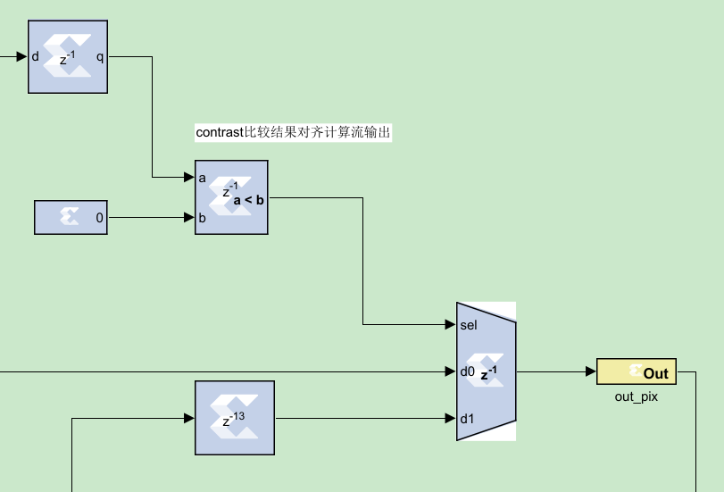

仿真结果。

试验图片来源于：<https://unsplash.com/>

输入原始图像：

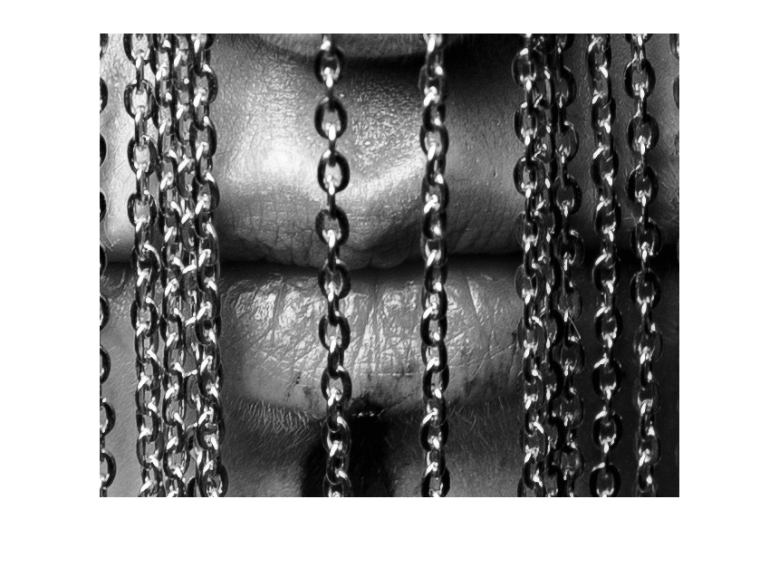

输出图像，亮度参数 50，对比度参数 100：

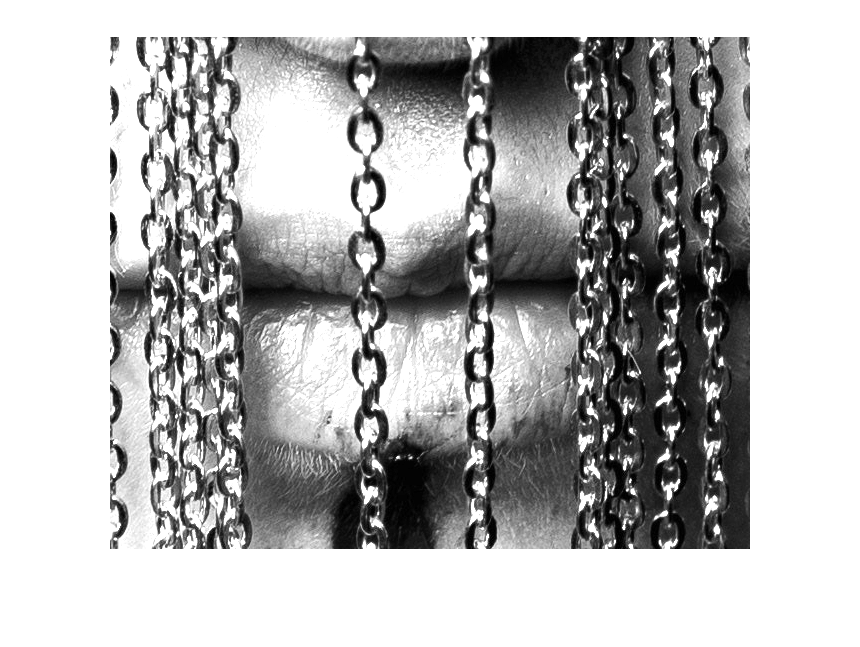

输出图像，亮度参数 -10，对比度参数 -50：

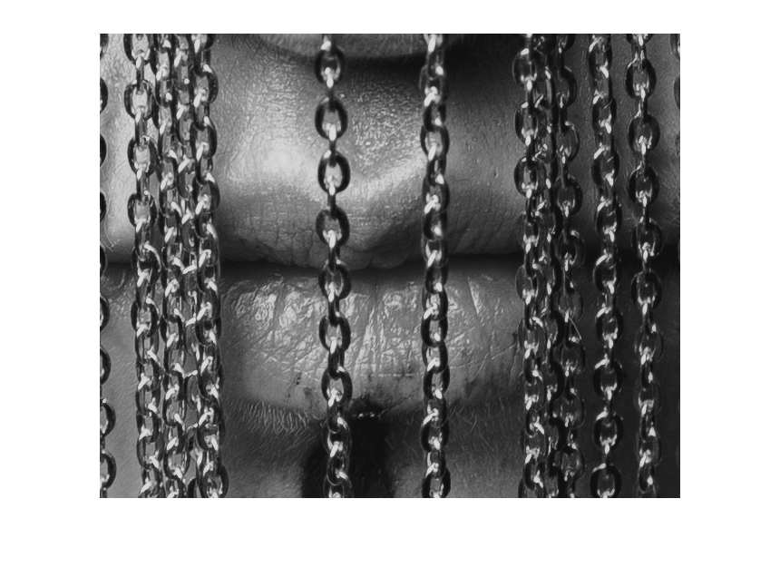

#### 饱和度调节

饱和度调整的算法很多，基本上是越复杂的算法，调整后的图像视觉效果越好。

由于FPGA 不善长复杂的浮点运算，另一方面由于本文定位于基本的图像处理算法，此处只选择一种比较简单的饱和度算法。

设当前输入像素值位宽为 8，RGB 三通道数值为 r、g、b，三个数值间最大值为 max，最小值为 min。

如果 $max=min$，则当前像素点不用调节，直接输出原像素值。

令 $v=max+min$，则有：
$$
s=\begin{cases}
\frac{max-min}{max+min}&v<255\\
\frac{max-min}{255-max+255-min}&v\geq255
\end{cases}
$$
设饱和度调节系数为 saturation，范围 -1.0~1.0。

如果 $saturation\leq0$：
$$
r_{out}=\frac{max+min}{2}+(r_{in}-\frac{max+min}{2})\times(1+saturation)\\
g_{out}=\frac{max+min}{2}+(g_{in}-\frac{max+min}{2})\times(1+saturation)\\
b_{out}=\frac{max+min}{2}+(b_{in}-\frac{max+min}{2})\times(1+saturation)
$$
如果 $saturation>0$：
$$
\alpha=\begin{cases}
\frac{1}{s}-1&(saturation+s)\geq 1\\
\frac{1}{1-saturation}-1&(saturation+s)<1
\end{cases}
$$

$$
r_{out}=r_{in}+(r_{in}-\frac{max+min}{2})\times\alpha\\
g_{out}=g_{in}+(g_{in}-\frac{max+min}{2})\times\alpha\\
b_{out}=b_{in}+(b_{in}-\frac{max+min}{2})\times\alpha
$$

在 sysgen 中使用浮点数进行计算，以保证精度，在输出前转化为无符号整数。整个设计即将前述的算法用 sysgen 模块搭起来，比较麻烦的部分在于各计算结果的时序对齐。

取得当前输入像素点 3 个颜色通道的最大值和最小值：

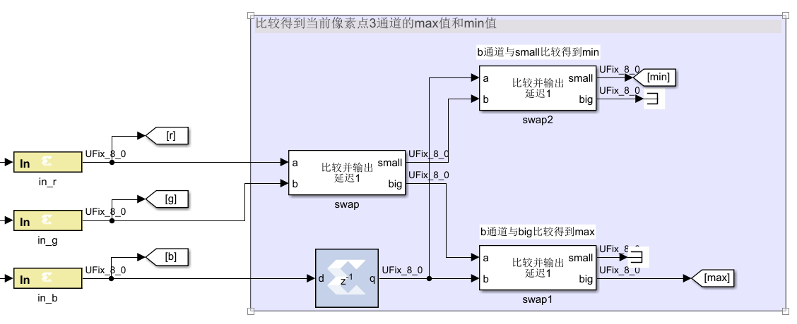

计算s值：

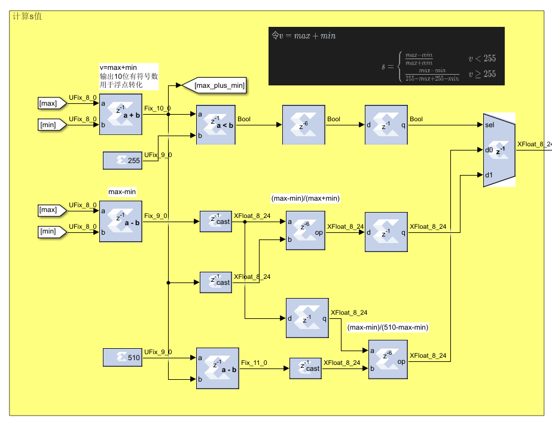

计算 $\alpha$ 值：


$saturation>0 $ 的计算：

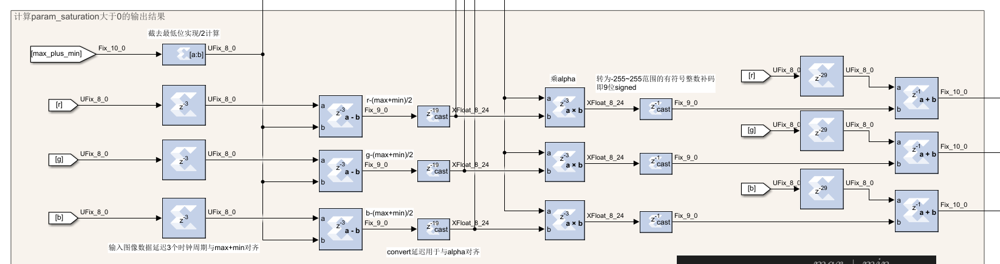

$saturation\leq0$ 的计算：

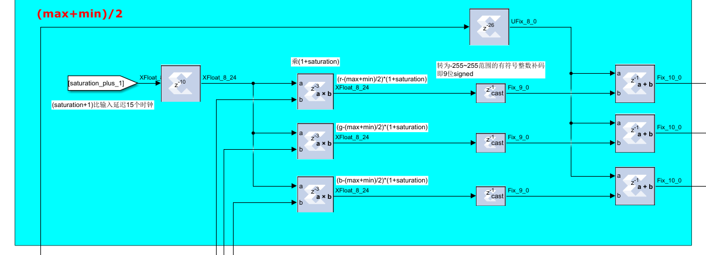

仿真结果。

试验图片来源于：Lena

输入图像：


saturation 值为 0.4 的输出图像：


saturation 值为 -0.3 的输出图像：


#### 图像放大

此处只说明图像放大，不涉及图像缩小，因为大多数图像处理场景下图像缩小的需求可以直接使用像素点抽取的方式实现，而且在缩小之后还涉及到与需求关联紧密的图像拼接，很难有通用化的设计。

##### 算法原理

###### 坐标转换

图像放大有以下关键设计：

1. 坐标转换：输出图像像素点坐标转化为输入图像内的坐标，并找到包围该坐标的像素点用于插值计算。
2. 数据缓冲：输入图像数据截取与缓冲，将用于插值计算的像素点值缓冲，并且在缓冲（FIFO）将满时向数据流上游反压。
3. 插值计算：常用的图像放大插值计算有[双线性插值](#双线性插值)（BiLinear）和双立方插值（BiCubic），前者计算简单，但是会造成图像模糊（相当于低通滤波）；后者计算复杂，但是比较好的保留了图像边缘。
4. **参数传递：由于算法实现涉及到多级数据缓冲及非均匀的流水线处理，而且参数在各个缓冲阶段都需要使用，因此在各级缓冲及流水线处理时都需要使用该处理阶段专用的参数，并且在输入1帧图像数据前更新。如果所有缓冲和计算流水线都共用一组参数的话，则会造成上级缓冲参数更新完成时，下级缓冲还在处理前一帧图像的数据。**

以下设计场景是将输入图像内**指定范围的图像子块**放大至与输入图像相同的分辩率。

图像放大的计算参数包括：

- 图像子块的左上角顶点在输入图像内的坐标：(x~0~, y~0~) 浮点值；
- 图像子块内像素点的间距：z 浮点值，以输入图像内相邻像素点间距为 1，表示图像子块内像素点的间距，由于是放大计算，z<1，且图像放大倍数为 $\frac{1}{z^2}$；
- 用于插值计算的输入图像的像素点坐标范围：x~begin~、x~end~、y~begin~、y~end~，全部为整数值，用于截取输入图像数据。

令输入图像分辩率为 $W\times H$，由 (x~0~, y~0~) 和 z 计算得到全部计算参数，不同的插值算法有不同的参数计算。

**双线性插值，使用包围当前输出像素点（绿点）的 4 个输入像素点（红点）进行插值**。

一般情况：

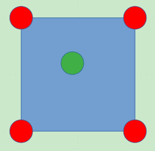

特殊情况，输出像素点与输入像素点的左上角点重合。

即输出像素点与某个输入像素点重合情况下的特殊处理，可以选择 4 个输入像素点中任一点作为重合点，但是由于图像坐标系由左上角开始，因此与左上角点重合比较便于计算。

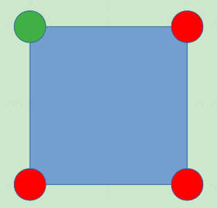
$$
x_{begin}\leq x_0\\
x_{begin}=floor(x_0)
$$

$$
y_{begin}\leq y_{0}\\
y_{begin}=floor(y_0)
$$

输出图像的列坐标最大值为 $x_0+(W-1)\times z$

输出图像的行坐标最大值为 $y_0+(H-1)\times z$

$$
x_{end}>x_0+(W-1)\times z\\
x_{end}=floor(x_0+(W-1)\times z+1)
$$

$$
y_{end}>y_0+(H-1)\times z\\
y_{end}=floor(y_0+(H-1)\times z+1)
$$

**设输出像素点在输出图像中的坐标值为 (X, Y)，该点对应的输入图像的坐标为**：
$$
(x_0+X\times z, y_0+Y\times z)
$$
则计算该输出像素点的输入图像的 4 个插值点的坐标为：

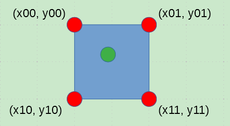
$$
x00=x10=floor(x_0+X\times z)\\
x01=x11=floor(x_0+X\times z+1)\\
y00=y01=floor(y_0+Y\times z)\\
y10=y11=floor(y_0+Y\times z+1)
$$

**双立方插值，使用包围当前输出像素点（绿点）的 16 个输入像素点（红点）进行插值**。

一般情况：

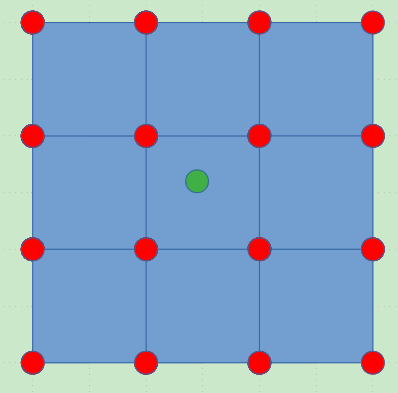

特殊情况，输出像素点与输入像素点的第 2 行第 2 列的像素点重合。

即输出像素点与某个输入像素点重合情况下的特殊处理，可以选择个红框上 4 个输入像素点任一点作为重合点，但是由于图像坐标系由左上角开始，因此与红框的左上角点重合比较便于计算。

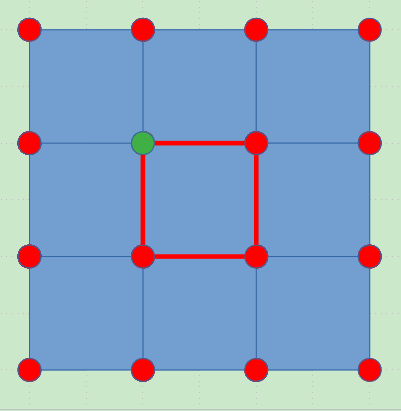
$$
x_{begin}\leq (x_0-1)\\
x_{begin}=floor(x_0-1)
$$

$$
y_{begin}\leq (y_{0}-1)\\
y_{begin}=floor(y_0-1)
$$

$$
x_{end}>x_0+(W-1)\times z+1\\
x_{end}=floor(x_0+(W-1)\times z+1+1)
$$

$$
y_{end}>y_0+(H-1)\times z+1\\
y_{end}=floor(y_0+(H-1)\times z+1+1)
$$
**设输出像素点在输出图像中的坐标值为 (X, Y)，该点对应的输入图像的坐标为**：
$$
(x_0+X\times z, y_0+Y\times z)
$$
则计算该输出像素点的输入图像的 16 个插值点的坐标为：

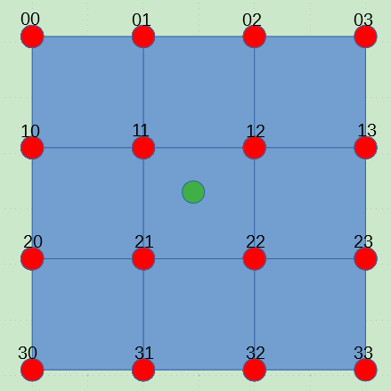
$$
x00=x10=x20=x30=floor(x_0+X\times z-1)\\
x01=x11=x21=x31=floor(x_0+X\times z)\\
x02=x12=x22=x32=floor(x_0+X\times z+1)\\
x03=x13=x23=x33=floor(x_0+X\times z+2)\\
y00=y01=y02=y03=floor(y_0+Y\times z-1)\\
y10=y11=y12=y13=floor(y_0+Y\times z)\\
y20=y21=y22=y23=floor(y_0+Y\times z+1)\\
y30=y31=y32=y33=floor(y_0+Y\times z+2)
$$

###### 数据缓冲

在 FPGA 实现中，每个时钟周期计算产生 1 个输出像素点的情况下，多个输出像素点的计算可能使用同一组输入像素点进行插值，而每个时钟周期都有新的输入像素点进入，因此需要对输入数据进行缓冲。

而且在参数设置的放大倍数较大的情况下，用于放大的图像子块较小，只需要少量的输入数据进行插值计算，导致输入数据占用时长远小于输出数据占用时长，因此需要控制上游模块暂停数据输入，防止由于缓冲空间不足，导致用于插值计算的输入数据被新的输入数据冲走。

数据缓冲分为 3 个阶段：

阶段 1：将输入图像数据送入[二维缓冲](#二维缓冲)产生与插值计算相同格式的并行数据。双线性插值为 $2\times 2$，双立方插值为 $4\times 4$。

阶段 2：将二维缓冲输出的并行数据存入 FIFO，根据其行列坐标值选择插值范围内的并行数据写入 FIFO。

阶段 3：将 FIFO 内的数据**按行读出**，并依次循环交替写入 2 个 Block RAM，实现 ping/pong切换。使用 RAM 而不用 FIFO 的原因在于这 1 行输入像素点数据可能多次用于多行输出像素点的插值计算，需要反复多次读取；用 ping/pong 切换的原因在于可以实现 1 个 RAM 读出数据用于插值计算的同时，另 1 个 RAM 可以写入 FIFO 读出的下 1 行输入图像数据。

###### 双立方插值计算

双立方插值，即 OpenCV 中 resize 函数的 INTER_CUBIC 插值算法。

插值系数 W 的计算公式：
$$
W(x)=\begin{cases}
(a+2)\times \lvert x\rvert^3-(a+3)\times\lvert x\rvert^2+1&\lvert x\rvert\leq1\\
a\times \lvert x\rvert^3-5\times a\times\lvert x\rvert^2+8\times a\times\lvert x\rvert-4\times a&1<\lvert x\rvert <2\\
0&else
\end{cases}
$$
上式中 a 值取 -0.5。

设输出像素点的坐标为 (x, y)，用于计算的插值像素点 (x~i~, y~i~) 取其邻近的 $4\times 4$ 个输入像素点。

根据[坐标转换](#坐标转换)部分的说明：

- 16 点的 x 坐标取值 floor(x)-1、floor(x)、ceil(x)、ceil(x)+1

- 16 点的 y 坐标取值 floor(y)-1、floor(y)、ceil(y)、ceil(y)+1

插值计算公式如下：
$$
f(x,y)=\sum^3_{i=0}\sum^3_{j=0}f(x_i,y_i)\times W(x-x_i)\times W(y-y_i)
$$

##### FPGA 实现

###### Verilog 设计

完整的设计分为 4 个步骤：

1. 输入图像数据进入 $5\times 5$ 的[二维缓冲](#二维缓冲)（借用常用的二维缓冲模块，不用专门开发 $4\times 4$ 的二维缓冲），从中截取 $4\times 4$ 的并行输出，注意以 pix22 作为当前输出像素点，输出坐标及 fv、lv 都与 pix22 对齐；
2. 二维缓冲输出的 $4\times 4$ 并行输出数据存入缓冲 FIFO；
3. FIFO 数据读出并且依次循环写入 2 个 Block RAM；
4. sysgen 插值计算模块根据其插值计算的输入像素点列坐标（作为读地址）从 Block RAM 中读出数据，并根据插值计算输入像素点的行坐标选择切换 ping/pong Block RAM。

二维缓冲例化代码，二维缓冲输出的并行数据、fv、lv、x和y相当于下个步骤的数据输入：

```verilog
wire [7:0] buf_11;
wire [7:0] buf_12;
wire [7:0] buf_13;
wire [7:0] buf_14;

wire [7:0] buf_21;
wire [7:0] buf_22;
wire [7:0] buf_23;
wire [7:0] buf_24;

wire [7:0] buf_31;
wire [7:0] buf_32;
wire [7:0] buf_33;
wire [7:0] buf_34;

wire [7:0] buf_41;
wire [7:0] buf_42;
wire [7:0] buf_43;
wire [7:0] buf_44;

(*keep = "TRUE"*) wire buf_fv;
(*keep = "TRUE"*) wire buf_lv;

(*keep = "TRUE"*) wire [15:0] buf_x;
(*keep = "TRUE"*) wire [15:0] buf_y;

buf_5x5_zoom buf_5x5_u (
.clk(clk),              // input wire clk
.rst(rst),              // input wire [0 : 0] rst
.in_pix(in_pix),        // input wire [7 : 0] in_pix
.in_lv(in_lv),          // input wire [0 : 0] in_lv
.out_pix00(),  // output wire [7 : 0] out_pix00
.out_pix01(),  // output wire [7 : 0] out_pix01
.out_pix02(),  // output wire [7 : 0] out_pix02
.out_pix03(),  // output wire [7 : 0] out_pix03
.out_pix04(),  // output wire [7 : 0] out_pix04
.out_pix10(),  // output wire [7 : 0] out_pix10
.out_pix11(buf_11),  // output wire [7 : 0] out_pix11
.out_pix12(buf_12),  // output wire [7 : 0] out_pix12
.out_pix13(buf_13),  // output wire [7 : 0] out_pix13
.out_pix14(buf_14),  // output wire [7 : 0] out_pix14
.out_pix20(),  // output wire [7 : 0] out_pix20
.out_pix21(buf_21),  // output wire [7 : 0] out_pix21
.out_pix22(buf_22),  // output wire [7 : 0] out_pix22
.out_pix23(buf_23),  // output wire [7 : 0] out_pix23
.out_pix24(buf_24),  // output wire [7 : 0] out_pix24
.out_pix30(),  // output wire [7 : 0] out_pix30
.out_pix31(buf_31),  // output wire [7 : 0] out_pix31
.out_pix32(buf_32),  // output wire [7 : 0] out_pix32
.out_pix33(buf_33),  // output wire [7 : 0] out_pix33
.out_pix34(buf_34),  // output wire [7 : 0] out_pix34
.out_pix40(),  // output wire [7 : 0] out_pix40
.out_pix41(buf_41),  // output wire [7 : 0] out_pix41
.out_pix42(buf_42),  // output wire [7 : 0] out_pix42
.out_pix43(buf_43),  // output wire [7 : 0] out_pix43
.out_pix44(buf_44),  // output wire [7 : 0] out_pix44
.out_x(buf_x),      // output wire [15 : 0] out_col
.out_y(buf_y),      // output wire [15 : 0] out_row
.out_fv(buf_fv),        // output wire [0 : 0] out_fv
.out_lv(buf_lv)        // output wire [0 : 0] out_lv
);
```

二维缓冲输出的 fv 用于**第 1 次参数传递**，将端口参数送至 FIFO 写接口，参考更新办法见[前述的参数更新流程](#参数更新流程)：

```verilog
//更新FIFO缓冲的参数
always @(posedge clk) begin
	if (rst == 1'b1) begin
		z <= 32'hFFFF_FFFF;
		x0 <= 32'hFFFF_FFFF;
		y0 <= 32'hFFFF_FFFF;
		x_begin <= 16'hFFFF;
		y_begin <= 16'hFFFF;
		x_end <= 16'hFFFF;
		y_end <= 16'hFFFF;
		col_len <= 16'hFFFF;
		row_len <= 16'hFFFF;
	end
	else begin
		case ({buf_fv_d1, buf_fv, param_valid})
			{1'b1, 1'b0, 1'b1}: begin
				//fv下降沿，且参数有效，则更新参数值
				z <= param_z;
				x0 <= param_x0;
				y0 <= param_y0;
				x_begin <= param_x_begin;
				y_begin <= param_y_begin;
				x_end <= param_x_end;
				y_end <= param_y_end;
				col_len <= param_col_len;
				row_len <= param_row_len;
			end

			default: begin
				//保持
				z <= z;
				x0 <= x0;
				y0 <= y0;
				x_begin <= x_begin;
				y_begin <= y_begin;
				x_end <= x_end;
				y_end <= y_end;
				col_len <= col_len;
				row_len <= row_len;
			end
		endcase
	end
end
```

用状态机控制截取输入图像数据写入 FIFO。

注意下方代码的 state_en 寄存器，用于控制算法使能，**在算法非使能情况下直接输出二维缓冲的结果，数据不写入 FIFO**。

```verilog
always @(posedge clk) begin
	if (rst == 1'b1) begin
		state_fifo_wr <= FIFO_WR_WAIT;//复位后等待fv下降沿才开始工作
		fifo_wr_en <= 1'b0;
		fifo_din <= {128{1'b1}};
	end
	else begin
		case (state_fifo_wr)
			FIFO_WR_WAIT: begin
				//在fv下降沿检查算法使能状态，用于启动状态机
				case ({buf_fv_d1, buf_fv, state_en})
					{1'b1, 1'b0, ENABLED}: begin
						state_fifo_wr <= FIFO_WR_DATA;
					end

					default: begin
						state_fifo_wr <= state_fifo_wr;
					end
				endcase

				fifo_wr_en <= 1'b0;
				fifo_din <= {128{1'b1}};
			end

			FIFO_WR_DATA: begin
				if ((buf_x >= x_begin) && (buf_x <= x_end) && (buf_y >= y_begin) && (buf_y <= y_end)) begin
					//二维缓冲输出的并行数据坐标在截取范围内
					fifo_wr_en <= buf_fv & buf_lv;//二缓缓冲输出并行数据有效
				end
				else begin
					fifo_wr_en <= 1'b0;
				end

				//FIFO写入数据为并行数据拼接
				fifo_din <= {buf_11, buf_12, buf_13, buf_14,
				buf_21, buf_22, buf_23, buf_24,
				buf_31, buf_32, buf_33, buf_34,
				buf_41, buf_42, buf_43, buf_44};

				case ({buf_x, buf_y, buf_fv, buf_lv})
					{x_end, y_end, 1'b1, 1'b1}: begin
						//有效范围内的最后1个像素点从二维缓冲输出
						state_fifo_wr <= FIFO_WR_WAIT;
					end

					default: begin
						//状态保持
						state_fifo_wr <= state_fifo_wr;
					end
				endcase
			end

			default: begin
				state_fifo_wr <= FIFO_WR_WAIT;
				fifo_wr_en <= 1'b0;
				fifo_din <= {128{1'b1}};
			end
		endcase
	end
end
```

FIFO 读出状态机如下，在从 FIFO 读出 1 帧数据之前先寄存 FIFO 写接口的参数，完成**第 2 次参数传递**，再根据 Block RAM 的可写状态切换数据写入的 RAM，直到 1 帧图像在 FIFO 内缓冲的数据全部读出。

```verilog
always @(posedge clk) begin
	if (rst == 1'b1) begin
		fifo_rd_en <= 1'b0;
		state_fifo_rd <= FIFO_RD_PARAM;
	end
	else begin
		case (state_fifo_rd)
			FIFO_RD_PARAM: begin
				//FIFO非空，表示新一帧图像数据已进入，更新参数
				if (fifo_empty == 1'b0) begin
					state_fifo_rd <= FIFO_RD_LINE_WAIT_PING;
				end
				else begin
					state_fifo_rd <= state_fifo_rd;
				end

				fifo_rd_en <= 1'b0;
			end

			FIFO_RD_LINE_WAIT_PING: begin
				//等待FIFO内装入1行数据量sg_col_len，且ping可写
				if ((fifo_data_count >= bram_col_len) && (bram_state_ping == 1'b0)) begin
					fifo_rd_en <= 1'b1;
					state_fifo_rd <= FIFO_RD_LINE_PING;
				end
				else begin
					fifo_rd_en <= 1'b0;
					state_fifo_rd <= state_fifo_rd;
				end
			end

			FIFO_RD_LINE_PING: begin
				//状态保持sg_col_len个时钟周期，从FIFO内读出1行数据写入ping
				//在当前状态下fifo_rd_en保持有效
				case (cnt_bram_col_len)
					bram_col_len: begin
						//完成sg_col_len个时钟周期计数，1行数据读出完成
						fifo_rd_en <= 1'b0;

						case (cnt_bram_row_len)
							bram_row_len: begin
								//完成sg_row_len行的数据读出，即1帧图像读出完成，状态机复位
								state_fifo_rd <= FIFO_RD_PARAM;
							end

							default: begin
								//未完成1帧图像读出，接下来读出下1行数据，切换至pong
								state_fifo_rd <= FIFO_RD_LINE_WAIT_PONG;
							end
						endcase
					end

					default: begin
						fifo_rd_en <= 1'b1;
						state_fifo_rd <= state_fifo_rd;
					end
				endcase
			end

			FIFO_RD_LINE_WAIT_PONG: begin
				//等待FIFO内装入1行数据量sg_col_len，且pong可写
				if ((fifo_data_count >= bram_col_len) && (bram_state_pong == 1'b0)) begin
					fifo_rd_en <= 1'b1;
					state_fifo_rd <= FIFO_RD_LINE_PONG;
				end
				else begin
					fifo_rd_en <= 1'b0;
					state_fifo_rd <= state_fifo_rd;
				end
			end

			FIFO_RD_LINE_PONG: begin
				//状态保持bram_col_len个时钟周期，从FIFO内读出1行数据写入pong
				//在当前状态下fifo_rd_en保持有效
				case (cnt_bram_col_len)
					bram_col_len: begin
						//完成sg_col_len个时钟周期计数，1行数据读出完成
						fifo_rd_en <= 1'b0;

						case (cnt_bram_row_len)
							bram_row_len: begin
								//完成bram_row_len行的数据读出，即1帧图像读出完成，状态机复位
								state_fifo_rd <= FIFO_RD_PARAM;
							end

							default: begin
								//未完成1帧图像读出，接下来读出下1行数据，切换至ping
								state_fifo_rd <= FIFO_RD_LINE_WAIT_PING;
							end
						endcase
					end

					default: begin
						fifo_rd_en <= 1'b1;
						state_fifo_rd <= state_fifo_rd;
					end
				endcase
			end

			default: begin
				fifo_rd_en <= 1'b0;
				state_fifo_rd <= FIFO_RD_PARAM;
			end
		endcase
	end
end

//FIFO读出1帧数据之前，更新bram写参数
always @(posedge clk) begin
	if (rst == 1'b1) begin
		{bram_z, bram_x0, bram_y0, bram_x_begin, bram_y_begin, bram_x_end, bram_y_end, bram_col_len, bram_row_len} <= {192{1'b1}};
	end
	else begin
		case (state_fifo_rd)
			FIFO_RD_PARAM: begin
				{bram_z, bram_x0, bram_y0, bram_x_begin, bram_y_begin, bram_x_end, bram_y_end, bram_col_len, bram_row_len} <= {z, x0, y0, x_begin, y_begin, x_end, y_end, col_len, row_len};
			end

			default: begin
				//保持
				{bram_z, bram_x0, bram_y0, bram_x_begin, bram_y_begin, bram_x_end, bram_y_end, bram_col_len, bram_row_len} <= {bram_z, bram_x0, bram_y0, bram_x_begin, bram_y_begin, bram_x_end, bram_y_end, bram_col_len, bram_row_len};
			end
		endcase
	end
end
```

Block RAM 定义为双口 RAM，a 口专用于写入，b 口专用于读出。

**注意：RAM 的写读地址与输入像素点列坐标一致**，方便 sysgen 根据列坐标读出用于插值的数据。

Block RAM 写入流程由 FIFO 读出状态机控制：

```verilog
//例化FIFO读出后保存行数据的bram
//用ping/pong切换的方式，实现1个bram写入的过程中另1个bram可以读出
reg wea_ping = 1'b0;
reg wea_pong = 1'b0;

reg [127:0] dina_ping = {128{1'b1}};
reg [127:0] dina_pong = {128{1'b1}};

reg [9:0] addra_ping = 10'h3FF;
reg [9:0] addra_pong = 10'h3FF;

//port b保持读状态，用addrb更新读出数值
wire [9:0] addrb_ping;
wire [9:0] addrb_pong;

wire [127:0] doutb_ping;
wire [127:0] doutb_pong;

//port a专用于写入
//port b专用于读出
bram_zoom bram_ping
(
.clka(clk),    // input wire clka
.wea(wea_ping),      // input wire [0 : 0] wea
.addra(addra_ping),  // input wire [9 : 0] addra
.dina(dina_ping),    // input wire [127 : 0] dina
.douta(),  // output wire [127 : 0] douta
.clkb(clk),    // input wire clkb
.web(1'b0),      // input wire [0 : 0] web
.addrb(addrb_ping),  // input wire [9 : 0] addrb
.dinb(128'd0),    // input wire [127 : 0] dinb
.doutb(doutb_ping)  // output wire [127 : 0] doutb
);

bram_zoom bram_pong
(
.clka(clk),    // input wire clka
.wea(wea_pong),      // input wire [0 : 0] wea
.addra(addra_pong),  // input wire [9 : 0] addra
.dina(dina_pong),    // input wire [127 : 0] dina
.douta(),  // output wire [127 : 0] douta
.clkb(clk),    // input wire clkb
.web(1'b0),      // input wire [0 : 0] web
.addrb(addrb_pong),  // input wire [9 : 0] addrb
.dinb(128'd0),    // input wire [127 : 0] dinb
.doutb(doutb_pong)  // output wire [127 : 0] doutb
);

//bram写接口，写地址即输入像素点坐标
always @(posedge clk) begin
	case (state_fifo_rd)
		FIFO_RD_LINE_PING: begin
			//FIFO数据写入ping
			wea_ping <= 1'b1;
			dina_ping <= fifo_dout;
			addra_ping <= addra_ping+10'd1;
		end

		default: begin
			wea_ping <= 1'b0;
			dina_ping <= 128'd0;
			addra_ping <= bram_x_begin[9:0]-10'd1;//用于在FIFO_RD_LINE_PING首个时钟周期+1后得到bram_x_begin
		end
	endcase
end

always @(posedge clk) begin
	case (state_fifo_rd)
		FIFO_RD_LINE_PONG: begin
			//FIFO数据写入pong
			wea_pong <= 1'b1;
			dina_pong <= fifo_dout;
			addra_pong <= addra_pong+10'd1;
		end

		default: begin
			wea_pong <= 1'b0;
			dina_pong <= 128'd0;
			addra_pong <= bram_x_begin[9:0]-10'd1;//用于在FIFO_RD_LINE_PONG首个时钟周期+1后得到bram_x_begin
		end
	endcase
end
```

Block RAM 的读出状态机，用输入 sysgen 模块的 lv 信号控制 sysgen 的计算流程，并且进行**第 3 次参数传递**，将参数供 sysgen 计算使用。

注意下方代码中 backpressure_in 信号的处理，即收到下游模块送入的反压信号时，Block RAM 读出状态机将停止工作。

```verilog
//bram数据读出控制

//来自于sysgen的输入图像坐标请求和对应的输出图像坐标
(*keep = "TRUE"*) wire coord_en;//坐标有效
(*keep = "TRUE"*) wire [15:0] coord_x;//输出图像列坐标
(*keep = "TRUE"*) wire [15:0] coord_y;//输出图像行坐标
(*keep = "TRUE"*) wire [15:0] coord_req_x;//请求输入图像的列坐标，用于bram读地址
(*keep = "TRUE"*) wire [15:0] coord_req_y;//请求输入图像的行坐标，切换bram ping/pong

//bram读地址直连sysgen的请求输入图像列坐标
assign addrb_ping = coord_req_x[9:0];
assign addrb_pong = coord_req_x[9:0];

//coord_en延迟1个时钟周期，用于同步bram读出数据，即比coord_req_x延迟1个时钟周期
reg coord_en_d1 = 1'b0;
always @(posedge clk) begin
	coord_en_d1 <= coord_en;
end

//coord_y延迟1个时钟周期，用于判断输出1帧结果
reg [15:0] coord_y_d1 = 16'hFFFF;
always @(posedge clk) begin
	coord_y_d1 <= coord_y;
end

//coord_req_y延迟1个时钟周期，用于查看请求输入图像的行坐标的变化，判断切换bram ping/pong
reg [15:0] coord_req_y_d1 = 16'hFFFF;
always @(posedge clk) begin
	coord_req_y_d1 <= coord_req_y;
end

//从bram写流程中取出的参数，用于sysgen计算，完成1帧插值计算，从ping中读出首行插值数据之前寄存
(*keep = "TRUE"*) reg [31:0] sg_z = 32'hFFFF_FFFF;
(*keep = "TRUE"*) reg [31:0] sg_x0 = 32'hFFFF_FFFF;
(*keep = "TRUE"*) reg [31:0] sg_y0 = 32'hFFFF_FFFF;
(*keep = "TRUE"*) reg [15:0] sg_y_begin = 16'hFFFF;
(*keep = "TRUE"*) reg [15:0] sg_y_end = 16'hFFFF;

//bram读状态机计数
reg [15:0] cnt_bram_rd = 16'd1;//计数范围

//bram读状态机，由bram内数据状态和sysgen坐标请求状态控制
localparam BRAM_RD_WAIT_PING = 6'b000001;
localparam BRAM_RD_PING = 6'b000010;
localparam BRAM_RD_HOLD_PING = 6'b000100;
localparam BRAM_RD_WAIT_PONG = 6'b001000;
localparam BRAM_RD_PONG = 6'b010000;
localparam BRAM_RD_HOLD_PONG = 6'b100000;
(*keep = "TRUE"*) reg [5:0] state_bram_rd = BRAM_RD_WAIT_PING;

always @(posedge clk) begin
	if (rst == 1'b1) begin
		state_bram_rd <= BRAM_RD_WAIT_PING;
	end
	else begin
		case (state_bram_rd)
			BRAM_RD_WAIT_PING: begin
				//等待ping可读，且无反压输入
				if ((bram_state_ping == 1'b1) && (backpressure_in == 1'b0)) begin
					state_bram_rd <= BRAM_RD_PING;
				end
				else begin
					state_bram_rd <= state_bram_rd;
				end
			end

			BRAM_RD_PING: begin
				//保持COLS个时钟周期，生成输入sysgen的lv，长度为COLS，启动sysgen计算
				case (cnt_bram_rd)
					COLS: begin
						state_bram_rd <= BRAM_RD_HOLD_PING;
					end

					default: begin
						state_bram_rd <= state_bram_rd;
					end
				endcase
			end

			BRAM_RD_HOLD_PING: begin
				//前1个状态生成的lv送出全部的的坐标请求
				case ({coord_en_d1, coord_en})
					{1'b1, 1'b0}: begin
						//完成1行坐标请求
						if ((coord_y == 16'd0) && (coord_y_d1 != 16'd0)) begin
							//完成一帧图像最后1行的请求
							//状态机复位
							state_bram_rd <= BRAM_RD_WAIT_PING;
						end
						/*
						由于浮点计算误差，可能导致一帧数据计算过程中，读取bram的次数多于row_width，从FIFO中多读出下帧的若干行
						因此必须通过ori_y有效值限制切换
						ori_y值小于row_begin，表示起点行误差，在ori_y>ori_y_d1情况下发现ori_y值小于等于row_begin，表示ori_y_d1小于row_begin，则不切换
						ori_y值大于row_end，表示终点行误差，在ori_y>ori_y_d1情况下发现ori_y值大于row_end，不切换
						*/
						else if ((coord_req_y > coord_req_y_d1) && (coord_req_y <= sg_y_end) && (coord_req_y > sg_y_begin)) begin
							//计算输入的原始图像坐标已切换至下一行
							state_bram_rd <= BRAM_RD_WAIT_PONG;
						end
						else begin
							//不切换bram，仍使用ping
							state_bram_rd <= BRAM_RD_WAIT_PING;
						end
					end
				endcase
			end

			BRAM_RD_WAIT_PONG: begin
				//等待pong可读，且无反压输入
				if ((bram_state_pong == 1'b1) && (backpressure_in == 1'b0)) begin
					state_bram_rd <= BRAM_RD_PONG;
				end
				else begin
					state_bram_rd <= state_bram_rd;
				end
			end

			BRAM_RD_PONG: begin
				//保持COLS个时钟周期，生成输入sysgen的lv，启动sysgen计算
				case (cnt_bram_rd)
					COLS: begin
						state_bram_rd <= BRAM_RD_HOLD_PONG;
					end

					default: begin
						state_bram_rd <= state_bram_rd;
					end
				endcase
			end

			BRAM_RD_HOLD_PONG: begin
				//等待sysgen完成1行数据请求
				case ({coord_en_d1, coord_en})
					{1'b1, 1'b0}: begin
						//完成1行坐标请求
						if ((coord_y == 16'd0) && (coord_y_d1 != 16'd0)) begin
							//完成一帧图像最后1行的请求
							//状态机复位
							state_bram_rd <= BRAM_RD_WAIT_PING;
						end
						/*
						由于浮点计算误差，可能导致一帧数据计算过程中，读取bram的次数多于row_width，从FIFO中多读出下帧的若干行
						因此必须通过ori_y有效值限制切换
						ori_y值小于row_begin，表示起点行误差，在ori_y>ori_y_d1情况下发现ori_y值小于等于row_begin，表示ori_y_d1小于row_begin，则不切换
						ori_y值大于row_end，表示终点行误差，在ori_y>ori_y_d1情况下发现ori_y值大于row_end，不切换
						*/
						else if ((coord_req_y > coord_req_y_d1) && (coord_req_y <= sg_y_end) && (coord_req_y > sg_y_begin)) begin
							//计算输入的原始图像坐标已切换至下一行
							state_bram_rd <= BRAM_RD_WAIT_PING;
						end
						else begin
							//不切换bram，仍使用pong
							state_bram_rd <= BRAM_RD_WAIT_PONG;
						end
					end
				endcase
			end

			default: begin
				state_bram_rd <= BRAM_RD_WAIT_PING;
			end
		endcase
	end
end

//更新sysgen参数
always @(posedge clk) begin
	if (rst == 1'b1) begin
		sg_z <= 32'hFFFF_FFFF;
		sg_x0 <= 32'hFFFF_FFFF;
		sg_y0 <= 32'hFFFF_FFFF;
		sg_y_begin <= 16'hFFFF;
		sg_y_end <= 16'hFFFF;
	end
	else begin
		case ({state_bram_rd, bram_state_ping, backpressure_in, coord_x, coord_y})
			{BRAM_RD_WAIT_PING, 1'b1, 1'b0, 16'd0, 16'd0}: begin
				//1帧数据首次进入BRAM_RD_PING状态时用bram参数更新sg参数
				sg_z <= bram_z;
				sg_x0 <= bram_x0;
				sg_y0 <= bram_y0;
				sg_y_begin <= bram_y_begin;
				sg_y_end <= bram_y_end;
			end

			default: begin
				//保持
				sg_z <= sg_z;
				sg_x0 <= sg_x0;
				sg_y0 <= sg_y0;
				sg_y_begin <= sg_y_begin;
				sg_y_end <= sg_y_end;
			end
		endcase
	end
end
```

Block RAM 的可写可读状态根据前述状态机的控制：

```verilog
always @(posedge clk) begin
	if (rst == 1'b1) begin
		bram_state_ping <= 1'b0;//默认为可写状态
	end
	else begin
		case (bram_state_ping)
			1'b0: begin
				//见bram写接口控制
				case ({wea_ping, addra_ping})
					{1'b1, bram_x_end[9:0]}: begin
						//下个时钟周期完成1行内最后1个像素点写入
						bram_state_ping <= 1'b1;
					end

					default: begin
						//保持
						bram_state_ping <= bram_state_ping;
					end
				endcase
			end

			1'b1: begin
				//即state_bram_rd在BRAM_RD_HOLD_PING状态下的转移条件
				case (state_bram_rd)
					BRAM_RD_HOLD_PING: begin
						//前1个状态生成的lv送出全部的的坐标请求
						case ({coord_en_d1, coord_en})
							{1'b1, 1'b0}: begin
								//完成1行坐标请求
								if ((coord_y == 16'd0) && (coord_y_d1 != 16'd0)) begin
									//完成一帧图像最后1行的请求
									//状态机复位
									bram_state_ping <= 1'b0;
								end
								else if ((coord_req_y > coord_req_y_d1) && (coord_req_y <= sg_y_end) && (coord_req_y > sg_y_begin)) begin
									//计算输入的原始图像坐标已切换至下一行
									bram_state_ping <= 1'b0;
								end
								else begin
									//不切换bram，仍使用ping
									//保持
									bram_state_ping <= bram_state_ping;
								end
							end
						endcase
					end
					
					default: begin
						//保持
						bram_state_ping <= bram_state_ping;
					end
				endcase
			end
		endcase
	end
end

always @(posedge clk) begin
	if (rst == 1'b1) begin
		bram_state_pong <= 1'b0;//默认为可写状态
	end
	else begin
		case (bram_state_pong)
			1'b0: begin
				//见bram写接口控制
				case ({wea_pong, addra_pong})
					{1'b1, bram_x_end[9:0]}: begin
						//下个时钟周期完成1行内最后1个像素点写入
						bram_state_pong <= 1'b1;
					end

					default: begin
						//保持
						bram_state_pong <= bram_state_pong;
					end
				endcase
			end

			1'b1: begin
				//即state_bram_rd在BRAM_RD_HOLD_PONG状态下的转移条件
				case (state_bram_rd)
					BRAM_RD_HOLD_PONG: begin
						//前1个状态生成的lv送出全部的的坐标请求
						case ({coord_en_d1, coord_en})
							{1'b1, 1'b0}: begin
								//完成1行坐标请求
								if ((coord_y == 16'd0) && (coord_y_d1 != 16'd0)) begin
									//完成一帧图像最后1行的请求
									//状态机复位
									bram_state_pong <= 1'b0;
								end
								else if ((coord_req_y > coord_req_y_d1) && (coord_req_y <= sg_y_end) && (coord_req_y > sg_y_begin)) begin
									//计算输入的原始图像坐标已切换至下一行
									bram_state_pong <= 1'b0;
								end
								else begin
									//不切换bram，仍使用pong
									//保持
									bram_state_pong <= bram_state_pong;
								end
							end
						endcase
					end
					
					default: begin
						//保持
						bram_state_pong <= bram_state_pong;
					end
				endcase
			end
		endcase
	end
end
```

模块的反压控制除了向数据流上游输出反压以外，还负责将下游的反压信号向上游传递：

```verilog
//在数据流上级模块中将根据反压停止数据送出状态机
parameter BACKPRESSURE_THRESHOLD = 12'd768;

reg backpressure_out = 1'b0;
always @(posedge clk) begin
	if (fifo_data_count >= BACKPRESSURE_THRESHOLD) begin
		backpressure_out <= 1'b1;
	end
	else begin
		backpressure_out <= backpressure_in;//向上游传递反压
	end
end
```

###### sysgen 设计

sysgen 与 Verilog 的配合方法在于 sysgen 向 Verilog 请求数据，Verilog 根据请求数据的坐标向 sysgen 送入用于插值的数据。

Verilog 在 Block RAM 读状态机中产生向 sysgen 输入的 in_lv，其持续的时间即输出图像的列数目，sysgen 计算产生其输出像素点的坐标 (coord_x, coord_y)，以及该像素点插值计算的输入像素点的坐标 (coord_req_x, coord_req_y)，计算方法与前述的[坐标转换](#坐标转换)一致。

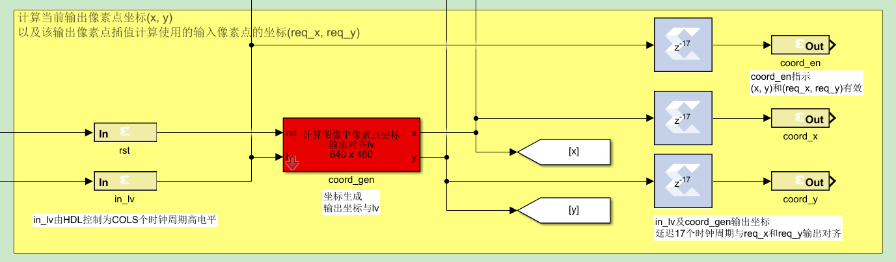

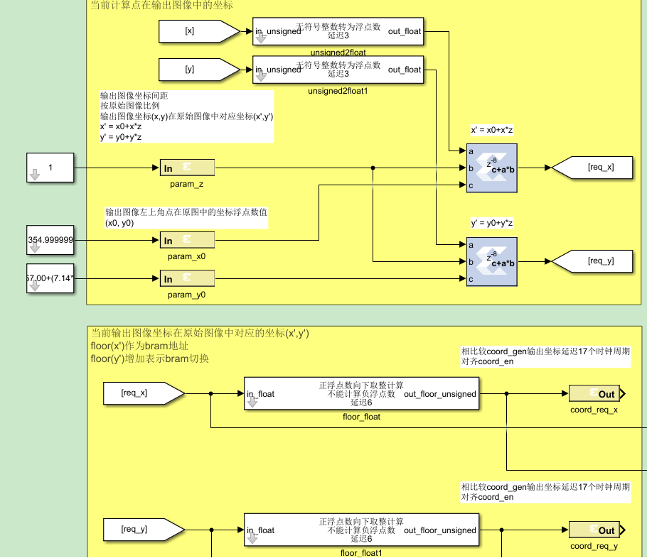

插值计算过程全部使用浮点数，在输出之前转化为无符号整数输出。

插值计算的实现过程与[双立方插值计算](#双立方插值计算)一致。

先进行坐标计算：

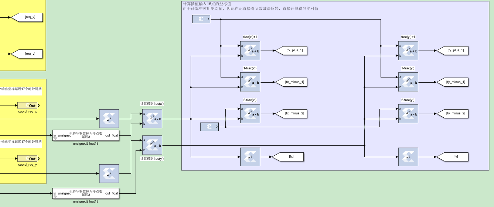再进行 16 点插值系数计算：

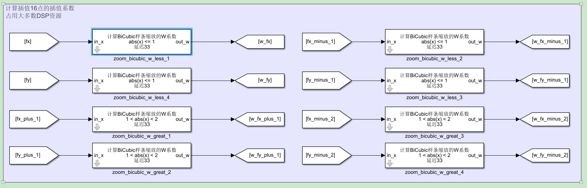

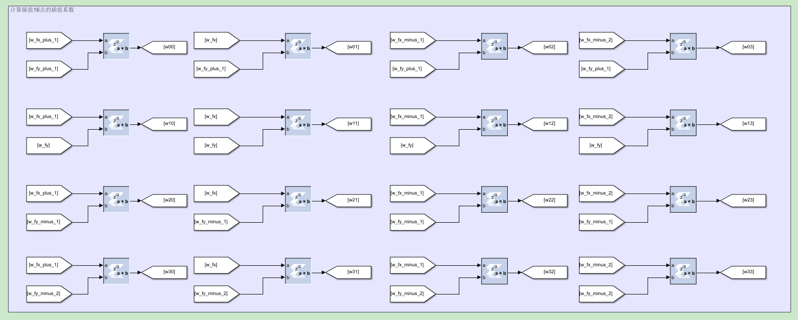

最后将 Block RAM 读入的并行数据与插值系数进行乘加完成插值计算。

###### 实机验证

由于数据接口比较复杂，不方便在 sysgen 环境下仿真，于是实机试验。

试验图片来源于视频截图：<https://www.youku.com/>

输入原始图像：


参数 z 值为 0.5 的放大图像：


参数 z 值为 0.3 的放大图像：


