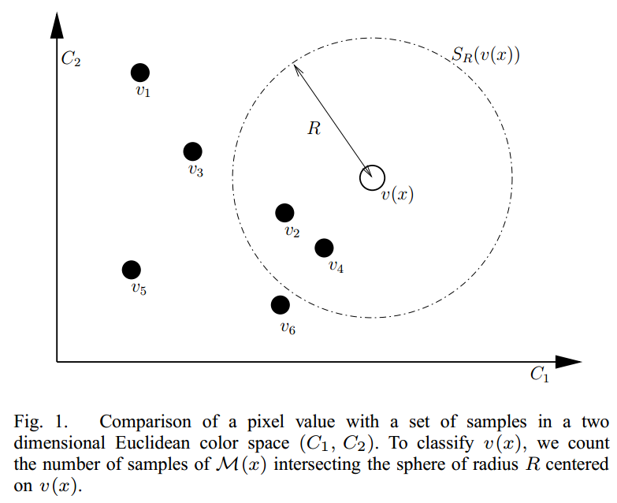
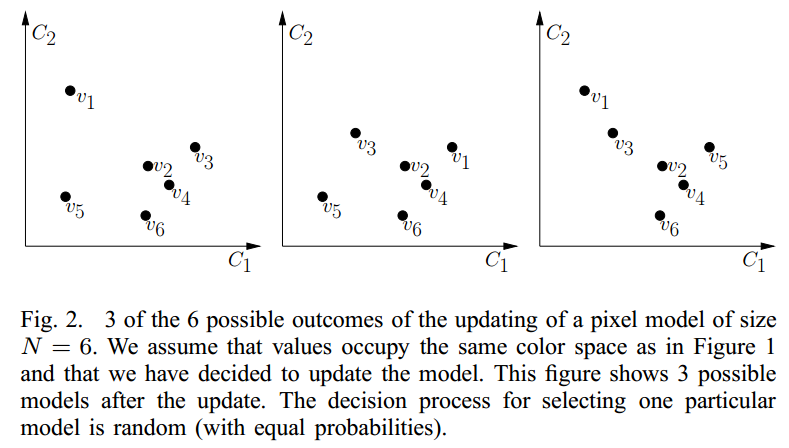

本文基本由原始文档的部分章节翻译得到：

*ViBe: A universal background subtraction algorithm for video sequences*

Olivier Barnich and Marc Van Croogenbroeck, Member, IEEE

*声明：本文并非全文翻译，本人并未联系作者取得授权，如有侵权，会立即删除。*

# III. ViBe 算法描述

背景提取算法至少必须妥善处理以下 3 个方面的问题才能得到理想的结果：

1. 算法的**像素点模型**怎样得到并且怎样工作？
2. 像素点模型怎样初始化？
3. 怎样在工作过程中更新像素点模型？

前述 3 个问题的答案会在本章内容中说明。

大多数论文都研究了问题 1 和问题 3。只有少部分论文讨论了问题 2，而问题 2 却是解决数字摄像场景下快速响应的关键。

而且，在大多数情况下，像素点模型和更新策略缺少关联性。比如，一些算法计算当前像素值值 p 和模型值 b 差值的绝对值，如果该值小于门限值 T 时认为当前像素点为背景。为了适应时间变化，用 p 值的统计方差更新 T 值，但是该统计方差却由时间域平均计算得到。于是，这种门限值 T 的调整速率完全由当前帧率和背景像素点数目决定，但是对于由网络带宽决定帧率的网络摄像机而言，这种方式并不合适。

接下来描述的背景提取算法称为 ViBe (VIsual Background Extractor)。附录 A 中 C 语言形式的伪代码可以供读者参考。

## A. 像素模型及背景判定

目前几乎所有的背景判定算法都是在给定色域空间，计算每个背景像素点的概率密度函数（pdf: probability density function）（或者给定像素点的统计学参数，比如均值或者方差），再由 pdf 进行计算完成判定。

对于高斯分布而言，由于均值和方差完全足以决定 pdf，因此没有任何区别。尽管主流的背景提取算法都是基于 pdf 或者统计参数，但是却很少有对于此类统计显著性的研究。

事实上，有效的背景提取计算并不一定必须使用 pdf。一种替代方案就是使用实际观察得到的像素值构建像素点模型以达到，随着时间增长而增大的==统计显著性==。这种方案最基本的假设就是已经被观察到的像素值再次出现的概率要大于未被观察到的像素值。

不选择 pdf 算法的原因在于：pdf 模型的偏差十分普遍，计算相当复杂，对异常值比较敏感，而且，pdf 的计算还涉及到统计样本数目选取的问题。

如果我们把背景提取问题作为一个分类问题看待，为了排除异常值的干扰，我们可以根据一个新的像素点值在指定颜色空间的邻近值来对该像素点进行分类。基于这种思想，我们选**用一组采样值的集合作为背景像素点模型**，而不是一个精确计算的模型。这种办法与主流算法最大的区别就在于，不用计算 pdf，而且只需要将像素值与模型中的各采样值进行比较即可。像素值会与集合中部分采样值接近，而与大多数采样值差异区大。这种方法的思想就是，少量数值相近的采样值比单纯大量的采样值更容易估计出背景像素值的统计分布。在某种意义上与 pdf 算法中排除 pdf 极值或者 pdf 区域截取是一样的思想。为了保证像素点模型的准确性，背景像素点采样必须谨慎，只有真正的背景像素点才能加入到模型中去。

（译者：以下的内容都是针对坐标 x 的 1 个像素点的判断，图像中所有像素点都得进行相同的判断计算，并使用独立的像素点模型。）

假设 $v(x)$ 为图像中坐标为 x 的像素点在当前色域中的数值，用 $v_{i}$ 表示序号为 i 的背景采样值。x 像素点的 N 个背景采样值的集合表示为$M(x)=\{v_{1}, v_{2}, ..., v_{N}\}$。N 个采样值来源于之前的图像帧。为方便理解，我们暂时不考虑时间对采样值集合的影响。

为了对 $v(x)$ 进行背景判断，我们需要找到其与 $M(x)$ 像素点模型中的最为接近的采样点。在当前色域中，以 $v(x)$ 为中心，R 为半径定义一个空间区域 $S_{R}\big((v(x)\big)$，将落入该区域的采样点的数目称为**基数**（cardinality，用 # 表示）。如果**基数大于等于指定的门限值  #min**，则当前像素点被认为是背景：
$$
\#\{S_{R}\big(v(x)\big)\cap M(x)\}\geq \#min
$$
根据上式，像素点的分类计算包括：v(x) 与 M(x) 中 N 个采样点的距离计算，以及距离值与半径 R 值的比较。

为方便示意，假设当前色域分为 2 个颜色通道（译者：对于 RGB 色域的 3 个颜色通道，空间区域 $S_{R}$ 会是一个圆球），下图中采样点 $v_2$ 和 $v_4$ 包含于空间区域 $S_{R}\big((v(x)\big)$：

注意，分类的目标在于找到包含在空间区域 $S_{R}\big((v(x)\big)$ 范围内的采样点数目，如果数目已达到 #min，则可以停止计算 M(x) 中的其它采样点。

很明显，像素点模型的准确性由 2 个参数决定，半径值 R，以及门限值 #min。经过实验研究，较好的参数选择是 R 值为 20（单个颜色通道的灰度图像），#min 值为 2。在实际应用中即不需要对这 2 个参数进行自适应更新，也不需要根据不同的像素位置进行调整。

注意，由于 M(x) 集合内采样点数目 N 和 #min 共同决定了分类标准，则当前像素点模型对当前像素值的敏感程序由比值 $\frac{\#min}{N}$ 决定，但是在所有的测试中该值保持固定。

在前文中，我们详述了像素点模型的工作原理。在接下来的一节中，我们将说明使用单独一帧图像完成像素点模型的初始化，以及像素点模型随时间的数值更新。

## B. 单帧图像初始化像素点模型

在本文参考资料中的许多流行的算法都需要数十帧数据进行模型初始化。从统计学的意义上来看，足够多的数据才能保证统计得到足够准确的背景像素点时间分布规律。很多应用场景需要从较少的图像帧中分割出前景图像，或者在诸如突发亮度变化的情况下不受干扰地分割出前景，但是普通的模型建立办法（译者：原文为 update，从上下文理解应当即包括 update 又包括 initialization）都无法保证这种需求。一种可行的办法是找到一种可以根据亮度变化自动调节的像素点模型。但是这种专用的模型建立（译者：原文为 update）算法却精细而脆弱，因为突发的亮度变化会完全改变背景的颜色特征。

一种更方便的解决办法是在一帧之内完成像素点模型的初始化，突发的亮度变化会在一帧之内完成像素点模型的初始化，在下一帧就可以执行可靠的前景图像分割。这样的快速响应，对于视频监控或者可能存在的后续的运动检测算法相当有利。

由于单帧图像内不包含时域信息，我们假设邻近的像素点具有相似的时域分布特性，这是我们将空域的邻近像素点的数值存入像素点模型的依据。在单帧图像内，我们随机从邻近像素点中选取 N 个像素值存入像素点模型。邻近空间的大小需要保证能够**取得足够多的不同数值**，但是要注意邻近空间范围越大，模型内采样点数值与当前像素点的关联程度越低。在实验中，我们发现对于分辨率 $640\times 480$ 的图像，8 邻域范围的处理结果较为理想。

假设 t = 0 表示第 1 帧图像，$N_{G}(x)$ 表示坐标为 x 的像素点的空间邻域范围，坐标 y 的像素点在邻域范围内按均匀分布概率随机选取：
$$
M^{0}(x)=\{v^{0}(y|y\in N_{G}(x)\}
$$
注意，某个 $v^{0}(y)$ 值被多次选中或者从不被选中也是可能的，比如 M(x) 内采样点数目 N 大于邻域内像素点数目的情况。既然我们已经认为邻域范围的像素值是最好的可能值，无论怎样的选中次数都不会是一个问题。

这种作法经过实验证明很成功，唯一的缺点就是在第 1 帧图像内出现运动物体的情况下，将会产生鬼影（译者：原文 ghost）。鬼影指的是一组连接的像素点被认为是一个运动物体但是实际上并不存在。针对当前算法而言，鬼影的产生来源于模型初始化过程中对运动物体像素点的采样，在之后的图像帧中，这个运动物体移动原位，就露出了原本由其遮盖的背景。这种鬼影会随着像素点模型的更新而逐步消失。幸运的是，在后续的 IV 章 C 节，我们使用的模型更新算法即可以保证包含鬼影的模型的恢复，也可以将慢速运动的物体融入背景。

## C. 随时间更新像素点模型

本节将要说明怎样在每一帧连续地更新像素点模型。模型更新是保证处理结果正确的关键，必须保证**更新办法可以适应亮度变化以及图像中新出现的物体**。

### 模型更新办法的基本讨论

判断像素点是否为背景的分类办法是由像素点在 t 时刻的数值 $v^{t}(x)$ 与 (t-1) 时刻的像素点模型 $M^{t-1}(x)$ 内的采样值的比较得到。因此，模型更新的核心问题在于哪些采样值保留在模型中，以及保留多长时间。

像素点模型中记录的是背景的历史信息。典型的更新办法是在指定数目的帧或者固定时间（比如几秒钟）之后，丢弃最老的采样值，并使用新采样值替换。先不考虑这样做的基本原理，单纯从替换办法来看，移除一个与背景像素值一致的老的采样值肯定不合适。

是否在像素点模型中包含前景像素值，是使用采样模型进行背景提取算法中需要解决的一个问题，否则模型将无法适应图像变化。这个问题的解决办法最终分为 2 类，一种保守更新策略和一个盲选的更新策略。

注意，使用 pdf 的算法并不涉及这个问题，因为算法本身可以通过对新采样值分配更大的权重来更新 pdf 模型。

保守更新策略不会在像素点模型中加入前景像素点的采样值，只有被认为是背景像素点的采样值才可以放入模型中。这种方法初看的确是一个很容易想到的办法，由于前景像素点不包含于模型中，这种办法的确可以保证快速发现运动物体。但是，却有可能产生死锁以及永不消失的鬼影，因为如果一个背景像素点（译者：背景像素点将长时间保持）被错误的认为是前景则会导致像素点模型持续不被更新，而且错误将会一直保持。而且不幸的是，很多实际场景都有可能产生这种情况。比如，如果某个汽车离开原本的停车位，则停车位露出的部分无法进入像素点模型，除非在更新过程中进行专门有针对性的处理。

盲选策略却不容易引起前述的死锁，因为无论当前像素点是否属于背景都有可能被更新写入像素点模型中去。由于慢速运动物体可能被持续写入像素点模型，这种策略将很难发现。一种可行的解决办法是放大像素点模型中的采样值数目，以覆盖更长的时间范围，但这种方法将产生更大的存储和计算消耗。比如，对于先进先出的更新办法而言，使用 300 个采样值可以覆盖 10 秒钟时间（以 30 FPS 为例），如果慢速运动物体（译者：物体覆盖多个像素点范围）如果 10 秒内仍未离开该像素点位置，该物体仍会被认为是背景。

严格说来，在背景被遮挡时模型无法包含背景的时域信息，而背景提取即需要时间域信息也需要空间域信息。为了提升更新策略的效果，我们可以使用 [III 章 B 节](#B. 单帧图像初始化像素点模型)的假设，即相邻的像素点具有相似的时域分布状态。根据这种假设，最好采用加入空域信息的保守更新策略，类似去水印算法，使用周边像素值代替当前位置的像素值。在 IV 章 C4 节中描述了一种简单有效的提取空域信息的办法，解决了保守更新策略的大多数问题。

本文的更新策略包含 3 个重要组成部分：

1. 无记忆的更新策略：保证像素点模型中采样值的平稳消失；
2. ==随机的时域二次采样==：扩展模型覆盖的时间范围；
3. 空域选点更新模型：一方面保证空域信息一致，另一方面解决前景覆盖背景的情况。

接下来 3 个小节将进行详述。

### 无记忆的更新策略

许多基于采样模型的算法都使用先进先出的办法更新模型内的采样值。为了应对长时间可能出现的图像变化，需要在模型中加入大理的采样值。但是如之前所述，这种办法在高帧率情况下并不足以解决问题。另一些算法使用 2 个分别应对快速变化和慢速变化的二次采样模型来解决问题，经实验证明是有效的。但是，这种二次采样的方法却产生了大量参数计算和选择的问题。

从理论的解度来看，对模型内的每个采样值而言，更合理的更新采样值的方式应当采样值保留在模型中的概率随时间而减小。像素点模型中应当保留最近的若干帧内的采样值，但是更老的采样值也不应当被直接舍弃。

我们提出一种采样值保留在模型内的概率随时间指数衰减的办法。通过保留一部分老的采样值，这种办法提升了模型的时间关联性。**由于这种办法继承于保守更新策略，因此前景像素点决不会被加入像素点模型中。**

如上图所示，这种更新办法简单而有效，不是机械地移除最老的采样值，而是随机移除一个采样值。

==（译者：此处随机移除采样值，对模型中的所有采样值而言是相同概率。只是针对一次移除选择，并不与前文所提及的概率随时间衰减相违背。因为越老的采样值，参与移除选择的次数更多，越有可能被选中而移除，从而其保留在模型中的概率，随移除选择次数的增加而衰减。）==

之后使用新的采样值替换移除的采样值。这种随机移除策略并不与保守更新策略相违背。保守更新策略同样需要使用稳定的更新过程。实际上，这种随机更新的办法是一种非确定性的背景提取算法（原文：据我们所知，这是第一种）。只有保守更新策略才能保证模型不会随时间产生偏差。除此以外，这种方法产生的结果每次运行都会有很难察觉的差别。

从数学原理上看，模型内的某个采样值在 t 时刻更新后仍然保留在模型中的概率为 $\frac{N-1}{N}$ （译者：N 个采样值中随机移除 1 个，移出模型的概率为 $\frac{1}{N}$）。从连续时间域考虑，并且假定模型没有记忆（译者：只知道当前模型内的所有采样值，不知道采样值的采样时刻），我们可以用以下公式表示某个采样值保留在模型中的概率：
$$
P(t, t+dt)=\Big(\frac{N-1}{N}\Big)^{(t+dt)-t}
$$
或者表示为
$$
P(t, t+dt)=e^{-ln(\frac{N}{N-1})dt}
$$
假设在 t 时刻某采样值仍保留在模型中，则上式表示采样值在 (t, t+dt) 时间范围内保留在模型中的概率随时间指数衰减，并且概率与 t 值无关。换句话说，过去的时间对未来没有影响，这就是所谓的**无记忆**。据我们了解，这种处理方式在背景提取算法中是独特的存在。这完全不用考虑每个采样值的存在时间，从而在某种程度上使算法可以适应任意帧率。

### 时域二次采样

前文我们描述了怎样用随机替换的办法使只有有限采样值的像素点模型覆盖大（理论上为无限）的时间范围。时域二次采样办法可以使时间范围进一步扩大。其基本原理在于，在许多实际情况下，并不需要在每一帧图像都更新像素点模型。为了减小更新模型的频率，我们人为地放大模型内采样值的保留时间。对于周期性或者伪周期性变化的背景而言，如果固定二次采样的间隔时间可能会导致像素点模型无法适应这种背景变化。于是我们使用随机的二次采样策略，即如果某个像素点被认为是背景，我们使用一个随机的判断过程决定此像素点是否用于更新像素点模型。

（译者：对于二次采样的理解，可能是像素值进入模型采样集为一次采样，通过概率判断是否进行一次采样被称为二次采样，subsampling）

在实验中，我们引入一个时间二次采样系数，用 $\phi$ 表示，设置值为 16，表示 1 个背景像素点有 16 分之 1 的概率被选中用于更新像素点模型。于是该系数值可以用于调节模型覆盖时间范围的大小。（译者：数值越大，新背景值写入模型的概率越低，则模型内已有采样值所代表的时间更久远）

### 用扩展的背景采样保持空域一致性

由于我们使用保守更新策略，必须引入一种当前像素点处背景被前景遮挡情况下的处理。比较普遍的方法是使用一种名为 detection support map （译者：检测支持映射？），这种方法统计当前像素点被持续判断为前景有次数。如果次数达到一个给定的门限值，该像素点值就被当成背景像素，写入像素点模型；或者是用相连通的前景像素点判断。还有的方法是使用名为 SACON 的模型，即在图像中即使用像素级（译者：单个前景像素点）判断又使用物体级（译者：连通的前景像素点）判断。

使用保守更新策略的优势在于前景像素值决不会写入由背景像素值组成的模型。尽管很方便，但是前述的 support map 类似的处理方法只是延缓了前景像素值写入模型的时间，而且由于是二选一的判断（译者：写入或者不写入），一次由于时间达到门限而不得不写入的真实的前景物体的像素值需要很长时间才能从模型中移除。相比较而言，前景像素值逐步写入（译者：不是在一个时间点一次性写入）模型更为合理。

我们认为相邻的背景像素点具有类似的时域分布特征，而且新的背景像素点也会用于更新其相邻位置像素点的模型。基于这种假设，被前景遮盖的背景像素点模型可以一直使用其邻近的背景像素点进行更新。由于只使用背景像素点更新模型，这种处理方法产生了空域信息扩展的效果。于是这种像素点模型可以在使用保守更新策略的情况下，适应亮度变化以及图像内的结构变化（增加或者移除图像中的物体）。

用 $N_{G}(x)$ 表示坐标 x 的像素点的 4 邻域或者 8 邻域的各像素点，并假设要将当前像素值 $v(x)$ 写入模型 $M(x)$ 来进行模型更新，我们同样使用 $v(x)$ 更新一个随机选择的模型 $M(y\in N_{G}(x))$，对邻域内各像素点选中的概率保持一致。

由于模型内有多个采样值，写入邻域像素点模型的错误的采样值并不会影响模型判断的正确性。更确切地说，这种错误的采样值影响由于其无法与已有的正确的观察值匹配而无法在空间域和时间域传播地更远。这种限制减弱了空域信息扩展带来的错误。

注意，无论是更新策略还是空域选点扩展都不是本算法的决定性因素。如前所述，如果多次对同一视频进行多次计算，每次结果都会稍不同。尽管很少被采用，并且与当前已知算法完全不同，随机选择丢弃采样值的方法仍然被证明十分有效。

至此，我们已完成 ViBe 算法的原理说明。由于该算法完全不用考虑视频帧率、色域、视频场景、背景本身及其变化，因此，我们认为 ViBe 算法具有普适性。